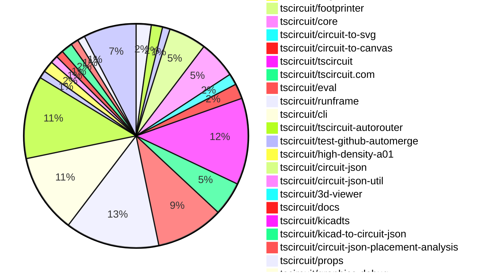

# contribution tracker

[contributions.tscircuit.com](https://contributions.tscircuit.com) ・ [tscircuit.com](https://tscircuit.com) ・ [Contribution Overviews](./contribution-overviews/) ・ [Changelogs](./changelogs/)

Generates weekly contribution overviews for tscircuit contributors. Check out all
the [contribution overviews here](./contribution-overviews/)
You can find AI-generated monthly changelogs in the [changelogs directory](./changelogs/)

- All PRs in the tscircuit org are scanned/summarized via an LLM
- The LLM classifies each Diff/PR as into a set of attributes for scoring
- All the PRs, summaries, and classifications are organized into charts and tables for [the website](https://contributions.tscircuit.com)

> Want to run locally? See the [Development Section](#development)

## Current Week

<!-- START_CURRENT_WEEK -->

# Contribution Overview 2026-04-07

The current week is shown below. There are 3 major sections:

- [Contributor Overview](#contributor-overview)
- [PRs by Repository](#prs-by-repository)
- [PRs by Contributor](#changes-by-contributor)
- [Scoring & Sponsorship Details](/docs/sponsorship-calculation-explanation.md)

## PRs by Repository



## Contributor Overview

| Contributor | 🐳 Major | 🐙 Minor | 🐌 Tiny | Score | ⭐ | Discussion Contributions |
|-------------|---------|---------|---------|-------|-----|--------------------------|
| [seveibar](#seveibar) | 12 | 5 | 8 | 67 | ⭐⭐⭐ | 0🔹 0🔶 0💎 |
| [AnasSarkiz](#AnasSarkiz) | 5 | 1 | 9 | 31 | ⭐⭐ | 0🔹 0🔶 0💎 |
| [MustafaMulla29](#MustafaMulla29) | 1 | 6 | 15 | 29 | ⭐⭐ | 0🔹 0🔶 0💎 |
| [Abse2001](#Abse2001) | 3 | 1 | 3 | 27 | ⭐⭐ | 0🔹 0🔶 0💎 |
| [ShiboSoftwareDev](#ShiboSoftwareDev) | 2 | 2 | 2 | 20 | ⭐⭐ | 0🔹 0🔶 0💎 |
| [tscircuitbot](#tscircuitbot) | 0 | 0 | 107 | 14 | ⭐⭐ | 0🔹 0🔶 0💎 |
| [mohan-bee](#mohan-bee) | 1 | 2 | 0 | 8 | ⭐ | 0🔹 0🔶 0💎 |
| [techmannih](#techmannih) | 0 | 0 | 6 | 6 | ⭐ | 0🔹 0🔶 0💎 |
| [ysdy823](#ysdy823) | 0 | 1 | 0 | 2 |  | 0🔹 0🔶 0💎 |
| [rushabhcodes](#rushabhcodes) | 0 | 0 | 1 | 1 |  | 0🔹 0🔶 0💎 |

## Staff Pass Ratio (SPR)

| Contributor | Reviewed PRs | Rejections | Approvals | SPR |
|-------------|--------------|------------|-----------|-----|
| [MustafaMulla29](#MustafaMulla29) | 8 | 1 | 7 | 87.5% |
| [ShiboSoftwareDev](#ShiboSoftwareDev) | 4 | 0 | 4 | 100.0% |
| [mohan-bee](#mohan-bee) | 4 | 1 | 3 | 75.0% |
| [Abse2001](#Abse2001) | 3 | 0 | 3 | 100.0% |
| [AnasSarkiz](#AnasSarkiz) | 2 | 0 | 2 | 100.0% |
| [techmannih](#techmannih) | 1 | 1 | 0 | 0.0% |

<details>
<summary>MustafaMulla29 SPR PRs (8)</summary>

- [#588](https://github.com/tscircuit/footprinter/pull/588) feat(vssop): switch to generic body-based courtyard
- [#585](https://github.com/tscircuit/footprinter/pull/585) Use generic body-based courtyard for SON parity
- [#757](https://github.com/tscircuit/3d-viewer/pull/757) Fix isPcbNoteElement filter for elements without layer prop
- [#2118](https://github.com/tscircuit/core/pull/2118) Feat: add inner symbol for usbc
- [#2116](https://github.com/tscircuit/core/pull/2116) Improve invalid footprint prop reporting for NormalComponent footprint(kicad:) strings
- [#540](https://github.com/tscircuit/circuit-to-svg/pull/540) Fix schematic component primitive layering so inner symbols render above box bodies
- [#3073](https://github.com/tscircuit/runframe/pull/3073) Revert "when switching circuit files, stop any active renders"
- [#222](https://github.com/tscircuit/circuit-to-canvas/pull/222) Fix pcb_note elements leaking into layer-filtered renders

</details>

<details>
<summary>ShiboSoftwareDev SPR PRs (4)</summary>

- [#528](https://github.com/tscircuit/circuit-json/pull/528) added routing_phase_index to nets and traces
- [#629](https://github.com/tscircuit/props/pull/629) Added optional routingPhaseIndex: number support to both net and trace
- [#2120](https://github.com/tscircuit/core/pull/2120) Fix source_port pin attribute serialization
- [#854](https://github.com/tscircuit/tscircuit-autorouter/pull/854) via clearance

</details>

<details>
<summary>mohan-bee SPR PRs (4)</summary>

- [#21](https://github.com/tscircuit/kicad-mod-cache/pull/21) Fix KiCad 3D models by falling back to STEP
- [#374](https://github.com/tscircuit/easyeda-converter/pull/374) Preserve {NAME}  placeholder in generated silkscreen text
- [#2622](https://github.com/tscircuit/cli/pull/2622) Fix wrong shell chaining command
- [#26](https://github.com/tscircuit/circuit-json-to-tscircuit/pull/26) Fix source‑subcircuit imports by preserving connectivity and props

</details>

<details>
<summary>Abse2001 SPR PRs (3)</summary>

- [#729](https://github.com/tscircuit/pcb-viewer/pull/729) Prevent canvas interactions when interacting with toolbar overlay
- [#375](https://github.com/tscircuit/easyeda-converter/pull/375) Fix EasyEDA CAD model placement using bounds fallback and ensure browser/node parity
- [#71](https://github.com/tscircuit/circuit-json-to-step/pull/71) Add STEP styling pipeline with face-level color support and optimized style reuse

</details>

<details>
<summary>AnasSarkiz SPR PRs (2)</summary>

- [#529](https://github.com/tscircuit/docs/pull/529) Add working STEP cadmodel docs example with bundled SOIC-8 asset and live preview
- [#863](https://github.com/tscircuit/tscircuit-autorouter/pull/863) Update high-density-repair02: repaired traces stay inside boundaries by nudging only interior points inward

</details>

<details>
<summary>techmannih SPR PRs (1)</summary>

- [#194](https://github.com/tscircuit/circuit-json-to-kicad/pull/194) feat: centralize component metadata extraction and improve PCB/Schematic value population

</details>

> Note: AI evaluates PRs and assigns 1-3 star ratings automatically. 4 and 5 star ratings require manual staff review.

### Discussion Contribution Legend

- 🔹 Normal Comments: Basic participation with minimal effort
- 🔶 Great Informative Comments: Thoughtful participation that adds value
- 💎 Incredible Comments: Exceptional participation with high-quality content

## Review Table

[reviews-received-hover]: ## "Number of reviews received for PRs for this contributor"
[approvals-received-hover]: ## "Number of approvals received for PRs this contributor authored"
[rejections-received-hover]: ## "Number of rejections received for PRs this contributor authored"
[prs-opened-hover]: ## "Number of PRs opened by this contributor"
[issues-created-hover]: ## "Number of issues created by this contributor"

| Contributor | Reviews Received | Approvals Received | Rejections Received | Approvals | Rejections Given | PRs Opened | PRs Merged | Issues Created |
|---|---|---|---|---|---|---|---|---|
| [Abse2001](#Abse2001) | 6 | 4 | 0 | 10 | 0 | 8 | 7 | 0 |
| [seveibar](#seveibar) | 2 | 0 | 0 | 30 | 3 | 40 | 25 | 0 |
| [techmannih](#techmannih) | 11 | 7 | 1 | 0 | 0 | 11 | 6 | 0 |
| [tscircuitbot](#tscircuitbot) | 0 | 0 | 0 | 0 | 0 | 164 | 107 | 0 |
| [MustafaMulla29](#MustafaMulla29) | 21 | 17 | 1 | 2 | 1 | 27 | 23 | 0 |
| [ShiboSoftwareDev](#ShiboSoftwareDev) | 7 | 6 | 0 | 6 | 0 | 14 | 6 | 0 |
| [mohan-bee](#mohan-bee) | 9 | 3 | 2 | 0 | 0 | 7 | 3 | 0 |
| [techmannih2](#techmannih2) | 0 | 0 | 0 | 0 | 0 | 2 | 0 | 0 |
| [rushabhcodes](#rushabhcodes) | 2 | 1 | 0 | 0 | 0 | 1 | 1 | 0 |
| [0hmxbot](#0hmxbot) | 0 | 0 | 0 | 0 | 0 | 4 | 0 | 0 |
| [ysdy823](#ysdy823) | 0 | 0 | 0 | 0 | 0 | 1 | 1 | 0 |
| [AnasSarkiz](#AnasSarkiz) | 13 | 11 | 0 | 1 | 0 | 19 | 15 | 0 |
| [0hmX](#0hmX) | 0 | 0 | 0 | 0 | 0 | 4 | 0 | 0 |
| [Ojas2095](#Ojas2095) | 0 | 0 | 0 | 0 | 0 | 1 | 0 | 0 |
| [mitchellecm7](#mitchellecm7) | 0 | 0 | 0 | 0 | 0 | 3 | 0 | 0 |
| [cccignore](#cccignore) | 0 | 0 | 0 | 0 | 0 | 1 | 0 | 0 |
| [ledgerpilot](#ledgerpilot) | 0 | 0 | 0 | 0 | 0 | 1 | 0 | 0 |
| [aliyevr889](#aliyevr889) | 0 | 0 | 0 | 0 | 0 | 1 | 0 | 0 |
| [Emanuelgm1998](#Emanuelgm1998) | 0 | 0 | 0 | 0 | 0 | 1 | 0 | 0 |

## Changes by Repository

### [tscircuit/pcb-viewer](https://github.com/tscircuit/pcb-viewer)

| PR # | Impact | Rating | Contributor | Description |
|------|--------|--------|-------------|-------------|
| [#729](https://github.com/tscircuit/pcb-viewer/pull/729) | 🐳 Major | ⭐⭐⭐ | Abse2001 | Prevents canvas interactions when the user interacts with the toolbar overlay, ensuring that toolbar actions do not interfere with canvas operations. |

<details>
<summary>🐌 Tiny Contributions (3)</summary>

| PR # | Impact | Contributor | Description |
|------|--------|-------------|-------------|
| [#731](https://github.com/tscircuit/pcb-viewer/pull/731) | 🐌 Tiny | techmannih | Updates the circuit-to-canvas dependency to version 0.0.95 in package.json |
| [#732](https://github.com/tscircuit/pcb-viewer/pull/732) | 🐌 Tiny | tscircuitbot | Automated package update |
| [#730](https://github.com/tscircuit/pcb-viewer/pull/730) | 🐌 Tiny | tscircuitbot | Automated package update to version 1.11.360 |

</details>

### [tscircuit/circuit-json-to-step](https://github.com/tscircuit/circuit-json-to-step)

| PR # | Impact | Rating | Contributor | Description |
|------|--------|--------|-------------|-------------|
| [#71](https://github.com/tscircuit/circuit-json-to-step/pull/71) | 🐳 Major | ⭐⭐⭐ | Abse2001 | Adds a STEP styling pipeline that supports face-level color customization and optimizes style reuse for circuit board rendering. |

### [tscircuit/cad-component-viz](https://github.com/tscircuit/cad-component-viz)

| PR # | Impact | Rating | Contributor | Description |
|------|--------|--------|-------------|-------------|
| [#5](https://github.com/tscircuit/cad-component-viz/pull/5) | 🐳 Major | ⭐⭐⭐ | Abse2001 | Adds a drag-and-drop interface for loading CAD models on the landing page and enhances the viewer model loading workflow. |

<details>
<summary>🐌 Tiny Contributions (2)</summary>

| PR # | Impact | Contributor | Description |
|------|--------|-------------|-------------|
| [#7](https://github.com/tscircuit/cad-component-viz/pull/7) | 🐌 Tiny | Abse2001 | Refactors the CAD pipeline to maintain the full model hierarchy, incorporates material colors, and enhances resource management for Three.js. |
| [#6](https://github.com/tscircuit/cad-component-viz/pull/6) | 🐌 Tiny | Abse2001 | This pull request introduces Continuous Integration (CI) checks for formatting and type checking in the CAD viewer codebase. It adds two GitHub Actions workflows: one for format checking and another for type checking, ensuring that code adheres to specified formatting rules and type safety. Additionally, it standardizes the formatting of existing code by removing unnecessary semicolons and ensuring consistent line endings. |

</details>

### [tscircuit/easyeda-converter](https://github.com/tscircuit/easyeda-converter)

| PR # | Impact | Rating | Contributor | Description |
|------|--------|--------|-------------|-------------|
| [#374](https://github.com/tscircuit/easyeda-converter/pull/374) | 🐳 Major | ⭐⭐⭐ | mohan-bee | this PR fixes easyeda generated chip footprints to preserve the NAME silkscreen placeholder instead of converting it to props.name, preventing runtime text required errors in the editor. |
| [#375](https://github.com/tscircuit/easyeda-converter/pull/375) | 🐙 Minor | ⭐⭐ | Abse2001 | Fixes EasyEDA CAD model placement by implementing bounds fallback and ensuring consistent behavior between browser and Node.js environments. |

### [tscircuit/svg.tscircuit.com](https://github.com/tscircuit/svg.tscircuit.com)


<details>
<summary>🐌 Tiny Contributions (1)</summary>

| PR # | Impact | Contributor | Description |
|------|--------|-------------|-------------|
| [#1289](https://github.com/tscircuit/svg.tscircuit.com/pull/1289) | 🐌 Tiny | Abse2001 | Updates the circuit-json-to-gltf dependency from version 0.0.74 to 0.0.93 in the package.json file. |

</details>

### [tscircuit/footprinter](https://github.com/tscircuit/footprinter)

| PR # | Impact | Rating | Contributor | Description |
|------|--------|--------|-------------|-------------|
| [#588](https://github.com/tscircuit/footprinter/pull/588) | 🐳 Major | ⭐⭐⭐ | MustafaMulla29 | Switches the courtyard representation for VSSOP components from a rectangular format to a generic body-based outline format, enhancing the accuracy of component layout. |
| [#585](https://github.com/tscircuit/footprinter/pull/585) | 🐙 Minor | ⭐⭐ | MustafaMulla29 | Changes the courtyard representation for SON components from a rectangular format to a more generic outline format, improving the accuracy of component layout in PCB designs. |

<details>
<summary>🐌 Tiny Contributions (8)</summary>

| PR # | Impact | Contributor | Description |
|------|--------|-------------|-------------|
| [#593](https://github.com/tscircuit/footprinter/pull/593) | 🐌 Tiny | techmannih | Fixes dimensions and coordinates for SOT and SOD packages to align with KiCad standards |
| [#592](https://github.com/tscircuit/footprinter/pull/592) | 🐌 Tiny | techmannih | Updates the circuit-to-svg dependency to version 0.0.342 in package.json |
| [#591](https://github.com/tscircuit/footprinter/pull/591) | 🐌 Tiny | MustafaMulla29 | Updates courtyard geometry for various components and adds parity tests to ensure consistency with KiCad. |
| [#590](https://github.com/tscircuit/footprinter/pull/590) | 🐌 Tiny | MustafaMulla29 | Fixes courtyard dimensions for JST, SOT, TO220, VSON, and electrolytic components to ensure proper layout and spacing in PCB designs. |
| [#589](https://github.com/tscircuit/footprinter/pull/589) | 🐌 Tiny | MustafaMulla29 | Fixes courtyard definitions for BGA, DIP, SOD923, SOT223, and axial components to ensure accurate PCB layout. |
| [#584](https://github.com/tscircuit/footprinter/pull/584) | 🐌 Tiny | MustafaMulla29 | Fixes courtyard generation for quad components to utilize a body-based approach, improving accuracy in PCB layout. |
| [#587](https://github.com/tscircuit/footprinter/pull/587) | 🐌 Tiny | MustafaMulla29 | Updates the TSSOP courtyard definition to use a generic body-based stepped outline instead of a rectangular courtyard, improving the accuracy of component footprints. |
| [#586](https://github.com/tscircuit/footprinter/pull/586) | 🐌 Tiny | MustafaMulla29 | Changes the SOP8 footprint to use a generic stepped courtyard outline instead of a rectangular courtyard, improving the accuracy of the footprint representation. |

</details>

### [tscircuit/core](https://github.com/tscircuit/core)

| PR # | Impact | Rating | Contributor | Description |
|------|--------|--------|-------------|-------------|
| [#2118](https://github.com/tscircuit/core/pull/2118) | 🐙 Minor | ⭐⭐ | MustafaMulla29 | Adds an inner USB-C symbol to the schematic box for USB-C connectors in the schematic rendering. |
| [#2121](https://github.com/tscircuit/core/pull/2121) | 🐙 Minor | ⭐⭐ | MustafaMulla29 | Adds a layer property to various PCB note components, allowing for better control over their rendering on different layers. |
| [#2116](https://github.com/tscircuit/core/pull/2116) | 🐙 Minor | ⭐⭐ | MustafaMulla29 | Adds better error reporting for invalid footprint properties in NormalComponent, specifically for KiCad footprint strings. |
| [#2120](https://github.com/tscircuit/core/pull/2120) | 🐙 Minor | ⭐⭐ | ShiboSoftwareDev | Fixes serialization of pin attributes for source_port records to ensure proper DRC checks for power and ground requirements. |

<details>
<summary>🐌 Tiny Contributions (6)</summary>

| PR # | Impact | Contributor | Description |
|------|--------|-------------|-------------|
| [#2119](https://github.com/tscircuit/core/pull/2119) | 🐌 Tiny | techmannih | Updates the circuit-to-svg dependency version from 0.0.337 to 0.0.342 in package.json |
| [#2126](https://github.com/tscircuit/core/pull/2126) | 🐌 Tiny | tscircuitbot | Updates the tscircuitchecks package from version 0.0.115 to 0.0.116 |
| [#2117](https://github.com/tscircuit/core/pull/2117) | 🐌 Tiny | MustafaMulla29 | Updates the footprinter dependency from version 0.0.338 to 0.0.346 in package.json and modifies a test to expect two errors instead of one. |
| [#2125](https://github.com/tscircuit/core/pull/2125) | 🐌 Tiny | seveibar | Updates the circuit JSON utility to version 0.0.92, which includes improved placement categorization for circuit components. |
| [#2124](https://github.com/tscircuit/core/pull/2124) | 🐌 Tiny | ShiboSoftwareDev | Updates the tscircuitcapacity-autorouter dependency to version 0.0.414 in the package.json file. |
| [#2123](https://github.com/tscircuit/core/pull/2123) | 🐌 Tiny | rushabhcodes | Fixes issue with holes being added as obstacles in the calculate-packing library, resolving problems encountered while creating a SparkFun board. |

</details>

### [tscircuit/circuit-to-svg](https://github.com/tscircuit/circuit-to-svg)


<details>
<summary>🐌 Tiny Contributions (3)</summary>

| PR # | Impact | Contributor | Description |
|------|--------|-------------|-------------|
| [#538](https://github.com/tscircuit/circuit-to-svg/pull/538) | 🐌 Tiny | techmannih | Adds support for round line joins in the SVG rendering of PCB courtyards, enhancing the visual representation of PCB outlines. |
| [#543](https://github.com/tscircuit/circuit-to-svg/pull/543) | 🐌 Tiny | MustafaMulla29 | Wraps every schematic component in a g element and ensures that component-owned primitives render correctly above the yellow box in SVG output. |
| [#541](https://github.com/tscircuit/circuit-to-svg/pull/541) | 🐌 Tiny | MustafaMulla29 | Fixes an issue where inner symbols are rendered incorrectly beneath a yellow box in schematic components. |

</details>

### [tscircuit/circuit-to-canvas](https://github.com/tscircuit/circuit-to-canvas)


<details>
<summary>🐌 Tiny Contributions (4)</summary>

| PR # | Impact | Contributor | Description |
|------|--------|-------------|-------------|
| [#220](https://github.com/tscircuit/circuit-to-canvas/pull/220) | 🐌 Tiny | techmannih | Adds support for round line joins in the rendering of PCB courtyard rectangles and outlines. |
| [#224](https://github.com/tscircuit/circuit-to-canvas/pull/224) | 🐌 Tiny | tscircuitbot | Automated package update |
| [#221](https://github.com/tscircuit/circuit-to-canvas/pull/221) | 🐌 Tiny | tscircuitbot | Automated package update |
| [#223](https://github.com/tscircuit/circuit-to-canvas/pull/223) | 🐌 Tiny | MustafaMulla29 | Updates the version of the tscircuitcircuit-json-util dependency from 0.0.78 to 0.0.91 in package.json |

</details>

### [tscircuit/tscircuit](https://github.com/tscircuit/tscircuit)


<details>
<summary>🐌 Tiny Contributions (23)</summary>

| PR # | Impact | Contributor | Description |
|------|--------|-------------|-------------|
| [#2867](https://github.com/tscircuit/tscircuit/pull/2867) | 🐌 Tiny | tscircuitbot | Automated package update |
| [#2866](https://github.com/tscircuit/tscircuit/pull/2866) | 🐌 Tiny | tscircuitbot | Automated package update |
| [#2865](https://github.com/tscircuit/tscircuit/pull/2865) | 🐌 Tiny | tscircuitbot | Automated package update to version 0.0.1610 |
| [#2864](https://github.com/tscircuit/tscircuit/pull/2864) | 🐌 Tiny | tscircuitbot | Automated package update |
| [#2862](https://github.com/tscircuit/tscircuit/pull/2862) | 🐌 Tiny | tscircuitbot | Automated package update |
| [#2861](https://github.com/tscircuit/tscircuit/pull/2861) | 🐌 Tiny | tscircuitbot | Updates the tscircuitcli package version from 0.1.1210 to 0.1.1211 in package.json |
| [#2860](https://github.com/tscircuit/tscircuit/pull/2860) | 🐌 Tiny | tscircuitbot | Updates the tscircuitcli package to version 0.1.1211 in the package.json file. |
| [#2859](https://github.com/tscircuit/tscircuit/pull/2859) | 🐌 Tiny | tscircuitbot | Automated package update |
| [#2858](https://github.com/tscircuit/tscircuit/pull/2858) | 🐌 Tiny | tscircuitbot | Updates the tscircuitcli package version from 0.1.1209 to 0.1.1210 in package.json |
| [#2857](https://github.com/tscircuit/tscircuit/pull/2857) | 🐌 Tiny | tscircuitbot | Updates the package version from 0.0.1605 to 0.0.1606 in package.json |
| [#2856](https://github.com/tscircuit/tscircuit/pull/2856) | 🐌 Tiny | tscircuitbot | Updates the tscircuitcli package from version 0.1.1208 to 0.1.1209 and the tscircuitrunframe package from version 0.0.1798 to 0.0.1799 in package.json |
| [#2855](https://github.com/tscircuit/tscircuit/pull/2855) | 🐌 Tiny | tscircuitbot | Automated package update |
| [#2854](https://github.com/tscircuit/tscircuit/pull/2854) | 🐌 Tiny | tscircuitbot | Automated package update |
| [#2853](https://github.com/tscircuit/tscircuit/pull/2853) | 🐌 Tiny | tscircuitbot | Automated package update |
| [#2852](https://github.com/tscircuit/tscircuit/pull/2852) | 🐌 Tiny | tscircuitbot | Automated package update |
| [#2851](https://github.com/tscircuit/tscircuit/pull/2851) | 🐌 Tiny | tscircuitbot | Automated package update |
| [#2850](https://github.com/tscircuit/tscircuit/pull/2850) | 🐌 Tiny | tscircuitbot | Automated package update |
| [#2849](https://github.com/tscircuit/tscircuit/pull/2849) | 🐌 Tiny | tscircuitbot | Automated package update |
| [#2847](https://github.com/tscircuit/tscircuit/pull/2847) | 🐌 Tiny | tscircuitbot | Updates the package version from 0.0.1600 to 0.0.1601 in package.json |
| [#2845](https://github.com/tscircuit/tscircuit/pull/2845) | 🐌 Tiny | tscircuitbot | Automated package update to version 0.0.1600 |
| [#2846](https://github.com/tscircuit/tscircuit/pull/2846) | 🐌 Tiny | tscircuitbot | Updates the version of several dependencies in the package.json file, including tscircuitcli, tscircuitfootprinter, and circuit-json. |
| [#2848](https://github.com/tscircuit/tscircuit/pull/2848) | 🐌 Tiny | MustafaMulla29 | Updates the version of the circuit-json-util dependency from 0.0.90 to 0.0.91 in package.json |
| [#2840](https://github.com/tscircuit/tscircuit/pull/2840) | 🐌 Tiny | MustafaMulla29 | Updates the versions of the core and eval dependencies in the package.json file. |

</details>

### [tscircuit/tscircuit.com](https://github.com/tscircuit/tscircuit.com)


<details>
<summary>🐌 Tiny Contributions (9)</summary>

| PR # | Impact | Contributor | Description |
|------|--------|-------------|-------------|
| [#3125](https://github.com/tscircuit/tscircuit.com/pull/3125) | 🐌 Tiny | tscircuitbot | Automated package update |
| [#3122](https://github.com/tscircuit/tscircuit.com/pull/3122) | 🐌 Tiny | tscircuitbot | Automated package update |
| [#3119](https://github.com/tscircuit/tscircuit.com/pull/3119) | 🐌 Tiny | tscircuitbot | Automated package update |
| [#3117](https://github.com/tscircuit/tscircuit.com/pull/3117) | 🐌 Tiny | tscircuitbot | Automated package update |
| [#3115](https://github.com/tscircuit/tscircuit.com/pull/3115) | 🐌 Tiny | tscircuitbot | Automated package update |
| [#3106](https://github.com/tscircuit/tscircuit.com/pull/3106) | 🐌 Tiny | tscircuitbot | Updates the version of the tscircuiteval package from 0.0.734 to 0.0.735 in package.json |
| [#3108](https://github.com/tscircuit/tscircuit.com/pull/3108) | 🐌 Tiny | tscircuitbot | Automated package update |
| [#3111](https://github.com/tscircuit/tscircuit.com/pull/3111) | 🐌 Tiny | tscircuitbot | Updates the tscircuiteval package to version 0.0.737 |
| [#3113](https://github.com/tscircuit/tscircuit.com/pull/3113) | 🐌 Tiny | tscircuitbot | Updates the tscircuiteval package to version 0.0.738 in the package.json file. |

</details>

### [tscircuit/eval](https://github.com/tscircuit/eval)


<details>
<summary>🐌 Tiny Contributions (18)</summary>

| PR # | Impact | Contributor | Description |
|------|--------|-------------|-------------|
| [#2368](https://github.com/tscircuit/eval/pull/2368) | 🐌 Tiny | tscircuitbot | Automated package update |
| [#2367](https://github.com/tscircuit/eval/pull/2367) | 🐌 Tiny | tscircuitbot | Automated package update |
| [#2364](https://github.com/tscircuit/eval/pull/2364) | 🐌 Tiny | tscircuitbot | Automated package update |
| [#2363](https://github.com/tscircuit/eval/pull/2363) | 🐌 Tiny | tscircuitbot | Automated package update |
| [#2361](https://github.com/tscircuit/eval/pull/2361) | 🐌 Tiny | tscircuitbot | Automated package update |
| [#2360](https://github.com/tscircuit/eval/pull/2360) | 🐌 Tiny | tscircuitbot | Updates package versions in package.json to the latest compatible versions. |
| [#2358](https://github.com/tscircuit/eval/pull/2358) | 🐌 Tiny | tscircuitbot | Automated package update |
| [#2357](https://github.com/tscircuit/eval/pull/2357) | 🐌 Tiny | tscircuitbot | Automated package update |
| [#2355](https://github.com/tscircuit/eval/pull/2355) | 🐌 Tiny | tscircuitbot | Automated package update |
| [#2354](https://github.com/tscircuit/eval/pull/2354) | 🐌 Tiny | tscircuitbot | Automated package update |
| [#2342](https://github.com/tscircuit/eval/pull/2342) | 🐌 Tiny | tscircuitbot | Updates the version of the tscircuitcore package from 0.0.1143 to 0.0.1144 in package.json |
| [#2340](https://github.com/tscircuit/eval/pull/2340) | 🐌 Tiny | tscircuitbot | Updates the versions of the tscircuitcore and tscircuitfootprinter packages in package.json |
| [#2343](https://github.com/tscircuit/eval/pull/2343) | 🐌 Tiny | tscircuitbot | Automated package update |
| [#2349](https://github.com/tscircuit/eval/pull/2349) | 🐌 Tiny | tscircuitbot | Automated package update |
| [#2352](https://github.com/tscircuit/eval/pull/2352) | 🐌 Tiny | tscircuitbot | Automated package update |
| [#2341](https://github.com/tscircuit/eval/pull/2341) | 🐌 Tiny | tscircuitbot | Automated package update |
| [#2350](https://github.com/tscircuit/eval/pull/2350) | 🐌 Tiny | tscircuitbot | Automated package update |
| [#2351](https://github.com/tscircuit/eval/pull/2351) | 🐌 Tiny | MustafaMulla29 | Adds easyeda to the noExternal configuration in multiple build configuration files to ensure it is bundled with the application. |

</details>

### [tscircuit/runframe](https://github.com/tscircuit/runframe)

| PR # | Impact | Rating | Contributor | Description |
|------|--------|--------|-------------|-------------|
| [#3068](https://github.com/tscircuit/runframe/pull/3068) | 🐳 Major | ⭐⭐⭐ | seveibar | Stops any active renders when switching circuit files in the RunFrame component to prevent rendering conflicts and improve user experience. |

<details>
<summary>🐌 Tiny Contributions (24)</summary>

| PR # | Impact | Contributor | Description |
|------|--------|-------------|-------------|
| [#3076](https://github.com/tscircuit/runframe/pull/3076) | 🐌 Tiny | tscircuitbot | Automated package update |
| [#3075](https://github.com/tscircuit/runframe/pull/3075) | 🐌 Tiny | tscircuitbot | Updates the tscircuiteval package from version 0.0.742 to 0.0.743 in the package.json file. |
| [#3074](https://github.com/tscircuit/runframe/pull/3074) | 🐌 Tiny | tscircuitbot | Automated package update |
| [#3071](https://github.com/tscircuit/runframe/pull/3071) | 🐌 Tiny | tscircuitbot | Automated package update |
| [#3070](https://github.com/tscircuit/runframe/pull/3070) | 🐌 Tiny | tscircuitbot | Updates the tscircuiteval package to version 0.0.742 in the package.json file. |
| [#3069](https://github.com/tscircuit/runframe/pull/3069) | 🐌 Tiny | tscircuitbot | Automated package update |
| [#3067](https://github.com/tscircuit/runframe/pull/3067) | 🐌 Tiny | tscircuitbot | Automated package update |
| [#3066](https://github.com/tscircuit/runframe/pull/3066) | 🐌 Tiny | tscircuitbot | Updates the tscircuiteval package from version 0.0.740 to 0.0.741 |
| [#3065](https://github.com/tscircuit/runframe/pull/3065) | 🐌 Tiny | tscircuitbot | Automated package update |
| [#3064](https://github.com/tscircuit/runframe/pull/3064) | 🐌 Tiny | tscircuitbot | Updates the tscircuiteval package from version 0.0.739 to 0.0.740 in the package.json file. |
| [#3063](https://github.com/tscircuit/runframe/pull/3063) | 🐌 Tiny | tscircuitbot | Automated package update |
| [#3062](https://github.com/tscircuit/runframe/pull/3062) | 🐌 Tiny | tscircuitbot | Updates the tscircuiteval package from version 0.0.738 to 0.0.739 in the package.json file. |
| [#3061](https://github.com/tscircuit/runframe/pull/3061) | 🐌 Tiny | tscircuitbot | Updates the package version from v0.0.1794 to v0.0.1795 in package.json |
| [#3060](https://github.com/tscircuit/runframe/pull/3060) | 🐌 Tiny | tscircuitbot | Updates the tscircuiteval package to version 0.0.738 in the package.json file. |
| [#3058](https://github.com/tscircuit/runframe/pull/3058) | 🐌 Tiny | tscircuitbot | Updates the tscircuiteval package from version 0.0.736 to 0.0.737 in the package.json file. |
| [#3057](https://github.com/tscircuit/runframe/pull/3057) | 🐌 Tiny | tscircuitbot | Automated package update |
| [#3056](https://github.com/tscircuit/runframe/pull/3056) | 🐌 Tiny | tscircuitbot | Updates the tscircuitpcb-viewer package from version 1.11.360 to 1.11.361 |
| [#3055](https://github.com/tscircuit/runframe/pull/3055) | 🐌 Tiny | tscircuitbot | Automated package update |
| [#3054](https://github.com/tscircuit/runframe/pull/3054) | 🐌 Tiny | tscircuitbot | Updates the tscircuiteval package from version 0.0.735 to 0.0.736 in the package.json file. |
| [#3052](https://github.com/tscircuit/runframe/pull/3052) | 🐌 Tiny | tscircuitbot | Updates the tscircuiteval package from version 0.0.734 to 0.0.735 in the project dependencies. |
| [#3051](https://github.com/tscircuit/runframe/pull/3051) | 🐌 Tiny | tscircuitbot | Automated package update |
| [#3059](https://github.com/tscircuit/runframe/pull/3059) | 🐌 Tiny | tscircuitbot | Automated package update |
| [#3053](https://github.com/tscircuit/runframe/pull/3053) | 🐌 Tiny | tscircuitbot | Automated package update |
| [#3050](https://github.com/tscircuit/runframe/pull/3050) | 🐌 Tiny | tscircuitbot | Updates the tscircuitpcb-viewer package from version 1.11.359 to 1.11.360 |

</details>

### [tscircuit/cli](https://github.com/tscircuit/cli)

| PR # | Impact | Rating | Contributor | Description |
|------|--------|--------|-------------|-------------|
| [#2633](https://github.com/tscircuit/cli/pull/2633) | 🐳 Major | ⭐⭐⭐ | seveibar | Adds a new command to analyze trace length for a pin or net in the circuit JSON. |
| [#2622](https://github.com/tscircuit/cli/pull/2622) | 🐙 Minor | ⭐⭐ | mohan-bee | Fixes the shell command chaining from using  to  to ensure proper execution of commands in the CLI. |

<details>
<summary>🐌 Tiny Contributions (19)</summary>

| PR # | Impact | Contributor | Description |
|------|--------|-------------|-------------|
| [#2644](https://github.com/tscircuit/cli/pull/2644) | 🐌 Tiny | tscircuitbot | Automated package update |
| [#2643](https://github.com/tscircuit/cli/pull/2643) | 🐌 Tiny | tscircuitbot | Updates the tscircuitrunframe package from version 0.0.1801 to 0.0.1802 |
| [#2642](https://github.com/tscircuit/cli/pull/2642) | 🐌 Tiny | tscircuitbot | Automated package update |
| [#2641](https://github.com/tscircuit/cli/pull/2641) | 🐌 Tiny | tscircuitbot | Automated package update |
| [#2639](https://github.com/tscircuit/cli/pull/2639) | 🐌 Tiny | tscircuitbot | Automated package update |
| [#2638](https://github.com/tscircuit/cli/pull/2638) | 🐌 Tiny | tscircuitbot | Automated README update with latest CLI usage output. |
| [#2637](https://github.com/tscircuit/cli/pull/2637) | 🐌 Tiny | tscircuitbot | Automated package update |
| [#2636](https://github.com/tscircuit/cli/pull/2636) | 🐌 Tiny | tscircuitbot | Updates the tscircuitrunframe package from version 0.0.1798 to 0.0.1799 |
| [#2635](https://github.com/tscircuit/cli/pull/2635) | 🐌 Tiny | tscircuitbot | Automated package update |
| [#2634](https://github.com/tscircuit/cli/pull/2634) | 🐌 Tiny | tscircuitbot | Updates the tscircuitrunframe package from version 0.0.1797 to 0.0.1798 |
| [#2632](https://github.com/tscircuit/cli/pull/2632) | 🐌 Tiny | tscircuitbot | Automated package update |
| [#2631](https://github.com/tscircuit/cli/pull/2631) | 🐌 Tiny | tscircuitbot | Updates the tscircuitrunframe package from version 0.0.1796 to 0.0.1797 |
| [#2630](https://github.com/tscircuit/cli/pull/2630) | 🐌 Tiny | tscircuitbot | Automated package update |
| [#2629](https://github.com/tscircuit/cli/pull/2629) | 🐌 Tiny | tscircuitbot | Updates the tscircuitrunframe package from version 0.0.1795 to 0.0.1796 |
| [#2627](https://github.com/tscircuit/cli/pull/2627) | 🐌 Tiny | tscircuitbot | Updates the tscircuitrunframe package to version 0.0.1795 in package.json |
| [#2628](https://github.com/tscircuit/cli/pull/2628) | 🐌 Tiny | tscircuitbot | Automated package update |
| [#2623](https://github.com/tscircuit/cli/pull/2623) | 🐌 Tiny | tscircuitbot | Automated package update |
| [#2626](https://github.com/tscircuit/cli/pull/2626) | 🐌 Tiny | tscircuitbot | Automated package update |
| [#2625](https://github.com/tscircuit/cli/pull/2625) | 🐌 Tiny | MustafaMulla29 | Updates the easyeda dependency version from 0.0.253 to 0.0.258 in package.json |

</details>

### [tscircuit/tscircuit-autorouter](https://github.com/tscircuit/tscircuit-autorouter)

| PR # | Impact | Rating | Contributor | Description |
|------|--------|--------|-------------|-------------|
| [#848](https://github.com/tscircuit/tscircuit-autorouter/pull/848) | 🐳 Major | ⭐⭐⭐ | seveibar | Add stage-by-stage PNG dumps for autorouter pipeline debug runs, including a reusable PipelineStageDebugRunner for logging and PNG artifact generation during pipeline execution. |
| [#842](https://github.com/tscircuit/tscircuit-autorouter/pull/842) | 🐳 Major | ⭐⭐⭐ | seveibar | This pull request introduces a new route stitching solver (MultipleHighDensityRouteStitchSolver3) and replaces the previous solver (MultipleHighDensityRouteStitchSolver) in the autorouting pipeline. It also includes various improvements to the TinyHyperGraph solvers, enhancing their performance and configurability. |
| [#834](https://github.com/tscircuit/tscircuit-autorouter/pull/834) | 🐳 Major | ⭐⭐⭐ | seveibar | Adds a max node ratio of 6 to the autorouting pipeline, improving routing efficiency by 1.4. |
| [#828](https://github.com/tscircuit/tscircuit-autorouter/pull/828) | 🐳 Major | ⭐⭐⭐ | seveibar | Reduces the maximum node dimension from 8 to 7 for the autorouting pipeline5, affecting how nodes are processed in routing algorithms. |
| [#854](https://github.com/tscircuit/tscircuit-autorouter/pull/854) | 🐳 Major | ⭐⭐⭐ | ShiboSoftwareDev | Adds functionality to manage via-to-trace clearance during high-density routing, preventing overlaps and ensuring compliance with clearance requirements. |
| [#863](https://github.com/tscircuit/tscircuit-autorouter/pull/863) | 🐳 Major | ⭐⭐⭐ | AnasSarkiz | Fixes the issue where repaired traces extend beyond the defined boundaries by adjusting only the interior points inward. |
| [#835](https://github.com/tscircuit/tscircuit-autorouter/pull/835) | 🐙 Minor | ⭐⭐ | seveibar | Adds a SolverOptions type and modifies solver instantiation to allow for per-scenario solver tuning via an effort value, while maintaining existing runTask behavior. |

<details>
<summary>🐌 Tiny Contributions (15)</summary>

| PR # | Impact | Contributor | Description |
|------|--------|-------------|-------------|
| [#855](https://github.com/tscircuit/tscircuit-autorouter/pull/855) | 🐌 Tiny | tscircuitbot | Automated package update |
| [#853](https://github.com/tscircuit/tscircuit-autorouter/pull/853) | 🐌 Tiny | tscircuitbot | Automated package update |
| [#849](https://github.com/tscircuit/tscircuit-autorouter/pull/849) | 🐌 Tiny | tscircuitbot | Automated package update |
| [#837](https://github.com/tscircuit/tscircuit-autorouter/pull/837) | 🐌 Tiny | tscircuitbot | Automated package update |
| [#847](https://github.com/tscircuit/tscircuit-autorouter/pull/847) | 🐌 Tiny | tscircuitbot | Automated package update |
| [#844](https://github.com/tscircuit/tscircuit-autorouter/pull/844) | 🐌 Tiny | tscircuitbot | Automated package update |
| [#832](https://github.com/tscircuit/tscircuit-autorouter/pull/832) | 🐌 Tiny | tscircuitbot | Automated package update |
| [#829](https://github.com/tscircuit/tscircuit-autorouter/pull/829) | 🐌 Tiny | tscircuitbot | Automated package update |
| [#839](https://github.com/tscircuit/tscircuit-autorouter/pull/839) | 🐌 Tiny | tscircuitbot | Automated package update |
| [#838](https://github.com/tscircuit/tscircuit-autorouter/pull/838) | 🐌 Tiny | tscircuitbot | Automated package update |
| [#841](https://github.com/tscircuit/tscircuit-autorouter/pull/841) | 🐌 Tiny | seveibar | Trims high-density node marker labels by removing the connection list to improve readability in visualization flows. |
| [#830](https://github.com/tscircuit/tscircuit-autorouter/pull/830) | 🐌 Tiny | seveibar | Adds a fixture and regression test for reproducing and debugging autorouting bug report 569cfe9b-1c74-4e59-b360-32ccaacfb0be, including an SVG snapshot for visualization comparison. |
| [#836](https://github.com/tscircuit/tscircuit-autorouter/pull/836) | 🐌 Tiny | seveibar | Sets the autorouting debugging fixture to use Pipeline 4 by default when no pipeline is stored in localStorage. |
| [#840](https://github.com/tscircuit/tscircuit-autorouter/pull/840) | 🐌 Tiny | seveibar | Adds an optional isCopperPour flag to the Obstacle type in SimpleRouteJson and updates the README to document this new flag. |
| [#857](https://github.com/tscircuit/tscircuit-autorouter/pull/857) | 🐌 Tiny | ShiboSoftwareDev | Changes the dependency status of high-density-repair02 from a regular dependency to a development dependency in package.json |

</details>

### [tscircuit/test-github-automerge](https://github.com/tscircuit/test-github-automerge)


<details>
<summary>🐌 Tiny Contributions (2)</summary>

| PR # | Impact | Contributor | Description |
|------|--------|-------------|-------------|
| [#40](https://github.com/tscircuit/test-github-automerge/pull/40) | 🐌 Tiny | tscircuitbot | Updates the tscircuitcircuit-json-util package from version 0.0.91 to 0.0.92 in the development dependencies. |
| [#38](https://github.com/tscircuit/test-github-automerge/pull/38) | 🐌 Tiny | tscircuitbot | Updates the tscircuitcircuit-json-util package from version 0.0.90 to 0.0.91 in the development dependencies. |

</details>

### [tscircuit/high-density-a01](https://github.com/tscircuit/high-density-a01)

| PR # | Impact | Rating | Contributor | Description |
|------|--------|--------|-------------|-------------|
| [#50](https://github.com/tscircuit/high-density-a01/pull/50) | 🐳 Major | ⭐⭐⭐ | seveibar | This pull request introduces the HighDensitySolverA05, which enhances the existing high-density routing capabilities by adding route normalization and force-directed reflow after each solved route. It includes new parameters for controlling the routing behavior and improves the overall routing efficiency. |

<details>
<summary>🐌 Tiny Contributions (2)</summary>

| PR # | Impact | Contributor | Description |
|------|--------|-------------|-------------|
| [#54](https://github.com/tscircuit/high-density-a01/pull/54) | 🐌 Tiny | tscircuitbot | Updates the package version from 0.0.25 to 0.0.27 in package.json |
| [#53](https://github.com/tscircuit/high-density-a01/pull/53) | 🐌 Tiny | seveibar | This pull request introduces new examples for the superhard dataset and improves the existing A05 functionality. It includes new fixture files and a dataset JSON file that contains various scenarios and their corresponding solver results. The changes aim to enhance the testing and debugging capabilities of the project. |

</details>

### [tscircuit/circuit-json](https://github.com/tscircuit/circuit-json)

| PR # | Impact | Rating | Contributor | Description |
|------|--------|--------|-------------|-------------|
| [#529](https://github.com/tscircuit/circuit-json/pull/529) | 🐙 Minor | ⭐⭐ | MustafaMulla29 | Adds a layer property to various PCB note types, allowing for better layer management in PCB designs. |

### [tscircuit/circuit-json-util](https://github.com/tscircuit/circuit-json-util)

| PR # | Impact | Rating | Contributor | Description |
|------|--------|--------|-------------|-------------|
| [#91](https://github.com/tscircuit/circuit-json-util/pull/91) | 🐙 Minor | ⭐⭐ | MustafaMulla29 | Returns user_note render layers for pcb_note elements, ensuring they are correctly excluded from layer-filtered renders. |
| [#92](https://github.com/tscircuit/circuit-json-util/pull/92) | 🐙 Minor | ⭐⭐ | seveibar | Adds categorization for courtyard overlap errors in the errorwarning categorization utility. |

### [tscircuit/3d-viewer](https://github.com/tscircuit/3d-viewer)


<details>
<summary>🐌 Tiny Contributions (1)</summary>

| PR # | Impact | Contributor | Description |
|------|--------|-------------|-------------|
| [#758](https://github.com/tscircuit/3d-viewer/pull/758) | 🐌 Tiny | MustafaMulla29 | Updates the circuit-json and circuit-to-canvas dependencies to their latest versions in the package.json file, along with a minor version bump for the tscircuit dependency. |

</details>

### [tscircuit/docs](https://github.com/tscircuit/docs)

| PR # | Impact | Rating | Contributor | Description |
|------|--------|--------|-------------|-------------|
| [#530](https://github.com/tscircuit/docs/pull/530) | 🐳 Major | ⭐⭐⭐ | seveibar | Adds a new AGENTS.md file with development guidelines and updates documentation to include instructions for installing the tscircuit skill for AI assistants. |
| [#529](https://github.com/tscircuit/docs/pull/529) | 🐳 Major | ⭐⭐⭐ | AnasSarkiz | Replaces the STEP cadmodel placeholder in the documentation with a complete, runnable example that includes a live preview of a 3D model using a real STEP asset. |

### [tscircuit/kicadts](https://github.com/tscircuit/kicadts)

| PR # | Impact | Rating | Contributor | Description |
|------|--------|--------|-------------|-------------|
| [#27](https://github.com/tscircuit/kicadts/pull/27) | 🐳 Major | ⭐⭐⭐ | seveibar | Adds new classes for handling embedded files and PCB arcs in the KiCad project structure, enhancing the representation of embedded files in PCB designs. |

### [tscircuit/kicad-to-circuit-json](https://github.com/tscircuit/kicad-to-circuit-json)

| PR # | Impact | Rating | Contributor | Description |
|------|--------|--------|-------------|-------------|
| [#54](https://github.com/tscircuit/kicad-to-circuit-json/pull/54) | 🐳 Major | ⭐⭐⭐ | seveibar | Adds support for additional layers in the PCB design and fixes type issues in the layer handling functions. |
| [#53](https://github.com/tscircuit/kicad-to-circuit-json/pull/53) | 🐙 Minor | ⭐⭐ | seveibar | Adds support for handling arcs in KiCad graphics, allowing for accurate representation and processing of arc elements in PCB designs. |

<details>
<summary>🐌 Tiny Contributions (1)</summary>

| PR # | Impact | Contributor | Description |
|------|--------|-------------|-------------|
| [#52](https://github.com/tscircuit/kicad-to-circuit-json/pull/52) | 🐌 Tiny | seveibar | Adds a Vite-based web application for converting KiCad PCB files to Circuit JSON format, allowing users to drag-and-drop files for conversion and preview the results in-browser. |

</details>

### [tscircuit/circuit-json-placement-analysis](https://github.com/tscircuit/circuit-json-placement-analysis)

| PR # | Impact | Rating | Contributor | Description |
|------|--------|--------|-------------|-------------|
| [#10](https://github.com/tscircuit/circuit-json-placement-analysis/pull/10) | 🐳 Major | ⭐⭐⭐ | seveibar | Separates top and bottom layer analysis in placement reports to ensure accurate component placement evaluation based on layer-specific geometries. |
| [#8](https://github.com/tscircuit/circuit-json-placement-analysis/pull/8) | 🐳 Major | ⭐⭐⭐ | seveibar | This pull request introduces significant enhancements to the placement analysis report generation, focusing on board utilization metrics. It adds new types and functions to calculate and report on empty spaces and overall board utilization, improving the analysis capabilities of the tool. |

### [tscircuit/props](https://github.com/tscircuit/props)

| PR # | Impact | Rating | Contributor | Description |
|------|--------|--------|-------------|-------------|
| [#628](https://github.com/tscircuit/props/pull/628) | 🐙 Minor | ⭐⭐ | seveibar | Add an optional unbroken boolean to CopperPourProps to indicate that the copper pour should remain unbroken during processing or rendering. |
| [#629](https://github.com/tscircuit/props/pull/629) | 🐙 Minor | ⭐⭐ | ShiboSoftwareDev | Adds optional support for routingPhaseIndex as a number or null in NetProps and TraceProps interfaces, enhancing routing capabilities. |

### [tscircuit/graphics-debug](https://github.com/tscircuit/graphics-debug)

| PR # | Impact | Rating | Contributor | Description |
|------|--------|--------|-------------|-------------|
| [#109](https://github.com/tscircuit/graphics-debug/pull/109) | 🐙 Minor | ⭐⭐ | seveibar | Add functionality to convert graphics objects into PNG format, allowing users to export visual representations of graphics objects as PNG images. |

### [tscircuit/high-density-repair01](https://github.com/tscircuit/high-density-repair01)


<details>
<summary>🐌 Tiny Contributions (1)</summary>

| PR # | Impact | Contributor | Description |
|------|--------|-------------|-------------|
| [#1](https://github.com/tscircuit/high-density-repair01/pull/1) | 🐌 Tiny | seveibar | wip minor Add hd08 repair pipeline and failing-sample tooling |

</details>

### [tscircuit/high-density-repair02](https://github.com/tscircuit/high-density-repair02)

| PR # | Impact | Rating | Contributor | Description |
|------|--------|--------|-------------|-------------|
| [#47](https://github.com/tscircuit/high-density-repair02/pull/47) | 🐳 Major | ⭐⭐⭐ | ShiboSoftwareDev | Normalizes boundary-anchored route endpoints before running the repair pipeline so routes that are effectively on a boundary are treated as exactly boundary-aligned during evaluation. |
| [#46](https://github.com/tscircuit/high-density-repair02/pull/46) | 🐳 Major | ⭐⭐⭐ | AnasSarkiz | This pull request introduces a dynamic margin for the nudgeInteriorPointsInsideBoundary function, which aims to enhance the solvers performance by adjusting the margin dynamically based on the context of the boundary conditions. The changes include modifications to the benchmark results, increasing the sample count and adjusting various metrics to reflect the new implementation. |
| [#45](https://github.com/tscircuit/high-density-repair02/pull/45) | 🐳 Major | ⭐⭐⭐ | AnasSarkiz | Clamps interior repair points within boundaries to prevent new DRC clearance violations during the repair process. |
| [#41](https://github.com/tscircuit/high-density-repair02/pull/41) | 🐳 Major | ⭐⭐⭐ | AnasSarkiz | This PR upgrades boundary handling in the high-density repair solver by broadening detection logic and aligning terminology from boundary hits to boundary violations. |
| [#35](https://github.com/tscircuit/high-density-repair02/pull/35) | 🐙 Minor | ⭐⭐ | AnasSarkiz | Adds detailed benchmark reporting with a full metrics breakdown and a comparison of performance deltas between the current PR and the main branch. |

<details>
<summary>🐌 Tiny Contributions (9)</summary>

| PR # | Impact | Contributor | Description |
|------|--------|-------------|-------------|
| [#37](https://github.com/tscircuit/high-density-repair02/pull/37) | 🐌 Tiny | AnasSarkiz | Adds a dataset selector and modifies the scenario limit for benchmark tests to default to 5000 scenarios, with an option to run all scenarios. |
| [#38](https://github.com/tscircuit/high-density-repair02/pull/38) | 🐌 Tiny | AnasSarkiz | Refactors the dataset organization by renaming and restructuring dataset-related scripts and fixtures for improved clarity and maintainability. |
| [#43](https://github.com/tscircuit/high-density-repair02/pull/43) | 🐌 Tiny | AnasSarkiz | Fixes formatting issues in the benchmark.yml file by adding quotes around description strings for better clarity. |
| [#42](https://github.com/tscircuit/high-density-repair02/pull/42) | 🐌 Tiny | AnasSarkiz | Adds support for contributors in the GitHub Actions benchmark trigger workflow. |
| [#39](https://github.com/tscircuit/high-density-repair02/pull/39) | 🐌 Tiny | AnasSarkiz | Moves benchmark and test assets to a new directory structure under datasets and updates related scripts, fixtures, tests, and CI inputs accordingly. |
| [#33](https://github.com/tscircuit/high-density-repair02/pull/33) | 🐌 Tiny | AnasSarkiz | This pull request introduces a new feature that replaces noisy logs in the benchmark workflow with actionable summary tables. The changes include modifications to the benchmark workflow files to enhance the output format, making it easier to interpret benchmark results. Additionally, a new JSON file is created to store benchmark results, which can be referenced in the summary tables. |
| [#31](https://github.com/tscircuit/high-density-repair02/pull/31) | 🐌 Tiny | AnasSarkiz | Adds a comprehensive GitHub Actions workflow for benchmarking that triggers on pull requests, allowing for argument parsing and automated reporting of results. |
| [#30](https://github.com/tscircuit/high-density-repair02/pull/30) | 🐌 Tiny | AnasSarkiz | Adds a new React component that provides fixtures for circuit and bug report cases, allowing users to load and debug various asset problems. |
| [#34](https://github.com/tscircuit/high-density-repair02/pull/34) | 🐌 Tiny | AnasSarkiz | Updates the README to correct the description of the project by adding A at the beginning of the project description. |

</details>

### [tscircuit/kicad-mod-cache](https://github.com/tscircuit/kicad-mod-cache)

| PR # | Impact | Rating | Contributor | Description |
|------|--------|--------|-------------|-------------|
| [#21](https://github.com/tscircuit/kicad-mod-cache/pull/21) | 🐙 Minor | ⭐⭐ | mohan-bee | Fixes 3D model rendering failure in KiCad when WRL URL returns 404 by adding a fallback to STEP models. |

### [tscircuit/checks](https://github.com/tscircuit/checks)

| PR # | Impact | Rating | Contributor | Description |
|------|--------|--------|-------------|-------------|
| [#130](https://github.com/tscircuit/checks/pull/130) | 🐙 Minor | ⭐⭐ | ysdy823 | Fixes false positives in courtyard overlap checks when components are on different PCB layers, ensuring that only same-layer overlaps trigger errors. |

## Changes by Contributor

### [Abse2001](https://github.com/Abse2001)

| PRs # | Impact | Rating | Description |
|------|--------|--------|-------------|
| [#729](https://github.com/tscircuit/pcb-viewer/pull/729) | 🐳 Major | ⭐⭐⭐ | Prevents canvas interactions when the user interacts with the toolbar overlay, ensuring that toolbar actions do not interfere with canvas operations. |
| [#71](https://github.com/tscircuit/circuit-json-to-step/pull/71) | 🐳 Major | ⭐⭐⭐ | Adds a STEP styling pipeline that supports face-level color customization and optimizes style reuse for circuit board rendering. |
| [#5](https://github.com/tscircuit/cad-component-viz/pull/5) | 🐳 Major | ⭐⭐⭐ | Adds a drag-and-drop interface for loading CAD models on the landing page and enhances the viewer model loading workflow. |
| [#375](https://github.com/tscircuit/easyeda-converter/pull/375) | 🐙 Minor | ⭐⭐ | Fixes EasyEDA CAD model placement by implementing bounds fallback and ensuring consistent behavior between browser and Node.js environments. |

<details>
<summary>🐌 Tiny Contributions (3)</summary>

| PR # | Impact | Description |
|------|--------|-------------|
| [#1289](https://github.com/tscircuit/svg.tscircuit.com/pull/1289) | 🐌 Tiny | Updates the circuit-json-to-gltf dependency from version 0.0.74 to 0.0.93 in the package.json file. |
| [#7](https://github.com/tscircuit/cad-component-viz/pull/7) | 🐌 Tiny | Refactors the CAD pipeline to maintain the full model hierarchy, incorporates material colors, and enhances resource management for Three.js. |
| [#6](https://github.com/tscircuit/cad-component-viz/pull/6) | 🐌 Tiny | This pull request introduces Continuous Integration (CI) checks for formatting and type checking in the CAD viewer codebase. It adds two GitHub Actions workflows: one for format checking and another for type checking, ensuring that code adheres to specified formatting rules and type safety. Additionally, it standardizes the formatting of existing code by removing unnecessary semicolons and ensuring consistent line endings. |

</details>

### [techmannih](https://github.com/techmannih)


<details>
<summary>🐌 Tiny Contributions (6)</summary>

| PR # | Impact | Description |
|------|--------|-------------|
| [#731](https://github.com/tscircuit/pcb-viewer/pull/731) | 🐌 Tiny | Updates the circuit-to-canvas dependency to version 0.0.95 in package.json |
| [#593](https://github.com/tscircuit/footprinter/pull/593) | 🐌 Tiny | Fixes dimensions and coordinates for SOT and SOD packages to align with KiCad standards |
| [#592](https://github.com/tscircuit/footprinter/pull/592) | 🐌 Tiny | Updates the circuit-to-svg dependency to version 0.0.342 in package.json |
| [#2119](https://github.com/tscircuit/core/pull/2119) | 🐌 Tiny | Updates the circuit-to-svg dependency version from 0.0.337 to 0.0.342 in package.json |
| [#538](https://github.com/tscircuit/circuit-to-svg/pull/538) | 🐌 Tiny | Adds support for round line joins in the SVG rendering of PCB courtyards, enhancing the visual representation of PCB outlines. |
| [#220](https://github.com/tscircuit/circuit-to-canvas/pull/220) | 🐌 Tiny | Adds support for round line joins in the rendering of PCB courtyard rectangles and outlines. |

</details>

### [tscircuitbot](https://github.com/tscircuitbot)


<details>
<summary>🐌 Tiny Contributions (107)</summary>

| PR # | Impact | Description |
|------|--------|-------------|
| [#732](https://github.com/tscircuit/pcb-viewer/pull/732) | 🐌 Tiny | Automated package update |
| [#730](https://github.com/tscircuit/pcb-viewer/pull/730) | 🐌 Tiny | Automated package update to version 1.11.360 |
| [#2867](https://github.com/tscircuit/tscircuit/pull/2867) | 🐌 Tiny | Automated package update |
| [#2866](https://github.com/tscircuit/tscircuit/pull/2866) | 🐌 Tiny | Automated package update |
| [#2865](https://github.com/tscircuit/tscircuit/pull/2865) | 🐌 Tiny | Automated package update to version 0.0.1610 |
| [#2864](https://github.com/tscircuit/tscircuit/pull/2864) | 🐌 Tiny | Automated package update |
| [#2862](https://github.com/tscircuit/tscircuit/pull/2862) | 🐌 Tiny | Automated package update |
| [#2861](https://github.com/tscircuit/tscircuit/pull/2861) | 🐌 Tiny | Updates the tscircuitcli package version from 0.1.1210 to 0.1.1211 in package.json |
| [#2860](https://github.com/tscircuit/tscircuit/pull/2860) | 🐌 Tiny | Updates the tscircuitcli package to version 0.1.1211 in the package.json file. |
| [#2859](https://github.com/tscircuit/tscircuit/pull/2859) | 🐌 Tiny | Automated package update |
| [#2858](https://github.com/tscircuit/tscircuit/pull/2858) | 🐌 Tiny | Updates the tscircuitcli package version from 0.1.1209 to 0.1.1210 in package.json |
| [#2857](https://github.com/tscircuit/tscircuit/pull/2857) | 🐌 Tiny | Updates the package version from 0.0.1605 to 0.0.1606 in package.json |
| [#2856](https://github.com/tscircuit/tscircuit/pull/2856) | 🐌 Tiny | Updates the tscircuitcli package from version 0.1.1208 to 0.1.1209 and the tscircuitrunframe package from version 0.0.1798 to 0.0.1799 in package.json |
| [#2855](https://github.com/tscircuit/tscircuit/pull/2855) | 🐌 Tiny | Automated package update |
| [#2854](https://github.com/tscircuit/tscircuit/pull/2854) | 🐌 Tiny | Automated package update |
| [#2853](https://github.com/tscircuit/tscircuit/pull/2853) | 🐌 Tiny | Automated package update |
| [#2852](https://github.com/tscircuit/tscircuit/pull/2852) | 🐌 Tiny | Automated package update |
| [#2851](https://github.com/tscircuit/tscircuit/pull/2851) | 🐌 Tiny | Automated package update |
| [#2850](https://github.com/tscircuit/tscircuit/pull/2850) | 🐌 Tiny | Automated package update |
| [#2849](https://github.com/tscircuit/tscircuit/pull/2849) | 🐌 Tiny | Automated package update |
| [#2847](https://github.com/tscircuit/tscircuit/pull/2847) | 🐌 Tiny | Updates the package version from 0.0.1600 to 0.0.1601 in package.json |
| [#2845](https://github.com/tscircuit/tscircuit/pull/2845) | 🐌 Tiny | Automated package update to version 0.0.1600 |
| [#2846](https://github.com/tscircuit/tscircuit/pull/2846) | 🐌 Tiny | Updates the version of several dependencies in the package.json file, including tscircuitcli, tscircuitfootprinter, and circuit-json. |
| [#2126](https://github.com/tscircuit/core/pull/2126) | 🐌 Tiny | Updates the tscircuitchecks package from version 0.0.115 to 0.0.116 |
| [#3125](https://github.com/tscircuit/tscircuit.com/pull/3125) | 🐌 Tiny | Automated package update |
| [#3122](https://github.com/tscircuit/tscircuit.com/pull/3122) | 🐌 Tiny | Automated package update |
| [#3119](https://github.com/tscircuit/tscircuit.com/pull/3119) | 🐌 Tiny | Automated package update |
| [#3117](https://github.com/tscircuit/tscircuit.com/pull/3117) | 🐌 Tiny | Automated package update |
| [#3115](https://github.com/tscircuit/tscircuit.com/pull/3115) | 🐌 Tiny | Automated package update |
| [#3106](https://github.com/tscircuit/tscircuit.com/pull/3106) | 🐌 Tiny | Updates the version of the tscircuiteval package from 0.0.734 to 0.0.735 in package.json |
| [#3108](https://github.com/tscircuit/tscircuit.com/pull/3108) | 🐌 Tiny | Automated package update |
| [#3111](https://github.com/tscircuit/tscircuit.com/pull/3111) | 🐌 Tiny | Updates the tscircuiteval package to version 0.0.737 |
| [#3113](https://github.com/tscircuit/tscircuit.com/pull/3113) | 🐌 Tiny | Updates the tscircuiteval package to version 0.0.738 in the package.json file. |
| [#2368](https://github.com/tscircuit/eval/pull/2368) | 🐌 Tiny | Automated package update |
| [#2367](https://github.com/tscircuit/eval/pull/2367) | 🐌 Tiny | Automated package update |
| [#2364](https://github.com/tscircuit/eval/pull/2364) | 🐌 Tiny | Automated package update |
| [#2363](https://github.com/tscircuit/eval/pull/2363) | 🐌 Tiny | Automated package update |
| [#2361](https://github.com/tscircuit/eval/pull/2361) | 🐌 Tiny | Automated package update |
| [#2360](https://github.com/tscircuit/eval/pull/2360) | 🐌 Tiny | Updates package versions in package.json to the latest compatible versions. |
| [#2358](https://github.com/tscircuit/eval/pull/2358) | 🐌 Tiny | Automated package update |
| [#2357](https://github.com/tscircuit/eval/pull/2357) | 🐌 Tiny | Automated package update |
| [#2355](https://github.com/tscircuit/eval/pull/2355) | 🐌 Tiny | Automated package update |
| [#2354](https://github.com/tscircuit/eval/pull/2354) | 🐌 Tiny | Automated package update |
| [#2342](https://github.com/tscircuit/eval/pull/2342) | 🐌 Tiny | Updates the version of the tscircuitcore package from 0.0.1143 to 0.0.1144 in package.json |
| [#2340](https://github.com/tscircuit/eval/pull/2340) | 🐌 Tiny | Updates the versions of the tscircuitcore and tscircuitfootprinter packages in package.json |
| [#2343](https://github.com/tscircuit/eval/pull/2343) | 🐌 Tiny | Automated package update |
| [#2349](https://github.com/tscircuit/eval/pull/2349) | 🐌 Tiny | Automated package update |
| [#2352](https://github.com/tscircuit/eval/pull/2352) | 🐌 Tiny | Automated package update |
| [#2341](https://github.com/tscircuit/eval/pull/2341) | 🐌 Tiny | Automated package update |
| [#2350](https://github.com/tscircuit/eval/pull/2350) | 🐌 Tiny | Automated package update |
| [#3076](https://github.com/tscircuit/runframe/pull/3076) | 🐌 Tiny | Automated package update |
| [#3075](https://github.com/tscircuit/runframe/pull/3075) | 🐌 Tiny | Updates the tscircuiteval package from version 0.0.742 to 0.0.743 in the package.json file. |
| [#3074](https://github.com/tscircuit/runframe/pull/3074) | 🐌 Tiny | Automated package update |
| [#3071](https://github.com/tscircuit/runframe/pull/3071) | 🐌 Tiny | Automated package update |
| [#3070](https://github.com/tscircuit/runframe/pull/3070) | 🐌 Tiny | Updates the tscircuiteval package to version 0.0.742 in the package.json file. |
| [#3069](https://github.com/tscircuit/runframe/pull/3069) | 🐌 Tiny | Automated package update |
| [#3067](https://github.com/tscircuit/runframe/pull/3067) | 🐌 Tiny | Automated package update |
| [#3066](https://github.com/tscircuit/runframe/pull/3066) | 🐌 Tiny | Updates the tscircuiteval package from version 0.0.740 to 0.0.741 |
| [#3065](https://github.com/tscircuit/runframe/pull/3065) | 🐌 Tiny | Automated package update |
| [#3064](https://github.com/tscircuit/runframe/pull/3064) | 🐌 Tiny | Updates the tscircuiteval package from version 0.0.739 to 0.0.740 in the package.json file. |
| [#3063](https://github.com/tscircuit/runframe/pull/3063) | 🐌 Tiny | Automated package update |
| [#3062](https://github.com/tscircuit/runframe/pull/3062) | 🐌 Tiny | Updates the tscircuiteval package from version 0.0.738 to 0.0.739 in the package.json file. |
| [#3061](https://github.com/tscircuit/runframe/pull/3061) | 🐌 Tiny | Updates the package version from v0.0.1794 to v0.0.1795 in package.json |
| [#3060](https://github.com/tscircuit/runframe/pull/3060) | 🐌 Tiny | Updates the tscircuiteval package to version 0.0.738 in the package.json file. |
| [#3058](https://github.com/tscircuit/runframe/pull/3058) | 🐌 Tiny | Updates the tscircuiteval package from version 0.0.736 to 0.0.737 in the package.json file. |
| [#3057](https://github.com/tscircuit/runframe/pull/3057) | 🐌 Tiny | Automated package update |
| [#3056](https://github.com/tscircuit/runframe/pull/3056) | 🐌 Tiny | Updates the tscircuitpcb-viewer package from version 1.11.360 to 1.11.361 |
| [#3055](https://github.com/tscircuit/runframe/pull/3055) | 🐌 Tiny | Automated package update |
| [#3054](https://github.com/tscircuit/runframe/pull/3054) | 🐌 Tiny | Updates the tscircuiteval package from version 0.0.735 to 0.0.736 in the package.json file. |
| [#3052](https://github.com/tscircuit/runframe/pull/3052) | 🐌 Tiny | Updates the tscircuiteval package from version 0.0.734 to 0.0.735 in the project dependencies. |
| [#3051](https://github.com/tscircuit/runframe/pull/3051) | 🐌 Tiny | Automated package update |
| [#3059](https://github.com/tscircuit/runframe/pull/3059) | 🐌 Tiny | Automated package update |
| [#3053](https://github.com/tscircuit/runframe/pull/3053) | 🐌 Tiny | Automated package update |
| [#3050](https://github.com/tscircuit/runframe/pull/3050) | 🐌 Tiny | Updates the tscircuitpcb-viewer package from version 1.11.359 to 1.11.360 |
| [#2644](https://github.com/tscircuit/cli/pull/2644) | 🐌 Tiny | Automated package update |
| [#2643](https://github.com/tscircuit/cli/pull/2643) | 🐌 Tiny | Updates the tscircuitrunframe package from version 0.0.1801 to 0.0.1802 |
| [#2642](https://github.com/tscircuit/cli/pull/2642) | 🐌 Tiny | Automated package update |
| [#2641](https://github.com/tscircuit/cli/pull/2641) | 🐌 Tiny | Automated package update |
| [#2639](https://github.com/tscircuit/cli/pull/2639) | 🐌 Tiny | Automated package update |
| [#2638](https://github.com/tscircuit/cli/pull/2638) | 🐌 Tiny | Automated README update with latest CLI usage output. |
| [#2637](https://github.com/tscircuit/cli/pull/2637) | 🐌 Tiny | Automated package update |
| [#2636](https://github.com/tscircuit/cli/pull/2636) | 🐌 Tiny | Updates the tscircuitrunframe package from version 0.0.1798 to 0.0.1799 |
| [#2635](https://github.com/tscircuit/cli/pull/2635) | 🐌 Tiny | Automated package update |
| [#2634](https://github.com/tscircuit/cli/pull/2634) | 🐌 Tiny | Updates the tscircuitrunframe package from version 0.0.1797 to 0.0.1798 |
| [#2632](https://github.com/tscircuit/cli/pull/2632) | 🐌 Tiny | Automated package update |
| [#2631](https://github.com/tscircuit/cli/pull/2631) | 🐌 Tiny | Updates the tscircuitrunframe package from version 0.0.1796 to 0.0.1797 |
| [#2630](https://github.com/tscircuit/cli/pull/2630) | 🐌 Tiny | Automated package update |
| [#2629](https://github.com/tscircuit/cli/pull/2629) | 🐌 Tiny | Updates the tscircuitrunframe package from version 0.0.1795 to 0.0.1796 |
| [#2627](https://github.com/tscircuit/cli/pull/2627) | 🐌 Tiny | Updates the tscircuitrunframe package to version 0.0.1795 in package.json |
| [#2628](https://github.com/tscircuit/cli/pull/2628) | 🐌 Tiny | Automated package update |
| [#2623](https://github.com/tscircuit/cli/pull/2623) | 🐌 Tiny | Automated package update |
| [#2626](https://github.com/tscircuit/cli/pull/2626) | 🐌 Tiny | Automated package update |
| [#855](https://github.com/tscircuit/tscircuit-autorouter/pull/855) | 🐌 Tiny | Automated package update |
| [#853](https://github.com/tscircuit/tscircuit-autorouter/pull/853) | 🐌 Tiny | Automated package update |
| [#849](https://github.com/tscircuit/tscircuit-autorouter/pull/849) | 🐌 Tiny | Automated package update |
| [#837](https://github.com/tscircuit/tscircuit-autorouter/pull/837) | 🐌 Tiny | Automated package update |
| [#847](https://github.com/tscircuit/tscircuit-autorouter/pull/847) | 🐌 Tiny | Automated package update |
| [#844](https://github.com/tscircuit/tscircuit-autorouter/pull/844) | 🐌 Tiny | Automated package update |
| [#832](https://github.com/tscircuit/tscircuit-autorouter/pull/832) | 🐌 Tiny | Automated package update |
| [#829](https://github.com/tscircuit/tscircuit-autorouter/pull/829) | 🐌 Tiny | Automated package update |
| [#839](https://github.com/tscircuit/tscircuit-autorouter/pull/839) | 🐌 Tiny | Automated package update |
| [#838](https://github.com/tscircuit/tscircuit-autorouter/pull/838) | 🐌 Tiny | Automated package update |
| [#40](https://github.com/tscircuit/test-github-automerge/pull/40) | 🐌 Tiny | Updates the tscircuitcircuit-json-util package from version 0.0.91 to 0.0.92 in the development dependencies. |
| [#38](https://github.com/tscircuit/test-github-automerge/pull/38) | 🐌 Tiny | Updates the tscircuitcircuit-json-util package from version 0.0.90 to 0.0.91 in the development dependencies. |
| [#224](https://github.com/tscircuit/circuit-to-canvas/pull/224) | 🐌 Tiny | Automated package update |
| [#221](https://github.com/tscircuit/circuit-to-canvas/pull/221) | 🐌 Tiny | Automated package update |
| [#54](https://github.com/tscircuit/high-density-a01/pull/54) | 🐌 Tiny | Updates the package version from 0.0.25 to 0.0.27 in package.json |

</details>

### [MustafaMulla29](https://github.com/MustafaMulla29)

| PRs # | Impact | Rating | Description |
|------|--------|--------|-------------|
| [#588](https://github.com/tscircuit/footprinter/pull/588) | 🐳 Major | ⭐⭐⭐ | Switches the courtyard representation for VSSOP components from a rectangular format to a generic body-based outline format, enhancing the accuracy of component layout. |
| [#529](https://github.com/tscircuit/circuit-json/pull/529) | 🐙 Minor | ⭐⭐ | Adds a layer property to various PCB note types, allowing for better layer management in PCB designs. |
| [#91](https://github.com/tscircuit/circuit-json-util/pull/91) | 🐙 Minor | ⭐⭐ | Returns user_note render layers for pcb_note elements, ensuring they are correctly excluded from layer-filtered renders. |
| [#585](https://github.com/tscircuit/footprinter/pull/585) | 🐙 Minor | ⭐⭐ | Changes the courtyard representation for SON components from a rectangular format to a more generic outline format, improving the accuracy of component layout in PCB designs. |
| [#2118](https://github.com/tscircuit/core/pull/2118) | 🐙 Minor | ⭐⭐ | Adds an inner USB-C symbol to the schematic box for USB-C connectors in the schematic rendering. |
| [#2121](https://github.com/tscircuit/core/pull/2121) | 🐙 Minor | ⭐⭐ | Adds a layer property to various PCB note components, allowing for better control over their rendering on different layers. |
| [#2116](https://github.com/tscircuit/core/pull/2116) | 🐙 Minor | ⭐⭐ | Adds better error reporting for invalid footprint properties in NormalComponent, specifically for KiCad footprint strings. |

<details>
<summary>🐌 Tiny Contributions (15)</summary>

| PR # | Impact | Description |
|------|--------|-------------|
| [#2848](https://github.com/tscircuit/tscircuit/pull/2848) | 🐌 Tiny | Updates the version of the circuit-json-util dependency from 0.0.90 to 0.0.91 in package.json |
| [#2840](https://github.com/tscircuit/tscircuit/pull/2840) | 🐌 Tiny | Updates the versions of the core and eval dependencies in the package.json file. |
| [#591](https://github.com/tscircuit/footprinter/pull/591) | 🐌 Tiny | Updates courtyard geometry for various components and adds parity tests to ensure consistency with KiCad. |
| [#590](https://github.com/tscircuit/footprinter/pull/590) | 🐌 Tiny | Fixes courtyard dimensions for JST, SOT, TO220, VSON, and electrolytic components to ensure proper layout and spacing in PCB designs. |
| [#589](https://github.com/tscircuit/footprinter/pull/589) | 🐌 Tiny | Fixes courtyard definitions for BGA, DIP, SOD923, SOT223, and axial components to ensure accurate PCB layout. |
| [#584](https://github.com/tscircuit/footprinter/pull/584) | 🐌 Tiny | Fixes courtyard generation for quad components to utilize a body-based approach, improving accuracy in PCB layout. |
| [#587](https://github.com/tscircuit/footprinter/pull/587) | 🐌 Tiny | Updates the TSSOP courtyard definition to use a generic body-based stepped outline instead of a rectangular courtyard, improving the accuracy of component footprints. |
| [#586](https://github.com/tscircuit/footprinter/pull/586) | 🐌 Tiny | Changes the SOP8 footprint to use a generic stepped courtyard outline instead of a rectangular courtyard, improving the accuracy of the footprint representation. |
| [#758](https://github.com/tscircuit/3d-viewer/pull/758) | 🐌 Tiny | Updates the circuit-json and circuit-to-canvas dependencies to their latest versions in the package.json file, along with a minor version bump for the tscircuit dependency. |
| [#2117](https://github.com/tscircuit/core/pull/2117) | 🐌 Tiny | Updates the footprinter dependency from version 0.0.338 to 0.0.346 in package.json and modifies a test to expect two errors instead of one. |
| [#543](https://github.com/tscircuit/circuit-to-svg/pull/543) | 🐌 Tiny | Wraps every schematic component in a g element and ensures that component-owned primitives render correctly above the yellow box in SVG output. |
| [#541](https://github.com/tscircuit/circuit-to-svg/pull/541) | 🐌 Tiny | Fixes an issue where inner symbols are rendered incorrectly beneath a yellow box in schematic components. |
| [#2351](https://github.com/tscircuit/eval/pull/2351) | 🐌 Tiny | Adds easyeda to the noExternal configuration in multiple build configuration files to ensure it is bundled with the application. |
| [#2625](https://github.com/tscircuit/cli/pull/2625) | 🐌 Tiny | Updates the easyeda dependency version from 0.0.253 to 0.0.258 in package.json |
| [#223](https://github.com/tscircuit/circuit-to-canvas/pull/223) | 🐌 Tiny | Updates the version of the tscircuitcircuit-json-util dependency from 0.0.78 to 0.0.91 in package.json |

</details>

### [seveibar](https://github.com/seveibar)

| PRs # | Impact | Rating | Description |
|------|--------|--------|-------------|
| [#3068](https://github.com/tscircuit/runframe/pull/3068) | 🐳 Major | ⭐⭐⭐ | Stops any active renders when switching circuit files in the RunFrame component to prevent rendering conflicts and improve user experience. |
| [#2633](https://github.com/tscircuit/cli/pull/2633) | 🐳 Major | ⭐⭐⭐ | Adds a new command to analyze trace length for a pin or net in the circuit JSON. |
| [#530](https://github.com/tscircuit/docs/pull/530) | 🐳 Major | ⭐⭐⭐ | Adds a new AGENTS.md file with development guidelines and updates documentation to include instructions for installing the tscircuit skill for AI assistants. |
| [#848](https://github.com/tscircuit/tscircuit-autorouter/pull/848) | 🐳 Major | ⭐⭐⭐ | Add stage-by-stage PNG dumps for autorouter pipeline debug runs, including a reusable PipelineStageDebugRunner for logging and PNG artifact generation during pipeline execution. |
| [#842](https://github.com/tscircuit/tscircuit-autorouter/pull/842) | 🐳 Major | ⭐⭐⭐ | This pull request introduces a new route stitching solver (MultipleHighDensityRouteStitchSolver3) and replaces the previous solver (MultipleHighDensityRouteStitchSolver) in the autorouting pipeline. It also includes various improvements to the TinyHyperGraph solvers, enhancing their performance and configurability. |
| [#834](https://github.com/tscircuit/tscircuit-autorouter/pull/834) | 🐳 Major | ⭐⭐⭐ | Adds a max node ratio of 6 to the autorouting pipeline, improving routing efficiency by 1.4. |
| [#828](https://github.com/tscircuit/tscircuit-autorouter/pull/828) | 🐳 Major | ⭐⭐⭐ | Reduces the maximum node dimension from 8 to 7 for the autorouting pipeline5, affecting how nodes are processed in routing algorithms. |
| [#27](https://github.com/tscircuit/kicadts/pull/27) | 🐳 Major | ⭐⭐⭐ | Adds new classes for handling embedded files and PCB arcs in the KiCad project structure, enhancing the representation of embedded files in PCB designs. |
| [#54](https://github.com/tscircuit/kicad-to-circuit-json/pull/54) | 🐳 Major | ⭐⭐⭐ | Adds support for additional layers in the PCB design and fixes type issues in the layer handling functions. |
| [#50](https://github.com/tscircuit/high-density-a01/pull/50) | 🐳 Major | ⭐⭐⭐ | This pull request introduces the HighDensitySolverA05, which enhances the existing high-density routing capabilities by adding route normalization and force-directed reflow after each solved route. It includes new parameters for controlling the routing behavior and improves the overall routing efficiency. |
| [#10](https://github.com/tscircuit/circuit-json-placement-analysis/pull/10) | 🐳 Major | ⭐⭐⭐ | Separates top and bottom layer analysis in placement reports to ensure accurate component placement evaluation based on layer-specific geometries. |
| [#8](https://github.com/tscircuit/circuit-json-placement-analysis/pull/8) | 🐳 Major | ⭐⭐⭐ | This pull request introduces significant enhancements to the placement analysis report generation, focusing on board utilization metrics. It adds new types and functions to calculate and report on empty spaces and overall board utilization, improving the analysis capabilities of the tool. |
| [#92](https://github.com/tscircuit/circuit-json-util/pull/92) | 🐙 Minor | ⭐⭐ | Adds categorization for courtyard overlap errors in the errorwarning categorization utility. |
| [#628](https://github.com/tscircuit/props/pull/628) | 🐙 Minor | ⭐⭐ | Add an optional unbroken boolean to CopperPourProps to indicate that the copper pour should remain unbroken during processing or rendering. |
| [#109](https://github.com/tscircuit/graphics-debug/pull/109) | 🐙 Minor | ⭐⭐ | Add functionality to convert graphics objects into PNG format, allowing users to export visual representations of graphics objects as PNG images. |
| [#835](https://github.com/tscircuit/tscircuit-autorouter/pull/835) | 🐙 Minor | ⭐⭐ | Adds a SolverOptions type and modifies solver instantiation to allow for per-scenario solver tuning via an effort value, while maintaining existing runTask behavior. |
| [#53](https://github.com/tscircuit/kicad-to-circuit-json/pull/53) | 🐙 Minor | ⭐⭐ | Adds support for handling arcs in KiCad graphics, allowing for accurate representation and processing of arc elements in PCB designs. |

<details>
<summary>🐌 Tiny Contributions (8)</summary>

| PR # | Impact | Description |
|------|--------|-------------|
| [#2125](https://github.com/tscircuit/core/pull/2125) | 🐌 Tiny | Updates the circuit JSON utility to version 0.0.92, which includes improved placement categorization for circuit components. |
| [#841](https://github.com/tscircuit/tscircuit-autorouter/pull/841) | 🐌 Tiny | Trims high-density node marker labels by removing the connection list to improve readability in visualization flows. |
| [#830](https://github.com/tscircuit/tscircuit-autorouter/pull/830) | 🐌 Tiny | Adds a fixture and regression test for reproducing and debugging autorouting bug report 569cfe9b-1c74-4e59-b360-32ccaacfb0be, including an SVG snapshot for visualization comparison. |
| [#836](https://github.com/tscircuit/tscircuit-autorouter/pull/836) | 🐌 Tiny | Sets the autorouting debugging fixture to use Pipeline 4 by default when no pipeline is stored in localStorage. |
| [#840](https://github.com/tscircuit/tscircuit-autorouter/pull/840) | 🐌 Tiny | Adds an optional isCopperPour flag to the Obstacle type in SimpleRouteJson and updates the README to document this new flag. |
| [#52](https://github.com/tscircuit/kicad-to-circuit-json/pull/52) | 🐌 Tiny | Adds a Vite-based web application for converting KiCad PCB files to Circuit JSON format, allowing users to drag-and-drop files for conversion and preview the results in-browser. |
| [#53](https://github.com/tscircuit/high-density-a01/pull/53) | 🐌 Tiny | This pull request introduces new examples for the superhard dataset and improves the existing A05 functionality. It includes new fixture files and a dataset JSON file that contains various scenarios and their corresponding solver results. The changes aim to enhance the testing and debugging capabilities of the project. |
| [#1](https://github.com/tscircuit/high-density-repair01/pull/1) | 🐌 Tiny | wip minor Add hd08 repair pipeline and failing-sample tooling |

</details>

### [ShiboSoftwareDev](https://github.com/ShiboSoftwareDev)

| PRs # | Impact | Rating | Description |
|------|--------|--------|-------------|
| [#854](https://github.com/tscircuit/tscircuit-autorouter/pull/854) | 🐳 Major | ⭐⭐⭐ | Adds functionality to manage via-to-trace clearance during high-density routing, preventing overlaps and ensuring compliance with clearance requirements. |
| [#47](https://github.com/tscircuit/high-density-repair02/pull/47) | 🐳 Major | ⭐⭐⭐ | Normalizes boundary-anchored route endpoints before running the repair pipeline so routes that are effectively on a boundary are treated as exactly boundary-aligned during evaluation. |
| [#629](https://github.com/tscircuit/props/pull/629) | 🐙 Minor | ⭐⭐ | Adds optional support for routingPhaseIndex as a number or null in NetProps and TraceProps interfaces, enhancing routing capabilities. |
| [#2120](https://github.com/tscircuit/core/pull/2120) | 🐙 Minor | ⭐⭐ | Fixes serialization of pin attributes for source_port records to ensure proper DRC checks for power and ground requirements. |

<details>
<summary>🐌 Tiny Contributions (2)</summary>

| PR # | Impact | Description |
|------|--------|-------------|
| [#2124](https://github.com/tscircuit/core/pull/2124) | 🐌 Tiny | Updates the tscircuitcapacity-autorouter dependency to version 0.0.414 in the package.json file. |
| [#857](https://github.com/tscircuit/tscircuit-autorouter/pull/857) | 🐌 Tiny | Changes the dependency status of high-density-repair02 from a regular dependency to a development dependency in package.json |

</details>

### [mohan-bee](https://github.com/mohan-bee)

| PRs # | Impact | Rating | Description |
|------|--------|--------|-------------|
| [#374](https://github.com/tscircuit/easyeda-converter/pull/374) | 🐳 Major | ⭐⭐⭐ | this PR fixes easyeda generated chip footprints to preserve the NAME silkscreen placeholder instead of converting it to props.name, preventing runtime text required errors in the editor. |
| [#21](https://github.com/tscircuit/kicad-mod-cache/pull/21) | 🐙 Minor | ⭐⭐ | Fixes 3D model rendering failure in KiCad when WRL URL returns 404 by adding a fallback to STEP models. |
| [#2622](https://github.com/tscircuit/cli/pull/2622) | 🐙 Minor | ⭐⭐ | Fixes the shell command chaining from using  to  to ensure proper execution of commands in the CLI. |

### [rushabhcodes](https://github.com/rushabhcodes)


<details>
<summary>🐌 Tiny Contributions (1)</summary>

| PR # | Impact | Description |
|------|--------|-------------|
| [#2123](https://github.com/tscircuit/core/pull/2123) | 🐌 Tiny | Fixes issue with holes being added as obstacles in the calculate-packing library, resolving problems encountered while creating a SparkFun board. |

</details>

### [ysdy823](https://github.com/ysdy823)

| PRs # | Impact | Rating | Description |
|------|--------|--------|-------------|
| [#130](https://github.com/tscircuit/checks/pull/130) | 🐙 Minor | ⭐⭐ | Fixes false positives in courtyard overlap checks when components are on different PCB layers, ensuring that only same-layer overlaps trigger errors. |

### [AnasSarkiz](https://github.com/AnasSarkiz)

| PRs # | Impact | Rating | Description |
|------|--------|--------|-------------|
| [#529](https://github.com/tscircuit/docs/pull/529) | 🐳 Major | ⭐⭐⭐ | Replaces the STEP cadmodel placeholder in the documentation with a complete, runnable example that includes a live preview of a 3D model using a real STEP asset. |
| [#863](https://github.com/tscircuit/tscircuit-autorouter/pull/863) | 🐳 Major | ⭐⭐⭐ | Fixes the issue where repaired traces extend beyond the defined boundaries by adjusting only the interior points inward. |
| [#46](https://github.com/tscircuit/high-density-repair02/pull/46) | 🐳 Major | ⭐⭐⭐ | This pull request introduces a dynamic margin for the nudgeInteriorPointsInsideBoundary function, which aims to enhance the solvers performance by adjusting the margin dynamically based on the context of the boundary conditions. The changes include modifications to the benchmark results, increasing the sample count and adjusting various metrics to reflect the new implementation. |
| [#45](https://github.com/tscircuit/high-density-repair02/pull/45) | 🐳 Major | ⭐⭐⭐ | Clamps interior repair points within boundaries to prevent new DRC clearance violations during the repair process. |
| [#41](https://github.com/tscircuit/high-density-repair02/pull/41) | 🐳 Major | ⭐⭐⭐ | This PR upgrades boundary handling in the high-density repair solver by broadening detection logic and aligning terminology from boundary hits to boundary violations. |
| [#35](https://github.com/tscircuit/high-density-repair02/pull/35) | 🐙 Minor | ⭐⭐ | Adds detailed benchmark reporting with a full metrics breakdown and a comparison of performance deltas between the current PR and the main branch. |

<details>
<summary>🐌 Tiny Contributions (9)</summary>

| PR # | Impact | Description |
|------|--------|-------------|
| [#37](https://github.com/tscircuit/high-density-repair02/pull/37) | 🐌 Tiny | Adds a dataset selector and modifies the scenario limit for benchmark tests to default to 5000 scenarios, with an option to run all scenarios. |
| [#38](https://github.com/tscircuit/high-density-repair02/pull/38) | 🐌 Tiny | Refactors the dataset organization by renaming and restructuring dataset-related scripts and fixtures for improved clarity and maintainability. |
| [#43](https://github.com/tscircuit/high-density-repair02/pull/43) | 🐌 Tiny | Fixes formatting issues in the benchmark.yml file by adding quotes around description strings for better clarity. |
| [#42](https://github.com/tscircuit/high-density-repair02/pull/42) | 🐌 Tiny | Adds support for contributors in the GitHub Actions benchmark trigger workflow. |
| [#39](https://github.com/tscircuit/high-density-repair02/pull/39) | 🐌 Tiny | Moves benchmark and test assets to a new directory structure under datasets and updates related scripts, fixtures, tests, and CI inputs accordingly. |
| [#33](https://github.com/tscircuit/high-density-repair02/pull/33) | 🐌 Tiny | This pull request introduces a new feature that replaces noisy logs in the benchmark workflow with actionable summary tables. The changes include modifications to the benchmark workflow files to enhance the output format, making it easier to interpret benchmark results. Additionally, a new JSON file is created to store benchmark results, which can be referenced in the summary tables. |
| [#31](https://github.com/tscircuit/high-density-repair02/pull/31) | 🐌 Tiny | Adds a comprehensive GitHub Actions workflow for benchmarking that triggers on pull requests, allowing for argument parsing and automated reporting of results. |
| [#30](https://github.com/tscircuit/high-density-repair02/pull/30) | 🐌 Tiny | Adds a new React component that provides fixtures for circuit and bug report cases, allowing users to load and debug various asset problems. |
| [#34](https://github.com/tscircuit/high-density-repair02/pull/34) | 🐌 Tiny | Updates the README to correct the description of the project by adding A at the beginning of the project description. |

</details>

## Repository Owners

| Repository | Codeowners |
|------------|------------|
| [builder](https://github.com/tscircuit/builder/blob/main/.github/CODEOWNERS) | [seveibar](https://github.com/seveibar)
| [pcb-viewer](https://github.com/tscircuit/pcb-viewer/blob/main/.github/CODEOWNERS) | [seveibar](https://github.com/seveibar), [ShiboSoftwareDev](https://github.com/ShiboSoftwareDev), [Abse2001](https://github.com/Abse2001)
| [footprints-old](https://github.com/tscircuit/footprints-old/blob/main/.github/CODEOWNERS) | [seveibar](https://github.com/seveibar)
| [footprinter](https://github.com/tscircuit/footprinter/blob/main/.github/CODEOWNERS) | [seveibar](https://github.com/seveibar), [techmannih](https://github.com/techmannih)
| [3d-viewer](https://github.com/tscircuit/3d-viewer/blob/main/.github/CODEOWNERS) | [ShiboSoftwareDev](https://github.com/ShiboSoftwareDev), [Abse2001](https://github.com/Abse2001)
| [winterspec](https://github.com/tscircuit/winterspec/blob/main/.github/CODEOWNERS) | [seveibar](https://github.com/seveibar), [ShiboSoftwareDev](https://github.com/ShiboSoftwareDev)
| [jscad-electronics](https://github.com/tscircuit/jscad-electronics/blob/main/.github/CODEOWNERS) | [seveibar](https://github.com/seveibar), [techmannih](https://github.com/techmannih), [ShiboSoftwareDev](https://github.com/ShiboSoftwareDev), [anas-sarkez](https://github.com/anas-sarkez)
| [circuit-to-svg](https://github.com/tscircuit/circuit-to-svg/blob/main/.github/CODEOWNERS) | [imrishabh18](https://github.com/imrishabh18)
| [schematic-symbols](https://github.com/tscircuit/schematic-symbols/blob/main/.github/CODEOWNERS) | [seveibar](https://github.com/seveibar), [imrishabh18](https://github.com/imrishabh18), [techmannih](https://github.com/techmannih)
| [circuit-json-to-gerber](https://github.com/tscircuit/circuit-json-to-gerber/blob/main/.github/CODEOWNERS) | [seveibar](https://github.com/seveibar), [ShiboSoftwareDev](https://github.com/ShiboSoftwareDev)
| [tscircuit.com](https://github.com/tscircuit/tscircuit.com/blob/main/.github/CODEOWNERS) | [seveibar](https://github.com/seveibar), [imrishabh18](https://github.com/imrishabh18)
| [issue-roulette](https://github.com/tscircuit/issue-roulette/blob/main/.github/CODEOWNERS) | [Anshgrover23](https://github.com/Anshgrover23)
| [sparkfun-boards](https://github.com/tscircuit/sparkfun-boards/blob/main/.github/CODEOWNERS) | [ShiboSoftwareDev](https://github.com/ShiboSoftwareDev), [Abse2001](https://github.com/Abse2001), [MustafaMulla29](https://github.com/MustafaMulla29), [Anshgrover23](https://github.com/Anshgrover23), [techmannih](https://github.com/techmannih)
| [schematic-corpus](https://github.com/tscircuit/schematic-corpus/blob/main/.github/CODEOWNERS) | [Abse2001](https://github.com/Abse2001)
| [copper-pour-solver](https://github.com/tscircuit/copper-pour-solver/blob/main/.github/CODEOWNERS) | [seveibar](https://github.com/seveibar), [ShiboSoftwareDev](https://github.com/ShiboSoftwareDev)
| [common](https://github.com/tscircuit/common/blob/main/.github/CODEOWNERS) | [seveibar](https://github.com/seveibar), [Abse2001](https://github.com/Abse2001)
| [circuit-to-canvas](https://github.com/tscircuit/circuit-to-canvas/blob/main/.github/CODEOWNERS) | [ShiboSoftwareDev](https://github.com/ShiboSoftwareDev), [Abse2001](https://github.com/Abse2001), [techmannih](https://github.com/techmannih)
| [circuit-json-to-lbrn](https://github.com/tscircuit/circuit-json-to-lbrn/blob/main/.github/CODEOWNERS) | [AnasSarkiz](https://github.com/AnasSarkiz)
| [pcbburn.com](https://github.com/tscircuit/pcbburn.com/blob/main/.github/CODEOWNERS) | [AnasSarkiz](https://github.com/AnasSarkiz)

## Repositories by Owner

| User | Repo |
|------|------|
| [seveibar](https://github.com/seveibar) | [builder](https://github.com/tscircuit/builder/blob/main/.github/CODEOWNERS) |
|  | [pcb-viewer](https://github.com/tscircuit/pcb-viewer/blob/main/.github/CODEOWNERS) |
|  | [footprints-old](https://github.com/tscircuit/footprints-old/blob/main/.github/CODEOWNERS) |
|  | [footprinter](https://github.com/tscircuit/footprinter/blob/main/.github/CODEOWNERS) |
|  | [winterspec](https://github.com/tscircuit/winterspec/blob/main/.github/CODEOWNERS) |
|  | [jscad-electronics](https://github.com/tscircuit/jscad-electronics/blob/main/.github/CODEOWNERS) |
|  | [schematic-symbols](https://github.com/tscircuit/schematic-symbols/blob/main/.github/CODEOWNERS) |
|  | [circuit-json-to-gerber](https://github.com/tscircuit/circuit-json-to-gerber/blob/main/.github/CODEOWNERS) |
|  | [tscircuit.com](https://github.com/tscircuit/tscircuit.com/blob/main/.github/CODEOWNERS) |
|  | [copper-pour-solver](https://github.com/tscircuit/copper-pour-solver/blob/main/.github/CODEOWNERS) |
|  | [common](https://github.com/tscircuit/common/blob/main/.github/CODEOWNERS) |
| [ShiboSoftwareDev](https://github.com/ShiboSoftwareDev) | [pcb-viewer](https://github.com/tscircuit/pcb-viewer/blob/main/.github/CODEOWNERS) |
|  | [3d-viewer](https://github.com/tscircuit/3d-viewer/blob/main/.github/CODEOWNERS) |
|  | [winterspec](https://github.com/tscircuit/winterspec/blob/main/.github/CODEOWNERS) |
|  | [jscad-electronics](https://github.com/tscircuit/jscad-electronics/blob/main/.github/CODEOWNERS) |
|  | [circuit-json-to-gerber](https://github.com/tscircuit/circuit-json-to-gerber/blob/main/.github/CODEOWNERS) |
|  | [sparkfun-boards](https://github.com/tscircuit/sparkfun-boards/blob/main/.github/CODEOWNERS) |
|  | [copper-pour-solver](https://github.com/tscircuit/copper-pour-solver/blob/main/.github/CODEOWNERS) |
|  | [circuit-to-canvas](https://github.com/tscircuit/circuit-to-canvas/blob/main/.github/CODEOWNERS) |
| [Abse2001](https://github.com/Abse2001) | [pcb-viewer](https://github.com/tscircuit/pcb-viewer/blob/main/.github/CODEOWNERS) |
|  | [3d-viewer](https://github.com/tscircuit/3d-viewer/blob/main/.github/CODEOWNERS) |
|  | [sparkfun-boards](https://github.com/tscircuit/sparkfun-boards/blob/main/.github/CODEOWNERS) |
|  | [schematic-corpus](https://github.com/tscircuit/schematic-corpus/blob/main/.github/CODEOWNERS) |
|  | [common](https://github.com/tscircuit/common/blob/main/.github/CODEOWNERS) |
|  | [circuit-to-canvas](https://github.com/tscircuit/circuit-to-canvas/blob/main/.github/CODEOWNERS) |
| [techmannih](https://github.com/techmannih) | [footprinter](https://github.com/tscircuit/footprinter/blob/main/.github/CODEOWNERS) |
|  | [jscad-electronics](https://github.com/tscircuit/jscad-electronics/blob/main/.github/CODEOWNERS) |
|  | [schematic-symbols](https://github.com/tscircuit/schematic-symbols/blob/main/.github/CODEOWNERS) |
|  | [sparkfun-boards](https://github.com/tscircuit/sparkfun-boards/blob/main/.github/CODEOWNERS) |
|  | [circuit-to-canvas](https://github.com/tscircuit/circuit-to-canvas/blob/main/.github/CODEOWNERS) |
| [anas-sarkez](https://github.com/anas-sarkez) | [jscad-electronics](https://github.com/tscircuit/jscad-electronics/blob/main/.github/CODEOWNERS) |
| [imrishabh18](https://github.com/imrishabh18) | [circuit-to-svg](https://github.com/tscircuit/circuit-to-svg/blob/main/.github/CODEOWNERS) |
|  | [schematic-symbols](https://github.com/tscircuit/schematic-symbols/blob/main/.github/CODEOWNERS) |
|  | [tscircuit.com](https://github.com/tscircuit/tscircuit.com/blob/main/.github/CODEOWNERS) |
| [Anshgrover23](https://github.com/Anshgrover23) | [issue-roulette](https://github.com/tscircuit/issue-roulette/blob/main/.github/CODEOWNERS) |
|  | [sparkfun-boards](https://github.com/tscircuit/sparkfun-boards/blob/main/.github/CODEOWNERS) |
| [MustafaMulla29](https://github.com/MustafaMulla29) | [sparkfun-boards](https://github.com/tscircuit/sparkfun-boards/blob/main/.github/CODEOWNERS) |
| [AnasSarkiz](https://github.com/AnasSarkiz) | [circuit-json-to-lbrn](https://github.com/tscircuit/circuit-json-to-lbrn/blob/main/.github/CODEOWNERS) |
|  | [pcbburn.com](https://github.com/tscircuit/pcbburn.com/blob/main/.github/CODEOWNERS) |


<!-- END_CURRENT_WEEK -->


## Development

### Prerequisites

- [Bun](https://bun.sh/) runtime
- `.env` file with required API keys:
  ```
  GITHUB_TOKEN=your_github_token
  OPENAI_API_KEY=your_openai_api_key
  DISCORD_TOKEN=your_discord_token (optional, for Discord integration)
  SLACK_BOT_TOKEN=your_slack_token (optional, for Slack integration)
  ```

### Available Scripts

#### Core Generation Scripts

- `bun run generate:weekly` - Generate current week's contribution overview
- `bun run generate:monthly` - Generate current month's contribution overview
- `bun run generate:changelog` - Generate monthly changelog from PRs

#### Analysis & Testing

- `bun run analyze-pr` - Analyze a single PR (interactive prompt)
- `bun run test:github` - Test GitHub API integration

#### Notifications & Sync

- `bun run notifications:issues` - Send notifications for new issues
- `bun run notifications:pr` - Send notifications for new PRs
- `bun run sync:discord` - Sync contributor roles with Discord

#### Data Export

- `bun run export:sponsorship` - Generate sponsorship data CSV

#### Development

- `bun run dev` - Start development server for web UI
- `bun run build` - Build for production
- `bun run format` - Format code with Biome

### Usage Examples

```bash
# Generate this week's contribution overview
bun run generate:weekly

# Generate current month's overview
bun run generate:monthly

# Analyze a specific PR
bun run analyze-pr

# Test your GitHub token setup
bun run test:github
```
