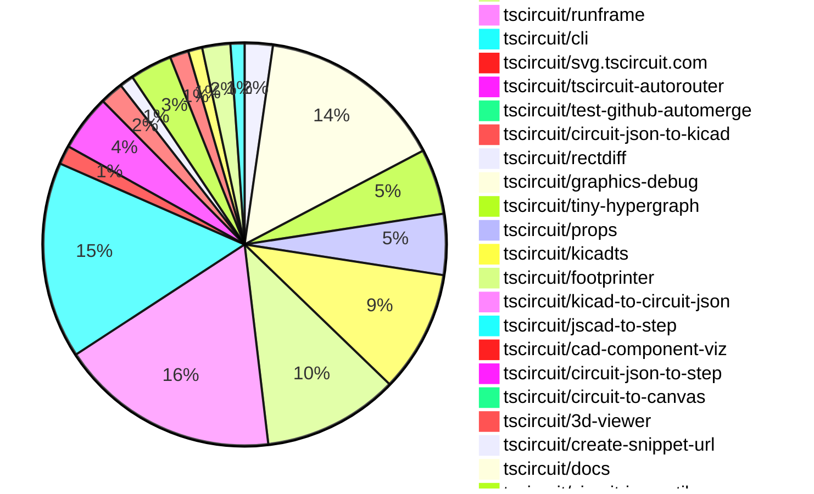

# contribution tracker

[contributions.tscircuit.com](https://contributions.tscircuit.com) ・ [tscircuit.com](https://tscircuit.com) ・ [Contribution Overviews](./contribution-overviews/) ・ [Changelogs](./changelogs/)

Generates weekly contribution overviews for tscircuit contributors. Check out all
the [contribution overviews here](./contribution-overviews/)
You can find AI-generated monthly changelogs in the [changelogs directory](./changelogs/)

- All PRs in the tscircuit org are scanned/summarized via an LLM
- The LLM classifies each Diff/PR as into a set of attributes for scoring
- All the PRs, summaries, and classifications are organized into charts and tables for [the website](https://contributions.tscircuit.com)

> Want to run locally? See the [Development Section](#development)

## Current Week

<!-- START_CURRENT_WEEK -->

# Contribution Overview 2026-04-14

The current week is shown below. There are 3 major sections:

- [Contributor Overview](#contributor-overview)
- [PRs by Repository](#prs-by-repository)
- [PRs by Contributor](#changes-by-contributor)
- [Scoring & Sponsorship Details](/docs/sponsorship-calculation-explanation.md)

## PRs by Repository



## Contributor Overview

| Contributor | 🐳 Major | 🐙 Minor | 🐌 Tiny | Score | ⭐ | Discussion Contributions |
|-------------|---------|---------|---------|-------|-----|--------------------------|
| [seveibar](#seveibar) | 9 | 7 | 7 | 58 | ⭐⭐⭐ | 0🔹 0🔶 0💎 |
| [ShiboSoftwareDev](#ShiboSoftwareDev) | 4 | 4 | 1 | 28 | ⭐⭐ | 0🔹 0🔶 0💎 |
| [Abse2001](#Abse2001) | 4 | 1 | 2 | 25 | ⭐⭐ | 0🔹 0🔶 0💎 |
| [imrishabh18](#imrishabh18) | 1 | 6 | 3 | 20 | ⭐⭐ | 0🔹 0🔶 0💎 |
| [rushabhcodes](#rushabhcodes) | 1 | 1 | 9 | 16 | ⭐⭐ | 0🔹 0🔶 0💎 |
| [AnasSarkiz](#AnasSarkiz) | 3 | 2 | 0 | 16 | ⭐⭐ | 0🔹 0🔶 0💎 |
| [tscircuitbot](#tscircuitbot) | 0 | 0 | 199 | 13.5 | ⭐⭐ | 0🔹 0🔶 0💎 |
| [MustafaMulla29](#MustafaMulla29) | 0 | 4 | 4 | 12 | ⭐⭐ | 0🔹 0🔶 0💎 |
| [techmannih](#techmannih) | 1 | 2 | 2 | 11 | ⭐⭐ | 0🔹 0🔶 0💎 |
| [mohan-bee](#mohan-bee) | 1 | 3 | 1 | 11 | ⭐⭐ | 0🔹 0🔶 0💎 |
| [0hmX](#0hmX) | 2 | 0 | 2 | 10 | ⭐ | 0🔹 0🔶 0💎 |
| [techmannih2](#techmannih2) | 1 | 0 | 0 | 4 | ⭐ | 0🔹 0🔶 0💎 |

## Staff Pass Ratio (SPR)

| Contributor | Reviewed PRs | Rejections | Approvals | SPR |
|-------------|--------------|------------|-----------|-----|
| [ShiboSoftwareDev](#ShiboSoftwareDev) | 7 | 1 | 7 | 85.7% |
| [mohan-bee](#mohan-bee) | 6 | 2 | 5 | 66.7% |
| [MustafaMulla29](#MustafaMulla29) | 5 | 0 | 5 | 100.0% |
| [Abse2001](#Abse2001) | 4 | 2 | 3 | 50.0% |
| [techmannih](#techmannih) | 3 | 0 | 3 | 100.0% |
| [rushabhcodes](#rushabhcodes) | 2 | 1 | 2 | 50.0% |
| [imrishabh18](#imrishabh18) | 2 | 0 | 2 | 100.0% |
| [AnasSarkiz](#AnasSarkiz) | 1 | 0 | 1 | 100.0% |
| [0hmX](#0hmX) | 1 | 0 | 1 | 100.0% |
| [techmannih2](#techmannih2) | 1 | 0 | 1 | 100.0% |

<details>
<summary>ShiboSoftwareDev SPR PRs (7)</summary>

- [#532](https://github.com/tscircuit/circuit-json/pull/532) add insertion_direction property to pcb_component
- [#383](https://github.com/tscircuit/easyeda-converter/pull/383) Convert diode and LED categories to semantic tscircuit components
- [#382](https://github.com/tscircuit/easyeda-converter/pull/382) Convert diode-category EasyEDA parts to tscircuit diodes
- [#2139](https://github.com/tscircuit/core/pull/2139) Add phased local autorouting by routingPhaseIndex
- [#2132](https://github.com/tscircuit/core/pull/2132) Deduplicate logical ports from composite footprint copper
- [#2140](https://github.com/tscircuit/core/pull/2140) Include vias in obstacle connectivity
- [#917](https://github.com/tscircuit/tscircuit-autorouter/pull/917) Add different-net via spacing to DRC checks

</details>

<details>
<summary>mohan-bee SPR PRs (6)</summary>

- [#537](https://github.com/tscircuit/circuit-json/pull/537) Add pcb_trace_warning support for explicit trace thickness mismatches
- [#2146](https://github.com/tscircuit/core/pull/2146) Fix ambiguous via selectors from creating broken traces
- [#132](https://github.com/tscircuit/checks/pull/132) Add DRC error when routed trace is thinner than requested
- [#3174](https://github.com/tscircuit/tscircuit.com/pull/3174) Add inline folder rename in file tree
- [#533](https://github.com/tscircuit/docs/pull/533) Add tsci update doc
- [#535](https://github.com/tscircuit/docs/pull/535) Update export doc

</details>

<details>
<summary>MustafaMulla29 SPR PRs (5)</summary>

- [#533](https://github.com/tscircuit/circuit-json/pull/533) New warning for missing manufacturer part number(required for connector)
- [#631](https://github.com/tscircuit/props/pull/631) Optional platformFetch for fetchPartCircuitJson
- [#2143](https://github.com/tscircuit/core/pull/2143) Emit a warning when manufacturerPartNumber is missing for the connector
- [#25](https://github.com/tscircuit/parts-engine/pull/25) feat(parts-engine): implement class based approach and add platformFetch override for Easyeda
- [#27](https://github.com/tscircuit/parts-engine/pull/27) Add EasyEDA proxy support to JlcPcbPartsEngine and clean up engine API

</details>

<details>
<summary>Abse2001 SPR PRs (4)</summary>

- [#741](https://github.com/tscircuit/pcb-viewer/pull/741) Add smooth error-focused zoom with bounds-based targeting and animated viewport transforms
- [#76](https://github.com/tscircuit/circuit-json-to-step/pull/76) Introduce dynamic module registry with fallback import
- [#75](https://github.com/tscircuit/circuit-json-to-step/pull/75) Introduce dynamic module registry with fallback import, validation, and test-time injection
- [#11](https://github.com/tscircuit/jscad-to-step/pull/11) Add robust color normalization and STEP color support for JSCAD models

</details>

<details>
<summary>techmannih SPR PRs (3)</summary>

- [#737](https://github.com/tscircuit/pcb-viewer/pull/737) Fix inner-layer copper pour rendering
- [#538](https://github.com/tscircuit/circuit-json/pull/538) Add optional 'display_inductance' support to 'SourceSimpleInductor'
- [#2141](https://github.com/tscircuit/core/pull/2141) Support rotated pill-hole-with-rect-pad plated hole

</details>

<details>
<summary>rushabhcodes SPR PRs (2)</summary>

- [#543](https://github.com/tscircuit/circuit-json/pull/543) Add pcb_note_text.is_mirrored to support bottom-layer mirrored text
- [#232](https://github.com/tscircuit/circuit-to-canvas/pull/232) Auto-mirror bottom-layer pcb_note_text and add regression coverage

</details>

<details>
<summary>imrishabh18 SPR PRs (2)</summary>

- [#550](https://github.com/tscircuit/circuit-json/pull/550) Add pcb_via_trace_clearance_error schema and tests
- [#135](https://github.com/tscircuit/checks/pull/135) Add via-vs-trace clearance check and integrate into exports and runners

</details>

<details>
<summary>AnasSarkiz SPR PRs (1)</summary>

- [#927](https://github.com/tscircuit/tscircuit-autorouter/pull/927) update repair02 to Prevent Over-Translation and Enforce Consistent Trace-Clearance Regression Guards

</details>

<details>
<summary>0hmX SPR PRs (1)</summary>

- [#923](https://github.com/tscircuit/tscircuit-autorouter/pull/923) feat: number of cramped port point to keep && bug: fix not adding parent

</details>

<details>
<summary>techmannih2 SPR PRs (1)</summary>

- [#202](https://github.com/tscircuit/circuit-json-to-kicad/pull/202)  feat(pcb): add default KiCad component reference and value fields 

</details>

> Note: AI evaluates PRs and assigns 1-3 star ratings automatically. 4 and 5 star ratings require manual staff review.

### Discussion Contribution Legend

- 🔹 Normal Comments: Basic participation with minimal effort
- 🔶 Great Informative Comments: Thoughtful participation that adds value
- 💎 Incredible Comments: Exceptional participation with high-quality content

## Review Table

[reviews-received-hover]: ## "Number of reviews received for PRs for this contributor"
[approvals-received-hover]: ## "Number of approvals received for PRs this contributor authored"
[rejections-received-hover]: ## "Number of rejections received for PRs this contributor authored"
[prs-opened-hover]: ## "Number of PRs opened by this contributor"
[issues-created-hover]: ## "Number of issues created by this contributor"

| Contributor | Reviews Received | Approvals Received | Rejections Received | Approvals | Rejections Given | PRs Opened | PRs Merged | Issues Created |
|---|---|---|---|---|---|---|---|---|
| [lyfher](#lyfher) | 0 | 0 | 0 | 0 | 0 | 4 | 0 | 0 |
| [LuSrodri](#LuSrodri) | 0 | 0 | 0 | 0 | 0 | 4 | 0 | 0 |
| [tscircuitbot](#tscircuitbot) | 0 | 0 | 0 | 0 | 0 | 263 | 199 | 0 |
| [seveibar](#seveibar) | 6 | 1 | 0 | 37 | 3 | 34 | 23 | 0 |
| [Angelebeats](#Angelebeats) | 3 | 0 | 2 | 0 | 0 | 10 | 0 | 0 |
| [rushabhcodes](#rushabhcodes) | 30 | 13 | 0 | 2 | 4 | 14 | 11 | 0 |
| [Abse2001](#Abse2001) | 18 | 5 | 2 | 5 | 0 | 8 | 7 | 0 |
| [fengfirewudi](#fengfirewudi) | 0 | 0 | 0 | 0 | 0 | 4 | 0 | 0 |
| [techmannih](#techmannih) | 5 | 5 | 0 | 2 | 0 | 6 | 5 | 0 |
| [imrishabh18](#imrishabh18) | 3 | 2 | 0 | 3 | 2 | 11 | 10 | 0 |
| [mohan-bee](#mohan-bee) | 18 | 7 | 2 | 0 | 0 | 12 | 5 | 0 |
| [MustafaMulla29](#MustafaMulla29) | 21 | 6 | 0 | 0 | 0 | 17 | 9 | 0 |
| [ShiboSoftwareDev](#ShiboSoftwareDev) | 11 | 7 | 0 | 3 | 0 | 14 | 9 | 0 |
| [Kabi10](#Kabi10) | 0 | 0 | 0 | 0 | 0 | 2 | 0 | 0 |
| [GusFromSpace](#GusFromSpace) | 0 | 0 | 0 | 0 | 0 | 1 | 0 | 0 |
| [thegreatalxx](#thegreatalxx) | 0 | 0 | 0 | 0 | 0 | 4 | 0 | 0 |
| [duckyduckycode](#duckyduckycode) | 0 | 0 | 0 | 0 | 0 | 1 | 0 | 0 |
| [tarai-dl](#tarai-dl) | 0 | 0 | 0 | 0 | 0 | 2 | 0 | 0 |
| [AnasSarkiz](#AnasSarkiz) | 5 | 5 | 0 | 0 | 0 | 11 | 5 | 0 |
| [0hmX](#0hmX) | 2 | 1 | 0 | 0 | 0 | 13 | 5 | 0 |
| [oneAI-Automations](#oneAI-Automations) | 0 | 0 | 0 | 0 | 0 | 1 | 0 | 0 |
| [pubgads77-star](#pubgads77-star) | 0 | 0 | 0 | 0 | 0 | 2 | 0 | 0 |
| [Varshik12](#Varshik12) | 0 | 0 | 0 | 0 | 0 | 1 | 0 | 0 |
| [Wong789](#Wong789) | 2 | 0 | 2 | 0 | 0 | 4 | 0 | 0 |
| [CyberSculptor96](#CyberSculptor96) | 0 | 0 | 0 | 0 | 0 | 1 | 0 | 0 |
| [shanimaury89-art](#shanimaury89-art) | 0 | 0 | 0 | 0 | 0 | 1 | 0 | 0 |
| [liufang88789-ui](#liufang88789-ui) | 0 | 0 | 0 | 0 | 0 | 1 | 0 | 0 |
| [techmannih2](#techmannih2) | 9 | 0 | 1 | 0 | 0 | 3 | 1 | 0 |

## Changes by Repository

### [tscircuit/pcb-viewer](https://github.com/tscircuit/pcb-viewer)

| PR # | Impact | Rating | Contributor | Description |
|------|--------|--------|-------------|-------------|
| [#741](https://github.com/tscircuit/pcb-viewer/pull/741) | 🐳 Major | ⭐⭐⭐ | Abse2001 | Adds a smooth zoom feature that focuses on errors in the PCB layout, allowing users to easily identify and address issues by animating the viewport to the relevant area. |
| [#737](https://github.com/tscircuit/pcb-viewer/pull/737) | 🐳 Major | ⭐⭐⭐ | techmannih | test :https:pcb-viewer-1oocgd3ju-tscircuit.vercel.app?fixture7B22path223A22src2Fexamples2F20262Frepros2Finner-layer-copper-pours.fixture.tsx227D https:pcb-viewer-1oocgd3ju-tscircuit.vercel.app?fixture7B22path223A22src2Fexamples2F20262Frepros2Foverlapping-inner-layer-copper-pours.fixture.tsx227D render copper pours through the shared copper layer loop used by other copper elements while tracespadstext already looped across top, bottom, and inner1-inner6 remove the duplicate topbottom-only copper pour draw pass add an 8-layer repro fixture covering top, inner1-inner6, and bottom |

<details>
<summary>🐌 Tiny Contributions (4)</summary>

| PR # | Impact | Contributor | Description |
|------|--------|-------------|-------------|
| [#746](https://github.com/tscircuit/pcb-viewer/pull/746) | 🐌 Tiny | tscircuitbot | Automated package update |
| [#743](https://github.com/tscircuit/pcb-viewer/pull/743) | 🐌 Tiny | tscircuitbot | Automated package update |
| [#740](https://github.com/tscircuit/pcb-viewer/pull/740) | 🐌 Tiny | tscircuitbot | Automated package update |
| [#745](https://github.com/tscircuit/pcb-viewer/pull/745) | 🐌 Tiny | seveibar | Changes the error visualization in the PCB viewer to use diamond shapes at error centers instead of circles, improving clarity in error representation. |

</details>

### [tscircuit/tscircuit](https://github.com/tscircuit/tscircuit)


<details>
<summary>🐌 Tiny Contributions (40)</summary>

| PR # | Impact | Contributor | Description |
|------|--------|-------------|-------------|
| [#2946](https://github.com/tscircuit/tscircuit/pull/2946) | 🐌 Tiny | tscircuitbot | Automated package update |
| [#2945](https://github.com/tscircuit/tscircuit/pull/2945) | 🐌 Tiny | tscircuitbot | Updates the tscircuitcli package from version 0.1.1247 to 0.1.1248 and the tscircuitrunframe package from version 0.0.1839 to 0.0.1840 in the package.json file. |
| [#2944](https://github.com/tscircuit/tscircuit/pull/2944) | 🐌 Tiny | tscircuitbot | Updates the package version from 0.0.1645 to 0.0.1646 in package.json |
| [#2943](https://github.com/tscircuit/tscircuit/pull/2943) | 🐌 Tiny | tscircuitbot | Automated package update |
| [#2942](https://github.com/tscircuit/tscircuit/pull/2942) | 🐌 Tiny | tscircuitbot | Automated package update |
| [#2941](https://github.com/tscircuit/tscircuit/pull/2941) | 🐌 Tiny | tscircuitbot | Automated package update |
| [#2937](https://github.com/tscircuit/tscircuit/pull/2937) | 🐌 Tiny | tscircuitbot | Automated package update |
| [#2936](https://github.com/tscircuit/tscircuit/pull/2936) | 🐌 Tiny | tscircuitbot | Automated package update |
| [#2932](https://github.com/tscircuit/tscircuit/pull/2932) | 🐌 Tiny | tscircuitbot | Updates the tscircuitcli package to version 0.1.1242 and the tscircuitrunframe package to version 0.0.1833, while downgrading the circuit-json package to version 0.0.408. |
| [#2933](https://github.com/tscircuit/tscircuit/pull/2933) | 🐌 Tiny | tscircuitbot | Automated package update |
| [#2931](https://github.com/tscircuit/tscircuit/pull/2931) | 🐌 Tiny | tscircuitbot | Automated package update |
| [#2929](https://github.com/tscircuit/tscircuit/pull/2929) | 🐌 Tiny | tscircuitbot | Updates the package version from 0.0.1639 to 0.0.1640 in package.json |
| [#2935](https://github.com/tscircuit/tscircuit/pull/2935) | 🐌 Tiny | tscircuitbot | Automated package update |
| [#2934](https://github.com/tscircuit/tscircuit/pull/2934) | 🐌 Tiny | tscircuitbot | Automated package update |
| [#2928](https://github.com/tscircuit/tscircuit/pull/2928) | 🐌 Tiny | tscircuitbot | Automated package update |
| [#2924](https://github.com/tscircuit/tscircuit/pull/2924) | 🐌 Tiny | tscircuitbot | Updates the tscircuitcli package from version 0.1.1238 to 0.1.1239 and the tscircuitrunframe package from version 0.0.1829 to 0.0.1830 in package.json |
| [#2916](https://github.com/tscircuit/tscircuit/pull/2916) | 🐌 Tiny | tscircuitbot | Automated package update |
| [#2925](https://github.com/tscircuit/tscircuit/pull/2925) | 🐌 Tiny | tscircuitbot | Automated package update |
| [#2917](https://github.com/tscircuit/tscircuit/pull/2917) | 🐌 Tiny | tscircuitbot | Automated package update |
| [#2920](https://github.com/tscircuit/tscircuit/pull/2920) | 🐌 Tiny | tscircuitbot | Automated package update |
| [#2926](https://github.com/tscircuit/tscircuit/pull/2926) | 🐌 Tiny | tscircuitbot | Automated package update |
| [#2919](https://github.com/tscircuit/tscircuit/pull/2919) | 🐌 Tiny | tscircuitbot | Automated package update |
| [#2918](https://github.com/tscircuit/tscircuit/pull/2918) | 🐌 Tiny | tscircuitbot | Automated package update |
| [#2921](https://github.com/tscircuit/tscircuit/pull/2921) | 🐌 Tiny | tscircuitbot | Automated package update |
| [#2923](https://github.com/tscircuit/tscircuit/pull/2923) | 🐌 Tiny | tscircuitbot | Automated package update |
| [#2922](https://github.com/tscircuit/tscircuit/pull/2922) | 🐌 Tiny | tscircuitbot | Automated package update |
| [#2927](https://github.com/tscircuit/tscircuit/pull/2927) | 🐌 Tiny | tscircuitbot | Automated package update to version 0.0.1639 |
| [#2901](https://github.com/tscircuit/tscircuit/pull/2901) | 🐌 Tiny | tscircuitbot | Updates the tscircuitcli package from version 0.1.1227 to 0.1.1228 and the tscircuitrunframe package from version 0.0.1816 to 0.0.1817 in the package.json file. |
| [#2914](https://github.com/tscircuit/tscircuit/pull/2914) | 🐌 Tiny | tscircuitbot | Automated package update |
| [#2905](https://github.com/tscircuit/tscircuit/pull/2905) | 🐌 Tiny | tscircuitbot | Automated package update |
| [#2908](https://github.com/tscircuit/tscircuit/pull/2908) | 🐌 Tiny | tscircuitbot | Updates the version of several packages in the project, including tscircuitcli, tscircuitcore, and tscircuiteval. |
| [#2909](https://github.com/tscircuit/tscircuit/pull/2909) | 🐌 Tiny | tscircuitbot | Updates the package version from 0.0.1630 to 0.0.1631 in package.json |
| [#2902](https://github.com/tscircuit/tscircuit/pull/2902) | 🐌 Tiny | tscircuitbot | Automated package update |
| [#2911](https://github.com/tscircuit/tscircuit/pull/2911) | 🐌 Tiny | tscircuitbot | Automated package update |
| [#2915](https://github.com/tscircuit/tscircuit/pull/2915) | 🐌 Tiny | tscircuitbot | Automated package update |
| [#2910](https://github.com/tscircuit/tscircuit/pull/2910) | 🐌 Tiny | tscircuitbot | Automated package update |
| [#2904](https://github.com/tscircuit/tscircuit/pull/2904) | 🐌 Tiny | tscircuitbot | Automated package update |
| [#2906](https://github.com/tscircuit/tscircuit/pull/2906) | 🐌 Tiny | tscircuitbot | Automated package update |
| [#2903](https://github.com/tscircuit/tscircuit/pull/2903) | 🐌 Tiny | tscircuitbot | Updates the tscircuitcli package and other related dependencies to their latest versions. |
| [#2930](https://github.com/tscircuit/tscircuit/pull/2930) | 🐌 Tiny | techmannih | Updates the circuit-json dependency version from 0.0.408 to 0.0.411 in package.json |

</details>

### [tscircuit/circuit-json](https://github.com/tscircuit/circuit-json)

| PR # | Impact | Rating | Contributor | Description |
|------|--------|--------|-------------|-------------|
| [#548](https://github.com/tscircuit/circuit-json/pull/548) | 🐳 Major | ⭐⭐⭐ | seveibar | Add manufacturing DRC properties to the pcb_board schema to express and validate board-level manufacturing constraints consistently. |
| [#543](https://github.com/tscircuit/circuit-json/pull/543) | 🐳 Major | ⭐⭐⭐ | rushabhcodes | Adds is_mirrored flag to PcbNoteText schema to enable bottom-layer mirrored text rendering in circuit-to-canvas. |
| [#544](https://github.com/tscircuit/circuit-json/pull/544) | 🐳 Major | ⭐⭐⭐ | imrishabh18 | Add explicit error elements to represent pad-to-pad and pad-to-trace clearance violations modeled after the existing pcb_via_clearance_error shape so these cases can be validated and included in the union types. |
| [#538](https://github.com/tscircuit/circuit-json/pull/538) | 🐙 Minor | ⭐⭐ | techmannih | Adds an optional display_inductance field to the SourceSimpleInductor interface for type safety and consistency with other components. |
| [#550](https://github.com/tscircuit/circuit-json/pull/550) | 🐙 Minor | ⭐⭐ | imrishabh18 | Add a dedicated error schema for PCB vias that are too close to traces, including tests for validation and integration into existing structures. |
| [#537](https://github.com/tscircuit/circuit-json/pull/537) | 🐙 Minor | ⭐⭐ | mohan-bee | Adds pcb_trace_warning to circuit-json to represent trace-thickness mismatch warnings in the shared spec and downstream tooling. |
| [#532](https://github.com/tscircuit/circuit-json/pull/532) | 🐙 Minor | ⭐⭐ | ShiboSoftwareDev | Adds an optional insertion_direction property to the pcb_component, allowing specification of the direction from which a component is inserted. |
| [#533](https://github.com/tscircuit/circuit-json/pull/533) | 🐙 Minor | ⭐⭐ | MustafaMulla29 | Adds a warning for standard connectors that are missing a manufacturer part number, enhancing error handling in circuit design. |

<details>
<summary>🐌 Tiny Contributions (6)</summary>

| PR # | Impact | Contributor | Description |
|------|--------|-------------|-------------|
| [#551](https://github.com/tscircuit/circuit-json/pull/551) | 🐌 Tiny | tscircuitbot | Automated package update |
| [#547](https://github.com/tscircuit/circuit-json/pull/547) | 🐌 Tiny | tscircuitbot | Automated package update |
| [#534](https://github.com/tscircuit/circuit-json/pull/534) | 🐌 Tiny | tscircuitbot | Updates the package version from v0.0.406 to v0.0.408 in package.json |
| [#541](https://github.com/tscircuit/circuit-json/pull/541) | 🐌 Tiny | tscircuitbot | Automated package update |
| [#539](https://github.com/tscircuit/circuit-json/pull/539) | 🐌 Tiny | tscircuitbot | Automated package update |
| [#545](https://github.com/tscircuit/circuit-json/pull/545) | 🐌 Tiny | imrishabh18 | Removes the formatbot GitHub workflow that automatically formats code on pull requests, which was hindering updates to the branch. |

</details>

### [tscircuit/core](https://github.com/tscircuit/core)

| PR # | Impact | Rating | Contributor | Description |
|------|--------|--------|-------------|-------------|
| [#2139](https://github.com/tscircuit/core/pull/2139) | 🐳 Major | ⭐⭐⭐ | ShiboSoftwareDev | Implements phased local autorouting for groups, allowing higher-priority routes to be preserved by routing traces and nets in phases based on their routingPhaseIndex. |
| [#2132](https://github.com/tscircuit/core/pull/2132) | 🐳 Major | ⭐⭐⭐ | ShiboSoftwareDev | Fixes composite footprints where multiple copper primitives share the same logical pin, such as an SMT pad plus plated hole with the same portHints. |
| [#2140](https://github.com/tscircuit/core/pull/2140) | 🐳 Major | ⭐⭐⭐ | ShiboSoftwareDev | Fixes autorouter obstacle generation so pcb_via obstacles include their own connectivity id instead of always using an empty connectedTo list. |
| [#2147](https://github.com/tscircuit/core/pull/2147) | 🐙 Minor | ⭐⭐ | seveibar | Allows a component-level noConnect list to mark source ports as intentionally unconnected and prevent spurious missing-trace warnings. |
| [#2141](https://github.com/tscircuit/core/pull/2141) | 🐙 Minor | ⭐⭐ | techmannih | Internally converts platedhole shapepill_hole_with_rect_pad pcbRotation...  to rotated_pill_hole_with_rect_pad, matching the existing rotated hole behavior, and adds reverse circuit-json mapping for compatibility. |
| [#2138](https://github.com/tscircuit/core/pull/2138) | 🐙 Minor | ⭐⭐ | imrishabh18 | Adds logic to ensure schematic symbols with orientation suffixes (_horz_vert) maintain correct visual orientation after group placement rotations. |
| [#2146](https://github.com/tscircuit/core/pull/2146) | 🐙 Minor | ⭐⭐ | mohan-bee | Fixes ambiguous via selectors to prevent invalid trace endpoints in circuit designs. |
| [#2143](https://github.com/tscircuit/core/pull/2143) | 🐙 Minor | ⭐⭐ | MustafaMulla29 | Adds a warning when the manufacturerPartNumber is missing for connectors with a specified standard, ensuring users are notified to provide this information to avoid future issues. |

<details>
<summary>🐌 Tiny Contributions (5)</summary>

| PR # | Impact | Contributor | Description |
|------|--------|-------------|-------------|
| [#2154](https://github.com/tscircuit/core/pull/2154) | 🐌 Tiny | tscircuitbot | Updates the tscircuitchecks package from version 0.0.118 to 0.0.119 |
| [#2153](https://github.com/tscircuit/core/pull/2153) | 🐌 Tiny | tscircuitbot | Updates the tscircuitchecks package from version 0.0.117 to 0.0.118 in the package.json file. |
| [#2145](https://github.com/tscircuit/core/pull/2145) | 🐌 Tiny | tscircuitbot | Updates the tscircuitchecks package from version 0.0.116 to 0.0.117 in the package.json file. |
| [#2152](https://github.com/tscircuit/core/pull/2152) | 🐌 Tiny | seveibar | Updates the autorouter dependency to version 0.0.434 in the package.json file |
| [#2155](https://github.com/tscircuit/core/pull/2155) | 🐌 Tiny | imrishabh18 | Updates the tscircuitcircuit-json-util package from version 0.0.92 to 0.0.93 to resolve build failures during evaluation. |

</details>

### [tscircuit/tscircuit.com](https://github.com/tscircuit/tscircuit.com)

| PR # | Impact | Rating | Contributor | Description |
|------|--------|--------|-------------|-------------|
| [#3174](https://github.com/tscircuit/tscircuit.com/pull/3174) | 🐳 Major | ⭐⭐⭐ | mohan-bee | This change makes folder rename work like file rename, with the input shown inline in the tree row and nested file paths updated when a folder name changes. |

<details>
<summary>🐌 Tiny Contributions (25)</summary>

| PR # | Impact | Contributor | Description |
|------|--------|-------------|-------------|
| [#3193](https://github.com/tscircuit/tscircuit.com/pull/3193) | 🐌 Tiny | tscircuitbot | Updates the tscircuitrunframe package from version 0.0.1839 to 0.0.1840 |
| [#3190](https://github.com/tscircuit/tscircuit.com/pull/3190) | 🐌 Tiny | tscircuitbot | Updates the tscircuitrunframe package from version 0.0.1838 to 0.0.1839 |
| [#3189](https://github.com/tscircuit/tscircuit.com/pull/3189) | 🐌 Tiny | tscircuitbot | Updates the tscircuiteval package from version 0.0.764 to 0.0.765 |
| [#3188](https://github.com/tscircuit/tscircuit.com/pull/3188) | 🐌 Tiny | tscircuitbot | Automated package update |
| [#3187](https://github.com/tscircuit/tscircuit.com/pull/3187) | 🐌 Tiny | tscircuitbot | Updates the tscircuitrunframe package from version 0.0.1835 to 0.0.1837 |
| [#3186](https://github.com/tscircuit/tscircuit.com/pull/3186) | 🐌 Tiny | tscircuitbot | Automated package update |
| [#3185](https://github.com/tscircuit/tscircuit.com/pull/3185) | 🐌 Tiny | tscircuitbot | Updates the tscircuiteval package from version 0.0.762 to 0.0.763 |
| [#3184](https://github.com/tscircuit/tscircuit.com/pull/3184) | 🐌 Tiny | tscircuitbot | Updates the tscircuitrunframe package from version 0.0.1834 to 0.0.1835 |
| [#3183](https://github.com/tscircuit/tscircuit.com/pull/3183) | 🐌 Tiny | tscircuitbot | Updates the tscircuitrunframe package from version 0.0.1833 to 0.0.1834 |
| [#3181](https://github.com/tscircuit/tscircuit.com/pull/3181) | 🐌 Tiny | tscircuitbot | Automated package update |
| [#3178](https://github.com/tscircuit/tscircuit.com/pull/3178) | 🐌 Tiny | tscircuitbot | Updates the tscircuiteval package from version 0.0.760 to 0.0.761 |
| [#3182](https://github.com/tscircuit/tscircuit.com/pull/3182) | 🐌 Tiny | tscircuitbot | Updates the tscircuiteval package to version 0.0.762 in the package.json file. |
| [#3171](https://github.com/tscircuit/tscircuit.com/pull/3171) | 🐌 Tiny | tscircuitbot | Updates the tscircuiteval package from version 0.0.759 to 0.0.760 |
| [#3168](https://github.com/tscircuit/tscircuit.com/pull/3168) | 🐌 Tiny | tscircuitbot | Updates the version of the tscircuiteval package from 0.0.758 to 0.0.759 in package.json |
| [#3166](https://github.com/tscircuit/tscircuit.com/pull/3166) | 🐌 Tiny | tscircuitbot | Automated package update |
| [#3160](https://github.com/tscircuit/tscircuit.com/pull/3160) | 🐌 Tiny | tscircuitbot | Updates the tscircuiteval package from version 0.0.754 to 0.0.755 |
| [#3152](https://github.com/tscircuit/tscircuit.com/pull/3152) | 🐌 Tiny | tscircuitbot | Updates the version of the tscircuiteval package from 0.0.751 to 0.0.752 in package.json |
| [#3164](https://github.com/tscircuit/tscircuit.com/pull/3164) | 🐌 Tiny | tscircuitbot | Automated package update |
| [#3162](https://github.com/tscircuit/tscircuit.com/pull/3162) | 🐌 Tiny | tscircuitbot | Automated package update |
| [#3158](https://github.com/tscircuit/tscircuit.com/pull/3158) | 🐌 Tiny | tscircuitbot | Automated package update |
| [#3153](https://github.com/tscircuit/tscircuit.com/pull/3153) | 🐌 Tiny | tscircuitbot | Updates the tscircuiteval package to version 0.0.753 |
| [#3150](https://github.com/tscircuit/tscircuit.com/pull/3150) | 🐌 Tiny | tscircuitbot | Updates the tscircuiteval package from version 0.0.750 to 0.0.751 |
| [#3173](https://github.com/tscircuit/tscircuit.com/pull/3173) | 🐌 Tiny | seveibar | Clarifies the 404 page copy to inform users that a missing page may be private rather than only moved. |
| [#3175](https://github.com/tscircuit/tscircuit.com/pull/3175) | 🐌 Tiny | Abse2001 | Refactors the fabrication and CAD export pipelines to utilize internal dynamic imports for improved module loading efficiency. |
| [#3180](https://github.com/tscircuit/tscircuit.com/pull/3180) | 🐌 Tiny | rushabhcodes | Updates the versions of tscircuit3d-viewer from 0.0.548 to 0.0.554 and tscircuitrunframe from 0.0.1778 to 0.0.1832 in package.json |

</details>

### [tscircuit/eval](https://github.com/tscircuit/eval)


<details>
<summary>🐌 Tiny Contributions (29)</summary>

| PR # | Impact | Contributor | Description |
|------|--------|-------------|-------------|
| [#2436](https://github.com/tscircuit/eval/pull/2436) | 🐌 Tiny | tscircuitbot | Automated package update |
| [#2435](https://github.com/tscircuit/eval/pull/2435) | 🐌 Tiny | tscircuitbot | Automated package update |
| [#2431](https://github.com/tscircuit/eval/pull/2431) | 🐌 Tiny | tscircuitbot | Automated package update |
| [#2428](https://github.com/tscircuit/eval/pull/2428) | 🐌 Tiny | tscircuitbot | Automated package update |
| [#2427](https://github.com/tscircuit/eval/pull/2427) | 🐌 Tiny | tscircuitbot | Automated package update |
| [#2423](https://github.com/tscircuit/eval/pull/2423) | 🐌 Tiny | tscircuitbot | Automated package update |
| [#2424](https://github.com/tscircuit/eval/pull/2424) | 🐌 Tiny | tscircuitbot | Automated package update |
| [#2425](https://github.com/tscircuit/eval/pull/2425) | 🐌 Tiny | tscircuitbot | Automated package update |
| [#2426](https://github.com/tscircuit/eval/pull/2426) | 🐌 Tiny | tscircuitbot | Automated package update |
| [#2420](https://github.com/tscircuit/eval/pull/2420) | 🐌 Tiny | tscircuitbot | Updates package versions in package.json to their latest compatible versions. |
| [#2421](https://github.com/tscircuit/eval/pull/2421) | 🐌 Tiny | tscircuitbot | Automated package update |
| [#2417](https://github.com/tscircuit/eval/pull/2417) | 🐌 Tiny | tscircuitbot | Automated package update |
| [#2416](https://github.com/tscircuit/eval/pull/2416) | 🐌 Tiny | tscircuitbot | Automated package update |
| [#2414](https://github.com/tscircuit/eval/pull/2414) | 🐌 Tiny | tscircuitbot | Automated package update |
| [#2398](https://github.com/tscircuit/eval/pull/2398) | 🐌 Tiny | tscircuitbot | Automated package update |
| [#2411](https://github.com/tscircuit/eval/pull/2411) | 🐌 Tiny | tscircuitbot | Automated package update |
| [#2392](https://github.com/tscircuit/eval/pull/2392) | 🐌 Tiny | tscircuitbot | Automated package update |
| [#2393](https://github.com/tscircuit/eval/pull/2393) | 🐌 Tiny | tscircuitbot | Automated package update |
| [#2402](https://github.com/tscircuit/eval/pull/2402) | 🐌 Tiny | tscircuitbot | Automated package update |
| [#2408](https://github.com/tscircuit/eval/pull/2408) | 🐌 Tiny | tscircuitbot | Automated package update |
| [#2405](https://github.com/tscircuit/eval/pull/2405) | 🐌 Tiny | tscircuitbot | Automated package update |
| [#2404](https://github.com/tscircuit/eval/pull/2404) | 🐌 Tiny | tscircuitbot | Updates the version of the tscircuitcore package from 0.0.1164 to 0.0.1165 in package.json |
| [#2399](https://github.com/tscircuit/eval/pull/2399) | 🐌 Tiny | tscircuitbot | Automated package update |
| [#2397](https://github.com/tscircuit/eval/pull/2397) | 🐌 Tiny | tscircuitbot | Updates the version of the tscircuitcore package from 0.0.1162 to 0.0.1163 in package.json |
| [#2401](https://github.com/tscircuit/eval/pull/2401) | 🐌 Tiny | tscircuitbot | Automated package update |
| [#2395](https://github.com/tscircuit/eval/pull/2395) | 🐌 Tiny | tscircuitbot | Updates the version of the tscircuitcore package from 0.0.1161 to 0.0.1162 in package.json |
| [#2430](https://github.com/tscircuit/eval/pull/2430) | 🐌 Tiny | imrishabh18 | Updates the dependencies for tscircuitchecks, tscircuitcircuit-json-util, and tscircuitcore to their latest versions. |
| [#2413](https://github.com/tscircuit/eval/pull/2413) | 🐌 Tiny | MustafaMulla29 | Removes easyeda from the noExternal configuration in multiple build configuration files, allowing it to be treated as an external dependency. |
| [#2407](https://github.com/tscircuit/eval/pull/2407) | 🐌 Tiny | MustafaMulla29 | Removes easyeda from the noExternal configuration in multiple build configuration files. |

</details>

### [tscircuit/runframe](https://github.com/tscircuit/runframe)


<details>
<summary>🐌 Tiny Contributions (47)</summary>

| PR # | Impact | Contributor | Description |
|------|--------|-------------|-------------|
| [#3155](https://github.com/tscircuit/runframe/pull/3155) | 🐌 Tiny | tscircuitbot | Automated package update |
| [#3154](https://github.com/tscircuit/runframe/pull/3154) | 🐌 Tiny | tscircuitbot | Automated package update |
| [#3153](https://github.com/tscircuit/runframe/pull/3153) | 🐌 Tiny | tscircuitbot | Automated package update |
| [#3152](https://github.com/tscircuit/runframe/pull/3152) | 🐌 Tiny | tscircuitbot | Updates the tscircuiteval package from version 0.0.764 to 0.0.765 in the package.json file. |
| [#3151](https://github.com/tscircuit/runframe/pull/3151) | 🐌 Tiny | tscircuitbot | Automated package update |
| [#3150](https://github.com/tscircuit/runframe/pull/3150) | 🐌 Tiny | tscircuitbot | Updates the tscircuitpcb-viewer package from version 1.11.366 to 1.11.367 |
| [#3149](https://github.com/tscircuit/runframe/pull/3149) | 🐌 Tiny | tscircuitbot | Automated package update |
| [#3148](https://github.com/tscircuit/runframe/pull/3148) | 🐌 Tiny | tscircuitbot | Updates the tscircuiteval package to version 0.0.764 in the package.json file. |
| [#3147](https://github.com/tscircuit/runframe/pull/3147) | 🐌 Tiny | tscircuitbot | Automated package update |
| [#3146](https://github.com/tscircuit/runframe/pull/3146) | 🐌 Tiny | tscircuitbot | Updates the tscircuiteval package from version 0.0.762 to 0.0.763 in the package.json file. |
| [#3145](https://github.com/tscircuit/runframe/pull/3145) | 🐌 Tiny | tscircuitbot | Automated package update |
| [#3144](https://github.com/tscircuit/runframe/pull/3144) | 🐌 Tiny | tscircuitbot | Updates the circuit-json-to-kicad package from version 0.0.104 to 0.0.105 |
| [#3142](https://github.com/tscircuit/runframe/pull/3142) | 🐌 Tiny | tscircuitbot | Automated package update |
| [#3141](https://github.com/tscircuit/runframe/pull/3141) | 🐌 Tiny | tscircuitbot | Updates the tscircuiteval package to version 0.0.762 in the package.json file. |
| [#3138](https://github.com/tscircuit/runframe/pull/3138) | 🐌 Tiny | tscircuitbot | Automated package update |
| [#3140](https://github.com/tscircuit/runframe/pull/3140) | 🐌 Tiny | tscircuitbot | Automated package update |
| [#3137](https://github.com/tscircuit/runframe/pull/3137) | 🐌 Tiny | tscircuitbot | Updates the tscircuiteval package from version 0.0.760 to 0.0.761 |
| [#3126](https://github.com/tscircuit/runframe/pull/3126) | 🐌 Tiny | tscircuitbot | Updates the tscircuiteval package from version 0.0.758 to 0.0.759 in the package.json file. |
| [#3133](https://github.com/tscircuit/runframe/pull/3133) | 🐌 Tiny | tscircuitbot | Updates the circuit-json-to-kicad package version from 0.0.101 to 0.0.104 in package.json |
| [#3131](https://github.com/tscircuit/runframe/pull/3131) | 🐌 Tiny | tscircuitbot | Automated package update |
| [#3130](https://github.com/tscircuit/runframe/pull/3130) | 🐌 Tiny | tscircuitbot | Updates the tscircuiteval package from version 0.0.759 to 0.0.760 |
| [#3127](https://github.com/tscircuit/runframe/pull/3127) | 🐌 Tiny | tscircuitbot | Automated package update |
| [#3135](https://github.com/tscircuit/runframe/pull/3135) | 🐌 Tiny | tscircuitbot | Updates the tscircuit3d-viewer package to version 0.0.554 in package.json |
| [#3134](https://github.com/tscircuit/runframe/pull/3134) | 🐌 Tiny | tscircuitbot | Automated package update |
| [#3129](https://github.com/tscircuit/runframe/pull/3129) | 🐌 Tiny | tscircuitbot | Automated package update |
| [#3125](https://github.com/tscircuit/runframe/pull/3125) | 🐌 Tiny | tscircuitbot | Updates the package version from v0.0.1825 to v0.0.1826 in package.json |
| [#3136](https://github.com/tscircuit/runframe/pull/3136) | 🐌 Tiny | tscircuitbot | Automated package update |
| [#3128](https://github.com/tscircuit/runframe/pull/3128) | 🐌 Tiny | tscircuitbot | Updates the tscircuitpcb-viewer package to version 1.11.366 |
| [#3124](https://github.com/tscircuit/runframe/pull/3124) | 🐌 Tiny | tscircuitbot | Updates the tscircuiteval package from version 0.0.757 to 0.0.758 in the package.json file. |
| [#3116](https://github.com/tscircuit/runframe/pull/3116) | 🐌 Tiny | tscircuitbot | Updates the tscircuiteval package from version 0.0.753 to 0.0.754 in the package.json file. |
| [#3121](https://github.com/tscircuit/runframe/pull/3121) | 🐌 Tiny | tscircuitbot | Automated package update |
| [#3120](https://github.com/tscircuit/runframe/pull/3120) | 🐌 Tiny | tscircuitbot | Updates the tscircuiteval package to version 0.0.756 in the package.json file. |
| [#3119](https://github.com/tscircuit/runframe/pull/3119) | 🐌 Tiny | tscircuitbot | Automated package update |
| [#3118](https://github.com/tscircuit/runframe/pull/3118) | 🐌 Tiny | tscircuitbot | Updates the tscircuiteval package from version 0.0.754 to 0.0.755 |
| [#3117](https://github.com/tscircuit/runframe/pull/3117) | 🐌 Tiny | tscircuitbot | Automated package update |
| [#3113](https://github.com/tscircuit/runframe/pull/3113) | 🐌 Tiny | tscircuitbot | Automated package update |
| [#3112](https://github.com/tscircuit/runframe/pull/3112) | 🐌 Tiny | tscircuitbot | Updates the tscircuiteval package from version 0.0.752 to 0.0.753 in the package.json file. |
| [#3110](https://github.com/tscircuit/runframe/pull/3110) | 🐌 Tiny | tscircuitbot | Updates the tscircuiteval package from version 0.0.751 to 0.0.752 |
| [#3109](https://github.com/tscircuit/runframe/pull/3109) | 🐌 Tiny | tscircuitbot | Automated package update |
| [#3107](https://github.com/tscircuit/runframe/pull/3107) | 🐌 Tiny | tscircuitbot | Automated package update |
| [#3106](https://github.com/tscircuit/runframe/pull/3106) | 🐌 Tiny | tscircuitbot | Updates the tscircuit3d-viewer package to version 0.0.553 in package.json |
| [#3123](https://github.com/tscircuit/runframe/pull/3123) | 🐌 Tiny | tscircuitbot | Automated package update |
| [#3122](https://github.com/tscircuit/runframe/pull/3122) | 🐌 Tiny | tscircuitbot | Updates the tscircuiteval package to version 0.0.757 in the package.json file. |
| [#3115](https://github.com/tscircuit/runframe/pull/3115) | 🐌 Tiny | tscircuitbot | Automated package update |
| [#3114](https://github.com/tscircuit/runframe/pull/3114) | 🐌 Tiny | tscircuitbot | Updates the tscircuitpcb-viewer package from version 1.11.363 to 1.11.365 |
| [#3108](https://github.com/tscircuit/runframe/pull/3108) | 🐌 Tiny | tscircuitbot | Updates the tscircuiteval package from version 0.0.750 to 0.0.751 in the package.json file. |
| [#3139](https://github.com/tscircuit/runframe/pull/3139) | 🐌 Tiny | rushabhcodes | Removes redundant as any casts when passing circuitJson into the preview viewers in CircuitJsonPreview, improving type safety and reducing unnecessary usage of any. |

</details>

### [tscircuit/cli](https://github.com/tscircuit/cli)


<details>
<summary>🐌 Tiny Contributions (42)</summary>

| PR # | Impact | Contributor | Description |
|------|--------|-------------|-------------|
| [#2718](https://github.com/tscircuit/cli/pull/2718) | 🐌 Tiny | tscircuitbot | Automated package update |
| [#2717](https://github.com/tscircuit/cli/pull/2717) | 🐌 Tiny | tscircuitbot | Updates the tscircuitrunframe package from version 0.0.1839 to 0.0.1840 |
| [#2716](https://github.com/tscircuit/cli/pull/2716) | 🐌 Tiny | tscircuitbot | Automated package update |
| [#2715](https://github.com/tscircuit/cli/pull/2715) | 🐌 Tiny | tscircuitbot | Updates the tscircuitrunframe package to version 0.0.1839 in package.json |
| [#2714](https://github.com/tscircuit/cli/pull/2714) | 🐌 Tiny | tscircuitbot | Automated package update |
| [#2713](https://github.com/tscircuit/cli/pull/2713) | 🐌 Tiny | tscircuitbot | Updates the tscircuitrunframe package from version 0.0.1837 to 0.0.1838 |
| [#2712](https://github.com/tscircuit/cli/pull/2712) | 🐌 Tiny | tscircuitbot | Automated package update |
| [#2711](https://github.com/tscircuit/cli/pull/2711) | 🐌 Tiny | tscircuitbot | Updates the tscircuitrunframe package version from 0.0.1835 to 0.0.1837 in package.json |
| [#2710](https://github.com/tscircuit/cli/pull/2710) | 🐌 Tiny | tscircuitbot | Automated package update |
| [#2709](https://github.com/tscircuit/cli/pull/2709) | 🐌 Tiny | tscircuitbot | Updates the tscircuitrunframe package from version 0.0.1834 to 0.0.1835 |
| [#2708](https://github.com/tscircuit/cli/pull/2708) | 🐌 Tiny | tscircuitbot | Automated package update |
| [#2707](https://github.com/tscircuit/cli/pull/2707) | 🐌 Tiny | tscircuitbot | Updates the tscircuitrunframe package from version 0.0.1833 to 0.0.1834 |
| [#2706](https://github.com/tscircuit/cli/pull/2706) | 🐌 Tiny | tscircuitbot | Automated package update |
| [#2705](https://github.com/tscircuit/cli/pull/2705) | 🐌 Tiny | tscircuitbot | Automated package update |
| [#2704](https://github.com/tscircuit/cli/pull/2704) | 🐌 Tiny | tscircuitbot | Automated package update |
| [#2703](https://github.com/tscircuit/cli/pull/2703) | 🐌 Tiny | tscircuitbot | Updates the tscircuitrunframe package from version 0.0.1831 to 0.0.1832 |
| [#2693](https://github.com/tscircuit/cli/pull/2693) | 🐌 Tiny | tscircuitbot | Updates the tscircuitrunframe package from version 0.0.1826 to 0.0.1827 |
| [#2702](https://github.com/tscircuit/cli/pull/2702) | 🐌 Tiny | tscircuitbot | Automated package update |
| [#2701](https://github.com/tscircuit/cli/pull/2701) | 🐌 Tiny | tscircuitbot | Updates the tscircuitrunframe package from version 0.0.1830 to 0.0.1831 |
| [#2700](https://github.com/tscircuit/cli/pull/2700) | 🐌 Tiny | tscircuitbot | Automated package update |
| [#2699](https://github.com/tscircuit/cli/pull/2699) | 🐌 Tiny | tscircuitbot | Updates the tscircuitrunframe package from version 0.0.1829 to 0.0.1830 |
| [#2698](https://github.com/tscircuit/cli/pull/2698) | 🐌 Tiny | tscircuitbot | Automated package update |
| [#2697](https://github.com/tscircuit/cli/pull/2697) | 🐌 Tiny | tscircuitbot | Updates the tscircuitrunframe package from version 0.0.1828 to 0.0.1829 |
| [#2696](https://github.com/tscircuit/cli/pull/2696) | 🐌 Tiny | tscircuitbot | Automated package update |
| [#2695](https://github.com/tscircuit/cli/pull/2695) | 🐌 Tiny | tscircuitbot | Updates the tscircuitrunframe package from version 0.0.1827 to 0.0.1828 |
| [#2692](https://github.com/tscircuit/cli/pull/2692) | 🐌 Tiny | tscircuitbot | Automated package update |
| [#2691](https://github.com/tscircuit/cli/pull/2691) | 🐌 Tiny | tscircuitbot | Updates the tscircuitrunframe package from version 0.0.1825 to 0.0.1826 |
| [#2694](https://github.com/tscircuit/cli/pull/2694) | 🐌 Tiny | tscircuitbot | Automated package update |
| [#2689](https://github.com/tscircuit/cli/pull/2689) | 🐌 Tiny | tscircuitbot | Updates the tscircuitrunframe package from version 0.0.1824 to 0.0.1825 |
| [#2683](https://github.com/tscircuit/cli/pull/2683) | 🐌 Tiny | tscircuitbot | Updates the tscircuitrunframe package from version 0.0.1820 to 0.0.1822 |
| [#2680](https://github.com/tscircuit/cli/pull/2680) | 🐌 Tiny | tscircuitbot | Updates the tscircuitrunframe package version from 0.0.1818 to 0.0.1820 |
| [#2675](https://github.com/tscircuit/cli/pull/2675) | 🐌 Tiny | tscircuitbot | Updates the tscircuitrunframe package to version 0.0.1817 |
| [#2690](https://github.com/tscircuit/cli/pull/2690) | 🐌 Tiny | tscircuitbot | Automated package update |
| [#2688](https://github.com/tscircuit/cli/pull/2688) | 🐌 Tiny | tscircuitbot | Automated package update |
| [#2687](https://github.com/tscircuit/cli/pull/2687) | 🐌 Tiny | tscircuitbot | Updates the tscircuitrunframe package to version 0.0.1824 in the package.json file. |
| [#2686](https://github.com/tscircuit/cli/pull/2686) | 🐌 Tiny | tscircuitbot | Automated package update |
| [#2684](https://github.com/tscircuit/cli/pull/2684) | 🐌 Tiny | tscircuitbot | Automated package update |
| [#2681](https://github.com/tscircuit/cli/pull/2681) | 🐌 Tiny | tscircuitbot | Automated package update |
| [#2678](https://github.com/tscircuit/cli/pull/2678) | 🐌 Tiny | tscircuitbot | Automated package update |
| [#2677](https://github.com/tscircuit/cli/pull/2677) | 🐌 Tiny | tscircuitbot | Updates the tscircuitrunframe package from version 0.0.1817 to 0.0.1818 |
| [#2676](https://github.com/tscircuit/cli/pull/2676) | 🐌 Tiny | tscircuitbot | Automated package update |
| [#2685](https://github.com/tscircuit/cli/pull/2685) | 🐌 Tiny | tscircuitbot | Updates the tscircuitrunframe package from version 0.0.1822 to 0.0.1823 |

</details>

### [tscircuit/svg.tscircuit.com](https://github.com/tscircuit/svg.tscircuit.com)


<details>
<summary>🐌 Tiny Contributions (4)</summary>

| PR # | Impact | Contributor | Description |
|------|--------|-------------|-------------|
| [#1340](https://github.com/tscircuit/svg.tscircuit.com/pull/1340) | 🐌 Tiny | tscircuitbot | Updates the tscircuit package version from 0.0.1646 to 0.0.1647 in package.json |
| [#1339](https://github.com/tscircuit/svg.tscircuit.com/pull/1339) | 🐌 Tiny | tscircuitbot | Updates the tscircuit package version from 0.0.1645 to 0.0.1646 in package.json |
| [#1338](https://github.com/tscircuit/svg.tscircuit.com/pull/1338) | 🐌 Tiny | tscircuitbot | Updates the tscircuit package from version 0.0.1644 to 0.0.1645 |
| [#1335](https://github.com/tscircuit/svg.tscircuit.com/pull/1335) | 🐌 Tiny | rushabhcodes | Updates SVG snapshots for 3D and PCB designs to align with recent rendering and layout changes. |

</details>

### [tscircuit/tscircuit-autorouter](https://github.com/tscircuit/tscircuit-autorouter)

| PR # | Impact | Rating | Contributor | Description |
|------|--------|--------|-------------|-------------|
| [#903](https://github.com/tscircuit/tscircuit-autorouter/pull/903) | 🐳 Major | ⭐⭐⭐ | seveibar | Fixes fallback behavior in Pipeline4 to return portPointPathingSolver.preview() when high-density preview output is unavailable. |
| [#923](https://github.com/tscircuit/tscircuit-autorouter/pull/923) | 🐳 Major | ⭐⭐⭐ | 0hmX | Adds a parameter to control the number of cramped port points to keep during autorouting and fixes an issue where parent points were not being added correctly. |
| [#917](https://github.com/tscircuit/tscircuit-autorouter/pull/917) | 🐙 Minor | ⭐⭐ | ShiboSoftwareDev | Adds checks for different-net via spacing to DRC error reporting in the autorouter. |

<details>
<summary>🐌 Tiny Contributions (9)</summary>

| PR # | Impact | Contributor | Description |
|------|--------|-------------|-------------|
| [#924](https://github.com/tscircuit/tscircuit-autorouter/pull/924) | 🐌 Tiny | tscircuitbot | Automated package update |
| [#914](https://github.com/tscircuit/tscircuit-autorouter/pull/914) | 🐌 Tiny | tscircuitbot | Automated package update |
| [#922](https://github.com/tscircuit/tscircuit-autorouter/pull/922) | 🐌 Tiny | tscircuitbot | Automated package update |
| [#918](https://github.com/tscircuit/tscircuit-autorouter/pull/918) | 🐌 Tiny | tscircuitbot | Automated package update |
| [#906](https://github.com/tscircuit/tscircuit-autorouter/pull/906) | 🐌 Tiny | tscircuitbot | Automated package update |
| [#908](https://github.com/tscircuit/tscircuit-autorouter/pull/908) | 🐌 Tiny | tscircuitbot | Automated package update |
| [#913](https://github.com/tscircuit/tscircuit-autorouter/pull/913) | 🐌 Tiny | seveibar | Fixes the snapshot update workflow to ensure that changes are committed even when tests fail, by capturing exit codes without stopping the job. |
| [#905](https://github.com/tscircuit/tscircuit-autorouter/pull/905) | 🐌 Tiny | ShiboSoftwareDev | Updates the high-density-repair02 solver to the latest version with new boundary fixes. |
| [#921](https://github.com/tscircuit/tscircuit-autorouter/pull/921) | 🐌 Tiny | 0hmX | This pull request adds a new fixture for a bug report, including a JSON file and a corresponding React component for testing the autorouting pipeline. |

</details>

### [tscircuit/test-github-automerge](https://github.com/tscircuit/test-github-automerge)


<details>
<summary>🐌 Tiny Contributions (1)</summary>

| PR # | Impact | Contributor | Description |
|------|--------|-------------|-------------|
| [#42](https://github.com/tscircuit/test-github-automerge/pull/42) | 🐌 Tiny | tscircuitbot | Updates the tscircuitcircuit-json-util package from version 0.0.92 to 0.0.93 in the development dependencies. |

</details>

### [tscircuit/circuit-json-to-kicad](https://github.com/tscircuit/circuit-json-to-kicad)

| PR # | Impact | Rating | Contributor | Description |
|------|--------|--------|-------------|-------------|
| [#202](https://github.com/tscircuit/circuit-json-to-kicad/pull/202) | 🐳 Major | ⭐⭐⭐ | techmannih2 | Add getKicadComponentProperty to derive default KiCad footprint Reference and Value properties from source components, update footprint metadata application to use component-derived fallbacks when explicit KiCad property metadata is not provided, and add regression coverage for resistor and capacitor footprint text fields. |
| [#203](https://github.com/tscircuit/circuit-json-to-kicad/pull/203) | 🐙 Minor | ⭐⭐ | seveibar | Fixes the issue where route-defined vias are not emitted, causing their sizes to be lost during the conversion process to KiCad. |
| [#205](https://github.com/tscircuit/circuit-json-to-kicad/pull/205) | 🐙 Minor | ⭐⭐ | seveibar | Preserve explicit Circuit JSON via outer and drill diameters in KiCad export instead of clamping to hard-coded minimums. |

<details>
<summary>🐌 Tiny Contributions (2)</summary>

| PR # | Impact | Contributor | Description |
|------|--------|-------------|-------------|
| [#209](https://github.com/tscircuit/circuit-json-to-kicad/pull/209) | 🐌 Tiny | tscircuitbot | Automated package update |
| [#207](https://github.com/tscircuit/circuit-json-to-kicad/pull/207) | 🐌 Tiny | tscircuitbot | Automated package update |

</details>

### [tscircuit/rectdiff](https://github.com/tscircuit/rectdiff)

| PR # | Impact | Rating | Contributor | Description |
|------|--------|--------|-------------|-------------|
| [#80](https://github.com/tscircuit/rectdiff/pull/80) | 🐳 Major | ⭐⭐⭐ | 0hmX | Add a snapshot test for the node solver input using RectDiffPipeline to ensure correct behavior of the solver with specific input data. |

<details>
<summary>🐌 Tiny Contributions (2)</summary>

| PR # | Impact | Contributor | Description |
|------|--------|-------------|-------------|
| [#82](https://github.com/tscircuit/rectdiff/pull/82) | 🐌 Tiny | tscircuitbot | Automated package update |
| [#84](https://github.com/tscircuit/rectdiff/pull/84) | 🐌 Tiny | 0hmX | Fixes the import paths for types in the autorouter to ensure rectdiff is consumable from the source. |

</details>

### [tscircuit/graphics-debug](https://github.com/tscircuit/graphics-debug)

| PR # | Impact | Rating | Contributor | Description |
|------|--------|--------|-------------|-------------|
| [#110](https://github.com/tscircuit/graphics-debug/pull/110) | 🐳 Major | ⭐⭐⭐ | seveibar | Adds a debug toggle for enabling object interaction on the canvas, allowing users to click on labeled objects to view their labels, while hiding labels by default. |

### [tscircuit/tiny-hypergraph](https://github.com/tscircuit/tiny-hypergraph)

| PR # | Impact | Rating | Contributor | Description |
|------|--------|--------|-------------|-------------|
| [#61](https://github.com/tscircuit/tiny-hypergraph/pull/61) | 🐳 Major | ⭐⭐⭐ | seveibar | Adds new candidate families for section mask generation, specifically three-hop and four-hop families, to enhance the automatic section-mask search functionality. |
| [#59](https://github.com/tscircuit/tiny-hypergraph/pull/59) | 🐳 Major | ⭐⭐⭐ | seveibar | Fixes greedy selection for follower traces and implements a more optimal centerline selection algorithm in the bus routing solver. |
| [#58](https://github.com/tscircuit/tiny-hypergraph/pull/58) | 🐳 Major | ⭐⭐⭐ | seveibar | Fixes bus routing failures for large route sets and corrects region-edge port classification to avoid misassignments near corners. |
| [#57](https://github.com/tscircuit/tiny-hypergraph/pull/57) | 🐳 Major | ⭐⭐⭐ | seveibar | This pull request introduces a new class, BusTraceInferencePlanner, which implements a fast follower-style bus routing algorithm. The class is designed to optimize the routing of buses in a hypergraph topology, allowing for more efficient pathfinding and trace generation. It includes various methods for building trace previews, evaluating trace usability, and managing trace segments, all aimed at improving the overall performance of the bus routing system. |
| [#54](https://github.com/tscircuit/tiny-hypergraph/pull/54) | 🐳 Major | ⭐⭐⭐ | seveibar | Summary extract boundary planning into BusBoundaryPlanner move shared bus solver types and preview-state utilities into dedicated modules pull pure path and goal-search helpers out of TinyHyperGraphBusSolver remove dead bus preview code and simplify solver coordination logic update bus routing tests to use the extracted boundary planner seam  Testing bun test testssolvercm5io-bus-routing.test.ts bunx tsc -p tsconfig.json --pretty false --ignoreDeprecations 5.0 |
| [#55](https://github.com/tscircuit/tiny-hypergraph/pull/55) | 🐳 Major | ⭐⭐⭐ | seveibar | Adds static reachability precheck to the Tiny Hypergraph solver to identify statically unroutable routes before attempting to solve them. |
| [#52](https://github.com/tscircuit/tiny-hypergraph/pull/52) | 🐙 Minor | ⭐⭐ | seveibar | Adds a new bus configuration with multiple connection patches for PCB ports in the circuit design. |
| [#51](https://github.com/tscircuit/tiny-hypergraph/pull/51) | 🐙 Minor | ⭐⭐ | seveibar | Prevents the visualization of the last candidate in the solvers output when the solver has already found a solution. |

<details>
<summary>🐌 Tiny Contributions (1)</summary>

| PR # | Impact | Contributor | Description |
|------|--------|-------------|-------------|
| [#53](https://github.com/tscircuit/tiny-hypergraph/pull/53) | 🐌 Tiny | seveibar | Adds a new page for reproducing bus routing scenarios with a focus on region spans in the Tiny Hypergraph solver. |

</details>

### [tscircuit/props](https://github.com/tscircuit/props)

| PR # | Impact | Rating | Contributor | Description |
|------|--------|--------|-------------|-------------|
| [#632](https://github.com/tscircuit/props/pull/632) | 🐙 Minor | ⭐⭐ | seveibar | Add a shared noConnect prop to ChipPropsSU and the chipProps zod schema, allowing callers to mark intentionally unconnected pins directly. |
| [#631](https://github.com/tscircuit/props/pull/631) | 🐙 Minor | ⭐⭐ | MustafaMulla29 | Adds an optional platformFetch parameter to the fetchPartCircuitJson function, allowing for custom fetch implementations. |

### [tscircuit/kicadts](https://github.com/tscircuit/kicadts)

| PR # | Impact | Rating | Contributor | Description |
|------|--------|--------|-------------|-------------|
| [#30](https://github.com/tscircuit/kicadts/pull/30) | 🐙 Minor | ⭐⭐ | seveibar | Add a new plotfptext pcb plot param class and register it for parsing, wire plotfptext into PcbPlotParams getters, setters, and child ordering, and update the setup unit test to cover parsing and round-tripping the new token |

### [tscircuit/footprinter](https://github.com/tscircuit/footprinter)


<details>
<summary>🐌 Tiny Contributions (2)</summary>

| PR # | Impact | Contributor | Description |
|------|--------|-------------|-------------|
| [#598](https://github.com/tscircuit/footprinter/pull/598) | 🐌 Tiny | seveibar | Adds an alias for pinheader to be recognized as pinrow in the Footprinter type normalization process. |
| [#596](https://github.com/tscircuit/footprinter/pull/596) | 🐌 Tiny | Abse2001 | Centers pinrow geometry on the origin and fixes the alignment of the footprint in the PCB layout. |

</details>

### [tscircuit/kicad-to-circuit-json](https://github.com/tscircuit/kicad-to-circuit-json)


<details>
<summary>🐌 Tiny Contributions (2)</summary>

| PR # | Impact | Contributor | Description |
|------|--------|-------------|-------------|
| [#64](https://github.com/tscircuit/kicad-to-circuit-json/pull/64) | 🐌 Tiny | seveibar | This pull request introduces support for parsing KiCad v8 files specifically for the Arduino Nano, enhancing the functionality of the kicad-to-circuit-json project. It includes updates to the package.json file to ensure compatibility with the new features and adds a snapshot of the Arduino Nano circuit JSON representation for testing purposes. |
| [#63](https://github.com/tscircuit/kicad-to-circuit-json/pull/63) | 🐌 Tiny | techmannih | Updates the versions of tscircuit and tscircuitcircuit-json-util in package.json to the latest releases. |

</details>

### [tscircuit/jscad-to-step](https://github.com/tscircuit/jscad-to-step)

| PR # | Impact | Rating | Contributor | Description |
|------|--------|--------|-------------|-------------|
| [#11](https://github.com/tscircuit/jscad-to-step/pull/11) | 🐳 Major | ⭐⭐⭐ | Abse2001 | Adds robust color normalization and support for STEP color representation in JSCAD models, enhancing color handling capabilities. |

### [tscircuit/cad-component-viz](https://github.com/tscircuit/cad-component-viz)

| PR # | Impact | Rating | Contributor | Description |
|------|--------|--------|-------------|-------------|
| [#9](https://github.com/tscircuit/cad-component-viz/pull/9) | 🐳 Major | ⭐⭐⭐ | Abse2001 | Redesigns the CAD viewer UI to include collapsible panels, enhanced controls, and loading states for better user interaction and experience. |
| [#8](https://github.com/tscircuit/cad-component-viz/pull/8) | 🐳 Major | ⭐⭐⭐ | Abse2001 | Adds a loading viewport UI to indicate model fetch and parsing states to users. |

### [tscircuit/circuit-json-to-step](https://github.com/tscircuit/circuit-json-to-step)

| PR # | Impact | Rating | Contributor | Description |
|------|--------|--------|-------------|-------------|
| [#76](https://github.com/tscircuit/circuit-json-to-step/pull/76) | 🐙 Minor | ⭐⭐ | Abse2001 | Adds a dynamic module registry for importing the circuit-json-to-gltf module with a fallback mechanism. |

### [tscircuit/circuit-to-canvas](https://github.com/tscircuit/circuit-to-canvas)

| PR # | Impact | Rating | Contributor | Description |
|------|--------|--------|-------------|-------------|
| [#232](https://github.com/tscircuit/circuit-to-canvas/pull/232) | 🐙 Minor | ⭐⭐ | rushabhcodes | Auto-mirrors bottom-layer pcb_note_text when no explicit mirror override is provided, aligning the renderer with the newer circuit-json mirrored-from-top-view field and adding regression tests for coverage. |

### [tscircuit/3d-viewer](https://github.com/tscircuit/3d-viewer)


<details>
<summary>🐌 Tiny Contributions (4)</summary>

| PR # | Impact | Contributor | Description |
|------|--------|-------------|-------------|
| [#764](https://github.com/tscircuit/3d-viewer/pull/764) | 🐌 Tiny | rushabhcodes | Updates the dependency circuit-to-canvas from version 0.0.97 to 0.0.100 without introducing any new functionality or changes to the source code. |
| [#761](https://github.com/tscircuit/3d-viewer/pull/761) | 🐌 Tiny | rushabhcodes | Removes unused SMT pad manifold helper and legacy copper-pour state from BoardGeomBuilder as pads now render via textures, cleaning up dead code. |
| [#762](https://github.com/tscircuit/3d-viewer/pull/762) | 🐌 Tiny | rushabhcodes | Adds .codex to .gitignore to prevent local workspace files from appearing as untracked files in the repository |
| [#760](https://github.com/tscircuit/3d-viewer/pull/760) | 🐌 Tiny | rushabhcodes | Removes unused methods and variables from the BoardGeomBuilder class to streamline the codebase and improve maintainability. |

</details>

### [tscircuit/create-snippet-url](https://github.com/tscircuit/create-snippet-url)


<details>
<summary>🐌 Tiny Contributions (1)</summary>

| PR # | Impact | Contributor | Description |
|------|--------|-------------|-------------|
| [#10](https://github.com/tscircuit/create-snippet-url/pull/10) | 🐌 Tiny | rushabhcodes | Fixes createPngUrl to generate PNG URLs through svg.tscircuit.com instead of the legacy png.tscircuit.com host. |

</details>

### [tscircuit/docs](https://github.com/tscircuit/docs)


<details>
<summary>🐌 Tiny Contributions (2)</summary>

| PR # | Impact | Contributor | Description |
|------|--------|-------------|-------------|
| [#532](https://github.com/tscircuit/docs/pull/532) | 🐌 Tiny | rushabhcodes | Adds a client-side redirect from the old documentation path elementsgroundplane to the new path elementscopperpour. |
| [#531](https://github.com/tscircuit/docs/pull/531) | 🐌 Tiny | mohan-bee | Adds documentation for the noConnect property to specify pins that are intentionally left unconnected in circuit designs. |

</details>

### [tscircuit/circuit-json-util](https://github.com/tscircuit/circuit-json-util)

| PR # | Impact | Rating | Contributor | Description |
|------|--------|--------|-------------|-------------|
| [#93](https://github.com/tscircuit/circuit-json-util/pull/93) | 🐙 Minor | ⭐⭐ | imrishabh18 | Exports internal shape-distance helper functions for reuse in other libraries by adding them to the public API of the package. |

### [tscircuit/circuit-to-svg](https://github.com/tscircuit/circuit-to-svg)

| PR # | Impact | Rating | Contributor | Description |
|------|--------|--------|-------------|-------------|
| [#546](https://github.com/tscircuit/circuit-to-svg/pull/546) | 🐙 Minor | ⭐⭐ | imrishabh18 | Adds rendering for pcb_via_trace_clearance_error in the SVG output, allowing users to visually identify clearance errors on PCBs. |

### [tscircuit/checks](https://github.com/tscircuit/checks)

| PR # | Impact | Rating | Contributor | Description |
|------|--------|--------|-------------|-------------|
| [#135](https://github.com/tscircuit/checks/pull/135) | 🐙 Minor | ⭐⭐ | imrishabh18 | Detect PCB vias that violate minimum clearance to unrelated trace segments to catch potential manufacturingDRC issues. |
| [#134](https://github.com/tscircuit/checks/pull/134) | 🐙 Minor | ⭐⭐ | imrishabh18 | Adds design rule checks for clearance violations between pads and traces, ensuring proper spacing in PCB designs. |
| [#132](https://github.com/tscircuit/checks/pull/132) | 🐙 Minor | ⭐⭐ | mohan-bee | Adds a routing check that reports a pcb_trace_error when a trace is routed thinner than its explicit requested thickness, making the issue visible to users. |

### [tscircuit/high-density-repair02](https://github.com/tscircuit/high-density-repair02)

| PR # | Impact | Rating | Contributor | Description |
|------|--------|--------|-------------|-------------|
| [#50](https://github.com/tscircuit/high-density-repair02/pull/50) | 🐳 Major | ⭐⭐⭐ | ShiboSoftwareDev | Track clearance conflicts at the route-point level so push cascades move only nearby overlapping segments instead of whole traces or unrelated route sections. Keep pushed routes eligible for later side processing, add tangential fallback moves, and reject full-route zero-clearance regressions so the cmn_3 top-left trace shifts without introducing overlaps. Improves autorouter results: |
| [#57](https://github.com/tscircuit/high-density-repair02/pull/57) | 🐳 Major | ⭐⭐⭐ | AnasSarkiz | Refines route generation and standardizes trace-clearance limits to enhance move evaluation reliability and prevent clearance regressions. |
| [#51](https://github.com/tscircuit/high-density-repair02/pull/51) | 🐳 Major | ⭐⭐⭐ | AnasSarkiz | Replaces rectangular trace violation markers with clustered circular indicators for improved visual detection in high-density layouts. |
| [#49](https://github.com/tscircuit/high-density-repair02/pull/49) | 🐳 Major | ⭐⭐⭐ | AnasSarkiz | Adds real-time trace clearance validation to the high-density repair solver, enabling detection of trace-to-trace clearance conflicts and rendering visual markers for violations during repair iterations. |
| [#54](https://github.com/tscircuit/high-density-repair02/pull/54) | 🐙 Minor | ⭐⭐ | AnasSarkiz | Adds trace-clearance health metrics to benchmark reports, including delta tracking for trace-repaired percentages. |
| [#52](https://github.com/tscircuit/high-density-repair02/pull/52) | 🐙 Minor | ⭐⭐ | AnasSarkiz | Adds trace-violation metrics to the dataset benchmark and CLI wrapper, enhancing reporting capabilities. |

### [tscircuit/easyeda-converter](https://github.com/tscircuit/easyeda-converter)

| PR # | Impact | Rating | Contributor | Description |
|------|--------|--------|-------------|-------------|
| [#383](https://github.com/tscircuit/easyeda-converter/pull/383) | 🐙 Minor | ⭐⭐ | ShiboSoftwareDev | Adds support for LED components by converting diode and LED categories to semantic tscircuit components. |
| [#382](https://github.com/tscircuit/easyeda-converter/pull/382) | 🐙 Minor | ⭐⭐ | ShiboSoftwareDev | Converts EasyEDA components categorized as diodes into diode components instead of generic chip components. |

### [tscircuit/parts-engine](https://github.com/tscircuit/parts-engine)

| PR # | Impact | Rating | Contributor | Description |
|------|--------|--------|-------------|-------------|
| [#25](https://github.com/tscircuit/parts-engine/pull/25) | 🐙 Minor | ⭐⭐ | MustafaMulla29 | Adds platformFetch injection for EasyEDA-only fetchPartCircuitJson requests, with clear precedence (call-level - engine-level - global fetch), while keeping existing jlcPartsEngine usage backward-compatible via a default factory instance. |

<details>
<summary>🐌 Tiny Contributions (2)</summary>

| PR # | Impact | Contributor | Description |
|------|--------|-------------|-------------|
| [#26](https://github.com/tscircuit/parts-engine/pull/26) | 🐌 Tiny | MustafaMulla29 | Adds the dist directory to the files array in package.json to specify which files should be included in the package distribution. |
| [#23](https://github.com/tscircuit/parts-engine/pull/23) | 🐌 Tiny | MustafaMulla29 | Moves the easyeda dependency from dependencies to devDependencies in package.json and modifies the build script accordingly. |

</details>

## Changes by Contributor

### [tscircuitbot](https://github.com/tscircuitbot)


<details>
<summary>🐌 Tiny Contributions (199)</summary>

| PR # | Impact | Description |
|------|--------|-------------|
| [#746](https://github.com/tscircuit/pcb-viewer/pull/746) | 🐌 Tiny | Automated package update |
| [#743](https://github.com/tscircuit/pcb-viewer/pull/743) | 🐌 Tiny | Automated package update |
| [#740](https://github.com/tscircuit/pcb-viewer/pull/740) | 🐌 Tiny | Automated package update |
| [#2946](https://github.com/tscircuit/tscircuit/pull/2946) | 🐌 Tiny | Automated package update |
| [#2945](https://github.com/tscircuit/tscircuit/pull/2945) | 🐌 Tiny | Updates the tscircuitcli package from version 0.1.1247 to 0.1.1248 and the tscircuitrunframe package from version 0.0.1839 to 0.0.1840 in the package.json file. |
| [#2944](https://github.com/tscircuit/tscircuit/pull/2944) | 🐌 Tiny | Updates the package version from 0.0.1645 to 0.0.1646 in package.json |
| [#2943](https://github.com/tscircuit/tscircuit/pull/2943) | 🐌 Tiny | Automated package update |
| [#2942](https://github.com/tscircuit/tscircuit/pull/2942) | 🐌 Tiny | Automated package update |
| [#2941](https://github.com/tscircuit/tscircuit/pull/2941) | 🐌 Tiny | Automated package update |
| [#2937](https://github.com/tscircuit/tscircuit/pull/2937) | 🐌 Tiny | Automated package update |
| [#2936](https://github.com/tscircuit/tscircuit/pull/2936) | 🐌 Tiny | Automated package update |
| [#2932](https://github.com/tscircuit/tscircuit/pull/2932) | 🐌 Tiny | Updates the tscircuitcli package to version 0.1.1242 and the tscircuitrunframe package to version 0.0.1833, while downgrading the circuit-json package to version 0.0.408. |
| [#2933](https://github.com/tscircuit/tscircuit/pull/2933) | 🐌 Tiny | Automated package update |
| [#2931](https://github.com/tscircuit/tscircuit/pull/2931) | 🐌 Tiny | Automated package update |
| [#2929](https://github.com/tscircuit/tscircuit/pull/2929) | 🐌 Tiny | Updates the package version from 0.0.1639 to 0.0.1640 in package.json |
| [#2935](https://github.com/tscircuit/tscircuit/pull/2935) | 🐌 Tiny | Automated package update |
| [#2934](https://github.com/tscircuit/tscircuit/pull/2934) | 🐌 Tiny | Automated package update |
| [#2928](https://github.com/tscircuit/tscircuit/pull/2928) | 🐌 Tiny | Automated package update |
| [#2924](https://github.com/tscircuit/tscircuit/pull/2924) | 🐌 Tiny | Updates the tscircuitcli package from version 0.1.1238 to 0.1.1239 and the tscircuitrunframe package from version 0.0.1829 to 0.0.1830 in package.json |
| [#2916](https://github.com/tscircuit/tscircuit/pull/2916) | 🐌 Tiny | Automated package update |
| [#2925](https://github.com/tscircuit/tscircuit/pull/2925) | 🐌 Tiny | Automated package update |
| [#2917](https://github.com/tscircuit/tscircuit/pull/2917) | 🐌 Tiny | Automated package update |
| [#2920](https://github.com/tscircuit/tscircuit/pull/2920) | 🐌 Tiny | Automated package update |
| [#2926](https://github.com/tscircuit/tscircuit/pull/2926) | 🐌 Tiny | Automated package update |
| [#2919](https://github.com/tscircuit/tscircuit/pull/2919) | 🐌 Tiny | Automated package update |
| [#2918](https://github.com/tscircuit/tscircuit/pull/2918) | 🐌 Tiny | Automated package update |
| [#2921](https://github.com/tscircuit/tscircuit/pull/2921) | 🐌 Tiny | Automated package update |
| [#2923](https://github.com/tscircuit/tscircuit/pull/2923) | 🐌 Tiny | Automated package update |
| [#2922](https://github.com/tscircuit/tscircuit/pull/2922) | 🐌 Tiny | Automated package update |
| [#2927](https://github.com/tscircuit/tscircuit/pull/2927) | 🐌 Tiny | Automated package update to version 0.0.1639 |
| [#2901](https://github.com/tscircuit/tscircuit/pull/2901) | 🐌 Tiny | Updates the tscircuitcli package from version 0.1.1227 to 0.1.1228 and the tscircuitrunframe package from version 0.0.1816 to 0.0.1817 in the package.json file. |
| [#2914](https://github.com/tscircuit/tscircuit/pull/2914) | 🐌 Tiny | Automated package update |
| [#2905](https://github.com/tscircuit/tscircuit/pull/2905) | 🐌 Tiny | Automated package update |
| [#2908](https://github.com/tscircuit/tscircuit/pull/2908) | 🐌 Tiny | Updates the version of several packages in the project, including tscircuitcli, tscircuitcore, and tscircuiteval. |
| [#2909](https://github.com/tscircuit/tscircuit/pull/2909) | 🐌 Tiny | Updates the package version from 0.0.1630 to 0.0.1631 in package.json |
| [#2902](https://github.com/tscircuit/tscircuit/pull/2902) | 🐌 Tiny | Automated package update |
| [#2911](https://github.com/tscircuit/tscircuit/pull/2911) | 🐌 Tiny | Automated package update |
| [#2915](https://github.com/tscircuit/tscircuit/pull/2915) | 🐌 Tiny | Automated package update |
| [#2910](https://github.com/tscircuit/tscircuit/pull/2910) | 🐌 Tiny | Automated package update |
| [#2904](https://github.com/tscircuit/tscircuit/pull/2904) | 🐌 Tiny | Automated package update |
| [#2906](https://github.com/tscircuit/tscircuit/pull/2906) | 🐌 Tiny | Automated package update |
| [#2903](https://github.com/tscircuit/tscircuit/pull/2903) | 🐌 Tiny | Updates the tscircuitcli package and other related dependencies to their latest versions. |
| [#551](https://github.com/tscircuit/circuit-json/pull/551) | 🐌 Tiny | Automated package update |
| [#547](https://github.com/tscircuit/circuit-json/pull/547) | 🐌 Tiny | Automated package update |
| [#534](https://github.com/tscircuit/circuit-json/pull/534) | 🐌 Tiny | Updates the package version from v0.0.406 to v0.0.408 in package.json |
| [#541](https://github.com/tscircuit/circuit-json/pull/541) | 🐌 Tiny | Automated package update |
| [#539](https://github.com/tscircuit/circuit-json/pull/539) | 🐌 Tiny | Automated package update |
| [#2154](https://github.com/tscircuit/core/pull/2154) | 🐌 Tiny | Updates the tscircuitchecks package from version 0.0.118 to 0.0.119 |
| [#2153](https://github.com/tscircuit/core/pull/2153) | 🐌 Tiny | Updates the tscircuitchecks package from version 0.0.117 to 0.0.118 in the package.json file. |
| [#2145](https://github.com/tscircuit/core/pull/2145) | 🐌 Tiny | Updates the tscircuitchecks package from version 0.0.116 to 0.0.117 in the package.json file. |
| [#3193](https://github.com/tscircuit/tscircuit.com/pull/3193) | 🐌 Tiny | Updates the tscircuitrunframe package from version 0.0.1839 to 0.0.1840 |
| [#3190](https://github.com/tscircuit/tscircuit.com/pull/3190) | 🐌 Tiny | Updates the tscircuitrunframe package from version 0.0.1838 to 0.0.1839 |
| [#3189](https://github.com/tscircuit/tscircuit.com/pull/3189) | 🐌 Tiny | Updates the tscircuiteval package from version 0.0.764 to 0.0.765 |
| [#3188](https://github.com/tscircuit/tscircuit.com/pull/3188) | 🐌 Tiny | Automated package update |
| [#3187](https://github.com/tscircuit/tscircuit.com/pull/3187) | 🐌 Tiny | Updates the tscircuitrunframe package from version 0.0.1835 to 0.0.1837 |
| [#3186](https://github.com/tscircuit/tscircuit.com/pull/3186) | 🐌 Tiny | Automated package update |
| [#3185](https://github.com/tscircuit/tscircuit.com/pull/3185) | 🐌 Tiny | Updates the tscircuiteval package from version 0.0.762 to 0.0.763 |
| [#3184](https://github.com/tscircuit/tscircuit.com/pull/3184) | 🐌 Tiny | Updates the tscircuitrunframe package from version 0.0.1834 to 0.0.1835 |
| [#3183](https://github.com/tscircuit/tscircuit.com/pull/3183) | 🐌 Tiny | Updates the tscircuitrunframe package from version 0.0.1833 to 0.0.1834 |
| [#3181](https://github.com/tscircuit/tscircuit.com/pull/3181) | 🐌 Tiny | Automated package update |
| [#3178](https://github.com/tscircuit/tscircuit.com/pull/3178) | 🐌 Tiny | Updates the tscircuiteval package from version 0.0.760 to 0.0.761 |
| [#3182](https://github.com/tscircuit/tscircuit.com/pull/3182) | 🐌 Tiny | Updates the tscircuiteval package to version 0.0.762 in the package.json file. |
| [#3171](https://github.com/tscircuit/tscircuit.com/pull/3171) | 🐌 Tiny | Updates the tscircuiteval package from version 0.0.759 to 0.0.760 |
| [#3168](https://github.com/tscircuit/tscircuit.com/pull/3168) | 🐌 Tiny | Updates the version of the tscircuiteval package from 0.0.758 to 0.0.759 in package.json |
| [#3166](https://github.com/tscircuit/tscircuit.com/pull/3166) | 🐌 Tiny | Automated package update |
| [#3160](https://github.com/tscircuit/tscircuit.com/pull/3160) | 🐌 Tiny | Updates the tscircuiteval package from version 0.0.754 to 0.0.755 |
| [#3152](https://github.com/tscircuit/tscircuit.com/pull/3152) | 🐌 Tiny | Updates the version of the tscircuiteval package from 0.0.751 to 0.0.752 in package.json |
| [#3164](https://github.com/tscircuit/tscircuit.com/pull/3164) | 🐌 Tiny | Automated package update |
| [#3162](https://github.com/tscircuit/tscircuit.com/pull/3162) | 🐌 Tiny | Automated package update |
| [#3158](https://github.com/tscircuit/tscircuit.com/pull/3158) | 🐌 Tiny | Automated package update |
| [#3153](https://github.com/tscircuit/tscircuit.com/pull/3153) | 🐌 Tiny | Updates the tscircuiteval package to version 0.0.753 |
| [#3150](https://github.com/tscircuit/tscircuit.com/pull/3150) | 🐌 Tiny | Updates the tscircuiteval package from version 0.0.750 to 0.0.751 |
| [#2436](https://github.com/tscircuit/eval/pull/2436) | 🐌 Tiny | Automated package update |
| [#2435](https://github.com/tscircuit/eval/pull/2435) | 🐌 Tiny | Automated package update |
| [#2431](https://github.com/tscircuit/eval/pull/2431) | 🐌 Tiny | Automated package update |
| [#2428](https://github.com/tscircuit/eval/pull/2428) | 🐌 Tiny | Automated package update |
| [#2427](https://github.com/tscircuit/eval/pull/2427) | 🐌 Tiny | Automated package update |
| [#2423](https://github.com/tscircuit/eval/pull/2423) | 🐌 Tiny | Automated package update |
| [#2424](https://github.com/tscircuit/eval/pull/2424) | 🐌 Tiny | Automated package update |
| [#2425](https://github.com/tscircuit/eval/pull/2425) | 🐌 Tiny | Automated package update |
| [#2426](https://github.com/tscircuit/eval/pull/2426) | 🐌 Tiny | Automated package update |
| [#2420](https://github.com/tscircuit/eval/pull/2420) | 🐌 Tiny | Updates package versions in package.json to their latest compatible versions. |
| [#2421](https://github.com/tscircuit/eval/pull/2421) | 🐌 Tiny | Automated package update |
| [#2417](https://github.com/tscircuit/eval/pull/2417) | 🐌 Tiny | Automated package update |
| [#2416](https://github.com/tscircuit/eval/pull/2416) | 🐌 Tiny | Automated package update |
| [#2414](https://github.com/tscircuit/eval/pull/2414) | 🐌 Tiny | Automated package update |
| [#2398](https://github.com/tscircuit/eval/pull/2398) | 🐌 Tiny | Automated package update |
| [#2411](https://github.com/tscircuit/eval/pull/2411) | 🐌 Tiny | Automated package update |
| [#2392](https://github.com/tscircuit/eval/pull/2392) | 🐌 Tiny | Automated package update |
| [#2393](https://github.com/tscircuit/eval/pull/2393) | 🐌 Tiny | Automated package update |
| [#2402](https://github.com/tscircuit/eval/pull/2402) | 🐌 Tiny | Automated package update |
| [#2408](https://github.com/tscircuit/eval/pull/2408) | 🐌 Tiny | Automated package update |
| [#2405](https://github.com/tscircuit/eval/pull/2405) | 🐌 Tiny | Automated package update |
| [#2404](https://github.com/tscircuit/eval/pull/2404) | 🐌 Tiny | Updates the version of the tscircuitcore package from 0.0.1164 to 0.0.1165 in package.json |
| [#2399](https://github.com/tscircuit/eval/pull/2399) | 🐌 Tiny | Automated package update |
| [#2397](https://github.com/tscircuit/eval/pull/2397) | 🐌 Tiny | Updates the version of the tscircuitcore package from 0.0.1162 to 0.0.1163 in package.json |
| [#2401](https://github.com/tscircuit/eval/pull/2401) | 🐌 Tiny | Automated package update |
| [#2395](https://github.com/tscircuit/eval/pull/2395) | 🐌 Tiny | Updates the version of the tscircuitcore package from 0.0.1161 to 0.0.1162 in package.json |
| [#3155](https://github.com/tscircuit/runframe/pull/3155) | 🐌 Tiny | Automated package update |
| [#3154](https://github.com/tscircuit/runframe/pull/3154) | 🐌 Tiny | Automated package update |
| [#3153](https://github.com/tscircuit/runframe/pull/3153) | 🐌 Tiny | Automated package update |
| [#3152](https://github.com/tscircuit/runframe/pull/3152) | 🐌 Tiny | Updates the tscircuiteval package from version 0.0.764 to 0.0.765 in the package.json file. |
| [#3151](https://github.com/tscircuit/runframe/pull/3151) | 🐌 Tiny | Automated package update |
| [#3150](https://github.com/tscircuit/runframe/pull/3150) | 🐌 Tiny | Updates the tscircuitpcb-viewer package from version 1.11.366 to 1.11.367 |
| [#3149](https://github.com/tscircuit/runframe/pull/3149) | 🐌 Tiny | Automated package update |
| [#3148](https://github.com/tscircuit/runframe/pull/3148) | 🐌 Tiny | Updates the tscircuiteval package to version 0.0.764 in the package.json file. |
| [#3147](https://github.com/tscircuit/runframe/pull/3147) | 🐌 Tiny | Automated package update |
| [#3146](https://github.com/tscircuit/runframe/pull/3146) | 🐌 Tiny | Updates the tscircuiteval package from version 0.0.762 to 0.0.763 in the package.json file. |
| [#3145](https://github.com/tscircuit/runframe/pull/3145) | 🐌 Tiny | Automated package update |
| [#3144](https://github.com/tscircuit/runframe/pull/3144) | 🐌 Tiny | Updates the circuit-json-to-kicad package from version 0.0.104 to 0.0.105 |
| [#3142](https://github.com/tscircuit/runframe/pull/3142) | 🐌 Tiny | Automated package update |
| [#3141](https://github.com/tscircuit/runframe/pull/3141) | 🐌 Tiny | Updates the tscircuiteval package to version 0.0.762 in the package.json file. |
| [#3138](https://github.com/tscircuit/runframe/pull/3138) | 🐌 Tiny | Automated package update |
| [#3140](https://github.com/tscircuit/runframe/pull/3140) | 🐌 Tiny | Automated package update |
| [#3137](https://github.com/tscircuit/runframe/pull/3137) | 🐌 Tiny | Updates the tscircuiteval package from version 0.0.760 to 0.0.761 |
| [#3126](https://github.com/tscircuit/runframe/pull/3126) | 🐌 Tiny | Updates the tscircuiteval package from version 0.0.758 to 0.0.759 in the package.json file. |
| [#3133](https://github.com/tscircuit/runframe/pull/3133) | 🐌 Tiny | Updates the circuit-json-to-kicad package version from 0.0.101 to 0.0.104 in package.json |
| [#3131](https://github.com/tscircuit/runframe/pull/3131) | 🐌 Tiny | Automated package update |
| [#3130](https://github.com/tscircuit/runframe/pull/3130) | 🐌 Tiny | Updates the tscircuiteval package from version 0.0.759 to 0.0.760 |
| [#3127](https://github.com/tscircuit/runframe/pull/3127) | 🐌 Tiny | Automated package update |
| [#3135](https://github.com/tscircuit/runframe/pull/3135) | 🐌 Tiny | Updates the tscircuit3d-viewer package to version 0.0.554 in package.json |
| [#3134](https://github.com/tscircuit/runframe/pull/3134) | 🐌 Tiny | Automated package update |
| [#3129](https://github.com/tscircuit/runframe/pull/3129) | 🐌 Tiny | Automated package update |
| [#3125](https://github.com/tscircuit/runframe/pull/3125) | 🐌 Tiny | Updates the package version from v0.0.1825 to v0.0.1826 in package.json |
| [#3136](https://github.com/tscircuit/runframe/pull/3136) | 🐌 Tiny | Automated package update |
| [#3128](https://github.com/tscircuit/runframe/pull/3128) | 🐌 Tiny | Updates the tscircuitpcb-viewer package to version 1.11.366 |
| [#3124](https://github.com/tscircuit/runframe/pull/3124) | 🐌 Tiny | Updates the tscircuiteval package from version 0.0.757 to 0.0.758 in the package.json file. |
| [#3116](https://github.com/tscircuit/runframe/pull/3116) | 🐌 Tiny | Updates the tscircuiteval package from version 0.0.753 to 0.0.754 in the package.json file. |
| [#3121](https://github.com/tscircuit/runframe/pull/3121) | 🐌 Tiny | Automated package update |
| [#3120](https://github.com/tscircuit/runframe/pull/3120) | 🐌 Tiny | Updates the tscircuiteval package to version 0.0.756 in the package.json file. |
| [#3119](https://github.com/tscircuit/runframe/pull/3119) | 🐌 Tiny | Automated package update |
| [#3118](https://github.com/tscircuit/runframe/pull/3118) | 🐌 Tiny | Updates the tscircuiteval package from version 0.0.754 to 0.0.755 |
| [#3117](https://github.com/tscircuit/runframe/pull/3117) | 🐌 Tiny | Automated package update |
| [#3113](https://github.com/tscircuit/runframe/pull/3113) | 🐌 Tiny | Automated package update |
| [#3112](https://github.com/tscircuit/runframe/pull/3112) | 🐌 Tiny | Updates the tscircuiteval package from version 0.0.752 to 0.0.753 in the package.json file. |
| [#3110](https://github.com/tscircuit/runframe/pull/3110) | 🐌 Tiny | Updates the tscircuiteval package from version 0.0.751 to 0.0.752 |
| [#3109](https://github.com/tscircuit/runframe/pull/3109) | 🐌 Tiny | Automated package update |
| [#3107](https://github.com/tscircuit/runframe/pull/3107) | 🐌 Tiny | Automated package update |
| [#3106](https://github.com/tscircuit/runframe/pull/3106) | 🐌 Tiny | Updates the tscircuit3d-viewer package to version 0.0.553 in package.json |
| [#3123](https://github.com/tscircuit/runframe/pull/3123) | 🐌 Tiny | Automated package update |
| [#3122](https://github.com/tscircuit/runframe/pull/3122) | 🐌 Tiny | Updates the tscircuiteval package to version 0.0.757 in the package.json file. |
| [#3115](https://github.com/tscircuit/runframe/pull/3115) | 🐌 Tiny | Automated package update |
| [#3114](https://github.com/tscircuit/runframe/pull/3114) | 🐌 Tiny | Updates the tscircuitpcb-viewer package from version 1.11.363 to 1.11.365 |
| [#3108](https://github.com/tscircuit/runframe/pull/3108) | 🐌 Tiny | Updates the tscircuiteval package from version 0.0.750 to 0.0.751 in the package.json file. |
| [#2718](https://github.com/tscircuit/cli/pull/2718) | 🐌 Tiny | Automated package update |
| [#2717](https://github.com/tscircuit/cli/pull/2717) | 🐌 Tiny | Updates the tscircuitrunframe package from version 0.0.1839 to 0.0.1840 |
| [#2716](https://github.com/tscircuit/cli/pull/2716) | 🐌 Tiny | Automated package update |
| [#2715](https://github.com/tscircuit/cli/pull/2715) | 🐌 Tiny | Updates the tscircuitrunframe package to version 0.0.1839 in package.json |
| [#2714](https://github.com/tscircuit/cli/pull/2714) | 🐌 Tiny | Automated package update |
| [#2713](https://github.com/tscircuit/cli/pull/2713) | 🐌 Tiny | Updates the tscircuitrunframe package from version 0.0.1837 to 0.0.1838 |
| [#2712](https://github.com/tscircuit/cli/pull/2712) | 🐌 Tiny | Automated package update |
| [#2711](https://github.com/tscircuit/cli/pull/2711) | 🐌 Tiny | Updates the tscircuitrunframe package version from 0.0.1835 to 0.0.1837 in package.json |
| [#2710](https://github.com/tscircuit/cli/pull/2710) | 🐌 Tiny | Automated package update |
| [#2709](https://github.com/tscircuit/cli/pull/2709) | 🐌 Tiny | Updates the tscircuitrunframe package from version 0.0.1834 to 0.0.1835 |
| [#2708](https://github.com/tscircuit/cli/pull/2708) | 🐌 Tiny | Automated package update |
| [#2707](https://github.com/tscircuit/cli/pull/2707) | 🐌 Tiny | Updates the tscircuitrunframe package from version 0.0.1833 to 0.0.1834 |
| [#2706](https://github.com/tscircuit/cli/pull/2706) | 🐌 Tiny | Automated package update |
| [#2705](https://github.com/tscircuit/cli/pull/2705) | 🐌 Tiny | Automated package update |
| [#2704](https://github.com/tscircuit/cli/pull/2704) | 🐌 Tiny | Automated package update |
| [#2703](https://github.com/tscircuit/cli/pull/2703) | 🐌 Tiny | Updates the tscircuitrunframe package from version 0.0.1831 to 0.0.1832 |
| [#2693](https://github.com/tscircuit/cli/pull/2693) | 🐌 Tiny | Updates the tscircuitrunframe package from version 0.0.1826 to 0.0.1827 |
| [#2702](https://github.com/tscircuit/cli/pull/2702) | 🐌 Tiny | Automated package update |
| [#2701](https://github.com/tscircuit/cli/pull/2701) | 🐌 Tiny | Updates the tscircuitrunframe package from version 0.0.1830 to 0.0.1831 |
| [#2700](https://github.com/tscircuit/cli/pull/2700) | 🐌 Tiny | Automated package update |
| [#2699](https://github.com/tscircuit/cli/pull/2699) | 🐌 Tiny | Updates the tscircuitrunframe package from version 0.0.1829 to 0.0.1830 |
| [#2698](https://github.com/tscircuit/cli/pull/2698) | 🐌 Tiny | Automated package update |
| [#2697](https://github.com/tscircuit/cli/pull/2697) | 🐌 Tiny | Updates the tscircuitrunframe package from version 0.0.1828 to 0.0.1829 |
| [#2696](https://github.com/tscircuit/cli/pull/2696) | 🐌 Tiny | Automated package update |
| [#2695](https://github.com/tscircuit/cli/pull/2695) | 🐌 Tiny | Updates the tscircuitrunframe package from version 0.0.1827 to 0.0.1828 |
| [#2692](https://github.com/tscircuit/cli/pull/2692) | 🐌 Tiny | Automated package update |
| [#2691](https://github.com/tscircuit/cli/pull/2691) | 🐌 Tiny | Updates the tscircuitrunframe package from version 0.0.1825 to 0.0.1826 |
| [#2694](https://github.com/tscircuit/cli/pull/2694) | 🐌 Tiny | Automated package update |
| [#2689](https://github.com/tscircuit/cli/pull/2689) | 🐌 Tiny | Updates the tscircuitrunframe package from version 0.0.1824 to 0.0.1825 |
| [#2683](https://github.com/tscircuit/cli/pull/2683) | 🐌 Tiny | Updates the tscircuitrunframe package from version 0.0.1820 to 0.0.1822 |
| [#2680](https://github.com/tscircuit/cli/pull/2680) | 🐌 Tiny | Updates the tscircuitrunframe package version from 0.0.1818 to 0.0.1820 |
| [#2675](https://github.com/tscircuit/cli/pull/2675) | 🐌 Tiny | Updates the tscircuitrunframe package to version 0.0.1817 |
| [#2690](https://github.com/tscircuit/cli/pull/2690) | 🐌 Tiny | Automated package update |
| [#2688](https://github.com/tscircuit/cli/pull/2688) | 🐌 Tiny | Automated package update |
| [#2687](https://github.com/tscircuit/cli/pull/2687) | 🐌 Tiny | Updates the tscircuitrunframe package to version 0.0.1824 in the package.json file. |
| [#2686](https://github.com/tscircuit/cli/pull/2686) | 🐌 Tiny | Automated package update |
| [#2684](https://github.com/tscircuit/cli/pull/2684) | 🐌 Tiny | Automated package update |
| [#2681](https://github.com/tscircuit/cli/pull/2681) | 🐌 Tiny | Automated package update |
| [#2678](https://github.com/tscircuit/cli/pull/2678) | 🐌 Tiny | Automated package update |
| [#2677](https://github.com/tscircuit/cli/pull/2677) | 🐌 Tiny | Updates the tscircuitrunframe package from version 0.0.1817 to 0.0.1818 |
| [#2676](https://github.com/tscircuit/cli/pull/2676) | 🐌 Tiny | Automated package update |
| [#2685](https://github.com/tscircuit/cli/pull/2685) | 🐌 Tiny | Updates the tscircuitrunframe package from version 0.0.1822 to 0.0.1823 |
| [#1340](https://github.com/tscircuit/svg.tscircuit.com/pull/1340) | 🐌 Tiny | Updates the tscircuit package version from 0.0.1646 to 0.0.1647 in package.json |
| [#1339](https://github.com/tscircuit/svg.tscircuit.com/pull/1339) | 🐌 Tiny | Updates the tscircuit package version from 0.0.1645 to 0.0.1646 in package.json |
| [#1338](https://github.com/tscircuit/svg.tscircuit.com/pull/1338) | 🐌 Tiny | Updates the tscircuit package from version 0.0.1644 to 0.0.1645 |
| [#924](https://github.com/tscircuit/tscircuit-autorouter/pull/924) | 🐌 Tiny | Automated package update |
| [#914](https://github.com/tscircuit/tscircuit-autorouter/pull/914) | 🐌 Tiny | Automated package update |
| [#922](https://github.com/tscircuit/tscircuit-autorouter/pull/922) | 🐌 Tiny | Automated package update |
| [#918](https://github.com/tscircuit/tscircuit-autorouter/pull/918) | 🐌 Tiny | Automated package update |
| [#906](https://github.com/tscircuit/tscircuit-autorouter/pull/906) | 🐌 Tiny | Automated package update |
| [#908](https://github.com/tscircuit/tscircuit-autorouter/pull/908) | 🐌 Tiny | Automated package update |
| [#42](https://github.com/tscircuit/test-github-automerge/pull/42) | 🐌 Tiny | Updates the tscircuitcircuit-json-util package from version 0.0.92 to 0.0.93 in the development dependencies. |
| [#209](https://github.com/tscircuit/circuit-json-to-kicad/pull/209) | 🐌 Tiny | Automated package update |
| [#207](https://github.com/tscircuit/circuit-json-to-kicad/pull/207) | 🐌 Tiny | Automated package update |
| [#82](https://github.com/tscircuit/rectdiff/pull/82) | 🐌 Tiny | Automated package update |

</details>

### [seveibar](https://github.com/seveibar)

| PRs # | Impact | Rating | Description |
|------|--------|--------|-------------|
| [#548](https://github.com/tscircuit/circuit-json/pull/548) | 🐳 Major | ⭐⭐⭐ | Add manufacturing DRC properties to the pcb_board schema to express and validate board-level manufacturing constraints consistently. |
| [#110](https://github.com/tscircuit/graphics-debug/pull/110) | 🐳 Major | ⭐⭐⭐ | Adds a debug toggle for enabling object interaction on the canvas, allowing users to click on labeled objects to view their labels, while hiding labels by default. |
| [#903](https://github.com/tscircuit/tscircuit-autorouter/pull/903) | 🐳 Major | ⭐⭐⭐ | Fixes fallback behavior in Pipeline4 to return portPointPathingSolver.preview() when high-density preview output is unavailable. |
| [#61](https://github.com/tscircuit/tiny-hypergraph/pull/61) | 🐳 Major | ⭐⭐⭐ | Adds new candidate families for section mask generation, specifically three-hop and four-hop families, to enhance the automatic section-mask search functionality. |
| [#59](https://github.com/tscircuit/tiny-hypergraph/pull/59) | 🐳 Major | ⭐⭐⭐ | Fixes greedy selection for follower traces and implements a more optimal centerline selection algorithm in the bus routing solver. |
| [#58](https://github.com/tscircuit/tiny-hypergraph/pull/58) | 🐳 Major | ⭐⭐⭐ | Fixes bus routing failures for large route sets and corrects region-edge port classification to avoid misassignments near corners. |
| [#57](https://github.com/tscircuit/tiny-hypergraph/pull/57) | 🐳 Major | ⭐⭐⭐ | This pull request introduces a new class, BusTraceInferencePlanner, which implements a fast follower-style bus routing algorithm. The class is designed to optimize the routing of buses in a hypergraph topology, allowing for more efficient pathfinding and trace generation. It includes various methods for building trace previews, evaluating trace usability, and managing trace segments, all aimed at improving the overall performance of the bus routing system. |
| [#54](https://github.com/tscircuit/tiny-hypergraph/pull/54) | 🐳 Major | ⭐⭐⭐ | Summary extract boundary planning into BusBoundaryPlanner move shared bus solver types and preview-state utilities into dedicated modules pull pure path and goal-search helpers out of TinyHyperGraphBusSolver remove dead bus preview code and simplify solver coordination logic update bus routing tests to use the extracted boundary planner seam  Testing bun test testssolvercm5io-bus-routing.test.ts bunx tsc -p tsconfig.json --pretty false --ignoreDeprecations 5.0 |
| [#55](https://github.com/tscircuit/tiny-hypergraph/pull/55) | 🐳 Major | ⭐⭐⭐ | Adds static reachability precheck to the Tiny Hypergraph solver to identify statically unroutable routes before attempting to solve them. |
| [#632](https://github.com/tscircuit/props/pull/632) | 🐙 Minor | ⭐⭐ | Add a shared noConnect prop to ChipPropsSU and the chipProps zod schema, allowing callers to mark intentionally unconnected pins directly. |
| [#2147](https://github.com/tscircuit/core/pull/2147) | 🐙 Minor | ⭐⭐ | Allows a component-level noConnect list to mark source ports as intentionally unconnected and prevent spurious missing-trace warnings. |
| [#30](https://github.com/tscircuit/kicadts/pull/30) | 🐙 Minor | ⭐⭐ | Add a new plotfptext pcb plot param class and register it for parsing, wire plotfptext into PcbPlotParams getters, setters, and child ordering, and update the setup unit test to cover parsing and round-tripping the new token |
| [#203](https://github.com/tscircuit/circuit-json-to-kicad/pull/203) | 🐙 Minor | ⭐⭐ | Fixes the issue where route-defined vias are not emitted, causing their sizes to be lost during the conversion process to KiCad. |
| [#205](https://github.com/tscircuit/circuit-json-to-kicad/pull/205) | 🐙 Minor | ⭐⭐ | Preserve explicit Circuit JSON via outer and drill diameters in KiCad export instead of clamping to hard-coded minimums. |
| [#52](https://github.com/tscircuit/tiny-hypergraph/pull/52) | 🐙 Minor | ⭐⭐ | Adds a new bus configuration with multiple connection patches for PCB ports in the circuit design. |
| [#51](https://github.com/tscircuit/tiny-hypergraph/pull/51) | 🐙 Minor | ⭐⭐ | Prevents the visualization of the last candidate in the solvers output when the solver has already found a solution. |

<details>
<summary>🐌 Tiny Contributions (7)</summary>

| PR # | Impact | Description |
|------|--------|-------------|
| [#745](https://github.com/tscircuit/pcb-viewer/pull/745) | 🐌 Tiny | Changes the error visualization in the PCB viewer to use diamond shapes at error centers instead of circles, improving clarity in error representation. |
| [#598](https://github.com/tscircuit/footprinter/pull/598) | 🐌 Tiny | Adds an alias for pinheader to be recognized as pinrow in the Footprinter type normalization process. |
| [#2152](https://github.com/tscircuit/core/pull/2152) | 🐌 Tiny | Updates the autorouter dependency to version 0.0.434 in the package.json file |
| [#3173](https://github.com/tscircuit/tscircuit.com/pull/3173) | 🐌 Tiny | Clarifies the 404 page copy to inform users that a missing page may be private rather than only moved. |
| [#913](https://github.com/tscircuit/tscircuit-autorouter/pull/913) | 🐌 Tiny | Fixes the snapshot update workflow to ensure that changes are committed even when tests fail, by capturing exit codes without stopping the job. |
| [#64](https://github.com/tscircuit/kicad-to-circuit-json/pull/64) | 🐌 Tiny | This pull request introduces support for parsing KiCad v8 files specifically for the Arduino Nano, enhancing the functionality of the kicad-to-circuit-json project. It includes updates to the package.json file to ensure compatibility with the new features and adds a snapshot of the Arduino Nano circuit JSON representation for testing purposes. |
| [#53](https://github.com/tscircuit/tiny-hypergraph/pull/53) | 🐌 Tiny | Adds a new page for reproducing bus routing scenarios with a focus on region spans in the Tiny Hypergraph solver. |

</details>

### [Abse2001](https://github.com/Abse2001)

| PRs # | Impact | Rating | Description |
|------|--------|--------|-------------|
| [#741](https://github.com/tscircuit/pcb-viewer/pull/741) | 🐳 Major | ⭐⭐⭐ | Adds a smooth zoom feature that focuses on errors in the PCB layout, allowing users to easily identify and address issues by animating the viewport to the relevant area. |
| [#11](https://github.com/tscircuit/jscad-to-step/pull/11) | 🐳 Major | ⭐⭐⭐ | Adds robust color normalization and support for STEP color representation in JSCAD models, enhancing color handling capabilities. |
| [#9](https://github.com/tscircuit/cad-component-viz/pull/9) | 🐳 Major | ⭐⭐⭐ | Redesigns the CAD viewer UI to include collapsible panels, enhanced controls, and loading states for better user interaction and experience. |
| [#8](https://github.com/tscircuit/cad-component-viz/pull/8) | 🐳 Major | ⭐⭐⭐ | Adds a loading viewport UI to indicate model fetch and parsing states to users. |
| [#76](https://github.com/tscircuit/circuit-json-to-step/pull/76) | 🐙 Minor | ⭐⭐ | Adds a dynamic module registry for importing the circuit-json-to-gltf module with a fallback mechanism. |

<details>
<summary>🐌 Tiny Contributions (2)</summary>

| PR # | Impact | Description |
|------|--------|-------------|
| [#596](https://github.com/tscircuit/footprinter/pull/596) | 🐌 Tiny | Centers pinrow geometry on the origin and fixes the alignment of the footprint in the PCB layout. |
| [#3175](https://github.com/tscircuit/tscircuit.com/pull/3175) | 🐌 Tiny | Refactors the fabrication and CAD export pipelines to utilize internal dynamic imports for improved module loading efficiency. |

</details>

### [techmannih](https://github.com/techmannih)

| PRs # | Impact | Rating | Description |
|------|--------|--------|-------------|
| [#737](https://github.com/tscircuit/pcb-viewer/pull/737) | 🐳 Major | ⭐⭐⭐ | test :https:pcb-viewer-1oocgd3ju-tscircuit.vercel.app?fixture7B22path223A22src2Fexamples2F20262Frepros2Finner-layer-copper-pours.fixture.tsx227D https:pcb-viewer-1oocgd3ju-tscircuit.vercel.app?fixture7B22path223A22src2Fexamples2F20262Frepros2Foverlapping-inner-layer-copper-pours.fixture.tsx227D render copper pours through the shared copper layer loop used by other copper elements while tracespadstext already looped across top, bottom, and inner1-inner6 remove the duplicate topbottom-only copper pour draw pass add an 8-layer repro fixture covering top, inner1-inner6, and bottom |
| [#538](https://github.com/tscircuit/circuit-json/pull/538) | 🐙 Minor | ⭐⭐ | Adds an optional display_inductance field to the SourceSimpleInductor interface for type safety and consistency with other components. |
| [#2141](https://github.com/tscircuit/core/pull/2141) | 🐙 Minor | ⭐⭐ | Internally converts platedhole shapepill_hole_with_rect_pad pcbRotation...  to rotated_pill_hole_with_rect_pad, matching the existing rotated hole behavior, and adds reverse circuit-json mapping for compatibility. |

<details>
<summary>🐌 Tiny Contributions (2)</summary>

| PR # | Impact | Description |
|------|--------|-------------|
| [#2930](https://github.com/tscircuit/tscircuit/pull/2930) | 🐌 Tiny | Updates the circuit-json dependency version from 0.0.408 to 0.0.411 in package.json |
| [#63](https://github.com/tscircuit/kicad-to-circuit-json/pull/63) | 🐌 Tiny | Updates the versions of tscircuit and tscircuitcircuit-json-util in package.json to the latest releases. |

</details>

### [rushabhcodes](https://github.com/rushabhcodes)

| PRs # | Impact | Rating | Description |
|------|--------|--------|-------------|
| [#543](https://github.com/tscircuit/circuit-json/pull/543) | 🐳 Major | ⭐⭐⭐ | Adds is_mirrored flag to PcbNoteText schema to enable bottom-layer mirrored text rendering in circuit-to-canvas. |
| [#232](https://github.com/tscircuit/circuit-to-canvas/pull/232) | 🐙 Minor | ⭐⭐ | Auto-mirrors bottom-layer pcb_note_text when no explicit mirror override is provided, aligning the renderer with the newer circuit-json mirrored-from-top-view field and adding regression tests for coverage. |

<details>
<summary>🐌 Tiny Contributions (9)</summary>

| PR # | Impact | Description |
|------|--------|-------------|
| [#764](https://github.com/tscircuit/3d-viewer/pull/764) | 🐌 Tiny | Updates the dependency circuit-to-canvas from version 0.0.97 to 0.0.100 without introducing any new functionality or changes to the source code. |
| [#761](https://github.com/tscircuit/3d-viewer/pull/761) | 🐌 Tiny | Removes unused SMT pad manifold helper and legacy copper-pour state from BoardGeomBuilder as pads now render via textures, cleaning up dead code. |
| [#762](https://github.com/tscircuit/3d-viewer/pull/762) | 🐌 Tiny | Adds .codex to .gitignore to prevent local workspace files from appearing as untracked files in the repository |
| [#760](https://github.com/tscircuit/3d-viewer/pull/760) | 🐌 Tiny | Removes unused methods and variables from the BoardGeomBuilder class to streamline the codebase and improve maintainability. |
| [#3180](https://github.com/tscircuit/tscircuit.com/pull/3180) | 🐌 Tiny | Updates the versions of tscircuit3d-viewer from 0.0.548 to 0.0.554 and tscircuitrunframe from 0.0.1778 to 0.0.1832 in package.json |
| [#3139](https://github.com/tscircuit/runframe/pull/3139) | 🐌 Tiny | Removes redundant as any casts when passing circuitJson into the preview viewers in CircuitJsonPreview, improving type safety and reducing unnecessary usage of any. |
| [#10](https://github.com/tscircuit/create-snippet-url/pull/10) | 🐌 Tiny | Fixes createPngUrl to generate PNG URLs through svg.tscircuit.com instead of the legacy png.tscircuit.com host. |
| [#1335](https://github.com/tscircuit/svg.tscircuit.com/pull/1335) | 🐌 Tiny | Updates SVG snapshots for 3D and PCB designs to align with recent rendering and layout changes. |
| [#532](https://github.com/tscircuit/docs/pull/532) | 🐌 Tiny | Adds a client-side redirect from the old documentation path elementsgroundplane to the new path elementscopperpour. |

</details>

### [imrishabh18](https://github.com/imrishabh18)

| PRs # | Impact | Rating | Description |
|------|--------|--------|-------------|
| [#544](https://github.com/tscircuit/circuit-json/pull/544) | 🐳 Major | ⭐⭐⭐ | Add explicit error elements to represent pad-to-pad and pad-to-trace clearance violations modeled after the existing pcb_via_clearance_error shape so these cases can be validated and included in the union types. |
| [#550](https://github.com/tscircuit/circuit-json/pull/550) | 🐙 Minor | ⭐⭐ | Add a dedicated error schema for PCB vias that are too close to traces, including tests for validation and integration into existing structures. |
| [#93](https://github.com/tscircuit/circuit-json-util/pull/93) | 🐙 Minor | ⭐⭐ | Exports internal shape-distance helper functions for reuse in other libraries by adding them to the public API of the package. |
| [#2138](https://github.com/tscircuit/core/pull/2138) | 🐙 Minor | ⭐⭐ | Adds logic to ensure schematic symbols with orientation suffixes (_horz_vert) maintain correct visual orientation after group placement rotations. |
| [#546](https://github.com/tscircuit/circuit-to-svg/pull/546) | 🐙 Minor | ⭐⭐ | Adds rendering for pcb_via_trace_clearance_error in the SVG output, allowing users to visually identify clearance errors on PCBs. |
| [#135](https://github.com/tscircuit/checks/pull/135) | 🐙 Minor | ⭐⭐ | Detect PCB vias that violate minimum clearance to unrelated trace segments to catch potential manufacturingDRC issues. |
| [#134](https://github.com/tscircuit/checks/pull/134) | 🐙 Minor | ⭐⭐ | Adds design rule checks for clearance violations between pads and traces, ensuring proper spacing in PCB designs. |

<details>
<summary>🐌 Tiny Contributions (3)</summary>

| PR # | Impact | Description |
|------|--------|-------------|
| [#545](https://github.com/tscircuit/circuit-json/pull/545) | 🐌 Tiny | Removes the formatbot GitHub workflow that automatically formats code on pull requests, which was hindering updates to the branch. |
| [#2155](https://github.com/tscircuit/core/pull/2155) | 🐌 Tiny | Updates the tscircuitcircuit-json-util package from version 0.0.92 to 0.0.93 to resolve build failures during evaluation. |
| [#2430](https://github.com/tscircuit/eval/pull/2430) | 🐌 Tiny | Updates the dependencies for tscircuitchecks, tscircuitcircuit-json-util, and tscircuitcore to their latest versions. |

</details>

### [mohan-bee](https://github.com/mohan-bee)

| PRs # | Impact | Rating | Description |
|------|--------|--------|-------------|
| [#3174](https://github.com/tscircuit/tscircuit.com/pull/3174) | 🐳 Major | ⭐⭐⭐ | This change makes folder rename work like file rename, with the input shown inline in the tree row and nested file paths updated when a folder name changes. |
| [#537](https://github.com/tscircuit/circuit-json/pull/537) | 🐙 Minor | ⭐⭐ | Adds pcb_trace_warning to circuit-json to represent trace-thickness mismatch warnings in the shared spec and downstream tooling. |
| [#2146](https://github.com/tscircuit/core/pull/2146) | 🐙 Minor | ⭐⭐ | Fixes ambiguous via selectors to prevent invalid trace endpoints in circuit designs. |
| [#132](https://github.com/tscircuit/checks/pull/132) | 🐙 Minor | ⭐⭐ | Adds a routing check that reports a pcb_trace_error when a trace is routed thinner than its explicit requested thickness, making the issue visible to users. |

<details>
<summary>🐌 Tiny Contributions (1)</summary>

| PR # | Impact | Description |
|------|--------|-------------|
| [#531](https://github.com/tscircuit/docs/pull/531) | 🐌 Tiny | Adds documentation for the noConnect property to specify pins that are intentionally left unconnected in circuit designs. |

</details>

### [ShiboSoftwareDev](https://github.com/ShiboSoftwareDev)

| PRs # | Impact | Rating | Description |
|------|--------|--------|-------------|
| [#2139](https://github.com/tscircuit/core/pull/2139) | 🐳 Major | ⭐⭐⭐ | Implements phased local autorouting for groups, allowing higher-priority routes to be preserved by routing traces and nets in phases based on their routingPhaseIndex. |
| [#2132](https://github.com/tscircuit/core/pull/2132) | 🐳 Major | ⭐⭐⭐ | Fixes composite footprints where multiple copper primitives share the same logical pin, such as an SMT pad plus plated hole with the same portHints. |
| [#2140](https://github.com/tscircuit/core/pull/2140) | 🐳 Major | ⭐⭐⭐ | Fixes autorouter obstacle generation so pcb_via obstacles include their own connectivity id instead of always using an empty connectedTo list. |
| [#50](https://github.com/tscircuit/high-density-repair02/pull/50) | 🐳 Major | ⭐⭐⭐ | Track clearance conflicts at the route-point level so push cascades move only nearby overlapping segments instead of whole traces or unrelated route sections. Keep pushed routes eligible for later side processing, add tangential fallback moves, and reject full-route zero-clearance regressions so the cmn_3 top-left trace shifts without introducing overlaps. Improves autorouter results: |
| [#532](https://github.com/tscircuit/circuit-json/pull/532) | 🐙 Minor | ⭐⭐ | Adds an optional insertion_direction property to the pcb_component, allowing specification of the direction from which a component is inserted. |
| [#383](https://github.com/tscircuit/easyeda-converter/pull/383) | 🐙 Minor | ⭐⭐ | Adds support for LED components by converting diode and LED categories to semantic tscircuit components. |
| [#382](https://github.com/tscircuit/easyeda-converter/pull/382) | 🐙 Minor | ⭐⭐ | Converts EasyEDA components categorized as diodes into diode components instead of generic chip components. |
| [#917](https://github.com/tscircuit/tscircuit-autorouter/pull/917) | 🐙 Minor | ⭐⭐ | Adds checks for different-net via spacing to DRC error reporting in the autorouter. |

<details>
<summary>🐌 Tiny Contributions (1)</summary>

| PR # | Impact | Description |
|------|--------|-------------|
| [#905](https://github.com/tscircuit/tscircuit-autorouter/pull/905) | 🐌 Tiny | Updates the high-density-repair02 solver to the latest version with new boundary fixes. |

</details>

### [MustafaMulla29](https://github.com/MustafaMulla29)

| PRs # | Impact | Rating | Description |
|------|--------|--------|-------------|
| [#533](https://github.com/tscircuit/circuit-json/pull/533) | 🐙 Minor | ⭐⭐ | Adds a warning for standard connectors that are missing a manufacturer part number, enhancing error handling in circuit design. |
| [#631](https://github.com/tscircuit/props/pull/631) | 🐙 Minor | ⭐⭐ | Adds an optional platformFetch parameter to the fetchPartCircuitJson function, allowing for custom fetch implementations. |
| [#2143](https://github.com/tscircuit/core/pull/2143) | 🐙 Minor | ⭐⭐ | Adds a warning when the manufacturerPartNumber is missing for connectors with a specified standard, ensuring users are notified to provide this information to avoid future issues. |
| [#25](https://github.com/tscircuit/parts-engine/pull/25) | 🐙 Minor | ⭐⭐ | Adds platformFetch injection for EasyEDA-only fetchPartCircuitJson requests, with clear precedence (call-level - engine-level - global fetch), while keeping existing jlcPartsEngine usage backward-compatible via a default factory instance. |

<details>
<summary>🐌 Tiny Contributions (4)</summary>

| PR # | Impact | Description |
|------|--------|-------------|
| [#2413](https://github.com/tscircuit/eval/pull/2413) | 🐌 Tiny | Removes easyeda from the noExternal configuration in multiple build configuration files, allowing it to be treated as an external dependency. |
| [#2407](https://github.com/tscircuit/eval/pull/2407) | 🐌 Tiny | Removes easyeda from the noExternal configuration in multiple build configuration files. |
| [#26](https://github.com/tscircuit/parts-engine/pull/26) | 🐌 Tiny | Adds the dist directory to the files array in package.json to specify which files should be included in the package distribution. |
| [#23](https://github.com/tscircuit/parts-engine/pull/23) | 🐌 Tiny | Moves the easyeda dependency from dependencies to devDependencies in package.json and modifies the build script accordingly. |

</details>

### [0hmX](https://github.com/0hmX)

| PRs # | Impact | Rating | Description |
|------|--------|--------|-------------|
| [#923](https://github.com/tscircuit/tscircuit-autorouter/pull/923) | 🐳 Major | ⭐⭐⭐ | Adds a parameter to control the number of cramped port points to keep during autorouting and fixes an issue where parent points were not being added correctly. |
| [#80](https://github.com/tscircuit/rectdiff/pull/80) | 🐳 Major | ⭐⭐⭐ | Add a snapshot test for the node solver input using RectDiffPipeline to ensure correct behavior of the solver with specific input data. |

<details>
<summary>🐌 Tiny Contributions (2)</summary>

| PR # | Impact | Description |
|------|--------|-------------|
| [#921](https://github.com/tscircuit/tscircuit-autorouter/pull/921) | 🐌 Tiny | This pull request adds a new fixture for a bug report, including a JSON file and a corresponding React component for testing the autorouting pipeline. |
| [#84](https://github.com/tscircuit/rectdiff/pull/84) | 🐌 Tiny | Fixes the import paths for types in the autorouter to ensure rectdiff is consumable from the source. |

</details>

### [techmannih2](https://github.com/techmannih2)

| PRs # | Impact | Rating | Description |
|------|--------|--------|-------------|
| [#202](https://github.com/tscircuit/circuit-json-to-kicad/pull/202) | 🐳 Major | ⭐⭐⭐ | Add getKicadComponentProperty to derive default KiCad footprint Reference and Value properties from source components, update footprint metadata application to use component-derived fallbacks when explicit KiCad property metadata is not provided, and add regression coverage for resistor and capacitor footprint text fields. |

### [AnasSarkiz](https://github.com/AnasSarkiz)

| PRs # | Impact | Rating | Description |
|------|--------|--------|-------------|
| [#57](https://github.com/tscircuit/high-density-repair02/pull/57) | 🐳 Major | ⭐⭐⭐ | Refines route generation and standardizes trace-clearance limits to enhance move evaluation reliability and prevent clearance regressions. |
| [#51](https://github.com/tscircuit/high-density-repair02/pull/51) | 🐳 Major | ⭐⭐⭐ | Replaces rectangular trace violation markers with clustered circular indicators for improved visual detection in high-density layouts. |
| [#49](https://github.com/tscircuit/high-density-repair02/pull/49) | 🐳 Major | ⭐⭐⭐ | Adds real-time trace clearance validation to the high-density repair solver, enabling detection of trace-to-trace clearance conflicts and rendering visual markers for violations during repair iterations. |
| [#54](https://github.com/tscircuit/high-density-repair02/pull/54) | 🐙 Minor | ⭐⭐ | Adds trace-clearance health metrics to benchmark reports, including delta tracking for trace-repaired percentages. |
| [#52](https://github.com/tscircuit/high-density-repair02/pull/52) | 🐙 Minor | ⭐⭐ | Adds trace-violation metrics to the dataset benchmark and CLI wrapper, enhancing reporting capabilities. |

## Repository Owners

| Repository | Codeowners |
|------------|------------|
| [builder](https://github.com/tscircuit/builder/blob/main/.github/CODEOWNERS) | [seveibar](https://github.com/seveibar)
| [pcb-viewer](https://github.com/tscircuit/pcb-viewer/blob/main/.github/CODEOWNERS) | [seveibar](https://github.com/seveibar), [ShiboSoftwareDev](https://github.com/ShiboSoftwareDev), [Abse2001](https://github.com/Abse2001)
| [footprints-old](https://github.com/tscircuit/footprints-old/blob/main/.github/CODEOWNERS) | [seveibar](https://github.com/seveibar)
| [footprinter](https://github.com/tscircuit/footprinter/blob/main/.github/CODEOWNERS) | [seveibar](https://github.com/seveibar), [techmannih](https://github.com/techmannih)
| [3d-viewer](https://github.com/tscircuit/3d-viewer/blob/main/.github/CODEOWNERS) | [ShiboSoftwareDev](https://github.com/ShiboSoftwareDev), [Abse2001](https://github.com/Abse2001)
| [winterspec](https://github.com/tscircuit/winterspec/blob/main/.github/CODEOWNERS) | [seveibar](https://github.com/seveibar), [ShiboSoftwareDev](https://github.com/ShiboSoftwareDev)
| [jscad-electronics](https://github.com/tscircuit/jscad-electronics/blob/main/.github/CODEOWNERS) | [seveibar](https://github.com/seveibar), [techmannih](https://github.com/techmannih), [ShiboSoftwareDev](https://github.com/ShiboSoftwareDev), [anas-sarkez](https://github.com/anas-sarkez)
| [circuit-to-svg](https://github.com/tscircuit/circuit-to-svg/blob/main/.github/CODEOWNERS) | [imrishabh18](https://github.com/imrishabh18)
| [schematic-symbols](https://github.com/tscircuit/schematic-symbols/blob/main/.github/CODEOWNERS) | [seveibar](https://github.com/seveibar), [imrishabh18](https://github.com/imrishabh18), [techmannih](https://github.com/techmannih)
| [circuit-json-to-gerber](https://github.com/tscircuit/circuit-json-to-gerber/blob/main/.github/CODEOWNERS) | [seveibar](https://github.com/seveibar), [ShiboSoftwareDev](https://github.com/ShiboSoftwareDev)
| [tscircuit.com](https://github.com/tscircuit/tscircuit.com/blob/main/.github/CODEOWNERS) | [seveibar](https://github.com/seveibar), [imrishabh18](https://github.com/imrishabh18)
| [issue-roulette](https://github.com/tscircuit/issue-roulette/blob/main/.github/CODEOWNERS) | [Anshgrover23](https://github.com/Anshgrover23)
| [sparkfun-boards](https://github.com/tscircuit/sparkfun-boards/blob/main/.github/CODEOWNERS) | [ShiboSoftwareDev](https://github.com/ShiboSoftwareDev), [Abse2001](https://github.com/Abse2001), [MustafaMulla29](https://github.com/MustafaMulla29), [Anshgrover23](https://github.com/Anshgrover23), [techmannih](https://github.com/techmannih)
| [schematic-corpus](https://github.com/tscircuit/schematic-corpus/blob/main/.github/CODEOWNERS) | [Abse2001](https://github.com/Abse2001)
| [copper-pour-solver](https://github.com/tscircuit/copper-pour-solver/blob/main/.github/CODEOWNERS) | [seveibar](https://github.com/seveibar), [ShiboSoftwareDev](https://github.com/ShiboSoftwareDev)
| [common](https://github.com/tscircuit/common/blob/main/.github/CODEOWNERS) | [seveibar](https://github.com/seveibar), [Abse2001](https://github.com/Abse2001)
| [circuit-to-canvas](https://github.com/tscircuit/circuit-to-canvas/blob/main/.github/CODEOWNERS) | [ShiboSoftwareDev](https://github.com/ShiboSoftwareDev), [Abse2001](https://github.com/Abse2001), [techmannih](https://github.com/techmannih)
| [circuit-json-to-lbrn](https://github.com/tscircuit/circuit-json-to-lbrn/blob/main/.github/CODEOWNERS) | [AnasSarkiz](https://github.com/AnasSarkiz)
| [pcbburn.com](https://github.com/tscircuit/pcbburn.com/blob/main/.github/CODEOWNERS) | [AnasSarkiz](https://github.com/AnasSarkiz)

## Repositories by Owner

| User | Repo |
|------|------|
| [seveibar](https://github.com/seveibar) | [builder](https://github.com/tscircuit/builder/blob/main/.github/CODEOWNERS) |
|  | [pcb-viewer](https://github.com/tscircuit/pcb-viewer/blob/main/.github/CODEOWNERS) |
|  | [footprints-old](https://github.com/tscircuit/footprints-old/blob/main/.github/CODEOWNERS) |
|  | [footprinter](https://github.com/tscircuit/footprinter/blob/main/.github/CODEOWNERS) |
|  | [winterspec](https://github.com/tscircuit/winterspec/blob/main/.github/CODEOWNERS) |
|  | [jscad-electronics](https://github.com/tscircuit/jscad-electronics/blob/main/.github/CODEOWNERS) |
|  | [schematic-symbols](https://github.com/tscircuit/schematic-symbols/blob/main/.github/CODEOWNERS) |
|  | [circuit-json-to-gerber](https://github.com/tscircuit/circuit-json-to-gerber/blob/main/.github/CODEOWNERS) |
|  | [tscircuit.com](https://github.com/tscircuit/tscircuit.com/blob/main/.github/CODEOWNERS) |
|  | [copper-pour-solver](https://github.com/tscircuit/copper-pour-solver/blob/main/.github/CODEOWNERS) |
|  | [common](https://github.com/tscircuit/common/blob/main/.github/CODEOWNERS) |
| [ShiboSoftwareDev](https://github.com/ShiboSoftwareDev) | [pcb-viewer](https://github.com/tscircuit/pcb-viewer/blob/main/.github/CODEOWNERS) |
|  | [3d-viewer](https://github.com/tscircuit/3d-viewer/blob/main/.github/CODEOWNERS) |
|  | [winterspec](https://github.com/tscircuit/winterspec/blob/main/.github/CODEOWNERS) |
|  | [jscad-electronics](https://github.com/tscircuit/jscad-electronics/blob/main/.github/CODEOWNERS) |
|  | [circuit-json-to-gerber](https://github.com/tscircuit/circuit-json-to-gerber/blob/main/.github/CODEOWNERS) |
|  | [sparkfun-boards](https://github.com/tscircuit/sparkfun-boards/blob/main/.github/CODEOWNERS) |
|  | [copper-pour-solver](https://github.com/tscircuit/copper-pour-solver/blob/main/.github/CODEOWNERS) |
|  | [circuit-to-canvas](https://github.com/tscircuit/circuit-to-canvas/blob/main/.github/CODEOWNERS) |
| [Abse2001](https://github.com/Abse2001) | [pcb-viewer](https://github.com/tscircuit/pcb-viewer/blob/main/.github/CODEOWNERS) |
|  | [3d-viewer](https://github.com/tscircuit/3d-viewer/blob/main/.github/CODEOWNERS) |
|  | [sparkfun-boards](https://github.com/tscircuit/sparkfun-boards/blob/main/.github/CODEOWNERS) |
|  | [schematic-corpus](https://github.com/tscircuit/schematic-corpus/blob/main/.github/CODEOWNERS) |
|  | [common](https://github.com/tscircuit/common/blob/main/.github/CODEOWNERS) |
|  | [circuit-to-canvas](https://github.com/tscircuit/circuit-to-canvas/blob/main/.github/CODEOWNERS) |
| [techmannih](https://github.com/techmannih) | [footprinter](https://github.com/tscircuit/footprinter/blob/main/.github/CODEOWNERS) |
|  | [jscad-electronics](https://github.com/tscircuit/jscad-electronics/blob/main/.github/CODEOWNERS) |
|  | [schematic-symbols](https://github.com/tscircuit/schematic-symbols/blob/main/.github/CODEOWNERS) |
|  | [sparkfun-boards](https://github.com/tscircuit/sparkfun-boards/blob/main/.github/CODEOWNERS) |
|  | [circuit-to-canvas](https://github.com/tscircuit/circuit-to-canvas/blob/main/.github/CODEOWNERS) |
| [anas-sarkez](https://github.com/anas-sarkez) | [jscad-electronics](https://github.com/tscircuit/jscad-electronics/blob/main/.github/CODEOWNERS) |
| [imrishabh18](https://github.com/imrishabh18) | [circuit-to-svg](https://github.com/tscircuit/circuit-to-svg/blob/main/.github/CODEOWNERS) |
|  | [schematic-symbols](https://github.com/tscircuit/schematic-symbols/blob/main/.github/CODEOWNERS) |
|  | [tscircuit.com](https://github.com/tscircuit/tscircuit.com/blob/main/.github/CODEOWNERS) |
| [Anshgrover23](https://github.com/Anshgrover23) | [issue-roulette](https://github.com/tscircuit/issue-roulette/blob/main/.github/CODEOWNERS) |
|  | [sparkfun-boards](https://github.com/tscircuit/sparkfun-boards/blob/main/.github/CODEOWNERS) |
| [MustafaMulla29](https://github.com/MustafaMulla29) | [sparkfun-boards](https://github.com/tscircuit/sparkfun-boards/blob/main/.github/CODEOWNERS) |
| [AnasSarkiz](https://github.com/AnasSarkiz) | [circuit-json-to-lbrn](https://github.com/tscircuit/circuit-json-to-lbrn/blob/main/.github/CODEOWNERS) |
|  | [pcbburn.com](https://github.com/tscircuit/pcbburn.com/blob/main/.github/CODEOWNERS) |


<!-- END_CURRENT_WEEK -->


## Development

### Prerequisites

- [Bun](https://bun.sh/) runtime
- `.env` file with required API keys:
  ```
  GITHUB_TOKEN=your_github_token
  OPENAI_API_KEY=your_openai_api_key
  DISCORD_TOKEN=your_discord_token (optional, for Discord integration)
  SLACK_BOT_TOKEN=your_slack_token (optional, for Slack integration)
  ```

### Available Scripts

#### Core Generation Scripts

- `bun run generate:weekly` - Generate current week's contribution overview
- `bun run generate:monthly` - Generate current month's contribution overview
- `bun run generate:changelog` - Generate monthly changelog from PRs

#### Analysis & Testing

- `bun run analyze-pr` - Analyze a single PR (interactive prompt)
- `bun run test:github` - Test GitHub API integration

#### Notifications & Sync

- `bun run notifications:issues` - Send notifications for new issues
- `bun run notifications:pr` - Send notifications for new PRs
- `bun run sync:discord` - Sync contributor roles with Discord

#### Data Export

- `bun run export:sponsorship` - Generate sponsorship data CSV

#### Development

- `bun run dev` - Start development server for web UI
- `bun run build` - Build for production
- `bun run format` - Format code with Biome

### Usage Examples

```bash
# Generate this week's contribution overview
bun run generate:weekly

# Generate current month's overview
bun run generate:monthly

# Analyze a specific PR
bun run analyze-pr

# Test your GitHub token setup
bun run test:github
```
