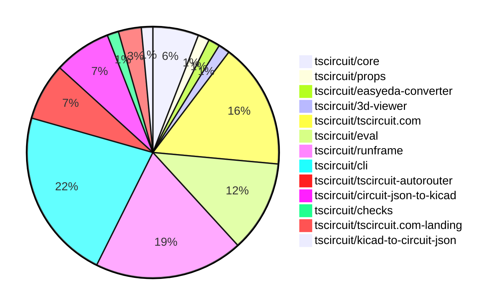

# Contribution Overview 2026-04-21

The current week is shown below. There are 3 major sections:

- [Contributor Overview](#contributor-overview)
- [PRs by Repository](#prs-by-repository)
- [PRs by Contributor](#changes-by-contributor)
- [Scoring & Sponsorship Details](/docs/sponsorship-calculation-explanation.md)

## PRs by Repository

## Contributor Overview

| Contributor | 🐳 Major | 🐙 Minor | 🐌 Tiny | Score | ⭐ | Discussion Contributions |
|-------------|---------|---------|---------|-------|-----|--------------------------|
| [tscircuitbot](#tscircuitbot) | 0 | 0 | 50 | 12.5 | ⭐⭐ | 0🔹 0🔶 0💎 |
| [Abse2001](#Abse2001) | 2 | 0 | 1 | 9 | ⭐ | 0🔹 0🔶 0💎 |
| [techmannih](#techmannih) | 0 | 3 | 1 | 7 | ⭐ | 0🔹 0🔶 0💎 |
| [AnasSarkiz](#AnasSarkiz) | 1 | 0 | 0 | 6 | ⭐ | 0🔹 0🔶 0💎 |
| [ShiboSoftwareDev](#ShiboSoftwareDev) | 1 | 0 | 1 | 5 | ⭐ | 0🔹 0🔶 0💎 |
| [imrishabh18](#imrishabh18) | 0 | 2 | 0 | 5 | ⭐ | 0🔹 0🔶 0💎 |
| [0hmX](#0hmX) | 1 | 0 | 1 | 5 | ⭐ | 0🔹 0🔶 0💎 |
| [rushabhcodes](#rushabhcodes) | 0 | 0 | 3 | 4 | ⭐ | 0🔹 0🔶 0💎 |
| [Sang-it](#Sang-it) | 0 | 1 | 0 | 2 |  | 0🔹 0🔶 0💎 |

## Staff Pass Ratio (SPR)

| Contributor | Reviewed PRs | Rejections | Approvals | SPR |
|-------------|--------------|------------|-----------|-----|
| [techmannih](#techmannih) | 3 | 0 | 3 | 100.0% |
| [0hmX](#0hmX) | 2 | 0 | 2 | 100.0% |
| [ShiboSoftwareDev](#ShiboSoftwareDev) | 1 | 0 | 1 | 100.0% |
| [Abse2001](#Abse2001) | 1 | 0 | 1 | 100.0% |
| [AnasSarkiz](#AnasSarkiz) | 1 | 0 | 1 | 100.0% |

techmannih SPR PRs (3)

- [#233](https://github.com/tscircuit/circuit-json-to-kicad/pull/233) feat: implement rotation support for circular_hole_with_rect_pad and rotated_pill_hole_with_rect_pad
- [#232](https://github.com/tscircuit/circuit-json-to-kicad/pull/232) feat: include supplier part number in KiCad footprint properties
- [#62](https://github.com/tscircuit/kicad-to-circuit-json/pull/62) feat: Add support for pill_hole_with_rect_pad shape plated hole

0hmX SPR PRs (2)

- [#953](https://github.com/tscircuit/tscircuit-autorouter/pull/953) add focused repro for high-density solver issue caused by reentry in nodeWithPortPoints input
- [#959](https://github.com/tscircuit/tscircuit-autorouter/pull/959) update url for rectdiff

ShiboSoftwareDev SPR PRs (1)

- [#2162](https://github.com/tscircuit/core/pull/2162) Infer internal footprint connections for split pins and shared aliases

Abse2001 SPR PRs (1)

- [#384](https://github.com/tscircuit/easyeda-converter/pull/384) Refactor CAD offset logic to use model bounds + SVG origin extraction

AnasSarkiz SPR PRs (1)

- [#949](https://github.com/tscircuit/tscircuit-autorouter/pull/949) improves margin-aware violation detection

> Note: AI evaluates PRs and assigns 1-3 star ratings automatically. 4 and 5 star ratings require manual staff review.

### Discussion Contribution Legend

- 🔹 Normal Comments: Basic participation with minimal effort
- 🔶 Great Informative Comments: Thoughtful participation that adds value
- 💎 Incredible Comments: Exceptional participation with high-quality content

## Review Table

[reviews-received-hover]: ## "Number of reviews received for PRs for this contributor"
[approvals-received-hover]: ## "Number of approvals received for PRs this contributor authored"
[rejections-received-hover]: ## "Number of rejections received for PRs this contributor authored"
[prs-opened-hover]: ## "Number of PRs opened by this contributor"
[issues-created-hover]: ## "Number of issues created by this contributor"

| Contributor | Reviews Received | Approvals Received | Rejections Received | Approvals | Rejections Given | PRs Opened | PRs Merged | Issues Created |
|---|---|---|---|---|---|---|---|---|
| [Wong789](#Wong789) | 0 | 0 | 0 | 0 | 0 | 1 | 0 | 0 |
| [ShiboSoftwareDev](#ShiboSoftwareDev) | 5 | 3 | 0 | 0 | 0 | 6 | 2 | 0 |
| [techmannih](#techmannih) | 6 | 4 | 0 | 0 | 0 | 5 | 4 | 0 |
| [seveibar](#seveibar) | 0 | 0 | 0 | 10 | 0 | 1 | 0 | 0 |
| [Abse2001](#Abse2001) | 3 | 3 | 0 | 0 | 0 | 5 | 3 | 0 |
| [AnasSarkiz](#AnasSarkiz) | 1 | 1 | 0 | 2 | 0 | 3 | 1 | 0 |
| [tscircuitbot](#tscircuitbot) | 0 | 0 | 0 | 0 | 0 | 60 | 51 | 0 |
| [imrishabh18](#imrishabh18) | 0 | 0 | 0 | 2 | 0 | 2 | 2 | 0 |
| [Lumantis](#Lumantis) | 1 | 0 | 1 | 0 | 0 | 1 | 0 | 0 |
| [rushabhcodes](#rushabhcodes) | 5 | 1 | 0 | 1 | 1 | 4 | 3 | 0 |
| [mohan-bee](#mohan-bee) | 0 | 0 | 0 | 0 | 0 | 1 | 0 | 0 |
| [0hmX](#0hmX) | 3 | 2 | 0 | 0 | 0 | 4 | 2 | 0 |
| [Angelebeats](#Angelebeats) | 0 | 0 | 0 | 0 | 0 | 2 | 0 | 0 |
| [Myc911](#Myc911) | 0 | 0 | 0 | 0 | 0 | 1 | 0 | 0 |
| [Ingenieralejo](#Ingenieralejo) | 0 | 0 | 0 | 0 | 0 | 1 | 0 | 0 |
| [Sang-it](#Sang-it) | 2 | 1 | 0 | 0 | 0 | 1 | 1 | 0 |

## Changes by Repository

### [tscircuit/core](https://github.com/tscircuit/core)

| PR # | Impact | Rating | Contributor | Description |
|------|--------|--------|-------------|-------------|
| [#2162](https://github.com/tscircuit/core/pull/2162) | 🐳 Major | ⭐⭐⭐ | ShiboSoftwareDev | This change makes repeated non-overlapping footprint contacts behave like implicit internally connected pins instead of ambiguous PCB targets, allowing traces to target shared aliases directly and updating port matching accordingly. |
| [#2163](https://github.com/tscircuit/core/pull/2163) | 🐙 Minor | ⭐⭐ | imrishabh18 | Updates DRC properties in the board schema from spacing to clearance to align with upstream package changes and resolves TypeScript errors. |

🐌 Tiny Contributions (2)

| PR # | Impact | Contributor | Description |
|------|--------|-------------|-------------|
| [#2164](https://github.com/tscircuit/core/pull/2164) | 🐌 Tiny | Abse2001 | Updates the version of the tscircuitfootprinter dependency from 0.0.349 to 0.0.351 in package.json |
| [#2167](https://github.com/tscircuit/core/pull/2167) | 🐌 Tiny | tscircuitbot | Updates the tscircuitchecks package from version 0.0.119 to 0.0.120 in the package.json file. |

### [tscircuit/props](https://github.com/tscircuit/props)

🐌 Tiny Contributions (1)

| PR # | Impact | Contributor | Description |
|------|--------|-------------|-------------|
| [#638](https://github.com/tscircuit/props/pull/638) | 🐌 Tiny | ShiboSoftwareDev | Removes the directional options x, x-, y, and y- from the footprint insertion direction type definition, streamlining the available options for users. |

### [tscircuit/easyeda-converter](https://github.com/tscircuit/easyeda-converter)

| PR # | Impact | Rating | Contributor | Description |
|------|--------|--------|-------------|-------------|
| [#384](https://github.com/tscircuit/easyeda-converter/pull/384) | 🐳 Major | ⭐⭐⭐ | Abse2001 | This pull request refactors the CAD offset logic to utilize model bounds and extract the SVG origin. It introduces a new method for calculating the CAD model offset based on the bounds of the model, improving the accuracy of the placement of CAD models in the circuit design. The changes include updates to the conversion functions and adjustments to the handling of CAD model properties, ensuring that the models origin is correctly calculated and applied during the conversion process. |

### [tscircuit/3d-viewer](https://github.com/tscircuit/3d-viewer)

| PR # | Impact | Rating | Contributor | Description |
|------|--------|--------|-------------|-------------|
| [#765](https://github.com/tscircuit/3d-viewer/pull/765) | 🐳 Major | ⭐⭐⭐ | Abse2001 | https:3d-viewer-git-fork-abse2001-main-tscircuit.vercel.app?pathstorykeypad--default |

### [tscircuit/tscircuit.com](https://github.com/tscircuit/tscircuit.com)

🐌 Tiny Contributions (11)

| PR # | Impact | Contributor | Description |
|------|--------|-------------|-------------|
| [#3223](https://github.com/tscircuit/tscircuit.com/pull/3223) | 🐌 Tiny | tscircuitbot | Updates the tscircuitrunframe package from version 0.0.1855 to 0.0.1857 |
| [#3222](https://github.com/tscircuit/tscircuit.com/pull/3222) | 🐌 Tiny | tscircuitbot | Updates the tscircuitrunframe package from version 0.0.1854 to 0.0.1855 |
| [#3221](https://github.com/tscircuit/tscircuit.com/pull/3221) | 🐌 Tiny | tscircuitbot | Updates the tscircuiteval package from version 0.0.772 to 0.0.773 |
| [#3219](https://github.com/tscircuit/tscircuit.com/pull/3219) | 🐌 Tiny | tscircuitbot | Automated package update |
| [#3218](https://github.com/tscircuit/tscircuit.com/pull/3218) | 🐌 Tiny | tscircuitbot | Updates the tscircuitrunframe package from version 0.0.1853 to 0.0.1854 |
| [#3217](https://github.com/tscircuit/tscircuit.com/pull/3217) | 🐌 Tiny | tscircuitbot | Automated package update |
| [#3215](https://github.com/tscircuit/tscircuit.com/pull/3215) | 🐌 Tiny | tscircuitbot | Updates the tscircuitrunframe package from version 0.0.1852 to 0.0.1853 |
| [#3214](https://github.com/tscircuit/tscircuit.com/pull/3214) | 🐌 Tiny | tscircuitbot | Automated package update |
| [#3213](https://github.com/tscircuit/tscircuit.com/pull/3213) | 🐌 Tiny | tscircuitbot | Updates the tscircuitrunframe package to version 0.0.1852 |
| [#3212](https://github.com/tscircuit/tscircuit.com/pull/3212) | 🐌 Tiny | tscircuitbot | Automated package update |
| [#3216](https://github.com/tscircuit/tscircuit.com/pull/3216) | 🐌 Tiny | rushabhcodes | Removes the local BomTable component and its associated logic as it is no longer referenced in the application, streamlining the codebase without affecting runtime behavior. |

### [tscircuit/eval](https://github.com/tscircuit/eval)

🐌 Tiny Contributions (8)

| PR # | Impact | Contributor | Description |
|------|--------|-------------|-------------|
| [#2458](https://github.com/tscircuit/eval/pull/2458) | 🐌 Tiny | tscircuitbot | Automated package update |
| [#2457](https://github.com/tscircuit/eval/pull/2457) | 🐌 Tiny | tscircuitbot | Automated package update |
| [#2456](https://github.com/tscircuit/eval/pull/2456) | 🐌 Tiny | tscircuitbot | Automated package update |
| [#2455](https://github.com/tscircuit/eval/pull/2455) | 🐌 Tiny | tscircuitbot | Updates package dependencies to their latest versions as part of routine maintenance. |
| [#2453](https://github.com/tscircuit/eval/pull/2453) | 🐌 Tiny | tscircuitbot | Automated package update |
| [#2452](https://github.com/tscircuit/eval/pull/2452) | 🐌 Tiny | tscircuitbot | Automated package update |
| [#2450](https://github.com/tscircuit/eval/pull/2450) | 🐌 Tiny | tscircuitbot | Automated package update |
| [#2449](https://github.com/tscircuit/eval/pull/2449) | 🐌 Tiny | tscircuitbot | Automated package update |

### [tscircuit/runframe](https://github.com/tscircuit/runframe)

🐌 Tiny Contributions (13)

| PR # | Impact | Contributor | Description |
|------|--------|-------------|-------------|
| [#3196](https://github.com/tscircuit/runframe/pull/3196) | 🐌 Tiny | tscircuitbot | Automated package update |
| [#3195](https://github.com/tscircuit/runframe/pull/3195) | 🐌 Tiny | tscircuitbot | Updates the circuit-json-to-kicad package from version 0.0.115 to 0.0.116 in package.json |
| [#3193](https://github.com/tscircuit/runframe/pull/3193) | 🐌 Tiny | tscircuitbot | Automated package update |
| [#3192](https://github.com/tscircuit/runframe/pull/3192) | 🐌 Tiny | tscircuitbot | Updates the tscircuiteval package from version 0.0.772 to 0.0.773 in the package.json file. |
| [#3191](https://github.com/tscircuit/runframe/pull/3191) | 🐌 Tiny | tscircuitbot | Automated package update |
| [#3190](https://github.com/tscircuit/runframe/pull/3190) | 🐌 Tiny | tscircuitbot | Updates the tscircuiteval package from version 0.0.771 to 0.0.772 in the package.json file. |
| [#3189](https://github.com/tscircuit/runframe/pull/3189) | 🐌 Tiny | tscircuitbot | Updates the package version from v0.0.1853 to v0.0.1854 in package.json |
| [#3188](https://github.com/tscircuit/runframe/pull/3188) | 🐌 Tiny | tscircuitbot | Updates the tscircuiteval package from version 0.0.770 to 0.0.771 in the package.json file. |
| [#3186](https://github.com/tscircuit/runframe/pull/3186) | 🐌 Tiny | tscircuitbot | Automated package update |
| [#3185](https://github.com/tscircuit/runframe/pull/3185) | 🐌 Tiny | tscircuitbot | Updates the tscircuiteval package from version 0.0.769 to 0.0.770 |
| [#3183](https://github.com/tscircuit/runframe/pull/3183) | 🐌 Tiny | tscircuitbot | Updates the circuit-json-to-kicad package version from 0.0.114 to 0.0.115 in package.json |
| [#3181](https://github.com/tscircuit/runframe/pull/3181) | 🐌 Tiny | tscircuitbot | Automated package update |
| [#3180](https://github.com/tscircuit/runframe/pull/3180) | 🐌 Tiny | tscircuitbot | Updates the tscircuit3d-viewer package to version 0.0.556 in package.json |

### [tscircuit/cli](https://github.com/tscircuit/cli)

🐌 Tiny Contributions (15)

| PR # | Impact | Contributor | Description |
|------|--------|-------------|-------------|
| [#2763](https://github.com/tscircuit/cli/pull/2763) | 🐌 Tiny | tscircuitbot | Automated package update |
| [#2762](https://github.com/tscircuit/cli/pull/2762) | 🐌 Tiny | tscircuitbot | Updates the tscircuitrunframe package from version 0.0.1855 to 0.0.1857 |
| [#2761](https://github.com/tscircuit/cli/pull/2761) | 🐌 Tiny | tscircuitbot | Automated package update |
| [#2760](https://github.com/tscircuit/cli/pull/2760) | 🐌 Tiny | tscircuitbot | Automated package update |
| [#2759](https://github.com/tscircuit/cli/pull/2759) | 🐌 Tiny | tscircuitbot | Automated package update |
| [#2758](https://github.com/tscircuit/cli/pull/2758) | 🐌 Tiny | tscircuitbot | Updates the tscircuitrunframe package to version 0.0.1854 |
| [#2757](https://github.com/tscircuit/cli/pull/2757) | 🐌 Tiny | tscircuitbot | Automated package update |
| [#2756](https://github.com/tscircuit/cli/pull/2756) | 🐌 Tiny | tscircuitbot | Updates the tscircuitrunframe package to version 0.0.1853 |
| [#2755](https://github.com/tscircuit/cli/pull/2755) | 🐌 Tiny | tscircuitbot | Automated package update |
| [#2754](https://github.com/tscircuit/cli/pull/2754) | 🐌 Tiny | tscircuitbot | Updates the tscircuitrunframe package from version 0.0.1851 to 0.0.1852 |
| [#2753](https://github.com/tscircuit/cli/pull/2753) | 🐌 Tiny | tscircuitbot | Automated package update |
| [#2752](https://github.com/tscircuit/cli/pull/2752) | 🐌 Tiny | tscircuitbot | Updates the tscircuitrunframe package from version 0.0.1850 to 0.0.1851 |
| [#2750](https://github.com/tscircuit/cli/pull/2750) | 🐌 Tiny | tscircuitbot | Automated package update |
| [#2748](https://github.com/tscircuit/cli/pull/2748) | 🐌 Tiny | tscircuitbot | Updates the tscircuitrunframe package from version 0.0.1849 to 0.0.1850 |
| [#2749](https://github.com/tscircuit/cli/pull/2749) | 🐌 Tiny | techmannih | Updates the version of the circuit-json-to-kicad dependency from 0.0.109 to 0.0.114 in package.json |

### [tscircuit/tscircuit-autorouter](https://github.com/tscircuit/tscircuit-autorouter)

| PR # | Impact | Rating | Contributor | Description |
|------|--------|--------|-------------|-------------|
| [#953](https://github.com/tscircuit/tscircuit-autorouter/pull/953) | 🐳 Major | ⭐⭐⭐ | 0hmX | Adds a focused reproduction for a high-density solver issue related to reentry in nodeWithPortPoints input, including new test cases and fixtures. |
| [#949](https://github.com/tscircuit/tscircuit-autorouter/pull/949) | 🐳 Major | ⭐⭐⭐ | AnasSarkiz | Enhances margin-aware violation detection in the autorouting process to improve design rule checking accuracy. |

🐌 Tiny Contributions (3)

| PR # | Impact | Contributor | Description |
|------|--------|-------------|-------------|
| [#962](https://github.com/tscircuit/tscircuit-autorouter/pull/962) | 🐌 Tiny | tscircuitbot | Automated package update |
| [#958](https://github.com/tscircuit/tscircuit-autorouter/pull/958) | 🐌 Tiny | tscircuitbot | Automated package update |
| [#956](https://github.com/tscircuit/tscircuit-autorouter/pull/956) | 🐌 Tiny | 0hmX | Removes the SVG snapshot test for bugreport49 from the test suite. |

### [tscircuit/circuit-json-to-kicad](https://github.com/tscircuit/circuit-json-to-kicad)

| PR # | Impact | Rating | Contributor | Description |
|------|--------|--------|-------------|-------------|
| [#233](https://github.com/tscircuit/circuit-json-to-kicad/pull/233) | 🐙 Minor | ⭐⭐ | techmannih | Adds rotation support for circular and rotated pill holes with rectangular pads in PCB design, enhancing the flexibility of hole placement. |
| [#232](https://github.com/tscircuit/circuit-json-to-kicad/pull/232) | 🐙 Minor | ⭐⭐ | techmannih | Enables the inclusion of supplier part numbers (specifically from jlcpcb) as properties in the generated KiCad PCB footprints. |
| [#229](https://github.com/tscircuit/circuit-json-to-kicad/pull/229) | 🐙 Minor | ⭐⭐ | Sang-it | Fixes KiCad pad labeling to preserve source pin identity instead of array order, ensuring correct pad numbering for custom footprints. |

🐌 Tiny Contributions (2)

| PR # | Impact | Contributor | Description |
|------|--------|-------------|-------------|
| [#234](https://github.com/tscircuit/circuit-json-to-kicad/pull/234) | 🐌 Tiny | tscircuitbot | Automated package update |
| [#231](https://github.com/tscircuit/circuit-json-to-kicad/pull/231) | 🐌 Tiny | tscircuitbot | Automated package update |

### [tscircuit/checks](https://github.com/tscircuit/checks)

| PR # | Impact | Rating | Contributor | Description |
|------|--------|--------|-------------|-------------|
| [#136](https://github.com/tscircuit/checks/pull/136) | 🐙 Minor | ⭐⭐ | imrishabh18 | Aligns local DRC default values with the published JLCPCB minimum manufacturing tolerances, replacing hardcoded values with dynamic values from the jlcMinTolerances package. |

### [tscircuit/tscircuit.com-landing](https://github.com/tscircuit/tscircuit.com-landing)

🐌 Tiny Contributions (2)

| PR # | Impact | Contributor | Description |
|------|--------|-------------|-------------|
| [#8](https://github.com/tscircuit/tscircuit.com-landing/pull/8) | 🐌 Tiny | rushabhcodes | Enhances the small-screen experience on the landing page by tightening the feature card layout, simplifying repeated card styles, and redesigning the footer for mobile to read as a compact sitemap instead of a squeezed desktop stack. |
| [#7](https://github.com/tscircuit/tscircuit.com-landing/pull/7) | 🐌 Tiny | rushabhcodes | Updates the landing page with improved UI elements, navigation simplification, animated GitHub star count, and replaces the autorouting demo video. |

### [tscircuit/kicad-to-circuit-json](https://github.com/tscircuit/kicad-to-circuit-json)

| PR # | Impact | Rating | Contributor | Description |
|------|--------|--------|-------------|-------------|
| [#62](https://github.com/tscircuit/kicad-to-circuit-json/pull/62) | 🐙 Minor | ⭐⭐ | techmannih | Adds support for a new plated hole shape, specifically the pill_hole_with_rect_pad, enhancing the PCB design capabilities. |

## Changes by Contributor

### [ShiboSoftwareDev](https://github.com/ShiboSoftwareDev)

| PRs # | Impact | Rating | Description |
|------|--------|--------|-------------|
| [#2162](https://github.com/tscircuit/core/pull/2162) | 🐳 Major | ⭐⭐⭐ | This change makes repeated non-overlapping footprint contacts behave like implicit internally connected pins instead of ambiguous PCB targets, allowing traces to target shared aliases directly and updating port matching accordingly. |

🐌 Tiny Contributions (1)

| PR # | Impact | Description |
|------|--------|-------------|
| [#638](https://github.com/tscircuit/props/pull/638) | 🐌 Tiny | Removes the directional options x, x-, y, and y- from the footprint insertion direction type definition, streamlining the available options for users. |

### [Abse2001](https://github.com/Abse2001)

| PRs # | Impact | Rating | Description |
|------|--------|--------|-------------|
| [#384](https://github.com/tscircuit/easyeda-converter/pull/384) | 🐳 Major | ⭐⭐⭐ | This pull request refactors the CAD offset logic to utilize model bounds and extract the SVG origin. It introduces a new method for calculating the CAD model offset based on the bounds of the model, improving the accuracy of the placement of CAD models in the circuit design. The changes include updates to the conversion functions and adjustments to the handling of CAD model properties, ensuring that the models origin is correctly calculated and applied during the conversion process. |
| [#765](https://github.com/tscircuit/3d-viewer/pull/765) | 🐳 Major | ⭐⭐⭐ | https:3d-viewer-git-fork-abse2001-main-tscircuit.vercel.app?pathstorykeypad--default |

🐌 Tiny Contributions (1)

| PR # | Impact | Description |
|------|--------|-------------|
| [#2164](https://github.com/tscircuit/core/pull/2164) | 🐌 Tiny | Updates the version of the tscircuitfootprinter dependency from 0.0.349 to 0.0.351 in package.json |

### [tscircuitbot](https://github.com/tscircuitbot)

🐌 Tiny Contributions (50)

| PR # | Impact | Description |
|------|--------|-------------|
| [#2167](https://github.com/tscircuit/core/pull/2167) | 🐌 Tiny | Updates the tscircuitchecks package from version 0.0.119 to 0.0.120 in the package.json file. |
| [#3223](https://github.com/tscircuit/tscircuit.com/pull/3223) | 🐌 Tiny | Updates the tscircuitrunframe package from version 0.0.1855 to 0.0.1857 |
| [#3222](https://github.com/tscircuit/tscircuit.com/pull/3222) | 🐌 Tiny | Updates the tscircuitrunframe package from version 0.0.1854 to 0.0.1855 |
| [#3221](https://github.com/tscircuit/tscircuit.com/pull/3221) | 🐌 Tiny | Updates the tscircuiteval package from version 0.0.772 to 0.0.773 |
| [#3219](https://github.com/tscircuit/tscircuit.com/pull/3219) | 🐌 Tiny | Automated package update |
| [#3218](https://github.com/tscircuit/tscircuit.com/pull/3218) | 🐌 Tiny | Updates the tscircuitrunframe package from version 0.0.1853 to 0.0.1854 |
| [#3217](https://github.com/tscircuit/tscircuit.com/pull/3217) | 🐌 Tiny | Automated package update |
| [#3215](https://github.com/tscircuit/tscircuit.com/pull/3215) | 🐌 Tiny | Updates the tscircuitrunframe package from version 0.0.1852 to 0.0.1853 |
| [#3214](https://github.com/tscircuit/tscircuit.com/pull/3214) | 🐌 Tiny | Automated package update |
| [#3213](https://github.com/tscircuit/tscircuit.com/pull/3213) | 🐌 Tiny | Updates the tscircuitrunframe package to version 0.0.1852 |
| [#3212](https://github.com/tscircuit/tscircuit.com/pull/3212) | 🐌 Tiny | Automated package update |
| [#2458](https://github.com/tscircuit/eval/pull/2458) | 🐌 Tiny | Automated package update |
| [#2457](https://github.com/tscircuit/eval/pull/2457) | 🐌 Tiny | Automated package update |
| [#2456](https://github.com/tscircuit/eval/pull/2456) | 🐌 Tiny | Automated package update |
| [#2455](https://github.com/tscircuit/eval/pull/2455) | 🐌 Tiny | Updates package dependencies to their latest versions as part of routine maintenance. |
| [#2453](https://github.com/tscircuit/eval/pull/2453) | 🐌 Tiny | Automated package update |
| [#2452](https://github.com/tscircuit/eval/pull/2452) | 🐌 Tiny | Automated package update |
| [#2450](https://github.com/tscircuit/eval/pull/2450) | 🐌 Tiny | Automated package update |
| [#2449](https://github.com/tscircuit/eval/pull/2449) | 🐌 Tiny | Automated package update |
| [#3196](https://github.com/tscircuit/runframe/pull/3196) | 🐌 Tiny | Automated package update |
| [#3195](https://github.com/tscircuit/runframe/pull/3195) | 🐌 Tiny | Updates the circuit-json-to-kicad package from version 0.0.115 to 0.0.116 in package.json |
| [#3193](https://github.com/tscircuit/runframe/pull/3193) | 🐌 Tiny | Automated package update |
| [#3192](https://github.com/tscircuit/runframe/pull/3192) | 🐌 Tiny | Updates the tscircuiteval package from version 0.0.772 to 0.0.773 in the package.json file. |
| [#3191](https://github.com/tscircuit/runframe/pull/3191) | 🐌 Tiny | Automated package update |
| [#3190](https://github.com/tscircuit/runframe/pull/3190) | 🐌 Tiny | Updates the tscircuiteval package from version 0.0.771 to 0.0.772 in the package.json file. |
| [#3189](https://github.com/tscircuit/runframe/pull/3189) | 🐌 Tiny | Updates the package version from v0.0.1853 to v0.0.1854 in package.json |
| [#3188](https://github.com/tscircuit/runframe/pull/3188) | 🐌 Tiny | Updates the tscircuiteval package from version 0.0.770 to 0.0.771 in the package.json file. |
| [#3186](https://github.com/tscircuit/runframe/pull/3186) | 🐌 Tiny | Automated package update |
| [#3185](https://github.com/tscircuit/runframe/pull/3185) | 🐌 Tiny | Updates the tscircuiteval package from version 0.0.769 to 0.0.770 |
| [#3183](https://github.com/tscircuit/runframe/pull/3183) | 🐌 Tiny | Updates the circuit-json-to-kicad package version from 0.0.114 to 0.0.115 in package.json |
| [#3181](https://github.com/tscircuit/runframe/pull/3181) | 🐌 Tiny | Automated package update |
| [#3180](https://github.com/tscircuit/runframe/pull/3180) | 🐌 Tiny | Updates the tscircuit3d-viewer package to version 0.0.556 in package.json |
| [#2763](https://github.com/tscircuit/cli/pull/2763) | 🐌 Tiny | Automated package update |
| [#2762](https://github.com/tscircuit/cli/pull/2762) | 🐌 Tiny | Updates the tscircuitrunframe package from version 0.0.1855 to 0.0.1857 |
| [#2761](https://github.com/tscircuit/cli/pull/2761) | 🐌 Tiny | Automated package update |
| [#2760](https://github.com/tscircuit/cli/pull/2760) | 🐌 Tiny | Automated package update |
| [#2759](https://github.com/tscircuit/cli/pull/2759) | 🐌 Tiny | Automated package update |
| [#2758](https://github.com/tscircuit/cli/pull/2758) | 🐌 Tiny | Updates the tscircuitrunframe package to version 0.0.1854 |
| [#2757](https://github.com/tscircuit/cli/pull/2757) | 🐌 Tiny | Automated package update |
| [#2756](https://github.com/tscircuit/cli/pull/2756) | 🐌 Tiny | Updates the tscircuitrunframe package to version 0.0.1853 |
| [#2755](https://github.com/tscircuit/cli/pull/2755) | 🐌 Tiny | Automated package update |
| [#2754](https://github.com/tscircuit/cli/pull/2754) | 🐌 Tiny | Updates the tscircuitrunframe package from version 0.0.1851 to 0.0.1852 |
| [#2753](https://github.com/tscircuit/cli/pull/2753) | 🐌 Tiny | Automated package update |
| [#2752](https://github.com/tscircuit/cli/pull/2752) | 🐌 Tiny | Updates the tscircuitrunframe package from version 0.0.1850 to 0.0.1851 |
| [#2750](https://github.com/tscircuit/cli/pull/2750) | 🐌 Tiny | Automated package update |
| [#2748](https://github.com/tscircuit/cli/pull/2748) | 🐌 Tiny | Updates the tscircuitrunframe package from version 0.0.1849 to 0.0.1850 |
| [#962](https://github.com/tscircuit/tscircuit-autorouter/pull/962) | 🐌 Tiny | Automated package update |
| [#958](https://github.com/tscircuit/tscircuit-autorouter/pull/958) | 🐌 Tiny | Automated package update |
| [#234](https://github.com/tscircuit/circuit-json-to-kicad/pull/234) | 🐌 Tiny | Automated package update |
| [#231](https://github.com/tscircuit/circuit-json-to-kicad/pull/231) | 🐌 Tiny | Automated package update |

### [imrishabh18](https://github.com/imrishabh18)

| PRs # | Impact | Rating | Description |
|------|--------|--------|-------------|
| [#2163](https://github.com/tscircuit/core/pull/2163) | 🐙 Minor | ⭐⭐ | Updates DRC properties in the board schema from spacing to clearance to align with upstream package changes and resolves TypeScript errors. |
| [#136](https://github.com/tscircuit/checks/pull/136) | 🐙 Minor | ⭐⭐ | Aligns local DRC default values with the published JLCPCB minimum manufacturing tolerances, replacing hardcoded values with dynamic values from the jlcMinTolerances package. |

### [rushabhcodes](https://github.com/rushabhcodes)

🐌 Tiny Contributions (3)

| PR # | Impact | Description |
|------|--------|-------------|
| [#3216](https://github.com/tscircuit/tscircuit.com/pull/3216) | 🐌 Tiny | Removes the local BomTable component and its associated logic as it is no longer referenced in the application, streamlining the codebase without affecting runtime behavior. |
| [#8](https://github.com/tscircuit/tscircuit.com-landing/pull/8) | 🐌 Tiny | Enhances the small-screen experience on the landing page by tightening the feature card layout, simplifying repeated card styles, and redesigning the footer for mobile to read as a compact sitemap instead of a squeezed desktop stack. |
| [#7](https://github.com/tscircuit/tscircuit.com-landing/pull/7) | 🐌 Tiny | Updates the landing page with improved UI elements, navigation simplification, animated GitHub star count, and replaces the autorouting demo video. |

### [techmannih](https://github.com/techmannih)

| PRs # | Impact | Rating | Description |
|------|--------|--------|-------------|
| [#233](https://github.com/tscircuit/circuit-json-to-kicad/pull/233) | 🐙 Minor | ⭐⭐ | Adds rotation support for circular and rotated pill holes with rectangular pads in PCB design, enhancing the flexibility of hole placement. |
| [#232](https://github.com/tscircuit/circuit-json-to-kicad/pull/232) | 🐙 Minor | ⭐⭐ | Enables the inclusion of supplier part numbers (specifically from jlcpcb) as properties in the generated KiCad PCB footprints. |
| [#62](https://github.com/tscircuit/kicad-to-circuit-json/pull/62) | 🐙 Minor | ⭐⭐ | Adds support for a new plated hole shape, specifically the pill_hole_with_rect_pad, enhancing the PCB design capabilities. |

🐌 Tiny Contributions (1)

| PR # | Impact | Description |
|------|--------|-------------|
| [#2749](https://github.com/tscircuit/cli/pull/2749) | 🐌 Tiny | Updates the version of the circuit-json-to-kicad dependency from 0.0.109 to 0.0.114 in package.json |

### [0hmX](https://github.com/0hmX)

| PRs # | Impact | Rating | Description |
|------|--------|--------|-------------|
| [#953](https://github.com/tscircuit/tscircuit-autorouter/pull/953) | 🐳 Major | ⭐⭐⭐ | Adds a focused reproduction for a high-density solver issue related to reentry in nodeWithPortPoints input, including new test cases and fixtures. |

🐌 Tiny Contributions (1)

| PR # | Impact | Description |
|------|--------|-------------|
| [#956](https://github.com/tscircuit/tscircuit-autorouter/pull/956) | 🐌 Tiny | Removes the SVG snapshot test for bugreport49 from the test suite. |

### [AnasSarkiz](https://github.com/AnasSarkiz)

| PRs # | Impact | Rating | Description |
|------|--------|--------|-------------|
| [#949](https://github.com/tscircuit/tscircuit-autorouter/pull/949) | 🐳 Major | ⭐⭐⭐ | Enhances margin-aware violation detection in the autorouting process to improve design rule checking accuracy. |

### [Sang-it](https://github.com/Sang-it)

| PRs # | Impact | Rating | Description |
|------|--------|--------|-------------|
| [#229](https://github.com/tscircuit/circuit-json-to-kicad/pull/229) | 🐙 Minor | ⭐⭐ | Fixes KiCad pad labeling to preserve source pin identity instead of array order, ensuring correct pad numbering for custom footprints. |

## Repository Owners

| Repository | Codeowners |
|------------|------------|
| [builder](https://github.com/tscircuit/builder/blob/main/.github/CODEOWNERS) | [seveibar](https://github.com/seveibar)
| [pcb-viewer](https://github.com/tscircuit/pcb-viewer/blob/main/.github/CODEOWNERS) | [seveibar](https://github.com/seveibar), [ShiboSoftwareDev](https://github.com/ShiboSoftwareDev), [Abse2001](https://github.com/Abse2001)
| [footprints-old](https://github.com/tscircuit/footprints-old/blob/main/.github/CODEOWNERS) | [seveibar](https://github.com/seveibar)
| [footprinter](https://github.com/tscircuit/footprinter/blob/main/.github/CODEOWNERS) | [seveibar](https://github.com/seveibar), [techmannih](https://github.com/techmannih)
| [3d-viewer](https://github.com/tscircuit/3d-viewer/blob/main/.github/CODEOWNERS) | [ShiboSoftwareDev](https://github.com/ShiboSoftwareDev), [Abse2001](https://github.com/Abse2001)
| [winterspec](https://github.com/tscircuit/winterspec/blob/main/.github/CODEOWNERS) | [seveibar](https://github.com/seveibar), [ShiboSoftwareDev](https://github.com/ShiboSoftwareDev)
| [jscad-electronics](https://github.com/tscircuit/jscad-electronics/blob/main/.github/CODEOWNERS) | [seveibar](https://github.com/seveibar), [techmannih](https://github.com/techmannih), [ShiboSoftwareDev](https://github.com/ShiboSoftwareDev), [anas-sarkez](https://github.com/anas-sarkez)
| [circuit-to-svg](https://github.com/tscircuit/circuit-to-svg/blob/main/.github/CODEOWNERS) | [imrishabh18](https://github.com/imrishabh18)
| [schematic-symbols](https://github.com/tscircuit/schematic-symbols/blob/main/.github/CODEOWNERS) | [seveibar](https://github.com/seveibar), [imrishabh18](https://github.com/imrishabh18), [techmannih](https://github.com/techmannih)
| [circuit-json-to-gerber](https://github.com/tscircuit/circuit-json-to-gerber/blob/main/.github/CODEOWNERS) | [seveibar](https://github.com/seveibar), [ShiboSoftwareDev](https://github.com/ShiboSoftwareDev)
| [tscircuit.com](https://github.com/tscircuit/tscircuit.com/blob/main/.github/CODEOWNERS) | [seveibar](https://github.com/seveibar), [imrishabh18](https://github.com/imrishabh18)
| [issue-roulette](https://github.com/tscircuit/issue-roulette/blob/main/.github/CODEOWNERS) | [Anshgrover23](https://github.com/Anshgrover23)
| [sparkfun-boards](https://github.com/tscircuit/sparkfun-boards/blob/main/.github/CODEOWNERS) | [ShiboSoftwareDev](https://github.com/ShiboSoftwareDev), [Abse2001](https://github.com/Abse2001), [MustafaMulla29](https://github.com/MustafaMulla29), [Anshgrover23](https://github.com/Anshgrover23), [techmannih](https://github.com/techmannih)
| [schematic-corpus](https://github.com/tscircuit/schematic-corpus/blob/main/.github/CODEOWNERS) | [Abse2001](https://github.com/Abse2001)
| [copper-pour-solver](https://github.com/tscircuit/copper-pour-solver/blob/main/.github/CODEOWNERS) | [seveibar](https://github.com/seveibar), [ShiboSoftwareDev](https://github.com/ShiboSoftwareDev)
| [common](https://github.com/tscircuit/common/blob/main/.github/CODEOWNERS) | [seveibar](https://github.com/seveibar), [Abse2001](https://github.com/Abse2001)
| [circuit-to-canvas](https://github.com/tscircuit/circuit-to-canvas/blob/main/.github/CODEOWNERS) | [ShiboSoftwareDev](https://github.com/ShiboSoftwareDev), [Abse2001](https://github.com/Abse2001), [techmannih](https://github.com/techmannih)
| [circuit-json-to-lbrn](https://github.com/tscircuit/circuit-json-to-lbrn/blob/main/.github/CODEOWNERS) | [AnasSarkiz](https://github.com/AnasSarkiz)
| [pcbburn.com](https://github.com/tscircuit/pcbburn.com/blob/main/.github/CODEOWNERS) | [AnasSarkiz](https://github.com/AnasSarkiz)

## Repositories by Owner

| User | Repo |
|------|------|
| [seveibar](https://github.com/seveibar) | [builder](https://github.com/tscircuit/builder/blob/main/.github/CODEOWNERS) |
|  | [pcb-viewer](https://github.com/tscircuit/pcb-viewer/blob/main/.github/CODEOWNERS) |
|  | [footprints-old](https://github.com/tscircuit/footprints-old/blob/main/.github/CODEOWNERS) |
|  | [footprinter](https://github.com/tscircuit/footprinter/blob/main/.github/CODEOWNERS) |
|  | [winterspec](https://github.com/tscircuit/winterspec/blob/main/.github/CODEOWNERS) |
|  | [jscad-electronics](https://github.com/tscircuit/jscad-electronics/blob/main/.github/CODEOWNERS) |
|  | [schematic-symbols](https://github.com/tscircuit/schematic-symbols/blob/main/.github/CODEOWNERS) |
|  | [circuit-json-to-gerber](https://github.com/tscircuit/circuit-json-to-gerber/blob/main/.github/CODEOWNERS) |
|  | [tscircuit.com](https://github.com/tscircuit/tscircuit.com/blob/main/.github/CODEOWNERS) |
|  | [copper-pour-solver](https://github.com/tscircuit/copper-pour-solver/blob/main/.github/CODEOWNERS) |
|  | [common](https://github.com/tscircuit/common/blob/main/.github/CODEOWNERS) |
| [ShiboSoftwareDev](https://github.com/ShiboSoftwareDev) | [pcb-viewer](https://github.com/tscircuit/pcb-viewer/blob/main/.github/CODEOWNERS) |
|  | [3d-viewer](https://github.com/tscircuit/3d-viewer/blob/main/.github/CODEOWNERS) |
|  | [winterspec](https://github.com/tscircuit/winterspec/blob/main/.github/CODEOWNERS) |
|  | [jscad-electronics](https://github.com/tscircuit/jscad-electronics/blob/main/.github/CODEOWNERS) |
|  | [circuit-json-to-gerber](https://github.com/tscircuit/circuit-json-to-gerber/blob/main/.github/CODEOWNERS) |
|  | [sparkfun-boards](https://github.com/tscircuit/sparkfun-boards/blob/main/.github/CODEOWNERS) |
|  | [copper-pour-solver](https://github.com/tscircuit/copper-pour-solver/blob/main/.github/CODEOWNERS) |
|  | [circuit-to-canvas](https://github.com/tscircuit/circuit-to-canvas/blob/main/.github/CODEOWNERS) |
| [Abse2001](https://github.com/Abse2001) | [pcb-viewer](https://github.com/tscircuit/pcb-viewer/blob/main/.github/CODEOWNERS) |
|  | [3d-viewer](https://github.com/tscircuit/3d-viewer/blob/main/.github/CODEOWNERS) |
|  | [sparkfun-boards](https://github.com/tscircuit/sparkfun-boards/blob/main/.github/CODEOWNERS) |
|  | [schematic-corpus](https://github.com/tscircuit/schematic-corpus/blob/main/.github/CODEOWNERS) |
|  | [common](https://github.com/tscircuit/common/blob/main/.github/CODEOWNERS) |
|  | [circuit-to-canvas](https://github.com/tscircuit/circuit-to-canvas/blob/main/.github/CODEOWNERS) |
| [techmannih](https://github.com/techmannih) | [footprinter](https://github.com/tscircuit/footprinter/blob/main/.github/CODEOWNERS) |
|  | [jscad-electronics](https://github.com/tscircuit/jscad-electronics/blob/main/.github/CODEOWNERS) |
|  | [schematic-symbols](https://github.com/tscircuit/schematic-symbols/blob/main/.github/CODEOWNERS) |
|  | [sparkfun-boards](https://github.com/tscircuit/sparkfun-boards/blob/main/.github/CODEOWNERS) |
|  | [circuit-to-canvas](https://github.com/tscircuit/circuit-to-canvas/blob/main/.github/CODEOWNERS) |
| [anas-sarkez](https://github.com/anas-sarkez) | [jscad-electronics](https://github.com/tscircuit/jscad-electronics/blob/main/.github/CODEOWNERS) |
| [imrishabh18](https://github.com/imrishabh18) | [circuit-to-svg](https://github.com/tscircuit/circuit-to-svg/blob/main/.github/CODEOWNERS) |
|  | [schematic-symbols](https://github.com/tscircuit/schematic-symbols/blob/main/.github/CODEOWNERS) |
|  | [tscircuit.com](https://github.com/tscircuit/tscircuit.com/blob/main/.github/CODEOWNERS) |
| [Anshgrover23](https://github.com/Anshgrover23) | [issue-roulette](https://github.com/tscircuit/issue-roulette/blob/main/.github/CODEOWNERS) |
|  | [sparkfun-boards](https://github.com/tscircuit/sparkfun-boards/blob/main/.github/CODEOWNERS) |
| [MustafaMulla29](https://github.com/MustafaMulla29) | [sparkfun-boards](https://github.com/tscircuit/sparkfun-boards/blob/main/.github/CODEOWNERS) |
| [AnasSarkiz](https://github.com/AnasSarkiz) | [circuit-json-to-lbrn](https://github.com/tscircuit/circuit-json-to-lbrn/blob/main/.github/CODEOWNERS) |
|  | [pcbburn.com](https://github.com/tscircuit/pcbburn.com/blob/main/.github/CODEOWNERS) |

