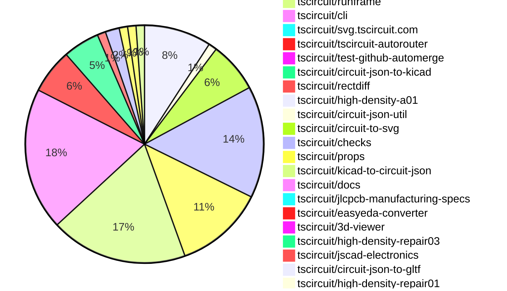

# Contribution Overview 2026-04-21

The current week is shown below. There are 3 major sections:

- [Contributor Overview](#contributor-overview)
- [PRs by Repository](#prs-by-repository)
- [PRs by Contributor](#changes-by-contributor)
- [Scoring & Sponsorship Details](/docs/sponsorship-calculation-explanation.md)

## PRs by Repository

## Contributor Overview

| Contributor | 🐳 Major | 🐙 Minor | 🐌 Tiny | Score | ⭐ | Discussion Contributions |
|-------------|---------|---------|---------|-------|-----|--------------------------|
| [ShiboSoftwareDev](#ShiboSoftwareDev) | 4 | 5 | 2 | 30 | ⭐⭐ | 0🔹 0🔶 0💎 |
| [Abse2001](#Abse2001) | 5 | 0 | 3 | 26 | ⭐⭐ | 0🔹 0🔶 0💎 |
| [AnasSarkiz](#AnasSarkiz) | 4 | 1 | 2 | 24 | ⭐⭐ | 0🔹 0🔶 0💎 |
| [imrishabh18](#imrishabh18) | 1 | 3 | 9 | 20 | ⭐⭐ | 0🔹 0🔶 0💎 |
| [techmannih](#techmannih) | 0 | 5 | 4 | 15 | ⭐⭐ | 0🔹 0🔶 0💎 |
| [tscircuitbot](#tscircuitbot) | 0 | 0 | 211 | 13.5 | ⭐⭐ | 0🔹 0🔶 0💎 |
| [mohan-bee](#mohan-bee) | 1 | 2 | 3 | 11 | ⭐⭐ | 0🔹 0🔶 0💎 |
| [rushabhcodes](#rushabhcodes) | 1 | 0 | 6 | 11 | ⭐⭐ | 0🔹 0🔶 0💎 |
| [seveibar](#seveibar) | 2 | 0 | 0 | 9 | ⭐ | 0🔹 0🔶 0💎 |
| [0hmX](#0hmX) | 1 | 0 | 3 | 7 | ⭐ | 0🔹 0🔶 0💎 |
| [Sang-it](#Sang-it) | 0 | 1 | 5 | 7 | ⭐ | 0🔹 0🔶 0💎 |

## Staff Pass Ratio (SPR)

| Contributor | Reviewed PRs | Rejections | Approvals | SPR |
|-------------|--------------|------------|-----------|-----|
| [ShiboSoftwareDev](#ShiboSoftwareDev) | 8 | 0 | 8 | 100.0% |
| [techmannih](#techmannih) | 4 | 0 | 4 | 100.0% |
| [mohan-bee](#mohan-bee) | 4 | 0 | 4 | 100.0% |
| [imrishabh18](#imrishabh18) | 2 | 0 | 2 | 100.0% |
| [Abse2001](#Abse2001) | 2 | 0 | 2 | 100.0% |
| [AnasSarkiz](#AnasSarkiz) | 2 | 0 | 2 | 100.0% |
| [0hmX](#0hmX) | 2 | 0 | 2 | 100.0% |
| [rushabhcodes](#rushabhcodes) | 1 | 0 | 1 | 100.0% |
| [Sang-it](#Sang-it) | 1 | 1 | 0 | 0.0% |

ShiboSoftwareDev SPR PRs (8)

- [#94](https://github.com/tscircuit/circuit-json-util/pull/94) Transform pcb_component insertion metadata in transformPCBElements
- [#2178](https://github.com/tscircuit/core/pull/2178) Bump @tscircuit/checks and add connector orientation regression tests
- [#2165](https://github.com/tscircuit/core/pull/2165) Wire footprint insertion direction into PCB components and align board DRC fields
- [#2168](https://github.com/tscircuit/core/pull/2168)  Align sim graph colors with differential probe names and refresh palette
- [#2169](https://github.com/tscircuit/core/pull/2169) Propagate board min via dimensions through autorouting
- [#2162](https://github.com/tscircuit/core/pull/2162) Infer internal footprint connections for split pins and shared aliases
- [#141](https://github.com/tscircuit/checks/pull/141) Use insertion_direction for connector accessibility checks
- [#950](https://github.com/tscircuit/tscircuit-autorouter/pull/950) Honor explicit via pad/hole dimensions across autorouters

techmannih SPR PRs (4)

- [#2170](https://github.com/tscircuit/core/pull/2170) Add rectBorderRadius support to pill_hole_with_rect_pad plated holes
- [#232](https://github.com/tscircuit/circuit-json-to-kicad/pull/232) feat: include supplier part number in KiCad footprint properties
- [#233](https://github.com/tscircuit/circuit-json-to-kicad/pull/233) feat: implement rotation support for circular_hole_with_rect_pad and rotated_pill_hole_with_rect_pad
- [#62](https://github.com/tscircuit/kicad-to-circuit-json/pull/62) feat: Add support for pill_hole_with_rect_pad shape plated hole

mohan-bee SPR PRs (4)

- [#3197](https://github.com/tscircuit/runframe/pull/3197) Fix package details dialog stacking in Import Component flow
- [#976](https://github.com/tscircuit/tscircuit-autorouter/pull/976) Skip zero-length trace segments from duplicate route points
- [#241](https://github.com/tscircuit/circuit-json-to-kicad/pull/241) Use manufacturer part number for simple chip schematic values
- [#235](https://github.com/tscircuit/circuit-json-to-kicad/pull/235) Fix component-owned silkscreen paths exporting as board graphics

imrishabh18 SPR PRs (2)

- [#2183](https://github.com/tscircuit/core/pull/2183) Add the `rotation` property to the srj obstacle output
- [#137](https://github.com/tscircuit/checks/pull/137) Use pcb_board DRC values and remove JLC specs dependency import

Abse2001 SPR PRs (2)

- [#384](https://github.com/tscircuit/easyeda-converter/pull/384) Refactor CAD offset logic to use model bounds + SVG origin extraction
- [#978](https://github.com/tscircuit/tscircuit-autorouter/pull/978) implement GlobalDrcForceImproveSolver

AnasSarkiz SPR PRs (2)

- [#949](https://github.com/tscircuit/tscircuit-autorouter/pull/949) improves margin-aware violation detection
- [#5](https://github.com/tscircuit/high-density-repair01/pull/5) Introduce projection-based clearance optimization to eliminate dense-node via and trace collisions

0hmX SPR PRs (2)

- [#959](https://github.com/tscircuit/tscircuit-autorouter/pull/959) update url for rectdiff
- [#953](https://github.com/tscircuit/tscircuit-autorouter/pull/953) add focused repro for high-density solver issue caused by reentry in nodeWithPortPoints input

rushabhcodes SPR PRs (1)

- [#3187](https://github.com/tscircuit/runframe/pull/3187) Simplify BOM table rendering

Sang-it SPR PRs (1)

- [#209](https://github.com/tscircuit/schematic-trace-solver/pull/209) fix single port netlabelplacemet

> Note: AI evaluates PRs and assigns 1-3 star ratings automatically. 4 and 5 star ratings require manual staff review.

### Discussion Contribution Legend

- 🔹 Normal Comments: Basic participation with minimal effort
- 🔶 Great Informative Comments: Thoughtful participation that adds value
- 💎 Incredible Comments: Exceptional participation with high-quality content

## Review Table

[reviews-received-hover]: ## "Number of reviews received for PRs for this contributor"
[approvals-received-hover]: ## "Number of approvals received for PRs this contributor authored"
[rejections-received-hover]: ## "Number of rejections received for PRs this contributor authored"
[prs-opened-hover]: ## "Number of PRs opened by this contributor"
[issues-created-hover]: ## "Number of issues created by this contributor"

| Contributor | Reviews Received | Approvals Received | Rejections Received | Approvals | Rejections Given | PRs Opened | PRs Merged | Issues Created |
|---|---|---|---|---|---|---|---|---|
| [atecnoco-arch](#atecnoco-arch) | 0 | 0 | 0 | 0 | 0 | 5 | 0 | 0 |
| [selenaalpha77-sketch](#selenaalpha77-sketch) | 0 | 0 | 0 | 0 | 0 | 50 | 0 | 0 |
| [Wong789](#Wong789) | 0 | 0 | 0 | 0 | 0 | 1 | 0 | 0 |
| [tscircuitbot](#tscircuitbot) | 0 | 0 | 0 | 0 | 0 | 266 | 211 | 0 |
| [techmannih](#techmannih) | 12 | 10 | 0 | 2 | 0 | 10 | 9 | 0 |
| [imrishabh18](#imrishabh18) | 8 | 8 | 0 | 9 | 1 | 15 | 13 | 0 |
| [ShiboSoftwareDev](#ShiboSoftwareDev) | 11 | 11 | 0 | 2 | 0 | 14 | 11 | 0 |
| [seveibar](#seveibar) | 0 | 0 | 0 | 43 | 1 | 5 | 2 | 0 |
| [mohan-bee](#mohan-bee) | 22 | 10 | 2 | 0 | 0 | 10 | 6 | 0 |
| [Abse2001](#Abse2001) | 9 | 9 | 0 | 3 | 0 | 12 | 8 | 0 |
| [AnasSarkiz](#AnasSarkiz) | 8 | 8 | 0 | 4 | 0 | 10 | 7 | 0 |
| [Lumantis](#Lumantis) | 1 | 0 | 1 | 0 | 0 | 1 | 0 | 0 |
| [rushabhcodes](#rushabhcodes) | 12 | 4 | 0 | 2 | 1 | 7 | 7 | 0 |
| [YPC0813](#YPC0813) | 0 | 0 | 0 | 0 | 0 | 2 | 0 | 0 |
| [premsreelathasugeendran](#premsreelathasugeendran) | 0 | 0 | 0 | 0 | 0 | 1 | 0 | 0 |
| [0hmX](#0hmX) | 3 | 2 | 0 | 0 | 0 | 8 | 4 | 0 |
| [Ingenieralejo](#Ingenieralejo) | 0 | 0 | 0 | 0 | 0 | 4 | 0 | 0 |
| [Pearltechie](#Pearltechie) | 0 | 0 | 0 | 0 | 0 | 1 | 0 | 0 |
| [Angelebeats](#Angelebeats) | 0 | 0 | 0 | 0 | 0 | 3 | 0 | 0 |
| [pavel493](#pavel493) | 0 | 0 | 0 | 0 | 0 | 1 | 0 | 0 |
| [Myc911](#Myc911) | 0 | 0 | 0 | 0 | 0 | 1 | 0 | 0 |
| [168062576-tech](#168062576-tech) | 0 | 0 | 0 | 0 | 0 | 1 | 0 | 0 |
| [Sang-it](#Sang-it) | 15 | 4 | 1 | 0 | 0 | 12 | 6 | 0 |
| [emabarrera](#emabarrera) | 0 | 0 | 0 | 0 | 0 | 2 | 0 | 0 |
| [MustafaMulla29](#MustafaMulla29) | 0 | 0 | 0 | 1 | 1 | 0 | 0 | 0 |

## Changes by Repository

### [tscircuit/tscircuit](https://github.com/tscircuit/tscircuit)

🐌 Tiny Contributions (24)

| PR # | Impact | Contributor | Description |
|------|--------|-------------|-------------|
| [#3009](https://github.com/tscircuit/tscircuit/pull/3009) | 🐌 Tiny | tscircuitbot | Automated package update |
| [#3008](https://github.com/tscircuit/tscircuit/pull/3008) | 🐌 Tiny | tscircuitbot | Automated package update |
| [#3007](https://github.com/tscircuit/tscircuit/pull/3007) | 🐌 Tiny | tscircuitbot | Automated package update |
| [#3006](https://github.com/tscircuit/tscircuit/pull/3006) | 🐌 Tiny | tscircuitbot | Updates the tscircuitcli package to version 0.1.1286 |
| [#3005](https://github.com/tscircuit/tscircuit/pull/3005) | 🐌 Tiny | tscircuitbot | Automated package update |
| [#3004](https://github.com/tscircuit/tscircuit/pull/3004) | 🐌 Tiny | tscircuitbot | Automated package update |
| [#3003](https://github.com/tscircuit/tscircuit/pull/3003) | 🐌 Tiny | tscircuitbot | Automated package update |
| [#3002](https://github.com/tscircuit/tscircuit/pull/3002) | 🐌 Tiny | tscircuitbot | Updates the tscircuitcli package from version 0.1.1283 to 0.1.1284 and the tscircuitrunframe package from version 0.0.1870 to 0.0.1871 in package.json |
| [#3001](https://github.com/tscircuit/tscircuit/pull/3001) | 🐌 Tiny | tscircuitbot | Automated package update |
| [#3000](https://github.com/tscircuit/tscircuit/pull/3000) | 🐌 Tiny | tscircuitbot | Updates the tscircuitcli package from version 0.1.1282 to 0.1.1283 and the tscircuitrunframe package from version 0.0.1869 to 0.0.1870 in the package.json file. |
| [#2992](https://github.com/tscircuit/tscircuit/pull/2992) | 🐌 Tiny | tscircuitbot | Updates the version of several dependencies in the package.json file, including tscircuitcli, tscircuitcore, tscircuiteval, and circuit-json-to-gltf. |
| [#2998](https://github.com/tscircuit/tscircuit/pull/2998) | 🐌 Tiny | tscircuitbot | Automated package update |
| [#2994](https://github.com/tscircuit/tscircuit/pull/2994) | 🐌 Tiny | tscircuitbot | Automated package update |
| [#2991](https://github.com/tscircuit/tscircuit/pull/2991) | 🐌 Tiny | tscircuitbot | Updates the package version from 0.0.1662 to 0.0.1663 in package.json |
| [#2999](https://github.com/tscircuit/tscircuit/pull/2999) | 🐌 Tiny | tscircuitbot | Updates the package version from 0.0.1666 to 0.0.1667 in package.json |
| [#2990](https://github.com/tscircuit/tscircuit/pull/2990) | 🐌 Tiny | tscircuitbot | Automated package update |
| [#2996](https://github.com/tscircuit/tscircuit/pull/2996) | 🐌 Tiny | tscircuitbot | Automated package update |
| [#2995](https://github.com/tscircuit/tscircuit/pull/2995) | 🐌 Tiny | tscircuitbot | Automated package update |
| [#2993](https://github.com/tscircuit/tscircuit/pull/2993) | 🐌 Tiny | tscircuitbot | Automated package update |
| [#2997](https://github.com/tscircuit/tscircuit/pull/2997) | 🐌 Tiny | tscircuitbot | Automated package update |
| [#2983](https://github.com/tscircuit/tscircuit/pull/2983) | 🐌 Tiny | tscircuitbot | Automated package update |
| [#2975](https://github.com/tscircuit/tscircuit/pull/2975) | 🐌 Tiny | tscircuitbot | Automated package update |
| [#2974](https://github.com/tscircuit/tscircuit/pull/2974) | 🐌 Tiny | ShiboSoftwareDev | Prevents synchronization of the tscircuitjlcpcb-manufacturing-specs package during the core version copying process. |
| [#2978](https://github.com/tscircuit/tscircuit/pull/2978) | 🐌 Tiny | techmannih | Updates the tscircuitprops dependency version from 0.0.508 to 0.0.512 in package.json |

### [tscircuit/circuit-json](https://github.com/tscircuit/circuit-json)

🐌 Tiny Contributions (3)

| PR # | Impact | Contributor | Description |
|------|--------|-------------|-------------|
| [#563](https://github.com/tscircuit/circuit-json/pull/563) | 🐌 Tiny | tscircuitbot | Automated package update |
| [#564](https://github.com/tscircuit/circuit-json/pull/564) | 🐌 Tiny | mohan-bee | Adds documentation for the PcbTraceWarning interface, detailing its structure and purpose in warning conditions for PCB traces. |
| [#562](https://github.com/tscircuit/circuit-json/pull/562) | 🐌 Tiny | imrishabh18 | Renames DRC properties for clarity and consistency in the manufacturing DRC properties interface. |

### [tscircuit/core](https://github.com/tscircuit/core)

| PR # | Impact | Rating | Contributor | Description |
|------|--------|--------|-------------|-------------|
| [#2165](https://github.com/tscircuit/core/pull/2165) | 🐳 Major | ⭐⭐⭐ | ShiboSoftwareDev | Propagates footprint.insertionDirection onto pcb_component.insertion_direction using the components global pre-layout rotation plus bottom-side mirroring, ensuring correct behavior for bottom-authored footprints and footprint constraints, while aligning board manufacturing defaults and tests with new clearance field names in circuit-json. |
| [#2169](https://github.com/tscircuit/core/pull/2169) | 🐳 Major | ⭐⭐⭐ | ShiboSoftwareDev | Propagates board minimum via dimensions through autorouting by updating the autorouter to use specific via dimensions from the board, ensuring routed via dimensions are preserved and not overwritten by defaults. |
| [#2162](https://github.com/tscircuit/core/pull/2162) | 🐳 Major | ⭐⭐⭐ | ShiboSoftwareDev | This change makes repeated non-overlapping footprint contacts behave like implicit internally connected pins instead of ambiguous PCB targets, allowing traces to target shared aliases directly and updating port matching accordingly. |
| [#2183](https://github.com/tscircuit/core/pull/2183) | 🐳 Major | ⭐⭐⭐ | imrishabh18 | Adds a ccwRotationDegrees property to the obstacle output in the SimpleRouteJson, allowing for the representation of chip rotation in the autorouting process. |
| [#2175](https://github.com/tscircuit/core/pull/2175) | 🐳 Major | ⭐⭐⭐ | Abse2001 | Adds a test for rendering a double-row pinheader and updates the circuit-json-to-gltf dependency version. |
| [#2178](https://github.com/tscircuit/core/pull/2178) | 🐙 Minor | ⭐⭐ | ShiboSoftwareDev | Bumps the version of tscircuitchecks to 0.0.122 and adds regression tests for connector orientation warnings. |
| [#2168](https://github.com/tscircuit/core/pull/2168) | 🐙 Minor | ⭐⭐ | ShiboSoftwareDev | Maps simulation voltage graphs to their corresponding probes, ensuring differential ngspice graphs inherit colors from schematicsimulation probes and updates the default simulation color palette. |
| [#2170](https://github.com/tscircuit/core/pull/2170) | 🐙 Minor | ⭐⭐ | techmannih | Adds support for rectBorderRadius in pill_hole_with_rect_pad plated holes, allowing for customizable corner rounding in PCB design. |
| [#2181](https://github.com/tscircuit/core/pull/2181) | 🐙 Minor | ⭐⭐ | imrishabh18 | Updates dependencies to the latest versions and migrates PCB manufacturing DRC field names to match the new schema in the circuit JSON. |
| [#2163](https://github.com/tscircuit/core/pull/2163) | 🐙 Minor | ⭐⭐ | imrishabh18 | Updates DRC properties in the board schema from spacing to clearance to align with upstream package changes and resolves TypeScript errors. |

🐌 Tiny Contributions (8)

| PR # | Impact | Contributor | Description |
|------|--------|-------------|-------------|
| [#2179](https://github.com/tscircuit/core/pull/2179) | 🐌 Tiny | tscircuitbot | Updates the tscircuitchecks package from version 0.0.122 to 0.0.123 |
| [#2180](https://github.com/tscircuit/core/pull/2180) | 🐌 Tiny | tscircuitbot | Updates the tscircuitchecks package from version 0.0.123 to 0.0.124 |
| [#2177](https://github.com/tscircuit/core/pull/2177) | 🐌 Tiny | tscircuitbot | Updates the tscircuitchecks package from version 0.0.121 to 0.0.122 |
| [#2172](https://github.com/tscircuit/core/pull/2172) | 🐌 Tiny | tscircuitbot | Updates the tscircuitchecks package from version 0.0.120 to 0.0.121 |
| [#2167](https://github.com/tscircuit/core/pull/2167) | 🐌 Tiny | tscircuitbot | Updates the tscircuitchecks package from version 0.0.119 to 0.0.120 in the package.json file. |
| [#2171](https://github.com/tscircuit/core/pull/2171) | 🐌 Tiny | imrishabh18 | Bundles the tscircuitjlcpcb-manufacturing-specs package with the core package, modifying the build process and configuration. |
| [#2164](https://github.com/tscircuit/core/pull/2164) | 🐌 Tiny | Abse2001 | Updates the version of the tscircuitfootprinter dependency from 0.0.349 to 0.0.351 in package.json |
| [#2182](https://github.com/tscircuit/core/pull/2182) | 🐌 Tiny | AnasSarkiz | Updates the version of the tscircuitcapacity-autorouter dependency in package.json from 0.0.447 to 0.0.452 |

### [tscircuit/tscircuit.com](https://github.com/tscircuit/tscircuit.com)

🐌 Tiny Contributions (40)

| PR # | Impact | Contributor | Description |
|------|--------|-------------|-------------|
| [#3254](https://github.com/tscircuit/tscircuit.com/pull/3254) | 🐌 Tiny | tscircuitbot | Updates the tscircuitrunframe package from version 0.0.1872 to 0.0.1873 |
| [#3253](https://github.com/tscircuit/tscircuit.com/pull/3253) | 🐌 Tiny | tscircuitbot | Updates the tscircuiteval package from version 0.0.784 to 0.0.785 |
| [#3252](https://github.com/tscircuit/tscircuit.com/pull/3252) | 🐌 Tiny | tscircuitbot | Updates the tscircuitrunframe package from version 0.0.1871 to 0.0.1872 |
| [#3251](https://github.com/tscircuit/tscircuit.com/pull/3251) | 🐌 Tiny | tscircuitbot | Automated package update |
| [#3250](https://github.com/tscircuit/tscircuit.com/pull/3250) | 🐌 Tiny | tscircuitbot | Updates the tscircuitrunframe package from version 0.0.1870 to 0.0.1871 |
| [#3249](https://github.com/tscircuit/tscircuit.com/pull/3249) | 🐌 Tiny | tscircuitbot | Updates the tscircuitrunframe package from version 0.0.1869 to 0.0.1870 |
| [#3248](https://github.com/tscircuit/tscircuit.com/pull/3248) | 🐌 Tiny | tscircuitbot | Updates the tscircuitrunframe package from version 0.0.1868 to 0.0.1869 |
| [#3247](https://github.com/tscircuit/tscircuit.com/pull/3247) | 🐌 Tiny | tscircuitbot | Updates the tscircuiteval package to version 0.0.783 |
| [#3245](https://github.com/tscircuit/tscircuit.com/pull/3245) | 🐌 Tiny | tscircuitbot | Updates the tscircuiteval package from version 0.0.781 to 0.0.782 |
| [#3244](https://github.com/tscircuit/tscircuit.com/pull/3244) | 🐌 Tiny | tscircuitbot | Updates the tscircuiteval package from version 0.0.780 to 0.0.781 |
| [#3242](https://github.com/tscircuit/tscircuit.com/pull/3242) | 🐌 Tiny | tscircuitbot | Updates the tscircuiteval package to version 0.0.780 |
| [#3241](https://github.com/tscircuit/tscircuit.com/pull/3241) | 🐌 Tiny | tscircuitbot | Automated package update |
| [#3240](https://github.com/tscircuit/tscircuit.com/pull/3240) | 🐌 Tiny | tscircuitbot | Updates the tscircuiteval package from version 0.0.778 to 0.0.779 |
| [#3239](https://github.com/tscircuit/tscircuit.com/pull/3239) | 🐌 Tiny | tscircuitbot | Updates the tscircuitrunframe package from version 0.0.1864 to 0.0.1865 |
| [#3246](https://github.com/tscircuit/tscircuit.com/pull/3246) | 🐌 Tiny | tscircuitbot | Updates the tscircuitrunframe package from version 0.0.1867 to 0.0.1868 |
| [#3243](https://github.com/tscircuit/tscircuit.com/pull/3243) | 🐌 Tiny | tscircuitbot | Updates the tscircuitrunframe package from version 0.0.1866 to 0.0.1867 |
| [#3237](https://github.com/tscircuit/tscircuit.com/pull/3237) | 🐌 Tiny | tscircuitbot | Updates the tscircuitrunframe package from version 0.0.1863 to 0.0.1864 |
| [#3238](https://github.com/tscircuit/tscircuit.com/pull/3238) | 🐌 Tiny | tscircuitbot | Updates the tscircuiteval package version from 0.0.777 to 0.0.778 |
| [#3236](https://github.com/tscircuit/tscircuit.com/pull/3236) | 🐌 Tiny | tscircuitbot | Updates the tscircuiteval package version from 0.0.776 to 0.0.777 in package.json |
| [#3235](https://github.com/tscircuit/tscircuit.com/pull/3235) | 🐌 Tiny | tscircuitbot | Updates the tscircuitrunframe package from version 0.0.1862 to 0.0.1863 |
| [#3234](https://github.com/tscircuit/tscircuit.com/pull/3234) | 🐌 Tiny | tscircuitbot | Updates the tscircuitrunframe package from version 0.0.1861 to 0.0.1862 |
| [#3233](https://github.com/tscircuit/tscircuit.com/pull/3233) | 🐌 Tiny | tscircuitbot | Updates the tscircuitrunframe package from version 0.0.1860 to 0.0.1861 |
| [#3230](https://github.com/tscircuit/tscircuit.com/pull/3230) | 🐌 Tiny | tscircuitbot | Updates the tscircuiteval package to version 0.0.776 in the package.json file. |
| [#3229](https://github.com/tscircuit/tscircuit.com/pull/3229) | 🐌 Tiny | tscircuitbot | Updates the tscircuitrunframe package to version 0.0.1859 |
| [#3227](https://github.com/tscircuit/tscircuit.com/pull/3227) | 🐌 Tiny | tscircuitbot | Automated package update |
| [#3226](https://github.com/tscircuit/tscircuit.com/pull/3226) | 🐌 Tiny | tscircuitbot | Updates the tscircuiteval package to version 0.0.774 |
| [#3231](https://github.com/tscircuit/tscircuit.com/pull/3231) | 🐌 Tiny | tscircuitbot | Automated package update |
| [#3228](https://github.com/tscircuit/tscircuit.com/pull/3228) | 🐌 Tiny | tscircuitbot | Updates the tscircuiteval package from version 0.0.774 to 0.0.775 |
| [#3212](https://github.com/tscircuit/tscircuit.com/pull/3212) | 🐌 Tiny | tscircuitbot | Automated package update |
| [#3222](https://github.com/tscircuit/tscircuit.com/pull/3222) | 🐌 Tiny | tscircuitbot | Updates the tscircuitrunframe package from version 0.0.1854 to 0.0.1855 |
| [#3219](https://github.com/tscircuit/tscircuit.com/pull/3219) | 🐌 Tiny | tscircuitbot | Automated package update |
| [#3215](https://github.com/tscircuit/tscircuit.com/pull/3215) | 🐌 Tiny | tscircuitbot | Updates the tscircuitrunframe package from version 0.0.1852 to 0.0.1853 |
| [#3223](https://github.com/tscircuit/tscircuit.com/pull/3223) | 🐌 Tiny | tscircuitbot | Updates the tscircuitrunframe package from version 0.0.1855 to 0.0.1857 |
| [#3221](https://github.com/tscircuit/tscircuit.com/pull/3221) | 🐌 Tiny | tscircuitbot | Updates the tscircuiteval package from version 0.0.772 to 0.0.773 |
| [#3217](https://github.com/tscircuit/tscircuit.com/pull/3217) | 🐌 Tiny | tscircuitbot | Automated package update |
| [#3214](https://github.com/tscircuit/tscircuit.com/pull/3214) | 🐌 Tiny | tscircuitbot | Automated package update |
| [#3213](https://github.com/tscircuit/tscircuit.com/pull/3213) | 🐌 Tiny | tscircuitbot | Updates the tscircuitrunframe package to version 0.0.1852 |
| [#3218](https://github.com/tscircuit/tscircuit.com/pull/3218) | 🐌 Tiny | tscircuitbot | Updates the tscircuitrunframe package from version 0.0.1853 to 0.0.1854 |
| [#3225](https://github.com/tscircuit/tscircuit.com/pull/3225) | 🐌 Tiny | imrishabh18 | Updates the website URL in the about section to use the package release website URL instead of the previous method of determining the URL. |
| [#3216](https://github.com/tscircuit/tscircuit.com/pull/3216) | 🐌 Tiny | rushabhcodes | Removes the local BomTable component and its associated logic as it is no longer referenced in the application, streamlining the codebase without affecting runtime behavior. |

### [tscircuit/eval](https://github.com/tscircuit/eval)

🐌 Tiny Contributions (32)

| PR # | Impact | Contributor | Description |
|------|--------|-------------|-------------|
| [#2496](https://github.com/tscircuit/eval/pull/2496) | 🐌 Tiny | tscircuitbot | Automated package update |
| [#2495](https://github.com/tscircuit/eval/pull/2495) | 🐌 Tiny | tscircuitbot | Updates the version of the tscircuitcore package from 0.0.1193 to 0.0.1194 in package.json |
| [#2493](https://github.com/tscircuit/eval/pull/2493) | 🐌 Tiny | tscircuitbot | Automated package update |
| [#2492](https://github.com/tscircuit/eval/pull/2492) | 🐌 Tiny | tscircuitbot | Automated package update |
| [#2475](https://github.com/tscircuit/eval/pull/2475) | 🐌 Tiny | tscircuitbot | Automated package update |
| [#2471](https://github.com/tscircuit/eval/pull/2471) | 🐌 Tiny | tscircuitbot | Updates the version of the tscircuitcore package from 0.0.1185 to 0.0.1186 in package.json |
| [#2490](https://github.com/tscircuit/eval/pull/2490) | 🐌 Tiny | tscircuitbot | Automated package update |
| [#2474](https://github.com/tscircuit/eval/pull/2474) | 🐌 Tiny | tscircuitbot | Automated package update |
| [#2489](https://github.com/tscircuit/eval/pull/2489) | 🐌 Tiny | tscircuitbot | Automated package update |
| [#2487](https://github.com/tscircuit/eval/pull/2487) | 🐌 Tiny | tscircuitbot | Automated package update |
| [#2486](https://github.com/tscircuit/eval/pull/2486) | 🐌 Tiny | tscircuitbot | Updates the versions of several dependencies in the package.json file. |
| [#2484](https://github.com/tscircuit/eval/pull/2484) | 🐌 Tiny | tscircuitbot | Automated package update |
| [#2483](https://github.com/tscircuit/eval/pull/2483) | 🐌 Tiny | tscircuitbot | Updates the version of several dependencies in the package.json file. |
| [#2481](https://github.com/tscircuit/eval/pull/2481) | 🐌 Tiny | tscircuitbot | Automated package update |
| [#2480](https://github.com/tscircuit/eval/pull/2480) | 🐌 Tiny | tscircuitbot | Updates package versions in package.json to their latest compatible versions. |
| [#2478](https://github.com/tscircuit/eval/pull/2478) | 🐌 Tiny | tscircuitbot | Automated package update |
| [#2477](https://github.com/tscircuit/eval/pull/2477) | 🐌 Tiny | tscircuitbot | Updates package dependencies to their latest versions as part of routine maintenance. |
| [#2472](https://github.com/tscircuit/eval/pull/2472) | 🐌 Tiny | tscircuitbot | Automated package update |
| [#2469](https://github.com/tscircuit/eval/pull/2469) | 🐌 Tiny | tscircuitbot | Automated package update to version 0.0.776 |
| [#2466](https://github.com/tscircuit/eval/pull/2466) | 🐌 Tiny | tscircuitbot | Automated package update to version 0.0.775 |
| [#2465](https://github.com/tscircuit/eval/pull/2465) | 🐌 Tiny | tscircuitbot | Automated package update |
| [#2461](https://github.com/tscircuit/eval/pull/2461) | 🐌 Tiny | tscircuitbot | Automated package update |
| [#2460](https://github.com/tscircuit/eval/pull/2460) | 🐌 Tiny | tscircuitbot | Automated package update |
| [#2468](https://github.com/tscircuit/eval/pull/2468) | 🐌 Tiny | tscircuitbot | Updates the version of the tscircuitcore and tscircuitprops packages in package.json |
| [#2458](https://github.com/tscircuit/eval/pull/2458) | 🐌 Tiny | tscircuitbot | Automated package update |
| [#2457](https://github.com/tscircuit/eval/pull/2457) | 🐌 Tiny | tscircuitbot | Automated package update |
| [#2456](https://github.com/tscircuit/eval/pull/2456) | 🐌 Tiny | tscircuitbot | Automated package update |
| [#2455](https://github.com/tscircuit/eval/pull/2455) | 🐌 Tiny | tscircuitbot | Updates package dependencies to their latest versions as part of routine maintenance. |
| [#2453](https://github.com/tscircuit/eval/pull/2453) | 🐌 Tiny | tscircuitbot | Automated package update |
| [#2452](https://github.com/tscircuit/eval/pull/2452) | 🐌 Tiny | tscircuitbot | Automated package update |
| [#2450](https://github.com/tscircuit/eval/pull/2450) | 🐌 Tiny | tscircuitbot | Automated package update |
| [#2449](https://github.com/tscircuit/eval/pull/2449) | 🐌 Tiny | tscircuitbot | Automated package update |

### [tscircuit/runframe](https://github.com/tscircuit/runframe)

| PR # | Impact | Rating | Contributor | Description |
|------|--------|--------|-------------|-------------|
| [#3187](https://github.com/tscircuit/runframe/pull/3187) | 🐳 Major | ⭐⭐⭐ | rushabhcodes | Rewrites BomTable to render directly from structured BOM rows returned by circuit-json-to-bom-csv instead of deriving the table from source_component elements. |
| [#3197](https://github.com/tscircuit/runframe/pull/3197) | 🐙 Minor | ⭐⭐ | mohan-bee | Fixes the Import Component package details view so clicking See Details no longer appears broken when the details dialog opens behind the search dialog. |

🐌 Tiny Contributions (47)

| PR # | Impact | Contributor | Description |
|------|--------|-------------|-------------|
| [#3233](https://github.com/tscircuit/runframe/pull/3233) | 🐌 Tiny | tscircuitbot | Automated package update |
| [#3232](https://github.com/tscircuit/runframe/pull/3232) | 🐌 Tiny | tscircuitbot | Updates the circuit-json-to-kicad package from version 0.0.119 to 0.0.120 |
| [#3230](https://github.com/tscircuit/runframe/pull/3230) | 🐌 Tiny | tscircuitbot | Automated package update |
| [#3229](https://github.com/tscircuit/runframe/pull/3229) | 🐌 Tiny | tscircuitbot | Updates the tscircuiteval package from version 0.0.784 to 0.0.785 in the project dependencies. |
| [#3228](https://github.com/tscircuit/runframe/pull/3228) | 🐌 Tiny | tscircuitbot | Automated package update |
| [#3227](https://github.com/tscircuit/runframe/pull/3227) | 🐌 Tiny | tscircuitbot | Updates the tscircuiteval package from version 0.0.783 to 0.0.784 in the project dependencies. |
| [#3226](https://github.com/tscircuit/runframe/pull/3226) | 🐌 Tiny | tscircuitbot | Automated package update |
| [#3225](https://github.com/tscircuit/runframe/pull/3225) | 🐌 Tiny | tscircuitbot | Updates the circuit-json-to-kicad package version from 0.0.118 to 0.0.119 in package.json |
| [#3223](https://github.com/tscircuit/runframe/pull/3223) | 🐌 Tiny | tscircuitbot | Automated package update |
| [#3222](https://github.com/tscircuit/runframe/pull/3222) | 🐌 Tiny | tscircuitbot | Automated package update |
| [#3220](https://github.com/tscircuit/runframe/pull/3220) | 🐌 Tiny | tscircuitbot | Automated package update |
| [#3219](https://github.com/tscircuit/runframe/pull/3219) | 🐌 Tiny | tscircuitbot | Updates the tscircuiteval package version from 0.0.780 to 0.0.782 in package.json |
| [#3215](https://github.com/tscircuit/runframe/pull/3215) | 🐌 Tiny | tscircuitbot | Updates the tscircuiteval package from version 0.0.778 to 0.0.779 in the package.json file. |
| [#3212](https://github.com/tscircuit/runframe/pull/3212) | 🐌 Tiny | tscircuitbot | Automated package update |
| [#3221](https://github.com/tscircuit/runframe/pull/3221) | 🐌 Tiny | tscircuitbot | Updates the tscircuiteval package to version 0.0.783 in the package.json file. |
| [#3214](https://github.com/tscircuit/runframe/pull/3214) | 🐌 Tiny | tscircuitbot | Automated package update |
| [#3211](https://github.com/tscircuit/runframe/pull/3211) | 🐌 Tiny | tscircuitbot | Updates the tscircuiteval package from version 0.0.776 to 0.0.777 in the package.json file. |
| [#3218](https://github.com/tscircuit/runframe/pull/3218) | 🐌 Tiny | tscircuitbot | Automated package update |
| [#3217](https://github.com/tscircuit/runframe/pull/3217) | 🐌 Tiny | tscircuitbot | Updates the tscircuiteval package from version 0.0.779 to 0.0.780 |
| [#3216](https://github.com/tscircuit/runframe/pull/3216) | 🐌 Tiny | tscircuitbot | Automated package update |
| [#3213](https://github.com/tscircuit/runframe/pull/3213) | 🐌 Tiny | tscircuitbot | Updates the tscircuiteval package to version 0.0.778 in the package.json file. |
| [#3210](https://github.com/tscircuit/runframe/pull/3210) | 🐌 Tiny | tscircuitbot | Automated package update |
| [#3209](https://github.com/tscircuit/runframe/pull/3209) | 🐌 Tiny | tscircuitbot | Updates the circuit-json-to-gerber package from version 0.0.48 to 0.0.49 |
| [#3208](https://github.com/tscircuit/runframe/pull/3208) | 🐌 Tiny | tscircuitbot | Updates the circuit-json-to-kicad package version from 0.0.117 to 0.0.118 in package.json |
| [#3200](https://github.com/tscircuit/runframe/pull/3200) | 🐌 Tiny | tscircuitbot | Updates the tscircuiteval package from version 0.0.774 to 0.0.775 in the package.json file. |
| [#3199](https://github.com/tscircuit/runframe/pull/3199) | 🐌 Tiny | tscircuitbot | Automated package update |
| [#3198](https://github.com/tscircuit/runframe/pull/3198) | 🐌 Tiny | tscircuitbot | Updates the tscircuiteval package to version 0.0.774 in the package.json file. |
| [#3207](https://github.com/tscircuit/runframe/pull/3207) | 🐌 Tiny | tscircuitbot | Automated package update |
| [#3206](https://github.com/tscircuit/runframe/pull/3206) | 🐌 Tiny | tscircuitbot | Automated package update |
| [#3203](https://github.com/tscircuit/runframe/pull/3203) | 🐌 Tiny | tscircuitbot | Automated package update |
| [#3202](https://github.com/tscircuit/runframe/pull/3202) | 🐌 Tiny | tscircuitbot | Updates the tscircuiteval package from version 0.0.775 to 0.0.776 |
| [#3201](https://github.com/tscircuit/runframe/pull/3201) | 🐌 Tiny | tscircuitbot | Automated package update |
| [#3205](https://github.com/tscircuit/runframe/pull/3205) | 🐌 Tiny | tscircuitbot | Updates the circuit-json-to-kicad package from version 0.0.116 to 0.0.117 |
| [#3192](https://github.com/tscircuit/runframe/pull/3192) | 🐌 Tiny | tscircuitbot | Updates the tscircuiteval package from version 0.0.772 to 0.0.773 in the package.json file. |
| [#3190](https://github.com/tscircuit/runframe/pull/3190) | 🐌 Tiny | tscircuitbot | Updates the tscircuiteval package from version 0.0.771 to 0.0.772 in the package.json file. |
| [#3180](https://github.com/tscircuit/runframe/pull/3180) | 🐌 Tiny | tscircuitbot | Updates the tscircuit3d-viewer package to version 0.0.556 in package.json |
| [#3196](https://github.com/tscircuit/runframe/pull/3196) | 🐌 Tiny | tscircuitbot | Automated package update |
| [#3195](https://github.com/tscircuit/runframe/pull/3195) | 🐌 Tiny | tscircuitbot | Updates the circuit-json-to-kicad package from version 0.0.115 to 0.0.116 in package.json |
| [#3188](https://github.com/tscircuit/runframe/pull/3188) | 🐌 Tiny | tscircuitbot | Updates the tscircuiteval package from version 0.0.770 to 0.0.771 in the package.json file. |
| [#3193](https://github.com/tscircuit/runframe/pull/3193) | 🐌 Tiny | tscircuitbot | Automated package update |
| [#3191](https://github.com/tscircuit/runframe/pull/3191) | 🐌 Tiny | tscircuitbot | Automated package update |
| [#3186](https://github.com/tscircuit/runframe/pull/3186) | 🐌 Tiny | tscircuitbot | Automated package update |
| [#3183](https://github.com/tscircuit/runframe/pull/3183) | 🐌 Tiny | tscircuitbot | Updates the circuit-json-to-kicad package version from 0.0.114 to 0.0.115 in package.json |
| [#3181](https://github.com/tscircuit/runframe/pull/3181) | 🐌 Tiny | tscircuitbot | Automated package update |
| [#3189](https://github.com/tscircuit/runframe/pull/3189) | 🐌 Tiny | tscircuitbot | Updates the package version from v0.0.1853 to v0.0.1854 in package.json |
| [#3185](https://github.com/tscircuit/runframe/pull/3185) | 🐌 Tiny | tscircuitbot | Updates the tscircuiteval package from version 0.0.769 to 0.0.770 |
| [#3184](https://github.com/tscircuit/runframe/pull/3184) | 🐌 Tiny | tscircuitbot | Automated package update |

### [tscircuit/cli](https://github.com/tscircuit/cli)

| PR # | Impact | Rating | Contributor | Description |
|------|--------|--------|-------------|-------------|
| [#2798](https://github.com/tscircuit/cli/pull/2798) | 🐳 Major | ⭐⭐⭐ | seveibar | Fixes the SRJ export functionality by ensuring that the exported JSON does not include a top-level simpleRouteJson key, allowing for correct structure in the output. |

🐌 Tiny Contributions (50)

| PR # | Impact | Contributor | Description |
|------|--------|-------------|-------------|
| [#2801](https://github.com/tscircuit/cli/pull/2801) | 🐌 Tiny | tscircuitbot | Automated package update |
| [#2800](https://github.com/tscircuit/cli/pull/2800) | 🐌 Tiny | tscircuitbot | Updates the tscircuitrunframe package to version 0.0.1873 |
| [#2799](https://github.com/tscircuit/cli/pull/2799) | 🐌 Tiny | tscircuitbot | Automated package update |
| [#2796](https://github.com/tscircuit/cli/pull/2796) | 🐌 Tiny | tscircuitbot | Automated package update |
| [#2795](https://github.com/tscircuit/cli/pull/2795) | 🐌 Tiny | tscircuitbot | Updates the tscircuitrunframe package from version 0.0.1871 to 0.0.1872 |
| [#2794](https://github.com/tscircuit/cli/pull/2794) | 🐌 Tiny | tscircuitbot | Automated package update |
| [#2793](https://github.com/tscircuit/cli/pull/2793) | 🐌 Tiny | tscircuitbot | Updates the tscircuitrunframe package from version 0.0.1870 to 0.0.1871 |
| [#2792](https://github.com/tscircuit/cli/pull/2792) | 🐌 Tiny | tscircuitbot | Automated package update |
| [#2791](https://github.com/tscircuit/cli/pull/2791) | 🐌 Tiny | tscircuitbot | Updates the tscircuitrunframe package from version 0.0.1869 to 0.0.1870 |
| [#2781](https://github.com/tscircuit/cli/pull/2781) | 🐌 Tiny | tscircuitbot | Updates the tscircuitrunframe package from version 0.0.1864 to 0.0.1865 |
| [#2776](https://github.com/tscircuit/cli/pull/2776) | 🐌 Tiny | tscircuitbot | Automated package update |
| [#2777](https://github.com/tscircuit/cli/pull/2777) | 🐌 Tiny | tscircuitbot | Automated README update with latest CLI usage output. |
| [#2790](https://github.com/tscircuit/cli/pull/2790) | 🐌 Tiny | tscircuitbot | Automated package update |
| [#2789](https://github.com/tscircuit/cli/pull/2789) | 🐌 Tiny | tscircuitbot | Updates the tscircuitrunframe package from version 0.0.1868 to 0.0.1869 |
| [#2786](https://github.com/tscircuit/cli/pull/2786) | 🐌 Tiny | tscircuitbot | Automated package update |
| [#2787](https://github.com/tscircuit/cli/pull/2787) | 🐌 Tiny | tscircuitbot | Updates the tscircuitrunframe package from version 0.0.1867 to 0.0.1868 |
| [#2784](https://github.com/tscircuit/cli/pull/2784) | 🐌 Tiny | tscircuitbot | Automated package update |
| [#2783](https://github.com/tscircuit/cli/pull/2783) | 🐌 Tiny | tscircuitbot | Updates the tscircuitrunframe package from version 0.0.1865 to 0.0.1866 |
| [#2778](https://github.com/tscircuit/cli/pull/2778) | 🐌 Tiny | tscircuitbot | Automated package update |
| [#2780](https://github.com/tscircuit/cli/pull/2780) | 🐌 Tiny | tscircuitbot | Automated package update |
| [#2788](https://github.com/tscircuit/cli/pull/2788) | 🐌 Tiny | tscircuitbot | Automated package update |
| [#2785](https://github.com/tscircuit/cli/pull/2785) | 🐌 Tiny | tscircuitbot | Updates the tscircuitrunframe package from version 0.0.1866 to 0.0.1867 |
| [#2782](https://github.com/tscircuit/cli/pull/2782) | 🐌 Tiny | tscircuitbot | Automated package update |
| [#2779](https://github.com/tscircuit/cli/pull/2779) | 🐌 Tiny | tscircuitbot | Updates the tscircuitrunframe package from version 0.0.1862 to 0.0.1864 |
| [#2773](https://github.com/tscircuit/cli/pull/2773) | 🐌 Tiny | tscircuitbot | Automated package update |
| [#2772](https://github.com/tscircuit/cli/pull/2772) | 🐌 Tiny | tscircuitbot | Updates the tscircuitrunframe package from version 0.0.1861 to 0.0.1862 |
| [#2770](https://github.com/tscircuit/cli/pull/2770) | 🐌 Tiny | tscircuitbot | Updates the tscircuitrunframe package from version 0.0.1860 to 0.0.1861 |
| [#2769](https://github.com/tscircuit/cli/pull/2769) | 🐌 Tiny | tscircuitbot | Automated package update |
| [#2767](https://github.com/tscircuit/cli/pull/2767) | 🐌 Tiny | tscircuitbot | Automated package update |
| [#2771](https://github.com/tscircuit/cli/pull/2771) | 🐌 Tiny | tscircuitbot | Automated package update |
| [#2768](https://github.com/tscircuit/cli/pull/2768) | 🐌 Tiny | tscircuitbot | Updates the tscircuitrunframe package to version 0.0.1860 |
| [#2766](https://github.com/tscircuit/cli/pull/2766) | 🐌 Tiny | tscircuitbot | Updates the tscircuitrunframe package to version 0.0.1859 in the package.json file |
| [#2765](https://github.com/tscircuit/cli/pull/2765) | 🐌 Tiny | tscircuitbot | Automated package update |
| [#2764](https://github.com/tscircuit/cli/pull/2764) | 🐌 Tiny | tscircuitbot | Updates the tscircuitrunframe package to version 0.0.1858 in the package.json file. |
| [#2760](https://github.com/tscircuit/cli/pull/2760) | 🐌 Tiny | tscircuitbot | Automated package update |
| [#2759](https://github.com/tscircuit/cli/pull/2759) | 🐌 Tiny | tscircuitbot | Automated package update |
| [#2748](https://github.com/tscircuit/cli/pull/2748) | 🐌 Tiny | tscircuitbot | Updates the tscircuitrunframe package from version 0.0.1849 to 0.0.1850 |
| [#2762](https://github.com/tscircuit/cli/pull/2762) | 🐌 Tiny | tscircuitbot | Updates the tscircuitrunframe package from version 0.0.1855 to 0.0.1857 |
| [#2754](https://github.com/tscircuit/cli/pull/2754) | 🐌 Tiny | tscircuitbot | Updates the tscircuitrunframe package from version 0.0.1851 to 0.0.1852 |
| [#2758](https://github.com/tscircuit/cli/pull/2758) | 🐌 Tiny | tscircuitbot | Updates the tscircuitrunframe package to version 0.0.1854 |
| [#2761](https://github.com/tscircuit/cli/pull/2761) | 🐌 Tiny | tscircuitbot | Automated package update |
| [#2752](https://github.com/tscircuit/cli/pull/2752) | 🐌 Tiny | tscircuitbot | Updates the tscircuitrunframe package from version 0.0.1850 to 0.0.1851 |
| [#2750](https://github.com/tscircuit/cli/pull/2750) | 🐌 Tiny | tscircuitbot | Automated package update |
| [#2753](https://github.com/tscircuit/cli/pull/2753) | 🐌 Tiny | tscircuitbot | Automated package update |
| [#2755](https://github.com/tscircuit/cli/pull/2755) | 🐌 Tiny | tscircuitbot | Automated package update |
| [#2756](https://github.com/tscircuit/cli/pull/2756) | 🐌 Tiny | tscircuitbot | Updates the tscircuitrunframe package to version 0.0.1853 |
| [#2763](https://github.com/tscircuit/cli/pull/2763) | 🐌 Tiny | tscircuitbot | Automated package update |
| [#2757](https://github.com/tscircuit/cli/pull/2757) | 🐌 Tiny | tscircuitbot | Automated package update |
| [#2749](https://github.com/tscircuit/cli/pull/2749) | 🐌 Tiny | techmannih | Updates the version of the circuit-json-to-kicad dependency from 0.0.109 to 0.0.114 in package.json |
| [#2774](https://github.com/tscircuit/cli/pull/2774) | 🐌 Tiny | rushabhcodes | Updates the versions of the dependencies circuit-json-to-gerber and poppygl in the package.json file to their latest versions, ensuring compatibility with recent features and bug fixes. |

### [tscircuit/svg.tscircuit.com](https://github.com/tscircuit/svg.tscircuit.com)

🐌 Tiny Contributions (2)

| PR # | Impact | Contributor | Description |
|------|--------|-------------|-------------|
| [#1355](https://github.com/tscircuit/svg.tscircuit.com/pull/1355) | 🐌 Tiny | tscircuitbot | Updates the tscircuit package version from 0.0.1661 to 0.0.1662 in package.json |
| [#1354](https://github.com/tscircuit/svg.tscircuit.com/pull/1354) | 🐌 Tiny | tscircuitbot | Updates the tscircuit package version from 0.0.1660 to 0.0.1661 in package.json |

### [tscircuit/tscircuit-autorouter](https://github.com/tscircuit/tscircuit-autorouter)

| PR # | Impact | Rating | Contributor | Description |
|------|--------|--------|-------------|-------------|
| [#950](https://github.com/tscircuit/tscircuit-autorouter/pull/950) | 🐳 Major | ⭐⭐⭐ | ShiboSoftwareDev | Normalizes via dimensions across autorouters by using a shared helper function, ensuring all autorouting pipelines utilize the specified pad and hole diameters, and updates circuit-json export and SVG rendering accordingly. |
| [#976](https://github.com/tscircuit/tscircuit-autorouter/pull/976) | 🐳 Major | ⭐⭐⭐ | mohan-bee | Prevents zero-length trace segments from being emitted when autorouter route data contains consecutive duplicate points. |
| [#978](https://github.com/tscircuit/tscircuit-autorouter/pull/978) | 🐳 Major | ⭐⭐⭐ | Abse2001 | Implements the GlobalDrcForceImproveSolver to enhance the autorouting process by improving design rule checks (DRC) for high-density routing. |
| [#974](https://github.com/tscircuit/tscircuit-autorouter/pull/974) | 🐳 Major | ⭐⭐⭐ | AnasSarkiz | Enhances benchmark feedback by incorporating early results, comparing with main branch deltas, and implementing timeouts for profile solvers. |
| [#949](https://github.com/tscircuit/tscircuit-autorouter/pull/949) | 🐳 Major | ⭐⭐⭐ | AnasSarkiz | Enhances margin-aware violation detection in the autorouting process to improve design rule checking accuracy. |
| [#953](https://github.com/tscircuit/tscircuit-autorouter/pull/953) | 🐳 Major | ⭐⭐⭐ | 0hmX | Adds a focused reproduction for a high-density solver issue related to reentry in nodeWithPortPoints input, including new test cases and fixtures. |
| [#972](https://github.com/tscircuit/tscircuit-autorouter/pull/972) | 🐙 Minor | ⭐⭐ | AnasSarkiz | Adds --profile-solvers support to benchmark CI, enabling profile comparison tables for PR and main in benchmark results. |

🐌 Tiny Contributions (9)

| PR # | Impact | Contributor | Description |
|------|--------|-------------|-------------|
| [#979](https://github.com/tscircuit/tscircuit-autorouter/pull/979) | 🐌 Tiny | tscircuitbot | Automated package update |
| [#977](https://github.com/tscircuit/tscircuit-autorouter/pull/977) | 🐌 Tiny | tscircuitbot | Automated package update |
| [#971](https://github.com/tscircuit/tscircuit-autorouter/pull/971) | 🐌 Tiny | tscircuitbot | Automated package update |
| [#975](https://github.com/tscircuit/tscircuit-autorouter/pull/975) | 🐌 Tiny | tscircuitbot | Automated package update |
| [#966](https://github.com/tscircuit/tscircuit-autorouter/pull/966) | 🐌 Tiny | tscircuitbot | Automated package update |
| [#962](https://github.com/tscircuit/tscircuit-autorouter/pull/962) | 🐌 Tiny | tscircuitbot | Automated package update |
| [#958](https://github.com/tscircuit/tscircuit-autorouter/pull/958) | 🐌 Tiny | tscircuitbot | Automated package update |
| [#970](https://github.com/tscircuit/tscircuit-autorouter/pull/970) | 🐌 Tiny | imrishabh18 | This pull request adds a new bug report fixture for bug report ID 51, including a JSON representation of the bug report and a corresponding React component for testing. |
| [#956](https://github.com/tscircuit/tscircuit-autorouter/pull/956) | 🐌 Tiny | 0hmX | Removes the SVG snapshot test for bugreport49 from the test suite. |

### [tscircuit/test-github-automerge](https://github.com/tscircuit/test-github-automerge)

🐌 Tiny Contributions (1)

| PR # | Impact | Contributor | Description |
|------|--------|-------------|-------------|
| [#43](https://github.com/tscircuit/test-github-automerge/pull/43) | 🐌 Tiny | tscircuitbot | Updates the tscircuitcircuit-json-util package from version 0.0.93 to 0.0.94 in the development dependencies. |

### [tscircuit/circuit-json-to-kicad](https://github.com/tscircuit/circuit-json-to-kicad)

| PR # | Impact | Rating | Contributor | Description |
|------|--------|--------|-------------|-------------|
| [#243](https://github.com/tscircuit/circuit-json-to-kicad/pull/243) | 🐙 Minor | ⭐⭐ | techmannih | Adds support for the rotated rectangle shape in the SMT pad creation process, allowing for pads to be defined with a rotation angle. |
| [#232](https://github.com/tscircuit/circuit-json-to-kicad/pull/232) | 🐙 Minor | ⭐⭐ | techmannih | Enables the inclusion of supplier part numbers (specifically from jlcpcb) as properties in the generated KiCad PCB footprints. |
| [#233](https://github.com/tscircuit/circuit-json-to-kicad/pull/233) | 🐙 Minor | ⭐⭐ | techmannih | Adds rotation support for circular and rotated pill holes with rectangular pads in PCB design, enhancing the flexibility of hole placement. |
| [#235](https://github.com/tscircuit/circuit-json-to-kicad/pull/235) | 🐙 Minor | ⭐⭐ | mohan-bee | Fixes KiCad export for pcb_silkscreen_path objects that belong to a component, ensuring they are exported as footprint-local primitives instead of board-level graphics. |
| [#229](https://github.com/tscircuit/circuit-json-to-kicad/pull/229) | 🐙 Minor | ⭐⭐ | Sang-it | Fixes KiCad pad labeling to preserve source pin identity instead of array order, ensuring correct pad numbering for custom footprints. |

🐌 Tiny Contributions (8)

| PR # | Impact | Contributor | Description |
|------|--------|-------------|-------------|
| [#246](https://github.com/tscircuit/circuit-json-to-kicad/pull/246) | 🐌 Tiny | tscircuitbot | Automated package update |
| [#245](https://github.com/tscircuit/circuit-json-to-kicad/pull/245) | 🐌 Tiny | tscircuitbot | Automated package update |
| [#237](https://github.com/tscircuit/circuit-json-to-kicad/pull/237) | 🐌 Tiny | tscircuitbot | Automated package update |
| [#239](https://github.com/tscircuit/circuit-json-to-kicad/pull/239) | 🐌 Tiny | tscircuitbot | Automated package update |
| [#231](https://github.com/tscircuit/circuit-json-to-kicad/pull/231) | 🐌 Tiny | tscircuitbot | Automated package update |
| [#234](https://github.com/tscircuit/circuit-json-to-kicad/pull/234) | 🐌 Tiny | tscircuitbot | Automated package update |
| [#236](https://github.com/tscircuit/circuit-json-to-kicad/pull/236) | 🐌 Tiny | techmannih | Adds a test to ensure that 0402 footprints maintain pad rotation when components are rotated 45 degrees in the circuit. |
| [#244](https://github.com/tscircuit/circuit-json-to-kicad/pull/244) | 🐌 Tiny | mohan-bee | Adds a test to verify that the schematic value for a simple chip uses the manufacturer part number correctly. |

### [tscircuit/rectdiff](https://github.com/tscircuit/rectdiff)

🐌 Tiny Contributions (3)

| PR # | Impact | Contributor | Description |
|------|--------|-------------|-------------|
| [#97](https://github.com/tscircuit/rectdiff/pull/97) | 🐌 Tiny | tscircuitbot | Automated package update |
| [#96](https://github.com/tscircuit/rectdiff/pull/96) | 🐌 Tiny | 0hmX | Adds a test for generating a multi-layer node summary from SRJ files, ensuring correct volume calculations and obstacle handling. |
| [#94](https://github.com/tscircuit/rectdiff/pull/94) | 🐌 Tiny | 0hmX | This pull request introduces new fixtures for the Arduino Uno plane-layer rectdiff functionality. It includes new page components and JSON assets that define the routing and layout for the Arduino Uno, enhancing the existing rectdiff capabilities. |

### [tscircuit/high-density-a01](https://github.com/tscircuit/high-density-a01)

| PR # | Impact | Rating | Contributor | Description |
|------|--------|--------|-------------|-------------|
| [#74](https://github.com/tscircuit/high-density-a01/pull/74) | 🐳 Major | ⭐⭐⭐ | seveibar | Adds a new solver (A09) to the high-density routing system, enhancing routing capabilities with new parameters and functionality. |

🐌 Tiny Contributions (1)

| PR # | Impact | Contributor | Description |
|------|--------|-------------|-------------|
| [#75](https://github.com/tscircuit/high-density-a01/pull/75) | 🐌 Tiny | tscircuitbot | Automated package update |

### [tscircuit/circuit-json-util](https://github.com/tscircuit/circuit-json-util)

| PR # | Impact | Rating | Contributor | Description |
|------|--------|--------|-------------|-------------|
| [#94](https://github.com/tscircuit/circuit-json-util/pull/94) | 🐙 Minor | ⭐⭐ | ShiboSoftwareDev | Updates transformPCBElement to maintain consistent pcb_component geometric metadata by transforming insertion_direction and moving cable_insertion_center with the applied matrix, while ensuring correct handling of quarter-turns for negative rotations. |

### [tscircuit/circuit-to-svg](https://github.com/tscircuit/circuit-to-svg)

| PR # | Impact | Rating | Contributor | Description |
|------|--------|--------|-------------|-------------|
| [#548](https://github.com/tscircuit/circuit-to-svg/pull/548) | 🐙 Minor | ⭐⭐ | ShiboSoftwareDev | Switch simulation graphs to a dedicated default palette with conventional plot colors so early traces use familiar blueredgreen-style ordering. |

### [tscircuit/checks](https://github.com/tscircuit/checks)

| PR # | Impact | Rating | Contributor | Description |
|------|--------|--------|-------------|-------------|
| [#141](https://github.com/tscircuit/checks/pull/141) | 🐙 Minor | ⭐⭐ | ShiboSoftwareDev | Update connector accessibility checks to use pcb_component.insertion_direction when available, with fallback to cable_insertion_center for older data. This maps side-entry directions to facing axes, skips from_above, and no longer requires cable_insertion_center to run the check. |
| [#136](https://github.com/tscircuit/checks/pull/136) | 🐙 Minor | ⭐⭐ | imrishabh18 | Aligns local DRC default values with the published JLCPCB minimum manufacturing tolerances, replacing hardcoded values with dynamic values from the jlcMinTolerances package. |

🐌 Tiny Contributions (3)

| PR # | Impact | Contributor | Description |
|------|--------|-------------|-------------|
| [#138](https://github.com/tscircuit/checks/pull/138) | 🐌 Tiny | imrishabh18 | Changes the build process to bundle the tscircuitjlcpcb-manufacturing-specs package and modifies the build script accordingly. |
| [#139](https://github.com/tscircuit/checks/pull/139) | 🐌 Tiny | imrishabh18 | Sets default clearance values for PCB components based on the PCB board specifications and JLCPCB manufacturing tolerances. |
| [#140](https://github.com/tscircuit/checks/pull/140) | 🐌 Tiny | imrishabh18 | Fixes the wording of error messages related to PCB trace overlaps and gaps to provide clearer information to users. |

### [tscircuit/props](https://github.com/tscircuit/props)

🐌 Tiny Contributions (3)

| PR # | Impact | Contributor | Description |
|------|--------|-------------|-------------|
| [#638](https://github.com/tscircuit/props/pull/638) | 🐌 Tiny | ShiboSoftwareDev | Removes the directional options x, x-, y, and y- from the footprint insertion direction type definition, streamlining the available options for users. |
| [#640](https://github.com/tscircuit/props/pull/640) | 🐌 Tiny | techmannih | Adds a new property rectBorderRadius to the PillWithRectPadPlatedHoleProps interface, allowing for customizable border radius on rectangular plated holes. |
| [#641](https://github.com/tscircuit/props/pull/641) | 🐌 Tiny | imrishabh18 | Renames DRC-related props on SubcircuitGroupProps to consistent camelCase names for runtime validation and documentation. |

### [tscircuit/kicad-to-circuit-json](https://github.com/tscircuit/kicad-to-circuit-json)

| PR # | Impact | Rating | Contributor | Description |
|------|--------|--------|-------------|-------------|
| [#62](https://github.com/tscircuit/kicad-to-circuit-json/pull/62) | 🐙 Minor | ⭐⭐ | techmannih | Adds support for a new plated hole shape, specifically the pill_hole_with_rect_pad, enhancing the PCB design capabilities. |

### [tscircuit/docs](https://github.com/tscircuit/docs)

🐌 Tiny Contributions (1)

| PR # | Impact | Contributor | Description |
|------|--------|-------------|-------------|
| [#535](https://github.com/tscircuit/docs/pull/535) | 🐌 Tiny | mohan-bee | Adds new export formats for assembly SVG and STEP 3D model to the documentation. |

### [tscircuit/jlcpcb-manufacturing-specs](https://github.com/tscircuit/jlcpcb-manufacturing-specs)

🐌 Tiny Contributions (1)

| PR # | Impact | Contributor | Description |
|------|--------|-------------|-------------|
| [#4](https://github.com/tscircuit/jlcpcb-manufacturing-specs/pull/4) | 🐌 Tiny | imrishabh18 | Renames JLCPCB tolerance keys for clarity, adjusts default tolerance values for accuracy, and updates the circuit-json dependency to ensure compatibility with the latest board schema. |

### [tscircuit/easyeda-converter](https://github.com/tscircuit/easyeda-converter)

| PR # | Impact | Rating | Contributor | Description |
|------|--------|--------|-------------|-------------|
| [#384](https://github.com/tscircuit/easyeda-converter/pull/384) | 🐳 Major | ⭐⭐⭐ | Abse2001 | This pull request refactors the CAD offset logic to utilize model bounds and extract the SVG origin. It introduces a new method for calculating the CAD model offset based on the bounds of the model, improving the accuracy of the placement of CAD models in the circuit design. The changes include updates to the conversion functions and adjustments to the handling of CAD model properties, ensuring that the models origin is correctly calculated and applied during the conversion process. |

### [tscircuit/3d-viewer](https://github.com/tscircuit/3d-viewer)

| PR # | Impact | Rating | Contributor | Description |
|------|--------|--------|-------------|-------------|
| [#765](https://github.com/tscircuit/3d-viewer/pull/765) | 🐳 Major | ⭐⭐⭐ | Abse2001 | https:3d-viewer-git-fork-abse2001-main-tscircuit.vercel.app?pathstorykeypad--default |

### [tscircuit/high-density-repair03](https://github.com/tscircuit/high-density-repair03)

| PR # | Impact | Rating | Contributor | Description |
|------|--------|--------|-------------|-------------|
| [#1](https://github.com/tscircuit/high-density-repair03/pull/1) | 🐳 Major | ⭐⭐⭐ | Abse2001 | This pull request introduces the GlobalDrcForceImproveSolver, a new solver for improving high-density PCB routes against DRC-style errors. It includes a comprehensive implementation of the solver logic, types, and usage documentation. |

### [tscircuit/jscad-electronics](https://github.com/tscircuit/jscad-electronics)

🐌 Tiny Contributions (1)

| PR # | Impact | Contributor | Description |
|------|--------|-------------|-------------|
| [#287](https://github.com/tscircuit/jscad-electronics/pull/287) | 🐌 Tiny | Abse2001 | Centers multi-row PinRow footprints around the component origin to ensure proper alignment in the layout. |

### [tscircuit/circuit-json-to-gltf](https://github.com/tscircuit/circuit-json-to-gltf)

🐌 Tiny Contributions (1)

| PR # | Impact | Contributor | Description |
|------|--------|-------------|-------------|
| [#157](https://github.com/tscircuit/circuit-json-to-gltf/pull/157) | 🐌 Tiny | Abse2001 | Adds a test for a double row pinheader and updates the jscad-electronics dependency to version 0.0.129. |

### [tscircuit/high-density-repair01](https://github.com/tscircuit/high-density-repair01)

| PR # | Impact | Rating | Contributor | Description |
|------|--------|--------|-------------|-------------|
| [#6](https://github.com/tscircuit/high-density-repair01/pull/6) | 🐳 Major | ⭐⭐⭐ | AnasSarkiz | Replaces the legacy benchmark flow with a unified runner that delivers automated reports, powerful CLI tooling, and scalable benchmarking for current and future datasets. |
| [#5](https://github.com/tscircuit/high-density-repair01/pull/5) | 🐳 Major | ⭐⭐⭐ | AnasSarkiz | Adds a projection-based post-processing pass that separates overlapping vias and traces inside dense nodes while keeping routes within bounds. Improves routing clarity, spacing, and overall collision resolution. |

### [tscircuit/contribution-tracker](https://github.com/tscircuit/contribution-tracker)

🐌 Tiny Contributions (1)

| PR # | Impact | Contributor | Description |
|------|--------|-------------|-------------|
| [#323](https://github.com/tscircuit/contribution-tracker/pull/323) | 🐌 Tiny | AnasSarkiz | Updates the maintainer designation for AnasSarkiz from maintainer3 to maintainer4 in the maintainers list. |

### [tscircuit/circuit-json-to-gerber](https://github.com/tscircuit/circuit-json-to-gerber)

🐌 Tiny Contributions (1)

| PR # | Impact | Contributor | Description |
|------|--------|-------------|-------------|
| [#77](https://github.com/tscircuit/circuit-json-to-gerber/pull/77) | 🐌 Tiny | rushabhcodes | Updates the version of the tscircuitalphabet dependency in package.json to ensure compatibility with the latest features and bug fixes. |

### [tscircuit/tscircuit.com-landing](https://github.com/tscircuit/tscircuit.com-landing)

🐌 Tiny Contributions (3)

| PR # | Impact | Contributor | Description |
|------|--------|-------------|-------------|
| [#9](https://github.com/tscircuit/tscircuit.com-landing/pull/9) | 🐌 Tiny | rushabhcodes | Updates the landing page copy for clarity, revises statistics, and optimizes gallery image loading by switching from remote URLs to local assets. |
| [#7](https://github.com/tscircuit/tscircuit.com-landing/pull/7) | 🐌 Tiny | rushabhcodes | Updates the landing page with improved UI elements, navigation simplification, animated GitHub star count, and replaces the autorouting demo video. |
| [#8](https://github.com/tscircuit/tscircuit.com-landing/pull/8) | 🐌 Tiny | rushabhcodes | Enhances the small-screen experience on the landing page by tightening the feature card layout, simplifying repeated card styles, and redesigning the footer for mobile to read as a compact sitemap instead of a squeezed desktop stack. |

### [tscircuit/schematic-trace-solver](https://github.com/tscircuit/schematic-trace-solver)

🐌 Tiny Contributions (3)

| PR # | Impact | Contributor | Description |
|------|--------|-------------|-------------|
| [#219](https://github.com/tscircuit/schematic-trace-solver/pull/219) | 🐌 Tiny | Sang-it | This pull request focuses on cleaning up the test files and improving the organization of the codebase. It includes the addition of new test files, the removal of outdated examples, and the restructuring of existing components to enhance clarity and maintainability. |
| [#205](https://github.com/tscircuit/schematic-trace-solver/pull/205) | 🐌 Tiny | Sang-it | Adds a new example page and corresponding tests for the schematic trace solver. |
| [#208](https://github.com/tscircuit/schematic-trace-solver/pull/208) | 🐌 Tiny | Sang-it | Adds debug labels to the NetLabelPlacementSolver for better visualization of net IDs and anchor points during the placement process. |

### [tscircuit/dataset-srj11-45-degree](https://github.com/tscircuit/dataset-srj11-45-degree)

🐌 Tiny Contributions (2)

| PR # | Impact | Contributor | Description |
|------|--------|-------------|-------------|
| [#2](https://github.com/tscircuit/dataset-srj11-45-degree/pull/2) | 🐌 Tiny | Sang-it | This pull request introduces new circuit routing configurations in JSON format, adding multiple sample circuit files that define obstacles, connections, and layout parameters for circuit design. |
| [#1](https://github.com/tscircuit/dataset-srj11-45-degree/pull/1) | 🐌 Tiny | Sang-it | Adds twenty new circuit examples to the dataset, enhancing the variety of test cases for autorouting. |

## Changes by Contributor

### [tscircuitbot](https://github.com/tscircuitbot)

🐌 Tiny Contributions (211)

| PR # | Impact | Description |
|------|--------|-------------|
| [#3009](https://github.com/tscircuit/tscircuit/pull/3009) | 🐌 Tiny | Automated package update |
| [#3008](https://github.com/tscircuit/tscircuit/pull/3008) | 🐌 Tiny | Automated package update |
| [#3007](https://github.com/tscircuit/tscircuit/pull/3007) | 🐌 Tiny | Automated package update |
| [#3006](https://github.com/tscircuit/tscircuit/pull/3006) | 🐌 Tiny | Updates the tscircuitcli package to version 0.1.1286 |
| [#3005](https://github.com/tscircuit/tscircuit/pull/3005) | 🐌 Tiny | Automated package update |
| [#3004](https://github.com/tscircuit/tscircuit/pull/3004) | 🐌 Tiny | Automated package update |
| [#3003](https://github.com/tscircuit/tscircuit/pull/3003) | 🐌 Tiny | Automated package update |
| [#3002](https://github.com/tscircuit/tscircuit/pull/3002) | 🐌 Tiny | Updates the tscircuitcli package from version 0.1.1283 to 0.1.1284 and the tscircuitrunframe package from version 0.0.1870 to 0.0.1871 in package.json |
| [#3001](https://github.com/tscircuit/tscircuit/pull/3001) | 🐌 Tiny | Automated package update |
| [#3000](https://github.com/tscircuit/tscircuit/pull/3000) | 🐌 Tiny | Updates the tscircuitcli package from version 0.1.1282 to 0.1.1283 and the tscircuitrunframe package from version 0.0.1869 to 0.0.1870 in the package.json file. |
| [#2992](https://github.com/tscircuit/tscircuit/pull/2992) | 🐌 Tiny | Updates the version of several dependencies in the package.json file, including tscircuitcli, tscircuitcore, tscircuiteval, and circuit-json-to-gltf. |
| [#2998](https://github.com/tscircuit/tscircuit/pull/2998) | 🐌 Tiny | Automated package update |
| [#2994](https://github.com/tscircuit/tscircuit/pull/2994) | 🐌 Tiny | Automated package update |
| [#2991](https://github.com/tscircuit/tscircuit/pull/2991) | 🐌 Tiny | Updates the package version from 0.0.1662 to 0.0.1663 in package.json |
| [#2999](https://github.com/tscircuit/tscircuit/pull/2999) | 🐌 Tiny | Updates the package version from 0.0.1666 to 0.0.1667 in package.json |
| [#2990](https://github.com/tscircuit/tscircuit/pull/2990) | 🐌 Tiny | Automated package update |
| [#2996](https://github.com/tscircuit/tscircuit/pull/2996) | 🐌 Tiny | Automated package update |
| [#2995](https://github.com/tscircuit/tscircuit/pull/2995) | 🐌 Tiny | Automated package update |
| [#2993](https://github.com/tscircuit/tscircuit/pull/2993) | 🐌 Tiny | Automated package update |
| [#2997](https://github.com/tscircuit/tscircuit/pull/2997) | 🐌 Tiny | Automated package update |
| [#2983](https://github.com/tscircuit/tscircuit/pull/2983) | 🐌 Tiny | Automated package update |
| [#2975](https://github.com/tscircuit/tscircuit/pull/2975) | 🐌 Tiny | Automated package update |
| [#563](https://github.com/tscircuit/circuit-json/pull/563) | 🐌 Tiny | Automated package update |
| [#2179](https://github.com/tscircuit/core/pull/2179) | 🐌 Tiny | Updates the tscircuitchecks package from version 0.0.122 to 0.0.123 |
| [#2180](https://github.com/tscircuit/core/pull/2180) | 🐌 Tiny | Updates the tscircuitchecks package from version 0.0.123 to 0.0.124 |
| [#2177](https://github.com/tscircuit/core/pull/2177) | 🐌 Tiny | Updates the tscircuitchecks package from version 0.0.121 to 0.0.122 |
| [#2172](https://github.com/tscircuit/core/pull/2172) | 🐌 Tiny | Updates the tscircuitchecks package from version 0.0.120 to 0.0.121 |
| [#2167](https://github.com/tscircuit/core/pull/2167) | 🐌 Tiny | Updates the tscircuitchecks package from version 0.0.119 to 0.0.120 in the package.json file. |
| [#3254](https://github.com/tscircuit/tscircuit.com/pull/3254) | 🐌 Tiny | Updates the tscircuitrunframe package from version 0.0.1872 to 0.0.1873 |
| [#3253](https://github.com/tscircuit/tscircuit.com/pull/3253) | 🐌 Tiny | Updates the tscircuiteval package from version 0.0.784 to 0.0.785 |
| [#3252](https://github.com/tscircuit/tscircuit.com/pull/3252) | 🐌 Tiny | Updates the tscircuitrunframe package from version 0.0.1871 to 0.0.1872 |
| [#3251](https://github.com/tscircuit/tscircuit.com/pull/3251) | 🐌 Tiny | Automated package update |
| [#3250](https://github.com/tscircuit/tscircuit.com/pull/3250) | 🐌 Tiny | Updates the tscircuitrunframe package from version 0.0.1870 to 0.0.1871 |
| [#3249](https://github.com/tscircuit/tscircuit.com/pull/3249) | 🐌 Tiny | Updates the tscircuitrunframe package from version 0.0.1869 to 0.0.1870 |
| [#3248](https://github.com/tscircuit/tscircuit.com/pull/3248) | 🐌 Tiny | Updates the tscircuitrunframe package from version 0.0.1868 to 0.0.1869 |
| [#3247](https://github.com/tscircuit/tscircuit.com/pull/3247) | 🐌 Tiny | Updates the tscircuiteval package to version 0.0.783 |
| [#3245](https://github.com/tscircuit/tscircuit.com/pull/3245) | 🐌 Tiny | Updates the tscircuiteval package from version 0.0.781 to 0.0.782 |
| [#3244](https://github.com/tscircuit/tscircuit.com/pull/3244) | 🐌 Tiny | Updates the tscircuiteval package from version 0.0.780 to 0.0.781 |
| [#3242](https://github.com/tscircuit/tscircuit.com/pull/3242) | 🐌 Tiny | Updates the tscircuiteval package to version 0.0.780 |
| [#3241](https://github.com/tscircuit/tscircuit.com/pull/3241) | 🐌 Tiny | Automated package update |
| [#3240](https://github.com/tscircuit/tscircuit.com/pull/3240) | 🐌 Tiny | Updates the tscircuiteval package from version 0.0.778 to 0.0.779 |
| [#3239](https://github.com/tscircuit/tscircuit.com/pull/3239) | 🐌 Tiny | Updates the tscircuitrunframe package from version 0.0.1864 to 0.0.1865 |
| [#3246](https://github.com/tscircuit/tscircuit.com/pull/3246) | 🐌 Tiny | Updates the tscircuitrunframe package from version 0.0.1867 to 0.0.1868 |
| [#3243](https://github.com/tscircuit/tscircuit.com/pull/3243) | 🐌 Tiny | Updates the tscircuitrunframe package from version 0.0.1866 to 0.0.1867 |
| [#3237](https://github.com/tscircuit/tscircuit.com/pull/3237) | 🐌 Tiny | Updates the tscircuitrunframe package from version 0.0.1863 to 0.0.1864 |
| [#3238](https://github.com/tscircuit/tscircuit.com/pull/3238) | 🐌 Tiny | Updates the tscircuiteval package version from 0.0.777 to 0.0.778 |
| [#3236](https://github.com/tscircuit/tscircuit.com/pull/3236) | 🐌 Tiny | Updates the tscircuiteval package version from 0.0.776 to 0.0.777 in package.json |
| [#3235](https://github.com/tscircuit/tscircuit.com/pull/3235) | 🐌 Tiny | Updates the tscircuitrunframe package from version 0.0.1862 to 0.0.1863 |
| [#3234](https://github.com/tscircuit/tscircuit.com/pull/3234) | 🐌 Tiny | Updates the tscircuitrunframe package from version 0.0.1861 to 0.0.1862 |
| [#3233](https://github.com/tscircuit/tscircuit.com/pull/3233) | 🐌 Tiny | Updates the tscircuitrunframe package from version 0.0.1860 to 0.0.1861 |
| [#3230](https://github.com/tscircuit/tscircuit.com/pull/3230) | 🐌 Tiny | Updates the tscircuiteval package to version 0.0.776 in the package.json file. |
| [#3229](https://github.com/tscircuit/tscircuit.com/pull/3229) | 🐌 Tiny | Updates the tscircuitrunframe package to version 0.0.1859 |
| [#3227](https://github.com/tscircuit/tscircuit.com/pull/3227) | 🐌 Tiny | Automated package update |
| [#3226](https://github.com/tscircuit/tscircuit.com/pull/3226) | 🐌 Tiny | Updates the tscircuiteval package to version 0.0.774 |
| [#3231](https://github.com/tscircuit/tscircuit.com/pull/3231) | 🐌 Tiny | Automated package update |
| [#3228](https://github.com/tscircuit/tscircuit.com/pull/3228) | 🐌 Tiny | Updates the tscircuiteval package from version 0.0.774 to 0.0.775 |
| [#3212](https://github.com/tscircuit/tscircuit.com/pull/3212) | 🐌 Tiny | Automated package update |
| [#3222](https://github.com/tscircuit/tscircuit.com/pull/3222) | 🐌 Tiny | Updates the tscircuitrunframe package from version 0.0.1854 to 0.0.1855 |
| [#3219](https://github.com/tscircuit/tscircuit.com/pull/3219) | 🐌 Tiny | Automated package update |
| [#3215](https://github.com/tscircuit/tscircuit.com/pull/3215) | 🐌 Tiny | Updates the tscircuitrunframe package from version 0.0.1852 to 0.0.1853 |
| [#3223](https://github.com/tscircuit/tscircuit.com/pull/3223) | 🐌 Tiny | Updates the tscircuitrunframe package from version 0.0.1855 to 0.0.1857 |
| [#3221](https://github.com/tscircuit/tscircuit.com/pull/3221) | 🐌 Tiny | Updates the tscircuiteval package from version 0.0.772 to 0.0.773 |
| [#3217](https://github.com/tscircuit/tscircuit.com/pull/3217) | 🐌 Tiny | Automated package update |
| [#3214](https://github.com/tscircuit/tscircuit.com/pull/3214) | 🐌 Tiny | Automated package update |
| [#3213](https://github.com/tscircuit/tscircuit.com/pull/3213) | 🐌 Tiny | Updates the tscircuitrunframe package to version 0.0.1852 |
| [#3218](https://github.com/tscircuit/tscircuit.com/pull/3218) | 🐌 Tiny | Updates the tscircuitrunframe package from version 0.0.1853 to 0.0.1854 |
| [#2496](https://github.com/tscircuit/eval/pull/2496) | 🐌 Tiny | Automated package update |
| [#2495](https://github.com/tscircuit/eval/pull/2495) | 🐌 Tiny | Updates the version of the tscircuitcore package from 0.0.1193 to 0.0.1194 in package.json |
| [#2493](https://github.com/tscircuit/eval/pull/2493) | 🐌 Tiny | Automated package update |
| [#2492](https://github.com/tscircuit/eval/pull/2492) | 🐌 Tiny | Automated package update |
| [#2475](https://github.com/tscircuit/eval/pull/2475) | 🐌 Tiny | Automated package update |
| [#2471](https://github.com/tscircuit/eval/pull/2471) | 🐌 Tiny | Updates the version of the tscircuitcore package from 0.0.1185 to 0.0.1186 in package.json |
| [#2490](https://github.com/tscircuit/eval/pull/2490) | 🐌 Tiny | Automated package update |
| [#2474](https://github.com/tscircuit/eval/pull/2474) | 🐌 Tiny | Automated package update |
| [#2489](https://github.com/tscircuit/eval/pull/2489) | 🐌 Tiny | Automated package update |
| [#2487](https://github.com/tscircuit/eval/pull/2487) | 🐌 Tiny | Automated package update |
| [#2486](https://github.com/tscircuit/eval/pull/2486) | 🐌 Tiny | Updates the versions of several dependencies in the package.json file. |
| [#2484](https://github.com/tscircuit/eval/pull/2484) | 🐌 Tiny | Automated package update |
| [#2483](https://github.com/tscircuit/eval/pull/2483) | 🐌 Tiny | Updates the version of several dependencies in the package.json file. |
| [#2481](https://github.com/tscircuit/eval/pull/2481) | 🐌 Tiny | Automated package update |
| [#2480](https://github.com/tscircuit/eval/pull/2480) | 🐌 Tiny | Updates package versions in package.json to their latest compatible versions. |
| [#2478](https://github.com/tscircuit/eval/pull/2478) | 🐌 Tiny | Automated package update |
| [#2477](https://github.com/tscircuit/eval/pull/2477) | 🐌 Tiny | Updates package dependencies to their latest versions as part of routine maintenance. |
| [#2472](https://github.com/tscircuit/eval/pull/2472) | 🐌 Tiny | Automated package update |
| [#2469](https://github.com/tscircuit/eval/pull/2469) | 🐌 Tiny | Automated package update to version 0.0.776 |
| [#2466](https://github.com/tscircuit/eval/pull/2466) | 🐌 Tiny | Automated package update to version 0.0.775 |
| [#2465](https://github.com/tscircuit/eval/pull/2465) | 🐌 Tiny | Automated package update |
| [#2461](https://github.com/tscircuit/eval/pull/2461) | 🐌 Tiny | Automated package update |
| [#2460](https://github.com/tscircuit/eval/pull/2460) | 🐌 Tiny | Automated package update |
| [#2468](https://github.com/tscircuit/eval/pull/2468) | 🐌 Tiny | Updates the version of the tscircuitcore and tscircuitprops packages in package.json |
| [#2458](https://github.com/tscircuit/eval/pull/2458) | 🐌 Tiny | Automated package update |
| [#2457](https://github.com/tscircuit/eval/pull/2457) | 🐌 Tiny | Automated package update |
| [#2456](https://github.com/tscircuit/eval/pull/2456) | 🐌 Tiny | Automated package update |
| [#2455](https://github.com/tscircuit/eval/pull/2455) | 🐌 Tiny | Updates package dependencies to their latest versions as part of routine maintenance. |
| [#2453](https://github.com/tscircuit/eval/pull/2453) | 🐌 Tiny | Automated package update |
| [#2452](https://github.com/tscircuit/eval/pull/2452) | 🐌 Tiny | Automated package update |
| [#2450](https://github.com/tscircuit/eval/pull/2450) | 🐌 Tiny | Automated package update |
| [#2449](https://github.com/tscircuit/eval/pull/2449) | 🐌 Tiny | Automated package update |
| [#3233](https://github.com/tscircuit/runframe/pull/3233) | 🐌 Tiny | Automated package update |
| [#3232](https://github.com/tscircuit/runframe/pull/3232) | 🐌 Tiny | Updates the circuit-json-to-kicad package from version 0.0.119 to 0.0.120 |
| [#3230](https://github.com/tscircuit/runframe/pull/3230) | 🐌 Tiny | Automated package update |
| [#3229](https://github.com/tscircuit/runframe/pull/3229) | 🐌 Tiny | Updates the tscircuiteval package from version 0.0.784 to 0.0.785 in the project dependencies. |
| [#3228](https://github.com/tscircuit/runframe/pull/3228) | 🐌 Tiny | Automated package update |
| [#3227](https://github.com/tscircuit/runframe/pull/3227) | 🐌 Tiny | Updates the tscircuiteval package from version 0.0.783 to 0.0.784 in the project dependencies. |
| [#3226](https://github.com/tscircuit/runframe/pull/3226) | 🐌 Tiny | Automated package update |
| [#3225](https://github.com/tscircuit/runframe/pull/3225) | 🐌 Tiny | Updates the circuit-json-to-kicad package version from 0.0.118 to 0.0.119 in package.json |
| [#3223](https://github.com/tscircuit/runframe/pull/3223) | 🐌 Tiny | Automated package update |
| [#3222](https://github.com/tscircuit/runframe/pull/3222) | 🐌 Tiny | Automated package update |
| [#3220](https://github.com/tscircuit/runframe/pull/3220) | 🐌 Tiny | Automated package update |
| [#3219](https://github.com/tscircuit/runframe/pull/3219) | 🐌 Tiny | Updates the tscircuiteval package version from 0.0.780 to 0.0.782 in package.json |
| [#3215](https://github.com/tscircuit/runframe/pull/3215) | 🐌 Tiny | Updates the tscircuiteval package from version 0.0.778 to 0.0.779 in the package.json file. |
| [#3212](https://github.com/tscircuit/runframe/pull/3212) | 🐌 Tiny | Automated package update |
| [#3221](https://github.com/tscircuit/runframe/pull/3221) | 🐌 Tiny | Updates the tscircuiteval package to version 0.0.783 in the package.json file. |
| [#3214](https://github.com/tscircuit/runframe/pull/3214) | 🐌 Tiny | Automated package update |
| [#3211](https://github.com/tscircuit/runframe/pull/3211) | 🐌 Tiny | Updates the tscircuiteval package from version 0.0.776 to 0.0.777 in the package.json file. |
| [#3218](https://github.com/tscircuit/runframe/pull/3218) | 🐌 Tiny | Automated package update |
| [#3217](https://github.com/tscircuit/runframe/pull/3217) | 🐌 Tiny | Updates the tscircuiteval package from version 0.0.779 to 0.0.780 |
| [#3216](https://github.com/tscircuit/runframe/pull/3216) | 🐌 Tiny | Automated package update |
| [#3213](https://github.com/tscircuit/runframe/pull/3213) | 🐌 Tiny | Updates the tscircuiteval package to version 0.0.778 in the package.json file. |
| [#3210](https://github.com/tscircuit/runframe/pull/3210) | 🐌 Tiny | Automated package update |
| [#3209](https://github.com/tscircuit/runframe/pull/3209) | 🐌 Tiny | Updates the circuit-json-to-gerber package from version 0.0.48 to 0.0.49 |
| [#3208](https://github.com/tscircuit/runframe/pull/3208) | 🐌 Tiny | Updates the circuit-json-to-kicad package version from 0.0.117 to 0.0.118 in package.json |
| [#3200](https://github.com/tscircuit/runframe/pull/3200) | 🐌 Tiny | Updates the tscircuiteval package from version 0.0.774 to 0.0.775 in the package.json file. |
| [#3199](https://github.com/tscircuit/runframe/pull/3199) | 🐌 Tiny | Automated package update |
| [#3198](https://github.com/tscircuit/runframe/pull/3198) | 🐌 Tiny | Updates the tscircuiteval package to version 0.0.774 in the package.json file. |
| [#3207](https://github.com/tscircuit/runframe/pull/3207) | 🐌 Tiny | Automated package update |
| [#3206](https://github.com/tscircuit/runframe/pull/3206) | 🐌 Tiny | Automated package update |
| [#3203](https://github.com/tscircuit/runframe/pull/3203) | 🐌 Tiny | Automated package update |
| [#3202](https://github.com/tscircuit/runframe/pull/3202) | 🐌 Tiny | Updates the tscircuiteval package from version 0.0.775 to 0.0.776 |
| [#3201](https://github.com/tscircuit/runframe/pull/3201) | 🐌 Tiny | Automated package update |
| [#3205](https://github.com/tscircuit/runframe/pull/3205) | 🐌 Tiny | Updates the circuit-json-to-kicad package from version 0.0.116 to 0.0.117 |
| [#3192](https://github.com/tscircuit/runframe/pull/3192) | 🐌 Tiny | Updates the tscircuiteval package from version 0.0.772 to 0.0.773 in the package.json file. |
| [#3190](https://github.com/tscircuit/runframe/pull/3190) | 🐌 Tiny | Updates the tscircuiteval package from version 0.0.771 to 0.0.772 in the package.json file. |
| [#3180](https://github.com/tscircuit/runframe/pull/3180) | 🐌 Tiny | Updates the tscircuit3d-viewer package to version 0.0.556 in package.json |
| [#3196](https://github.com/tscircuit/runframe/pull/3196) | 🐌 Tiny | Automated package update |
| [#3195](https://github.com/tscircuit/runframe/pull/3195) | 🐌 Tiny | Updates the circuit-json-to-kicad package from version 0.0.115 to 0.0.116 in package.json |
| [#3188](https://github.com/tscircuit/runframe/pull/3188) | 🐌 Tiny | Updates the tscircuiteval package from version 0.0.770 to 0.0.771 in the package.json file. |
| [#3193](https://github.com/tscircuit/runframe/pull/3193) | 🐌 Tiny | Automated package update |
| [#3191](https://github.com/tscircuit/runframe/pull/3191) | 🐌 Tiny | Automated package update |
| [#3186](https://github.com/tscircuit/runframe/pull/3186) | 🐌 Tiny | Automated package update |
| [#3183](https://github.com/tscircuit/runframe/pull/3183) | 🐌 Tiny | Updates the circuit-json-to-kicad package version from 0.0.114 to 0.0.115 in package.json |
| [#3181](https://github.com/tscircuit/runframe/pull/3181) | 🐌 Tiny | Automated package update |
| [#3189](https://github.com/tscircuit/runframe/pull/3189) | 🐌 Tiny | Updates the package version from v0.0.1853 to v0.0.1854 in package.json |
| [#3185](https://github.com/tscircuit/runframe/pull/3185) | 🐌 Tiny | Updates the tscircuiteval package from version 0.0.769 to 0.0.770 |
| [#3184](https://github.com/tscircuit/runframe/pull/3184) | 🐌 Tiny | Automated package update |
| [#2801](https://github.com/tscircuit/cli/pull/2801) | 🐌 Tiny | Automated package update |
| [#2800](https://github.com/tscircuit/cli/pull/2800) | 🐌 Tiny | Updates the tscircuitrunframe package to version 0.0.1873 |
| [#2799](https://github.com/tscircuit/cli/pull/2799) | 🐌 Tiny | Automated package update |
| [#2796](https://github.com/tscircuit/cli/pull/2796) | 🐌 Tiny | Automated package update |
| [#2795](https://github.com/tscircuit/cli/pull/2795) | 🐌 Tiny | Updates the tscircuitrunframe package from version 0.0.1871 to 0.0.1872 |
| [#2794](https://github.com/tscircuit/cli/pull/2794) | 🐌 Tiny | Automated package update |
| [#2793](https://github.com/tscircuit/cli/pull/2793) | 🐌 Tiny | Updates the tscircuitrunframe package from version 0.0.1870 to 0.0.1871 |
| [#2792](https://github.com/tscircuit/cli/pull/2792) | 🐌 Tiny | Automated package update |
| [#2791](https://github.com/tscircuit/cli/pull/2791) | 🐌 Tiny | Updates the tscircuitrunframe package from version 0.0.1869 to 0.0.1870 |
| [#2781](https://github.com/tscircuit/cli/pull/2781) | 🐌 Tiny | Updates the tscircuitrunframe package from version 0.0.1864 to 0.0.1865 |
| [#2776](https://github.com/tscircuit/cli/pull/2776) | 🐌 Tiny | Automated package update |
| [#2777](https://github.com/tscircuit/cli/pull/2777) | 🐌 Tiny | Automated README update with latest CLI usage output. |
| [#2790](https://github.com/tscircuit/cli/pull/2790) | 🐌 Tiny | Automated package update |
| [#2789](https://github.com/tscircuit/cli/pull/2789) | 🐌 Tiny | Updates the tscircuitrunframe package from version 0.0.1868 to 0.0.1869 |
| [#2786](https://github.com/tscircuit/cli/pull/2786) | 🐌 Tiny | Automated package update |
| [#2787](https://github.com/tscircuit/cli/pull/2787) | 🐌 Tiny | Updates the tscircuitrunframe package from version 0.0.1867 to 0.0.1868 |
| [#2784](https://github.com/tscircuit/cli/pull/2784) | 🐌 Tiny | Automated package update |
| [#2783](https://github.com/tscircuit/cli/pull/2783) | 🐌 Tiny | Updates the tscircuitrunframe package from version 0.0.1865 to 0.0.1866 |
| [#2778](https://github.com/tscircuit/cli/pull/2778) | 🐌 Tiny | Automated package update |
| [#2780](https://github.com/tscircuit/cli/pull/2780) | 🐌 Tiny | Automated package update |
| [#2788](https://github.com/tscircuit/cli/pull/2788) | 🐌 Tiny | Automated package update |
| [#2785](https://github.com/tscircuit/cli/pull/2785) | 🐌 Tiny | Updates the tscircuitrunframe package from version 0.0.1866 to 0.0.1867 |
| [#2782](https://github.com/tscircuit/cli/pull/2782) | 🐌 Tiny | Automated package update |
| [#2779](https://github.com/tscircuit/cli/pull/2779) | 🐌 Tiny | Updates the tscircuitrunframe package from version 0.0.1862 to 0.0.1864 |
| [#2773](https://github.com/tscircuit/cli/pull/2773) | 🐌 Tiny | Automated package update |
| [#2772](https://github.com/tscircuit/cli/pull/2772) | 🐌 Tiny | Updates the tscircuitrunframe package from version 0.0.1861 to 0.0.1862 |
| [#2770](https://github.com/tscircuit/cli/pull/2770) | 🐌 Tiny | Updates the tscircuitrunframe package from version 0.0.1860 to 0.0.1861 |
| [#2769](https://github.com/tscircuit/cli/pull/2769) | 🐌 Tiny | Automated package update |
| [#2767](https://github.com/tscircuit/cli/pull/2767) | 🐌 Tiny | Automated package update |
| [#2771](https://github.com/tscircuit/cli/pull/2771) | 🐌 Tiny | Automated package update |
| [#2768](https://github.com/tscircuit/cli/pull/2768) | 🐌 Tiny | Updates the tscircuitrunframe package to version 0.0.1860 |
| [#2766](https://github.com/tscircuit/cli/pull/2766) | 🐌 Tiny | Updates the tscircuitrunframe package to version 0.0.1859 in the package.json file |
| [#2765](https://github.com/tscircuit/cli/pull/2765) | 🐌 Tiny | Automated package update |
| [#2764](https://github.com/tscircuit/cli/pull/2764) | 🐌 Tiny | Updates the tscircuitrunframe package to version 0.0.1858 in the package.json file. |
| [#2760](https://github.com/tscircuit/cli/pull/2760) | 🐌 Tiny | Automated package update |
| [#2759](https://github.com/tscircuit/cli/pull/2759) | 🐌 Tiny | Automated package update |
| [#2748](https://github.com/tscircuit/cli/pull/2748) | 🐌 Tiny | Updates the tscircuitrunframe package from version 0.0.1849 to 0.0.1850 |
| [#2762](https://github.com/tscircuit/cli/pull/2762) | 🐌 Tiny | Updates the tscircuitrunframe package from version 0.0.1855 to 0.0.1857 |
| [#2754](https://github.com/tscircuit/cli/pull/2754) | 🐌 Tiny | Updates the tscircuitrunframe package from version 0.0.1851 to 0.0.1852 |
| [#2758](https://github.com/tscircuit/cli/pull/2758) | 🐌 Tiny | Updates the tscircuitrunframe package to version 0.0.1854 |
| [#2761](https://github.com/tscircuit/cli/pull/2761) | 🐌 Tiny | Automated package update |
| [#2752](https://github.com/tscircuit/cli/pull/2752) | 🐌 Tiny | Updates the tscircuitrunframe package from version 0.0.1850 to 0.0.1851 |
| [#2750](https://github.com/tscircuit/cli/pull/2750) | 🐌 Tiny | Automated package update |
| [#2753](https://github.com/tscircuit/cli/pull/2753) | 🐌 Tiny | Automated package update |
| [#2755](https://github.com/tscircuit/cli/pull/2755) | 🐌 Tiny | Automated package update |
| [#2756](https://github.com/tscircuit/cli/pull/2756) | 🐌 Tiny | Updates the tscircuitrunframe package to version 0.0.1853 |
| [#2763](https://github.com/tscircuit/cli/pull/2763) | 🐌 Tiny | Automated package update |
| [#2757](https://github.com/tscircuit/cli/pull/2757) | 🐌 Tiny | Automated package update |
| [#1355](https://github.com/tscircuit/svg.tscircuit.com/pull/1355) | 🐌 Tiny | Updates the tscircuit package version from 0.0.1661 to 0.0.1662 in package.json |
| [#1354](https://github.com/tscircuit/svg.tscircuit.com/pull/1354) | 🐌 Tiny | Updates the tscircuit package version from 0.0.1660 to 0.0.1661 in package.json |
| [#979](https://github.com/tscircuit/tscircuit-autorouter/pull/979) | 🐌 Tiny | Automated package update |
| [#977](https://github.com/tscircuit/tscircuit-autorouter/pull/977) | 🐌 Tiny | Automated package update |
| [#971](https://github.com/tscircuit/tscircuit-autorouter/pull/971) | 🐌 Tiny | Automated package update |
| [#975](https://github.com/tscircuit/tscircuit-autorouter/pull/975) | 🐌 Tiny | Automated package update |
| [#966](https://github.com/tscircuit/tscircuit-autorouter/pull/966) | 🐌 Tiny | Automated package update |
| [#962](https://github.com/tscircuit/tscircuit-autorouter/pull/962) | 🐌 Tiny | Automated package update |
| [#958](https://github.com/tscircuit/tscircuit-autorouter/pull/958) | 🐌 Tiny | Automated package update |
| [#43](https://github.com/tscircuit/test-github-automerge/pull/43) | 🐌 Tiny | Updates the tscircuitcircuit-json-util package from version 0.0.93 to 0.0.94 in the development dependencies. |
| [#246](https://github.com/tscircuit/circuit-json-to-kicad/pull/246) | 🐌 Tiny | Automated package update |
| [#245](https://github.com/tscircuit/circuit-json-to-kicad/pull/245) | 🐌 Tiny | Automated package update |
| [#237](https://github.com/tscircuit/circuit-json-to-kicad/pull/237) | 🐌 Tiny | Automated package update |
| [#239](https://github.com/tscircuit/circuit-json-to-kicad/pull/239) | 🐌 Tiny | Automated package update |
| [#231](https://github.com/tscircuit/circuit-json-to-kicad/pull/231) | 🐌 Tiny | Automated package update |
| [#234](https://github.com/tscircuit/circuit-json-to-kicad/pull/234) | 🐌 Tiny | Automated package update |
| [#97](https://github.com/tscircuit/rectdiff/pull/97) | 🐌 Tiny | Automated package update |
| [#75](https://github.com/tscircuit/high-density-a01/pull/75) | 🐌 Tiny | Automated package update |

### [ShiboSoftwareDev](https://github.com/ShiboSoftwareDev)

| PRs # | Impact | Rating | Description |
|------|--------|--------|-------------|
| [#2165](https://github.com/tscircuit/core/pull/2165) | 🐳 Major | ⭐⭐⭐ | Propagates footprint.insertionDirection onto pcb_component.insertion_direction using the components global pre-layout rotation plus bottom-side mirroring, ensuring correct behavior for bottom-authored footprints and footprint constraints, while aligning board manufacturing defaults and tests with new clearance field names in circuit-json. |
| [#2169](https://github.com/tscircuit/core/pull/2169) | 🐳 Major | ⭐⭐⭐ | Propagates board minimum via dimensions through autorouting by updating the autorouter to use specific via dimensions from the board, ensuring routed via dimensions are preserved and not overwritten by defaults. |
| [#2162](https://github.com/tscircuit/core/pull/2162) | 🐳 Major | ⭐⭐⭐ | This change makes repeated non-overlapping footprint contacts behave like implicit internally connected pins instead of ambiguous PCB targets, allowing traces to target shared aliases directly and updating port matching accordingly. |
| [#950](https://github.com/tscircuit/tscircuit-autorouter/pull/950) | 🐳 Major | ⭐⭐⭐ | Normalizes via dimensions across autorouters by using a shared helper function, ensuring all autorouting pipelines utilize the specified pad and hole diameters, and updates circuit-json export and SVG rendering accordingly. |
| [#94](https://github.com/tscircuit/circuit-json-util/pull/94) | 🐙 Minor | ⭐⭐ | Updates transformPCBElement to maintain consistent pcb_component geometric metadata by transforming insertion_direction and moving cable_insertion_center with the applied matrix, while ensuring correct handling of quarter-turns for negative rotations. |
| [#2178](https://github.com/tscircuit/core/pull/2178) | 🐙 Minor | ⭐⭐ | Bumps the version of tscircuitchecks to 0.0.122 and adds regression tests for connector orientation warnings. |
| [#2168](https://github.com/tscircuit/core/pull/2168) | 🐙 Minor | ⭐⭐ | Maps simulation voltage graphs to their corresponding probes, ensuring differential ngspice graphs inherit colors from schematicsimulation probes and updates the default simulation color palette. |
| [#548](https://github.com/tscircuit/circuit-to-svg/pull/548) | 🐙 Minor | ⭐⭐ | Switch simulation graphs to a dedicated default palette with conventional plot colors so early traces use familiar blueredgreen-style ordering. |
| [#141](https://github.com/tscircuit/checks/pull/141) | 🐙 Minor | ⭐⭐ | Update connector accessibility checks to use pcb_component.insertion_direction when available, with fallback to cable_insertion_center for older data. This maps side-entry directions to facing axes, skips from_above, and no longer requires cable_insertion_center to run the check. |

🐌 Tiny Contributions (2)

| PR # | Impact | Description |
|------|--------|-------------|
| [#2974](https://github.com/tscircuit/tscircuit/pull/2974) | 🐌 Tiny | Prevents synchronization of the tscircuitjlcpcb-manufacturing-specs package during the core version copying process. |
| [#638](https://github.com/tscircuit/props/pull/638) | 🐌 Tiny | Removes the directional options x, x-, y, and y- from the footprint insertion direction type definition, streamlining the available options for users. |

### [techmannih](https://github.com/techmannih)

| PRs # | Impact | Rating | Description |
|------|--------|--------|-------------|
| [#2170](https://github.com/tscircuit/core/pull/2170) | 🐙 Minor | ⭐⭐ | Adds support for rectBorderRadius in pill_hole_with_rect_pad plated holes, allowing for customizable corner rounding in PCB design. |
| [#243](https://github.com/tscircuit/circuit-json-to-kicad/pull/243) | 🐙 Minor | ⭐⭐ | Adds support for the rotated rectangle shape in the SMT pad creation process, allowing for pads to be defined with a rotation angle. |
| [#232](https://github.com/tscircuit/circuit-json-to-kicad/pull/232) | 🐙 Minor | ⭐⭐ | Enables the inclusion of supplier part numbers (specifically from jlcpcb) as properties in the generated KiCad PCB footprints. |
| [#233](https://github.com/tscircuit/circuit-json-to-kicad/pull/233) | 🐙 Minor | ⭐⭐ | Adds rotation support for circular and rotated pill holes with rectangular pads in PCB design, enhancing the flexibility of hole placement. |
| [#62](https://github.com/tscircuit/kicad-to-circuit-json/pull/62) | 🐙 Minor | ⭐⭐ | Adds support for a new plated hole shape, specifically the pill_hole_with_rect_pad, enhancing the PCB design capabilities. |

🐌 Tiny Contributions (4)

| PR # | Impact | Description |
|------|--------|-------------|
| [#2978](https://github.com/tscircuit/tscircuit/pull/2978) | 🐌 Tiny | Updates the tscircuitprops dependency version from 0.0.508 to 0.0.512 in package.json |
| [#640](https://github.com/tscircuit/props/pull/640) | 🐌 Tiny | Adds a new property rectBorderRadius to the PillWithRectPadPlatedHoleProps interface, allowing for customizable border radius on rectangular plated holes. |
| [#2749](https://github.com/tscircuit/cli/pull/2749) | 🐌 Tiny | Updates the version of the circuit-json-to-kicad dependency from 0.0.109 to 0.0.114 in package.json |
| [#236](https://github.com/tscircuit/circuit-json-to-kicad/pull/236) | 🐌 Tiny | Adds a test to ensure that 0402 footprints maintain pad rotation when components are rotated 45 degrees in the circuit. |

### [mohan-bee](https://github.com/mohan-bee)

| PRs # | Impact | Rating | Description |
|------|--------|--------|-------------|
| [#976](https://github.com/tscircuit/tscircuit-autorouter/pull/976) | 🐳 Major | ⭐⭐⭐ | Prevents zero-length trace segments from being emitted when autorouter route data contains consecutive duplicate points. |
| [#3197](https://github.com/tscircuit/runframe/pull/3197) | 🐙 Minor | ⭐⭐ | Fixes the Import Component package details view so clicking See Details no longer appears broken when the details dialog opens behind the search dialog. |
| [#235](https://github.com/tscircuit/circuit-json-to-kicad/pull/235) | 🐙 Minor | ⭐⭐ | Fixes KiCad export for pcb_silkscreen_path objects that belong to a component, ensuring they are exported as footprint-local primitives instead of board-level graphics. |

🐌 Tiny Contributions (3)

| PR # | Impact | Description |
|------|--------|-------------|
| [#564](https://github.com/tscircuit/circuit-json/pull/564) | 🐌 Tiny | Adds documentation for the PcbTraceWarning interface, detailing its structure and purpose in warning conditions for PCB traces. |
| [#535](https://github.com/tscircuit/docs/pull/535) | 🐌 Tiny | Adds new export formats for assembly SVG and STEP 3D model to the documentation. |
| [#244](https://github.com/tscircuit/circuit-json-to-kicad/pull/244) | 🐌 Tiny | Adds a test to verify that the schematic value for a simple chip uses the manufacturer part number correctly. |

### [imrishabh18](https://github.com/imrishabh18)

| PRs # | Impact | Rating | Description |
|------|--------|--------|-------------|
| [#2183](https://github.com/tscircuit/core/pull/2183) | 🐳 Major | ⭐⭐⭐ | Adds a ccwRotationDegrees property to the obstacle output in the SimpleRouteJson, allowing for the representation of chip rotation in the autorouting process. |
| [#2181](https://github.com/tscircuit/core/pull/2181) | 🐙 Minor | ⭐⭐ | Updates dependencies to the latest versions and migrates PCB manufacturing DRC field names to match the new schema in the circuit JSON. |
| [#2163](https://github.com/tscircuit/core/pull/2163) | 🐙 Minor | ⭐⭐ | Updates DRC properties in the board schema from spacing to clearance to align with upstream package changes and resolves TypeScript errors. |
| [#136](https://github.com/tscircuit/checks/pull/136) | 🐙 Minor | ⭐⭐ | Aligns local DRC default values with the published JLCPCB minimum manufacturing tolerances, replacing hardcoded values with dynamic values from the jlcMinTolerances package. |

🐌 Tiny Contributions (9)

| PR # | Impact | Description |
|------|--------|-------------|
| [#562](https://github.com/tscircuit/circuit-json/pull/562) | 🐌 Tiny | Renames DRC properties for clarity and consistency in the manufacturing DRC properties interface. |
| [#641](https://github.com/tscircuit/props/pull/641) | 🐌 Tiny | Renames DRC-related props on SubcircuitGroupProps to consistent camelCase names for runtime validation and documentation. |
| [#2171](https://github.com/tscircuit/core/pull/2171) | 🐌 Tiny | Bundles the tscircuitjlcpcb-manufacturing-specs package with the core package, modifying the build process and configuration. |
| [#138](https://github.com/tscircuit/checks/pull/138) | 🐌 Tiny | Changes the build process to bundle the tscircuitjlcpcb-manufacturing-specs package and modifies the build script accordingly. |
| [#139](https://github.com/tscircuit/checks/pull/139) | 🐌 Tiny | Sets default clearance values for PCB components based on the PCB board specifications and JLCPCB manufacturing tolerances. |
| [#140](https://github.com/tscircuit/checks/pull/140) | 🐌 Tiny | Fixes the wording of error messages related to PCB trace overlaps and gaps to provide clearer information to users. |
| [#3225](https://github.com/tscircuit/tscircuit.com/pull/3225) | 🐌 Tiny | Updates the website URL in the about section to use the package release website URL instead of the previous method of determining the URL. |
| [#970](https://github.com/tscircuit/tscircuit-autorouter/pull/970) | 🐌 Tiny | This pull request adds a new bug report fixture for bug report ID 51, including a JSON representation of the bug report and a corresponding React component for testing. |
| [#4](https://github.com/tscircuit/jlcpcb-manufacturing-specs/pull/4) | 🐌 Tiny | Renames JLCPCB tolerance keys for clarity, adjusts default tolerance values for accuracy, and updates the circuit-json dependency to ensure compatibility with the latest board schema. |

### [Abse2001](https://github.com/Abse2001)

| PRs # | Impact | Rating | Description |
|------|--------|--------|-------------|
| [#384](https://github.com/tscircuit/easyeda-converter/pull/384) | 🐳 Major | ⭐⭐⭐ | This pull request refactors the CAD offset logic to utilize model bounds and extract the SVG origin. It introduces a new method for calculating the CAD model offset based on the bounds of the model, improving the accuracy of the placement of CAD models in the circuit design. The changes include updates to the conversion functions and adjustments to the handling of CAD model properties, ensuring that the models origin is correctly calculated and applied during the conversion process. |
| [#765](https://github.com/tscircuit/3d-viewer/pull/765) | 🐳 Major | ⭐⭐⭐ | https:3d-viewer-git-fork-abse2001-main-tscircuit.vercel.app?pathstorykeypad--default |
| [#2175](https://github.com/tscircuit/core/pull/2175) | 🐳 Major | ⭐⭐⭐ | Adds a test for rendering a double-row pinheader and updates the circuit-json-to-gltf dependency version. |
| [#978](https://github.com/tscircuit/tscircuit-autorouter/pull/978) | 🐳 Major | ⭐⭐⭐ | Implements the GlobalDrcForceImproveSolver to enhance the autorouting process by improving design rule checks (DRC) for high-density routing. |
| [#1](https://github.com/tscircuit/high-density-repair03/pull/1) | 🐳 Major | ⭐⭐⭐ | This pull request introduces the GlobalDrcForceImproveSolver, a new solver for improving high-density PCB routes against DRC-style errors. It includes a comprehensive implementation of the solver logic, types, and usage documentation. |

🐌 Tiny Contributions (3)

| PR # | Impact | Description |
|------|--------|-------------|
| [#2164](https://github.com/tscircuit/core/pull/2164) | 🐌 Tiny | Updates the version of the tscircuitfootprinter dependency from 0.0.349 to 0.0.351 in package.json |
| [#287](https://github.com/tscircuit/jscad-electronics/pull/287) | 🐌 Tiny | Centers multi-row PinRow footprints around the component origin to ensure proper alignment in the layout. |
| [#157](https://github.com/tscircuit/circuit-json-to-gltf/pull/157) | 🐌 Tiny | Adds a test for a double row pinheader and updates the jscad-electronics dependency to version 0.0.129. |

### [AnasSarkiz](https://github.com/AnasSarkiz)

| PRs # | Impact | Rating | Description |
|------|--------|--------|-------------|
| [#974](https://github.com/tscircuit/tscircuit-autorouter/pull/974) | 🐳 Major | ⭐⭐⭐ | Enhances benchmark feedback by incorporating early results, comparing with main branch deltas, and implementing timeouts for profile solvers. |
| [#949](https://github.com/tscircuit/tscircuit-autorouter/pull/949) | 🐳 Major | ⭐⭐⭐ | Enhances margin-aware violation detection in the autorouting process to improve design rule checking accuracy. |
| [#6](https://github.com/tscircuit/high-density-repair01/pull/6) | 🐳 Major | ⭐⭐⭐ | Replaces the legacy benchmark flow with a unified runner that delivers automated reports, powerful CLI tooling, and scalable benchmarking for current and future datasets. |
| [#5](https://github.com/tscircuit/high-density-repair01/pull/5) | 🐳 Major | ⭐⭐⭐ | Adds a projection-based post-processing pass that separates overlapping vias and traces inside dense nodes while keeping routes within bounds. Improves routing clarity, spacing, and overall collision resolution. |
| [#972](https://github.com/tscircuit/tscircuit-autorouter/pull/972) | 🐙 Minor | ⭐⭐ | Adds --profile-solvers support to benchmark CI, enabling profile comparison tables for PR and main in benchmark results. |

🐌 Tiny Contributions (2)

| PR # | Impact | Description |
|------|--------|-------------|
| [#2182](https://github.com/tscircuit/core/pull/2182) | 🐌 Tiny | Updates the version of the tscircuitcapacity-autorouter dependency in package.json from 0.0.447 to 0.0.452 |
| [#323](https://github.com/tscircuit/contribution-tracker/pull/323) | 🐌 Tiny | Updates the maintainer designation for AnasSarkiz from maintainer3 to maintainer4 in the maintainers list. |

### [rushabhcodes](https://github.com/rushabhcodes)

| PRs # | Impact | Rating | Description |
|------|--------|--------|-------------|
| [#3187](https://github.com/tscircuit/runframe/pull/3187) | 🐳 Major | ⭐⭐⭐ | Rewrites BomTable to render directly from structured BOM rows returned by circuit-json-to-bom-csv instead of deriving the table from source_component elements. |

🐌 Tiny Contributions (6)

| PR # | Impact | Description |
|------|--------|-------------|
| [#77](https://github.com/tscircuit/circuit-json-to-gerber/pull/77) | 🐌 Tiny | Updates the version of the tscircuitalphabet dependency in package.json to ensure compatibility with the latest features and bug fixes. |
| [#3216](https://github.com/tscircuit/tscircuit.com/pull/3216) | 🐌 Tiny | Removes the local BomTable component and its associated logic as it is no longer referenced in the application, streamlining the codebase without affecting runtime behavior. |
| [#2774](https://github.com/tscircuit/cli/pull/2774) | 🐌 Tiny | Updates the versions of the dependencies circuit-json-to-gerber and poppygl in the package.json file to their latest versions, ensuring compatibility with recent features and bug fixes. |
| [#9](https://github.com/tscircuit/tscircuit.com-landing/pull/9) | 🐌 Tiny | Updates the landing page copy for clarity, revises statistics, and optimizes gallery image loading by switching from remote URLs to local assets. |
| [#7](https://github.com/tscircuit/tscircuit.com-landing/pull/7) | 🐌 Tiny | Updates the landing page with improved UI elements, navigation simplification, animated GitHub star count, and replaces the autorouting demo video. |
| [#8](https://github.com/tscircuit/tscircuit.com-landing/pull/8) | 🐌 Tiny | Enhances the small-screen experience on the landing page by tightening the feature card layout, simplifying repeated card styles, and redesigning the footer for mobile to read as a compact sitemap instead of a squeezed desktop stack. |

### [seveibar](https://github.com/seveibar)

| PRs # | Impact | Rating | Description |
|------|--------|--------|-------------|
| [#2798](https://github.com/tscircuit/cli/pull/2798) | 🐳 Major | ⭐⭐⭐ | Fixes the SRJ export functionality by ensuring that the exported JSON does not include a top-level simpleRouteJson key, allowing for correct structure in the output. |
| [#74](https://github.com/tscircuit/high-density-a01/pull/74) | 🐳 Major | ⭐⭐⭐ | Adds a new solver (A09) to the high-density routing system, enhancing routing capabilities with new parameters and functionality. |

### [0hmX](https://github.com/0hmX)

| PRs # | Impact | Rating | Description |
|------|--------|--------|-------------|
| [#953](https://github.com/tscircuit/tscircuit-autorouter/pull/953) | 🐳 Major | ⭐⭐⭐ | Adds a focused reproduction for a high-density solver issue related to reentry in nodeWithPortPoints input, including new test cases and fixtures. |

🐌 Tiny Contributions (3)

| PR # | Impact | Description |
|------|--------|-------------|
| [#956](https://github.com/tscircuit/tscircuit-autorouter/pull/956) | 🐌 Tiny | Removes the SVG snapshot test for bugreport49 from the test suite. |
| [#96](https://github.com/tscircuit/rectdiff/pull/96) | 🐌 Tiny | Adds a test for generating a multi-layer node summary from SRJ files, ensuring correct volume calculations and obstacle handling. |
| [#94](https://github.com/tscircuit/rectdiff/pull/94) | 🐌 Tiny | This pull request introduces new fixtures for the Arduino Uno plane-layer rectdiff functionality. It includes new page components and JSON assets that define the routing and layout for the Arduino Uno, enhancing the existing rectdiff capabilities. |

### [Sang-it](https://github.com/Sang-it)

| PRs # | Impact | Rating | Description |
|------|--------|--------|-------------|
| [#229](https://github.com/tscircuit/circuit-json-to-kicad/pull/229) | 🐙 Minor | ⭐⭐ | Fixes KiCad pad labeling to preserve source pin identity instead of array order, ensuring correct pad numbering for custom footprints. |

🐌 Tiny Contributions (5)

| PR # | Impact | Description |
|------|--------|-------------|
| [#219](https://github.com/tscircuit/schematic-trace-solver/pull/219) | 🐌 Tiny | This pull request focuses on cleaning up the test files and improving the organization of the codebase. It includes the addition of new test files, the removal of outdated examples, and the restructuring of existing components to enhance clarity and maintainability. |
| [#205](https://github.com/tscircuit/schematic-trace-solver/pull/205) | 🐌 Tiny | Adds a new example page and corresponding tests for the schematic trace solver. |
| [#208](https://github.com/tscircuit/schematic-trace-solver/pull/208) | 🐌 Tiny | Adds debug labels to the NetLabelPlacementSolver for better visualization of net IDs and anchor points during the placement process. |
| [#2](https://github.com/tscircuit/dataset-srj11-45-degree/pull/2) | 🐌 Tiny | This pull request introduces new circuit routing configurations in JSON format, adding multiple sample circuit files that define obstacles, connections, and layout parameters for circuit design. |
| [#1](https://github.com/tscircuit/dataset-srj11-45-degree/pull/1) | 🐌 Tiny | Adds twenty new circuit examples to the dataset, enhancing the variety of test cases for autorouting. |

## Repository Owners

| Repository | Codeowners |
|------------|------------|
| [builder](https://github.com/tscircuit/builder/blob/main/.github/CODEOWNERS) | [seveibar](https://github.com/seveibar)
| [pcb-viewer](https://github.com/tscircuit/pcb-viewer/blob/main/.github/CODEOWNERS) | [seveibar](https://github.com/seveibar), [ShiboSoftwareDev](https://github.com/ShiboSoftwareDev), [Abse2001](https://github.com/Abse2001)
| [footprints-old](https://github.com/tscircuit/footprints-old/blob/main/.github/CODEOWNERS) | [seveibar](https://github.com/seveibar)
| [footprinter](https://github.com/tscircuit/footprinter/blob/main/.github/CODEOWNERS) | [seveibar](https://github.com/seveibar), [techmannih](https://github.com/techmannih)
| [3d-viewer](https://github.com/tscircuit/3d-viewer/blob/main/.github/CODEOWNERS) | [ShiboSoftwareDev](https://github.com/ShiboSoftwareDev), [Abse2001](https://github.com/Abse2001)
| [winterspec](https://github.com/tscircuit/winterspec/blob/main/.github/CODEOWNERS) | [seveibar](https://github.com/seveibar), [ShiboSoftwareDev](https://github.com/ShiboSoftwareDev)
| [jscad-electronics](https://github.com/tscircuit/jscad-electronics/blob/main/.github/CODEOWNERS) | [seveibar](https://github.com/seveibar), [techmannih](https://github.com/techmannih), [ShiboSoftwareDev](https://github.com/ShiboSoftwareDev), [anas-sarkez](https://github.com/anas-sarkez)
| [circuit-to-svg](https://github.com/tscircuit/circuit-to-svg/blob/main/.github/CODEOWNERS) | [imrishabh18](https://github.com/imrishabh18)
| [schematic-symbols](https://github.com/tscircuit/schematic-symbols/blob/main/.github/CODEOWNERS) | [seveibar](https://github.com/seveibar), [imrishabh18](https://github.com/imrishabh18), [techmannih](https://github.com/techmannih)
| [circuit-json-to-gerber](https://github.com/tscircuit/circuit-json-to-gerber/blob/main/.github/CODEOWNERS) | [seveibar](https://github.com/seveibar), [ShiboSoftwareDev](https://github.com/ShiboSoftwareDev)
| [tscircuit.com](https://github.com/tscircuit/tscircuit.com/blob/main/.github/CODEOWNERS) | [seveibar](https://github.com/seveibar), [imrishabh18](https://github.com/imrishabh18)
| [issue-roulette](https://github.com/tscircuit/issue-roulette/blob/main/.github/CODEOWNERS) | [Anshgrover23](https://github.com/Anshgrover23)
| [sparkfun-boards](https://github.com/tscircuit/sparkfun-boards/blob/main/.github/CODEOWNERS) | [ShiboSoftwareDev](https://github.com/ShiboSoftwareDev), [Abse2001](https://github.com/Abse2001), [MustafaMulla29](https://github.com/MustafaMulla29), [Anshgrover23](https://github.com/Anshgrover23), [techmannih](https://github.com/techmannih)
| [schematic-corpus](https://github.com/tscircuit/schematic-corpus/blob/main/.github/CODEOWNERS) | [Abse2001](https://github.com/Abse2001)
| [copper-pour-solver](https://github.com/tscircuit/copper-pour-solver/blob/main/.github/CODEOWNERS) | [seveibar](https://github.com/seveibar), [ShiboSoftwareDev](https://github.com/ShiboSoftwareDev)
| [common](https://github.com/tscircuit/common/blob/main/.github/CODEOWNERS) | [seveibar](https://github.com/seveibar), [Abse2001](https://github.com/Abse2001)
| [circuit-to-canvas](https://github.com/tscircuit/circuit-to-canvas/blob/main/.github/CODEOWNERS) | [ShiboSoftwareDev](https://github.com/ShiboSoftwareDev), [Abse2001](https://github.com/Abse2001), [techmannih](https://github.com/techmannih)
| [circuit-json-to-lbrn](https://github.com/tscircuit/circuit-json-to-lbrn/blob/main/.github/CODEOWNERS) | [AnasSarkiz](https://github.com/AnasSarkiz)
| [pcbburn.com](https://github.com/tscircuit/pcbburn.com/blob/main/.github/CODEOWNERS) | [AnasSarkiz](https://github.com/AnasSarkiz)

## Repositories by Owner

| User | Repo |
|------|------|
| [seveibar](https://github.com/seveibar) | [builder](https://github.com/tscircuit/builder/blob/main/.github/CODEOWNERS) |
|  | [pcb-viewer](https://github.com/tscircuit/pcb-viewer/blob/main/.github/CODEOWNERS) |
|  | [footprints-old](https://github.com/tscircuit/footprints-old/blob/main/.github/CODEOWNERS) |
|  | [footprinter](https://github.com/tscircuit/footprinter/blob/main/.github/CODEOWNERS) |
|  | [winterspec](https://github.com/tscircuit/winterspec/blob/main/.github/CODEOWNERS) |
|  | [jscad-electronics](https://github.com/tscircuit/jscad-electronics/blob/main/.github/CODEOWNERS) |
|  | [schematic-symbols](https://github.com/tscircuit/schematic-symbols/blob/main/.github/CODEOWNERS) |
|  | [circuit-json-to-gerber](https://github.com/tscircuit/circuit-json-to-gerber/blob/main/.github/CODEOWNERS) |
|  | [tscircuit.com](https://github.com/tscircuit/tscircuit.com/blob/main/.github/CODEOWNERS) |
|  | [copper-pour-solver](https://github.com/tscircuit/copper-pour-solver/blob/main/.github/CODEOWNERS) |
|  | [common](https://github.com/tscircuit/common/blob/main/.github/CODEOWNERS) |
| [ShiboSoftwareDev](https://github.com/ShiboSoftwareDev) | [pcb-viewer](https://github.com/tscircuit/pcb-viewer/blob/main/.github/CODEOWNERS) |
|  | [3d-viewer](https://github.com/tscircuit/3d-viewer/blob/main/.github/CODEOWNERS) |
|  | [winterspec](https://github.com/tscircuit/winterspec/blob/main/.github/CODEOWNERS) |
|  | [jscad-electronics](https://github.com/tscircuit/jscad-electronics/blob/main/.github/CODEOWNERS) |
|  | [circuit-json-to-gerber](https://github.com/tscircuit/circuit-json-to-gerber/blob/main/.github/CODEOWNERS) |
|  | [sparkfun-boards](https://github.com/tscircuit/sparkfun-boards/blob/main/.github/CODEOWNERS) |
|  | [copper-pour-solver](https://github.com/tscircuit/copper-pour-solver/blob/main/.github/CODEOWNERS) |
|  | [circuit-to-canvas](https://github.com/tscircuit/circuit-to-canvas/blob/main/.github/CODEOWNERS) |
| [Abse2001](https://github.com/Abse2001) | [pcb-viewer](https://github.com/tscircuit/pcb-viewer/blob/main/.github/CODEOWNERS) |
|  | [3d-viewer](https://github.com/tscircuit/3d-viewer/blob/main/.github/CODEOWNERS) |
|  | [sparkfun-boards](https://github.com/tscircuit/sparkfun-boards/blob/main/.github/CODEOWNERS) |
|  | [schematic-corpus](https://github.com/tscircuit/schematic-corpus/blob/main/.github/CODEOWNERS) |
|  | [common](https://github.com/tscircuit/common/blob/main/.github/CODEOWNERS) |
|  | [circuit-to-canvas](https://github.com/tscircuit/circuit-to-canvas/blob/main/.github/CODEOWNERS) |
| [techmannih](https://github.com/techmannih) | [footprinter](https://github.com/tscircuit/footprinter/blob/main/.github/CODEOWNERS) |
|  | [jscad-electronics](https://github.com/tscircuit/jscad-electronics/blob/main/.github/CODEOWNERS) |
|  | [schematic-symbols](https://github.com/tscircuit/schematic-symbols/blob/main/.github/CODEOWNERS) |
|  | [sparkfun-boards](https://github.com/tscircuit/sparkfun-boards/blob/main/.github/CODEOWNERS) |
|  | [circuit-to-canvas](https://github.com/tscircuit/circuit-to-canvas/blob/main/.github/CODEOWNERS) |
| [anas-sarkez](https://github.com/anas-sarkez) | [jscad-electronics](https://github.com/tscircuit/jscad-electronics/blob/main/.github/CODEOWNERS) |
| [imrishabh18](https://github.com/imrishabh18) | [circuit-to-svg](https://github.com/tscircuit/circuit-to-svg/blob/main/.github/CODEOWNERS) |
|  | [schematic-symbols](https://github.com/tscircuit/schematic-symbols/blob/main/.github/CODEOWNERS) |
|  | [tscircuit.com](https://github.com/tscircuit/tscircuit.com/blob/main/.github/CODEOWNERS) |
| [Anshgrover23](https://github.com/Anshgrover23) | [issue-roulette](https://github.com/tscircuit/issue-roulette/blob/main/.github/CODEOWNERS) |
|  | [sparkfun-boards](https://github.com/tscircuit/sparkfun-boards/blob/main/.github/CODEOWNERS) |
| [MustafaMulla29](https://github.com/MustafaMulla29) | [sparkfun-boards](https://github.com/tscircuit/sparkfun-boards/blob/main/.github/CODEOWNERS) |
| [AnasSarkiz](https://github.com/AnasSarkiz) | [circuit-json-to-lbrn](https://github.com/tscircuit/circuit-json-to-lbrn/blob/main/.github/CODEOWNERS) |
|  | [pcbburn.com](https://github.com/tscircuit/pcbburn.com/blob/main/.github/CODEOWNERS) |

