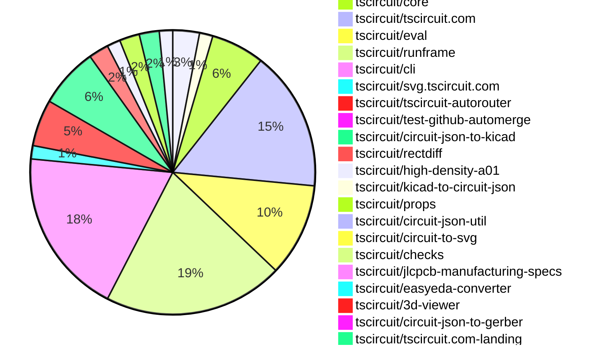

# Contribution Overview 2026-04-21

The current week is shown below. There are 3 major sections:

- [Contributor Overview](#contributor-overview)
- [PRs by Repository](#prs-by-repository)
- [PRs by Contributor](#changes-by-contributor)
- [Scoring & Sponsorship Details](/docs/sponsorship-calculation-explanation.md)

## PRs by Repository

## Contributor Overview

| Contributor | 🐳 Major | 🐙 Minor | 🐌 Tiny | Score | ⭐ | Discussion Contributions |
|-------------|---------|---------|---------|-------|-----|--------------------------|
| [ShiboSoftwareDev](#ShiboSoftwareDev) | 4 | 3 | 2 | 24 | ⭐⭐ | 0🔹 0🔶 0💎 |
| [tscircuitbot](#tscircuitbot) | 0 | 0 | 99 | 13 | ⭐⭐ | 0🔹 0🔶 0💎 |
| [techmannih](#techmannih) | 0 | 4 | 4 | 13 | ⭐⭐ | 0🔹 0🔶 0💎 |
| [Abse2001](#Abse2001) | 2 | 0 | 1 | 10 | ⭐ | 0🔹 0🔶 0💎 |
| [imrishabh18](#imrishabh18) | 0 | 2 | 4 | 9 | ⭐ | 0🔹 0🔶 0💎 |
| [0hmX](#0hmX) | 1 | 0 | 3 | 7 | ⭐ | 0🔹 0🔶 0💎 |
| [rushabhcodes](#rushabhcodes) | 0 | 0 | 5 | 6 | ⭐ | 0🔹 0🔶 0💎 |
| [AnasSarkiz](#AnasSarkiz) | 1 | 0 | 0 | 6 | ⭐ | 0🔹 0🔶 0💎 |
| [mohan-bee](#mohan-bee) | 0 | 2 | 1 | 5 | ⭐ | 0🔹 0🔶 0💎 |
| [seveibar](#seveibar) | 1 | 0 | 0 | 5 | ⭐ | 0🔹 0🔶 0💎 |
| [Sang-it](#Sang-it) | 0 | 1 | 2 | 4 | ⭐ | 0🔹 0🔶 0💎 |

## Staff Pass Ratio (SPR)

| Contributor | Reviewed PRs | Rejections | Approvals | SPR |
|-------------|--------------|------------|-----------|-----|
| [ShiboSoftwareDev](#ShiboSoftwareDev) | 6 | 0 | 6 | 100.0% |
| [techmannih](#techmannih) | 4 | 0 | 4 | 100.0% |
| [mohan-bee](#mohan-bee) | 2 | 0 | 2 | 100.0% |
| [0hmX](#0hmX) | 2 | 0 | 2 | 100.0% |
| [Abse2001](#Abse2001) | 1 | 0 | 1 | 100.0% |
| [AnasSarkiz](#AnasSarkiz) | 1 | 0 | 1 | 100.0% |

ShiboSoftwareDev SPR PRs (6)

- [#94](https://github.com/tscircuit/circuit-json-util/pull/94) Transform pcb_component insertion metadata in transformPCBElements
- [#2165](https://github.com/tscircuit/core/pull/2165) Wire footprint insertion direction into PCB components and align board DRC fields
- [#2169](https://github.com/tscircuit/core/pull/2169) Propagate board min via dimensions through autorouting
- [#2168](https://github.com/tscircuit/core/pull/2168)  Align sim graph colors with differential probe names and refresh palette
- [#2162](https://github.com/tscircuit/core/pull/2162) Infer internal footprint connections for split pins and shared aliases
- [#950](https://github.com/tscircuit/tscircuit-autorouter/pull/950) Honor explicit via pad/hole dimensions across autorouters

techmannih SPR PRs (4)

- [#2170](https://github.com/tscircuit/core/pull/2170) Add rectBorderRadius support to pill_hole_with_rect_pad plated holes
- [#232](https://github.com/tscircuit/circuit-json-to-kicad/pull/232) feat: include supplier part number in KiCad footprint properties
- [#233](https://github.com/tscircuit/circuit-json-to-kicad/pull/233) feat: implement rotation support for circular_hole_with_rect_pad and rotated_pill_hole_with_rect_pad
- [#62](https://github.com/tscircuit/kicad-to-circuit-json/pull/62) feat: Add support for pill_hole_with_rect_pad shape plated hole

mohan-bee SPR PRs (2)

- [#3197](https://github.com/tscircuit/runframe/pull/3197) Fix package details dialog stacking in Import Component flow
- [#235](https://github.com/tscircuit/circuit-json-to-kicad/pull/235) Fix component-owned silkscreen paths exporting as board graphics

0hmX SPR PRs (2)

- [#959](https://github.com/tscircuit/tscircuit-autorouter/pull/959) update url for rectdiff
- [#953](https://github.com/tscircuit/tscircuit-autorouter/pull/953) add focused repro for high-density solver issue caused by reentry in nodeWithPortPoints input

Abse2001 SPR PRs (1)

- [#384](https://github.com/tscircuit/easyeda-converter/pull/384) Refactor CAD offset logic to use model bounds + SVG origin extraction

AnasSarkiz SPR PRs (1)

- [#949](https://github.com/tscircuit/tscircuit-autorouter/pull/949) improves margin-aware violation detection

> Note: AI evaluates PRs and assigns 1-3 star ratings automatically. 4 and 5 star ratings require manual staff review.

### Discussion Contribution Legend

- 🔹 Normal Comments: Basic participation with minimal effort
- 🔶 Great Informative Comments: Thoughtful participation that adds value
- 💎 Incredible Comments: Exceptional participation with high-quality content

## Review Table

[reviews-received-hover]: ## "Number of reviews received for PRs for this contributor"
[approvals-received-hover]: ## "Number of approvals received for PRs this contributor authored"
[rejections-received-hover]: ## "Number of rejections received for PRs this contributor authored"
[prs-opened-hover]: ## "Number of PRs opened by this contributor"
[issues-created-hover]: ## "Number of issues created by this contributor"

| Contributor | Reviews Received | Approvals Received | Rejections Received | Approvals | Rejections Given | PRs Opened | PRs Merged | Issues Created |
|---|---|---|---|---|---|---|---|---|
| [tscircuitbot](#tscircuitbot) | 0 | 0 | 0 | 0 | 0 | 122 | 99 | 0 |
| [techmannih](#techmannih) | 10 | 8 | 0 | 1 | 0 | 9 | 8 | 0 |
| [imrishabh18](#imrishabh18) | 3 | 3 | 0 | 4 | 1 | 6 | 6 | 0 |
| [ShiboSoftwareDev](#ShiboSoftwareDev) | 9 | 9 | 0 | 0 | 0 | 10 | 9 | 0 |
| [seveibar](#seveibar) | 0 | 0 | 0 | 24 | 0 | 1 | 1 | 0 |
| [Wong789](#Wong789) | 0 | 0 | 0 | 0 | 0 | 1 | 0 | 0 |
| [Abse2001](#Abse2001) | 3 | 3 | 0 | 1 | 0 | 6 | 3 | 0 |
| [AnasSarkiz](#AnasSarkiz) | 1 | 1 | 0 | 2 | 0 | 3 | 1 | 0 |
| [Lumantis](#Lumantis) | 1 | 0 | 1 | 0 | 0 | 1 | 0 | 0 |
| [rushabhcodes](#rushabhcodes) | 9 | 2 | 0 | 2 | 1 | 6 | 5 | 0 |
| [mohan-bee](#mohan-bee) | 8 | 4 | 1 | 0 | 0 | 4 | 3 | 0 |
| [YPC0813](#YPC0813) | 0 | 0 | 0 | 0 | 0 | 1 | 0 | 0 |
| [0hmX](#0hmX) | 3 | 2 | 0 | 0 | 0 | 8 | 4 | 0 |
| [Angelebeats](#Angelebeats) | 0 | 0 | 0 | 0 | 0 | 2 | 0 | 0 |
| [pavel493](#pavel493) | 0 | 0 | 0 | 0 | 0 | 1 | 0 | 0 |
| [Myc911](#Myc911) | 0 | 0 | 0 | 0 | 0 | 1 | 0 | 0 |
| [Sang-it](#Sang-it) | 5 | 3 | 0 | 0 | 0 | 5 | 3 | 0 |
| [Ingenieralejo](#Ingenieralejo) | 0 | 0 | 0 | 0 | 0 | 1 | 0 | 0 |
| [MustafaMulla29](#MustafaMulla29) | 0 | 0 | 0 | 1 | 0 | 0 | 0 | 0 |

## Changes by Repository

### [tscircuit/tscircuit](https://github.com/tscircuit/tscircuit)

🐌 Tiny Contributions (4)

| PR # | Impact | Contributor | Description |
|------|--------|-------------|-------------|
| [#2983](https://github.com/tscircuit/tscircuit/pull/2983) | 🐌 Tiny | tscircuitbot | Automated package update |
| [#2975](https://github.com/tscircuit/tscircuit/pull/2975) | 🐌 Tiny | tscircuitbot | Automated package update |
| [#2978](https://github.com/tscircuit/tscircuit/pull/2978) | 🐌 Tiny | techmannih | Updates the tscircuitprops dependency version from 0.0.508 to 0.0.512 in package.json |
| [#2974](https://github.com/tscircuit/tscircuit/pull/2974) | 🐌 Tiny | ShiboSoftwareDev | Prevents synchronization of the tscircuitjlcpcb-manufacturing-specs package during the core version copying process. |

### [tscircuit/circuit-json](https://github.com/tscircuit/circuit-json)

🐌 Tiny Contributions (2)

| PR # | Impact | Contributor | Description |
|------|--------|-------------|-------------|
| [#563](https://github.com/tscircuit/circuit-json/pull/563) | 🐌 Tiny | tscircuitbot | Automated package update |
| [#562](https://github.com/tscircuit/circuit-json/pull/562) | 🐌 Tiny | imrishabh18 | Renames DRC properties for clarity and consistency in the manufacturing DRC properties interface. |

### [tscircuit/core](https://github.com/tscircuit/core)

| PR # | Impact | Rating | Contributor | Description |
|------|--------|--------|-------------|-------------|
| [#2165](https://github.com/tscircuit/core/pull/2165) | 🐳 Major | ⭐⭐⭐ | ShiboSoftwareDev | Propagates footprint.insertionDirection onto pcb_component.insertion_direction using the components global pre-layout rotation plus bottom-side mirroring, ensuring correct behavior for bottom-authored footprints and footprint constraints, while aligning board manufacturing defaults and tests with new clearance field names in circuit-json. |
| [#2169](https://github.com/tscircuit/core/pull/2169) | 🐳 Major | ⭐⭐⭐ | ShiboSoftwareDev | Propagates board minimum via dimensions through autorouting by updating the autorouter to use specific via dimensions from the board, ensuring routed via dimensions are preserved and not overwritten by defaults. |
| [#2162](https://github.com/tscircuit/core/pull/2162) | 🐳 Major | ⭐⭐⭐ | ShiboSoftwareDev | This change makes repeated non-overlapping footprint contacts behave like implicit internally connected pins instead of ambiguous PCB targets, allowing traces to target shared aliases directly and updating port matching accordingly. |
| [#2170](https://github.com/tscircuit/core/pull/2170) | 🐙 Minor | ⭐⭐ | techmannih | Adds support for rectBorderRadius in pill_hole_with_rect_pad plated holes, allowing for customizable corner rounding in PCB design. |
| [#2168](https://github.com/tscircuit/core/pull/2168) | 🐙 Minor | ⭐⭐ | ShiboSoftwareDev | Maps simulation voltage graphs to their corresponding probes, ensuring differential ngspice graphs inherit colors from schematicsimulation probes and updates the default simulation color palette. |
| [#2163](https://github.com/tscircuit/core/pull/2163) | 🐙 Minor | ⭐⭐ | imrishabh18 | Updates DRC properties in the board schema from spacing to clearance to align with upstream package changes and resolves TypeScript errors. |

🐌 Tiny Contributions (2)

| PR # | Impact | Contributor | Description |
|------|--------|-------------|-------------|
| [#2167](https://github.com/tscircuit/core/pull/2167) | 🐌 Tiny | tscircuitbot | Updates the tscircuitchecks package from version 0.0.119 to 0.0.120 in the package.json file. |
| [#2164](https://github.com/tscircuit/core/pull/2164) | 🐌 Tiny | Abse2001 | Updates the version of the tscircuitfootprinter dependency from 0.0.349 to 0.0.351 in package.json |

### [tscircuit/tscircuit.com](https://github.com/tscircuit/tscircuit.com)

🐌 Tiny Contributions (21)

| PR # | Impact | Contributor | Description |
|------|--------|-------------|-------------|
| [#3235](https://github.com/tscircuit/tscircuit.com/pull/3235) | 🐌 Tiny | tscircuitbot | Updates the tscircuitrunframe package from version 0.0.1862 to 0.0.1863 |
| [#3234](https://github.com/tscircuit/tscircuit.com/pull/3234) | 🐌 Tiny | tscircuitbot | Updates the tscircuitrunframe package from version 0.0.1861 to 0.0.1862 |
| [#3233](https://github.com/tscircuit/tscircuit.com/pull/3233) | 🐌 Tiny | tscircuitbot | Updates the tscircuitrunframe package from version 0.0.1860 to 0.0.1861 |
| [#3231](https://github.com/tscircuit/tscircuit.com/pull/3231) | 🐌 Tiny | tscircuitbot | Automated package update |
| [#3230](https://github.com/tscircuit/tscircuit.com/pull/3230) | 🐌 Tiny | tscircuitbot | Updates the tscircuiteval package to version 0.0.776 in the package.json file. |
| [#3229](https://github.com/tscircuit/tscircuit.com/pull/3229) | 🐌 Tiny | tscircuitbot | Updates the tscircuitrunframe package to version 0.0.1859 |
| [#3228](https://github.com/tscircuit/tscircuit.com/pull/3228) | 🐌 Tiny | tscircuitbot | Updates the tscircuiteval package from version 0.0.774 to 0.0.775 |
| [#3227](https://github.com/tscircuit/tscircuit.com/pull/3227) | 🐌 Tiny | tscircuitbot | Automated package update |
| [#3226](https://github.com/tscircuit/tscircuit.com/pull/3226) | 🐌 Tiny | tscircuitbot | Updates the tscircuiteval package to version 0.0.774 |
| [#3212](https://github.com/tscircuit/tscircuit.com/pull/3212) | 🐌 Tiny | tscircuitbot | Automated package update |
| [#3222](https://github.com/tscircuit/tscircuit.com/pull/3222) | 🐌 Tiny | tscircuitbot | Updates the tscircuitrunframe package from version 0.0.1854 to 0.0.1855 |
| [#3219](https://github.com/tscircuit/tscircuit.com/pull/3219) | 🐌 Tiny | tscircuitbot | Automated package update |
| [#3215](https://github.com/tscircuit/tscircuit.com/pull/3215) | 🐌 Tiny | tscircuitbot | Updates the tscircuitrunframe package from version 0.0.1852 to 0.0.1853 |
| [#3223](https://github.com/tscircuit/tscircuit.com/pull/3223) | 🐌 Tiny | tscircuitbot | Updates the tscircuitrunframe package from version 0.0.1855 to 0.0.1857 |
| [#3221](https://github.com/tscircuit/tscircuit.com/pull/3221) | 🐌 Tiny | tscircuitbot | Updates the tscircuiteval package from version 0.0.772 to 0.0.773 |
| [#3217](https://github.com/tscircuit/tscircuit.com/pull/3217) | 🐌 Tiny | tscircuitbot | Automated package update |
| [#3214](https://github.com/tscircuit/tscircuit.com/pull/3214) | 🐌 Tiny | tscircuitbot | Automated package update |
| [#3213](https://github.com/tscircuit/tscircuit.com/pull/3213) | 🐌 Tiny | tscircuitbot | Updates the tscircuitrunframe package to version 0.0.1852 |
| [#3218](https://github.com/tscircuit/tscircuit.com/pull/3218) | 🐌 Tiny | tscircuitbot | Updates the tscircuitrunframe package from version 0.0.1853 to 0.0.1854 |
| [#3225](https://github.com/tscircuit/tscircuit.com/pull/3225) | 🐌 Tiny | imrishabh18 | Updates the website URL in the about section to use the package release website URL instead of the previous method of determining the URL. |
| [#3216](https://github.com/tscircuit/tscircuit.com/pull/3216) | 🐌 Tiny | rushabhcodes | Removes the local BomTable component and its associated logic as it is no longer referenced in the application, streamlining the codebase without affecting runtime behavior. |

### [tscircuit/eval](https://github.com/tscircuit/eval)

🐌 Tiny Contributions (14)

| PR # | Impact | Contributor | Description |
|------|--------|-------------|-------------|
| [#2469](https://github.com/tscircuit/eval/pull/2469) | 🐌 Tiny | tscircuitbot | Automated package update to version 0.0.776 |
| [#2468](https://github.com/tscircuit/eval/pull/2468) | 🐌 Tiny | tscircuitbot | Updates the version of the tscircuitcore and tscircuitprops packages in package.json |
| [#2466](https://github.com/tscircuit/eval/pull/2466) | 🐌 Tiny | tscircuitbot | Automated package update to version 0.0.775 |
| [#2465](https://github.com/tscircuit/eval/pull/2465) | 🐌 Tiny | tscircuitbot | Automated package update |
| [#2461](https://github.com/tscircuit/eval/pull/2461) | 🐌 Tiny | tscircuitbot | Automated package update |
| [#2460](https://github.com/tscircuit/eval/pull/2460) | 🐌 Tiny | tscircuitbot | Automated package update |
| [#2458](https://github.com/tscircuit/eval/pull/2458) | 🐌 Tiny | tscircuitbot | Automated package update |
| [#2457](https://github.com/tscircuit/eval/pull/2457) | 🐌 Tiny | tscircuitbot | Automated package update |
| [#2456](https://github.com/tscircuit/eval/pull/2456) | 🐌 Tiny | tscircuitbot | Automated package update |
| [#2455](https://github.com/tscircuit/eval/pull/2455) | 🐌 Tiny | tscircuitbot | Updates package dependencies to their latest versions as part of routine maintenance. |
| [#2453](https://github.com/tscircuit/eval/pull/2453) | 🐌 Tiny | tscircuitbot | Automated package update |
| [#2452](https://github.com/tscircuit/eval/pull/2452) | 🐌 Tiny | tscircuitbot | Automated package update |
| [#2450](https://github.com/tscircuit/eval/pull/2450) | 🐌 Tiny | tscircuitbot | Automated package update |
| [#2449](https://github.com/tscircuit/eval/pull/2449) | 🐌 Tiny | tscircuitbot | Automated package update |

### [tscircuit/runframe](https://github.com/tscircuit/runframe)

| PR # | Impact | Rating | Contributor | Description |
|------|--------|--------|-------------|-------------|
| [#3197](https://github.com/tscircuit/runframe/pull/3197) | 🐙 Minor | ⭐⭐ | mohan-bee | Fixes the Import Component package details view so clicking See Details no longer appears broken when the details dialog opens behind the search dialog. |

🐌 Tiny Contributions (26)

| PR # | Impact | Contributor | Description |
|------|--------|-------------|-------------|
| [#3210](https://github.com/tscircuit/runframe/pull/3210) | 🐌 Tiny | tscircuitbot | Automated package update |
| [#3209](https://github.com/tscircuit/runframe/pull/3209) | 🐌 Tiny | tscircuitbot | Updates the circuit-json-to-gerber package from version 0.0.48 to 0.0.49 |
| [#3208](https://github.com/tscircuit/runframe/pull/3208) | 🐌 Tiny | tscircuitbot | Updates the circuit-json-to-kicad package version from 0.0.117 to 0.0.118 in package.json |
| [#3207](https://github.com/tscircuit/runframe/pull/3207) | 🐌 Tiny | tscircuitbot | Automated package update |
| [#3206](https://github.com/tscircuit/runframe/pull/3206) | 🐌 Tiny | tscircuitbot | Automated package update |
| [#3205](https://github.com/tscircuit/runframe/pull/3205) | 🐌 Tiny | tscircuitbot | Updates the circuit-json-to-kicad package from version 0.0.116 to 0.0.117 |
| [#3203](https://github.com/tscircuit/runframe/pull/3203) | 🐌 Tiny | tscircuitbot | Automated package update |
| [#3202](https://github.com/tscircuit/runframe/pull/3202) | 🐌 Tiny | tscircuitbot | Updates the tscircuiteval package from version 0.0.775 to 0.0.776 |
| [#3201](https://github.com/tscircuit/runframe/pull/3201) | 🐌 Tiny | tscircuitbot | Automated package update |
| [#3200](https://github.com/tscircuit/runframe/pull/3200) | 🐌 Tiny | tscircuitbot | Updates the tscircuiteval package from version 0.0.774 to 0.0.775 in the package.json file. |
| [#3199](https://github.com/tscircuit/runframe/pull/3199) | 🐌 Tiny | tscircuitbot | Automated package update |
| [#3198](https://github.com/tscircuit/runframe/pull/3198) | 🐌 Tiny | tscircuitbot | Updates the tscircuiteval package to version 0.0.774 in the package.json file. |
| [#3180](https://github.com/tscircuit/runframe/pull/3180) | 🐌 Tiny | tscircuitbot | Updates the tscircuit3d-viewer package to version 0.0.556 in package.json |
| [#3190](https://github.com/tscircuit/runframe/pull/3190) | 🐌 Tiny | tscircuitbot | Updates the tscircuiteval package from version 0.0.771 to 0.0.772 in the package.json file. |
| [#3192](https://github.com/tscircuit/runframe/pull/3192) | 🐌 Tiny | tscircuitbot | Updates the tscircuiteval package from version 0.0.772 to 0.0.773 in the package.json file. |
| [#3188](https://github.com/tscircuit/runframe/pull/3188) | 🐌 Tiny | tscircuitbot | Updates the tscircuiteval package from version 0.0.770 to 0.0.771 in the package.json file. |
| [#3195](https://github.com/tscircuit/runframe/pull/3195) | 🐌 Tiny | tscircuitbot | Updates the circuit-json-to-kicad package from version 0.0.115 to 0.0.116 in package.json |
| [#3196](https://github.com/tscircuit/runframe/pull/3196) | 🐌 Tiny | tscircuitbot | Automated package update |
| [#3193](https://github.com/tscircuit/runframe/pull/3193) | 🐌 Tiny | tscircuitbot | Automated package update |
| [#3191](https://github.com/tscircuit/runframe/pull/3191) | 🐌 Tiny | tscircuitbot | Automated package update |
| [#3183](https://github.com/tscircuit/runframe/pull/3183) | 🐌 Tiny | tscircuitbot | Updates the circuit-json-to-kicad package version from 0.0.114 to 0.0.115 in package.json |
| [#3181](https://github.com/tscircuit/runframe/pull/3181) | 🐌 Tiny | tscircuitbot | Automated package update |
| [#3186](https://github.com/tscircuit/runframe/pull/3186) | 🐌 Tiny | tscircuitbot | Automated package update |
| [#3189](https://github.com/tscircuit/runframe/pull/3189) | 🐌 Tiny | tscircuitbot | Updates the package version from v0.0.1853 to v0.0.1854 in package.json |
| [#3185](https://github.com/tscircuit/runframe/pull/3185) | 🐌 Tiny | tscircuitbot | Updates the tscircuiteval package from version 0.0.769 to 0.0.770 |
| [#3184](https://github.com/tscircuit/runframe/pull/3184) | 🐌 Tiny | tscircuitbot | Automated package update |

### [tscircuit/cli](https://github.com/tscircuit/cli)

🐌 Tiny Contributions (25)

| PR # | Impact | Contributor | Description |
|------|--------|-------------|-------------|
| [#2773](https://github.com/tscircuit/cli/pull/2773) | 🐌 Tiny | tscircuitbot | Automated package update |
| [#2772](https://github.com/tscircuit/cli/pull/2772) | 🐌 Tiny | tscircuitbot | Updates the tscircuitrunframe package from version 0.0.1861 to 0.0.1862 |
| [#2771](https://github.com/tscircuit/cli/pull/2771) | 🐌 Tiny | tscircuitbot | Automated package update |
| [#2770](https://github.com/tscircuit/cli/pull/2770) | 🐌 Tiny | tscircuitbot | Updates the tscircuitrunframe package from version 0.0.1860 to 0.0.1861 |
| [#2769](https://github.com/tscircuit/cli/pull/2769) | 🐌 Tiny | tscircuitbot | Automated package update |
| [#2768](https://github.com/tscircuit/cli/pull/2768) | 🐌 Tiny | tscircuitbot | Updates the tscircuitrunframe package to version 0.0.1860 |
| [#2767](https://github.com/tscircuit/cli/pull/2767) | 🐌 Tiny | tscircuitbot | Automated package update |
| [#2766](https://github.com/tscircuit/cli/pull/2766) | 🐌 Tiny | tscircuitbot | Updates the tscircuitrunframe package to version 0.0.1859 in the package.json file |
| [#2765](https://github.com/tscircuit/cli/pull/2765) | 🐌 Tiny | tscircuitbot | Automated package update |
| [#2764](https://github.com/tscircuit/cli/pull/2764) | 🐌 Tiny | tscircuitbot | Updates the tscircuitrunframe package to version 0.0.1858 in the package.json file. |
| [#2762](https://github.com/tscircuit/cli/pull/2762) | 🐌 Tiny | tscircuitbot | Updates the tscircuitrunframe package from version 0.0.1855 to 0.0.1857 |
| [#2760](https://github.com/tscircuit/cli/pull/2760) | 🐌 Tiny | tscircuitbot | Automated package update |
| [#2759](https://github.com/tscircuit/cli/pull/2759) | 🐌 Tiny | tscircuitbot | Automated package update |
| [#2748](https://github.com/tscircuit/cli/pull/2748) | 🐌 Tiny | tscircuitbot | Updates the tscircuitrunframe package from version 0.0.1849 to 0.0.1850 |
| [#2763](https://github.com/tscircuit/cli/pull/2763) | 🐌 Tiny | tscircuitbot | Automated package update |
| [#2761](https://github.com/tscircuit/cli/pull/2761) | 🐌 Tiny | tscircuitbot | Automated package update |
| [#2758](https://github.com/tscircuit/cli/pull/2758) | 🐌 Tiny | tscircuitbot | Updates the tscircuitrunframe package to version 0.0.1854 |
| [#2756](https://github.com/tscircuit/cli/pull/2756) | 🐌 Tiny | tscircuitbot | Updates the tscircuitrunframe package to version 0.0.1853 |
| [#2755](https://github.com/tscircuit/cli/pull/2755) | 🐌 Tiny | tscircuitbot | Automated package update |
| [#2754](https://github.com/tscircuit/cli/pull/2754) | 🐌 Tiny | tscircuitbot | Updates the tscircuitrunframe package from version 0.0.1851 to 0.0.1852 |
| [#2753](https://github.com/tscircuit/cli/pull/2753) | 🐌 Tiny | tscircuitbot | Automated package update |
| [#2752](https://github.com/tscircuit/cli/pull/2752) | 🐌 Tiny | tscircuitbot | Updates the tscircuitrunframe package from version 0.0.1850 to 0.0.1851 |
| [#2750](https://github.com/tscircuit/cli/pull/2750) | 🐌 Tiny | tscircuitbot | Automated package update |
| [#2757](https://github.com/tscircuit/cli/pull/2757) | 🐌 Tiny | tscircuitbot | Automated package update |
| [#2749](https://github.com/tscircuit/cli/pull/2749) | 🐌 Tiny | techmannih | Updates the version of the circuit-json-to-kicad dependency from 0.0.109 to 0.0.114 in package.json |

### [tscircuit/svg.tscircuit.com](https://github.com/tscircuit/svg.tscircuit.com)

🐌 Tiny Contributions (2)

| PR # | Impact | Contributor | Description |
|------|--------|-------------|-------------|
| [#1355](https://github.com/tscircuit/svg.tscircuit.com/pull/1355) | 🐌 Tiny | tscircuitbot | Updates the tscircuit package version from 0.0.1661 to 0.0.1662 in package.json |
| [#1354](https://github.com/tscircuit/svg.tscircuit.com/pull/1354) | 🐌 Tiny | tscircuitbot | Updates the tscircuit package version from 0.0.1660 to 0.0.1661 in package.json |

### [tscircuit/tscircuit-autorouter](https://github.com/tscircuit/tscircuit-autorouter)

| PR # | Impact | Rating | Contributor | Description |
|------|--------|--------|-------------|-------------|
| [#950](https://github.com/tscircuit/tscircuit-autorouter/pull/950) | 🐳 Major | ⭐⭐⭐ | ShiboSoftwareDev | Normalizes via dimensions across autorouters by using a shared helper function, ensuring all autorouting pipelines utilize the specified pad and hole diameters, and updates circuit-json export and SVG rendering accordingly. |
| [#953](https://github.com/tscircuit/tscircuit-autorouter/pull/953) | 🐳 Major | ⭐⭐⭐ | 0hmX | Adds a focused reproduction for a high-density solver issue related to reentry in nodeWithPortPoints input, including new test cases and fixtures. |
| [#949](https://github.com/tscircuit/tscircuit-autorouter/pull/949) | 🐳 Major | ⭐⭐⭐ | AnasSarkiz | Enhances margin-aware violation detection in the autorouting process to improve design rule checking accuracy. |

🐌 Tiny Contributions (4)

| PR # | Impact | Contributor | Description |
|------|--------|-------------|-------------|
| [#966](https://github.com/tscircuit/tscircuit-autorouter/pull/966) | 🐌 Tiny | tscircuitbot | Automated package update |
| [#962](https://github.com/tscircuit/tscircuit-autorouter/pull/962) | 🐌 Tiny | tscircuitbot | Automated package update |
| [#958](https://github.com/tscircuit/tscircuit-autorouter/pull/958) | 🐌 Tiny | tscircuitbot | Automated package update |
| [#956](https://github.com/tscircuit/tscircuit-autorouter/pull/956) | 🐌 Tiny | 0hmX | Removes the SVG snapshot test for bugreport49 from the test suite. |

### [tscircuit/test-github-automerge](https://github.com/tscircuit/test-github-automerge)

🐌 Tiny Contributions (1)

| PR # | Impact | Contributor | Description |
|------|--------|-------------|-------------|
| [#43](https://github.com/tscircuit/test-github-automerge/pull/43) | 🐌 Tiny | tscircuitbot | Updates the tscircuitcircuit-json-util package from version 0.0.93 to 0.0.94 in the development dependencies. |

### [tscircuit/circuit-json-to-kicad](https://github.com/tscircuit/circuit-json-to-kicad)

| PR # | Impact | Rating | Contributor | Description |
|------|--------|--------|-------------|-------------|
| [#232](https://github.com/tscircuit/circuit-json-to-kicad/pull/232) | 🐙 Minor | ⭐⭐ | techmannih | Enables the inclusion of supplier part numbers (specifically from jlcpcb) as properties in the generated KiCad PCB footprints. |
| [#233](https://github.com/tscircuit/circuit-json-to-kicad/pull/233) | 🐙 Minor | ⭐⭐ | techmannih | Adds rotation support for circular and rotated pill holes with rectangular pads in PCB design, enhancing the flexibility of hole placement. |
| [#235](https://github.com/tscircuit/circuit-json-to-kicad/pull/235) | 🐙 Minor | ⭐⭐ | mohan-bee | Fixes KiCad export for pcb_silkscreen_path objects that belong to a component, ensuring they are exported as footprint-local primitives instead of board-level graphics. |
| [#229](https://github.com/tscircuit/circuit-json-to-kicad/pull/229) | 🐙 Minor | ⭐⭐ | Sang-it | Fixes KiCad pad labeling to preserve source pin identity instead of array order, ensuring correct pad numbering for custom footprints. |

🐌 Tiny Contributions (5)

| PR # | Impact | Contributor | Description |
|------|--------|-------------|-------------|
| [#239](https://github.com/tscircuit/circuit-json-to-kicad/pull/239) | 🐌 Tiny | tscircuitbot | Automated package update |
| [#237](https://github.com/tscircuit/circuit-json-to-kicad/pull/237) | 🐌 Tiny | tscircuitbot | Automated package update |
| [#231](https://github.com/tscircuit/circuit-json-to-kicad/pull/231) | 🐌 Tiny | tscircuitbot | Automated package update |
| [#234](https://github.com/tscircuit/circuit-json-to-kicad/pull/234) | 🐌 Tiny | tscircuitbot | Automated package update |
| [#236](https://github.com/tscircuit/circuit-json-to-kicad/pull/236) | 🐌 Tiny | techmannih | Adds a test to ensure that 0402 footprints maintain pad rotation when components are rotated 45 degrees in the circuit. |

### [tscircuit/rectdiff](https://github.com/tscircuit/rectdiff)

🐌 Tiny Contributions (3)

| PR # | Impact | Contributor | Description |
|------|--------|-------------|-------------|
| [#97](https://github.com/tscircuit/rectdiff/pull/97) | 🐌 Tiny | tscircuitbot | Automated package update |
| [#96](https://github.com/tscircuit/rectdiff/pull/96) | 🐌 Tiny | 0hmX | Adds a test for generating a multi-layer node summary from SRJ files, ensuring correct volume calculations and obstacle handling. |
| [#94](https://github.com/tscircuit/rectdiff/pull/94) | 🐌 Tiny | 0hmX | This pull request introduces new fixtures for the Arduino Uno plane-layer rectdiff functionality. It includes new page components and JSON assets that define the routing and layout for the Arduino Uno, enhancing the existing rectdiff capabilities. |

### [tscircuit/high-density-a01](https://github.com/tscircuit/high-density-a01)

| PR # | Impact | Rating | Contributor | Description |
|------|--------|--------|-------------|-------------|
| [#74](https://github.com/tscircuit/high-density-a01/pull/74) | 🐳 Major | ⭐⭐⭐ | seveibar | Adds a new solver (A09) to the high-density routing system, enhancing routing capabilities with new parameters and functionality. |

🐌 Tiny Contributions (1)

| PR # | Impact | Contributor | Description |
|------|--------|-------------|-------------|
| [#75](https://github.com/tscircuit/high-density-a01/pull/75) | 🐌 Tiny | tscircuitbot | Automated package update |

### [tscircuit/kicad-to-circuit-json](https://github.com/tscircuit/kicad-to-circuit-json)

| PR # | Impact | Rating | Contributor | Description |
|------|--------|--------|-------------|-------------|
| [#62](https://github.com/tscircuit/kicad-to-circuit-json/pull/62) | 🐙 Minor | ⭐⭐ | techmannih | Adds support for a new plated hole shape, specifically the pill_hole_with_rect_pad, enhancing the PCB design capabilities. |

### [tscircuit/props](https://github.com/tscircuit/props)

🐌 Tiny Contributions (3)

| PR # | Impact | Contributor | Description |
|------|--------|-------------|-------------|
| [#640](https://github.com/tscircuit/props/pull/640) | 🐌 Tiny | techmannih | Adds a new property rectBorderRadius to the PillWithRectPadPlatedHoleProps interface, allowing for customizable border radius on rectangular plated holes. |
| [#638](https://github.com/tscircuit/props/pull/638) | 🐌 Tiny | ShiboSoftwareDev | Removes the directional options x, x-, y, and y- from the footprint insertion direction type definition, streamlining the available options for users. |
| [#641](https://github.com/tscircuit/props/pull/641) | 🐌 Tiny | imrishabh18 | Renames DRC-related props on SubcircuitGroupProps to consistent camelCase names for runtime validation and documentation. |

### [tscircuit/circuit-json-util](https://github.com/tscircuit/circuit-json-util)

| PR # | Impact | Rating | Contributor | Description |
|------|--------|--------|-------------|-------------|
| [#94](https://github.com/tscircuit/circuit-json-util/pull/94) | 🐙 Minor | ⭐⭐ | ShiboSoftwareDev | Updates transformPCBElement to maintain consistent pcb_component geometric metadata by transforming insertion_direction and moving cable_insertion_center with the applied matrix, while ensuring correct handling of quarter-turns for negative rotations. |

### [tscircuit/circuit-to-svg](https://github.com/tscircuit/circuit-to-svg)

| PR # | Impact | Rating | Contributor | Description |
|------|--------|--------|-------------|-------------|
| [#548](https://github.com/tscircuit/circuit-to-svg/pull/548) | 🐙 Minor | ⭐⭐ | ShiboSoftwareDev | Switch simulation graphs to a dedicated default palette with conventional plot colors so early traces use familiar blueredgreen-style ordering. |

### [tscircuit/checks](https://github.com/tscircuit/checks)

| PR # | Impact | Rating | Contributor | Description |
|------|--------|--------|-------------|-------------|
| [#136](https://github.com/tscircuit/checks/pull/136) | 🐙 Minor | ⭐⭐ | imrishabh18 | Aligns local DRC default values with the published JLCPCB minimum manufacturing tolerances, replacing hardcoded values with dynamic values from the jlcMinTolerances package. |

### [tscircuit/jlcpcb-manufacturing-specs](https://github.com/tscircuit/jlcpcb-manufacturing-specs)

🐌 Tiny Contributions (1)

| PR # | Impact | Contributor | Description |
|------|--------|-------------|-------------|
| [#4](https://github.com/tscircuit/jlcpcb-manufacturing-specs/pull/4) | 🐌 Tiny | imrishabh18 | Renames JLCPCB tolerance keys for clarity, adjusts default tolerance values for accuracy, and updates the circuit-json dependency to ensure compatibility with the latest board schema. |

### [tscircuit/easyeda-converter](https://github.com/tscircuit/easyeda-converter)

| PR # | Impact | Rating | Contributor | Description |
|------|--------|--------|-------------|-------------|
| [#384](https://github.com/tscircuit/easyeda-converter/pull/384) | 🐳 Major | ⭐⭐⭐ | Abse2001 | This pull request refactors the CAD offset logic to utilize model bounds and extract the SVG origin. It introduces a new method for calculating the CAD model offset based on the bounds of the model, improving the accuracy of the placement of CAD models in the circuit design. The changes include updates to the conversion functions and adjustments to the handling of CAD model properties, ensuring that the models origin is correctly calculated and applied during the conversion process. |

### [tscircuit/3d-viewer](https://github.com/tscircuit/3d-viewer)

| PR # | Impact | Rating | Contributor | Description |
|------|--------|--------|-------------|-------------|
| [#765](https://github.com/tscircuit/3d-viewer/pull/765) | 🐳 Major | ⭐⭐⭐ | Abse2001 | https:3d-viewer-git-fork-abse2001-main-tscircuit.vercel.app?pathstorykeypad--default |

### [tscircuit/circuit-json-to-gerber](https://github.com/tscircuit/circuit-json-to-gerber)

🐌 Tiny Contributions (1)

| PR # | Impact | Contributor | Description |
|------|--------|-------------|-------------|
| [#77](https://github.com/tscircuit/circuit-json-to-gerber/pull/77) | 🐌 Tiny | rushabhcodes | Updates the version of the tscircuitalphabet dependency in package.json to ensure compatibility with the latest features and bug fixes. |

### [tscircuit/tscircuit.com-landing](https://github.com/tscircuit/tscircuit.com-landing)

🐌 Tiny Contributions (3)

| PR # | Impact | Contributor | Description |
|------|--------|-------------|-------------|
| [#9](https://github.com/tscircuit/tscircuit.com-landing/pull/9) | 🐌 Tiny | rushabhcodes | Updates the landing page copy for clarity, revises statistics, and optimizes gallery image loading by switching from remote URLs to local assets. |
| [#7](https://github.com/tscircuit/tscircuit.com-landing/pull/7) | 🐌 Tiny | rushabhcodes | Updates the landing page with improved UI elements, navigation simplification, animated GitHub star count, and replaces the autorouting demo video. |
| [#8](https://github.com/tscircuit/tscircuit.com-landing/pull/8) | 🐌 Tiny | rushabhcodes | Enhances the small-screen experience on the landing page by tightening the feature card layout, simplifying repeated card styles, and redesigning the footer for mobile to read as a compact sitemap instead of a squeezed desktop stack. |

### [tscircuit/docs](https://github.com/tscircuit/docs)

🐌 Tiny Contributions (1)

| PR # | Impact | Contributor | Description |
|------|--------|-------------|-------------|
| [#535](https://github.com/tscircuit/docs/pull/535) | 🐌 Tiny | mohan-bee | Adds new export formats for assembly SVG and STEP 3D model to the documentation. |

### [tscircuit/schematic-trace-solver](https://github.com/tscircuit/schematic-trace-solver)

🐌 Tiny Contributions (2)

| PR # | Impact | Contributor | Description |
|------|--------|-------------|-------------|
| [#208](https://github.com/tscircuit/schematic-trace-solver/pull/208) | 🐌 Tiny | Sang-it | Adds debug labels to the NetLabelPlacementSolver for better visualization of net IDs and anchor points during the placement process. |
| [#205](https://github.com/tscircuit/schematic-trace-solver/pull/205) | 🐌 Tiny | Sang-it | Adds a new example page and corresponding tests for the schematic trace solver. |

## Changes by Contributor

### [tscircuitbot](https://github.com/tscircuitbot)

🐌 Tiny Contributions (99)

| PR # | Impact | Description |
|------|--------|-------------|
| [#2983](https://github.com/tscircuit/tscircuit/pull/2983) | 🐌 Tiny | Automated package update |
| [#2975](https://github.com/tscircuit/tscircuit/pull/2975) | 🐌 Tiny | Automated package update |
| [#563](https://github.com/tscircuit/circuit-json/pull/563) | 🐌 Tiny | Automated package update |
| [#2167](https://github.com/tscircuit/core/pull/2167) | 🐌 Tiny | Updates the tscircuitchecks package from version 0.0.119 to 0.0.120 in the package.json file. |
| [#3235](https://github.com/tscircuit/tscircuit.com/pull/3235) | 🐌 Tiny | Updates the tscircuitrunframe package from version 0.0.1862 to 0.0.1863 |
| [#3234](https://github.com/tscircuit/tscircuit.com/pull/3234) | 🐌 Tiny | Updates the tscircuitrunframe package from version 0.0.1861 to 0.0.1862 |
| [#3233](https://github.com/tscircuit/tscircuit.com/pull/3233) | 🐌 Tiny | Updates the tscircuitrunframe package from version 0.0.1860 to 0.0.1861 |
| [#3231](https://github.com/tscircuit/tscircuit.com/pull/3231) | 🐌 Tiny | Automated package update |
| [#3230](https://github.com/tscircuit/tscircuit.com/pull/3230) | 🐌 Tiny | Updates the tscircuiteval package to version 0.0.776 in the package.json file. |
| [#3229](https://github.com/tscircuit/tscircuit.com/pull/3229) | 🐌 Tiny | Updates the tscircuitrunframe package to version 0.0.1859 |
| [#3228](https://github.com/tscircuit/tscircuit.com/pull/3228) | 🐌 Tiny | Updates the tscircuiteval package from version 0.0.774 to 0.0.775 |
| [#3227](https://github.com/tscircuit/tscircuit.com/pull/3227) | 🐌 Tiny | Automated package update |
| [#3226](https://github.com/tscircuit/tscircuit.com/pull/3226) | 🐌 Tiny | Updates the tscircuiteval package to version 0.0.774 |
| [#3212](https://github.com/tscircuit/tscircuit.com/pull/3212) | 🐌 Tiny | Automated package update |
| [#3222](https://github.com/tscircuit/tscircuit.com/pull/3222) | 🐌 Tiny | Updates the tscircuitrunframe package from version 0.0.1854 to 0.0.1855 |
| [#3219](https://github.com/tscircuit/tscircuit.com/pull/3219) | 🐌 Tiny | Automated package update |
| [#3215](https://github.com/tscircuit/tscircuit.com/pull/3215) | 🐌 Tiny | Updates the tscircuitrunframe package from version 0.0.1852 to 0.0.1853 |
| [#3223](https://github.com/tscircuit/tscircuit.com/pull/3223) | 🐌 Tiny | Updates the tscircuitrunframe package from version 0.0.1855 to 0.0.1857 |
| [#3221](https://github.com/tscircuit/tscircuit.com/pull/3221) | 🐌 Tiny | Updates the tscircuiteval package from version 0.0.772 to 0.0.773 |
| [#3217](https://github.com/tscircuit/tscircuit.com/pull/3217) | 🐌 Tiny | Automated package update |
| [#3214](https://github.com/tscircuit/tscircuit.com/pull/3214) | 🐌 Tiny | Automated package update |
| [#3213](https://github.com/tscircuit/tscircuit.com/pull/3213) | 🐌 Tiny | Updates the tscircuitrunframe package to version 0.0.1852 |
| [#3218](https://github.com/tscircuit/tscircuit.com/pull/3218) | 🐌 Tiny | Updates the tscircuitrunframe package from version 0.0.1853 to 0.0.1854 |
| [#2469](https://github.com/tscircuit/eval/pull/2469) | 🐌 Tiny | Automated package update to version 0.0.776 |
| [#2468](https://github.com/tscircuit/eval/pull/2468) | 🐌 Tiny | Updates the version of the tscircuitcore and tscircuitprops packages in package.json |
| [#2466](https://github.com/tscircuit/eval/pull/2466) | 🐌 Tiny | Automated package update to version 0.0.775 |
| [#2465](https://github.com/tscircuit/eval/pull/2465) | 🐌 Tiny | Automated package update |
| [#2461](https://github.com/tscircuit/eval/pull/2461) | 🐌 Tiny | Automated package update |
| [#2460](https://github.com/tscircuit/eval/pull/2460) | 🐌 Tiny | Automated package update |
| [#2458](https://github.com/tscircuit/eval/pull/2458) | 🐌 Tiny | Automated package update |
| [#2457](https://github.com/tscircuit/eval/pull/2457) | 🐌 Tiny | Automated package update |
| [#2456](https://github.com/tscircuit/eval/pull/2456) | 🐌 Tiny | Automated package update |
| [#2455](https://github.com/tscircuit/eval/pull/2455) | 🐌 Tiny | Updates package dependencies to their latest versions as part of routine maintenance. |
| [#2453](https://github.com/tscircuit/eval/pull/2453) | 🐌 Tiny | Automated package update |
| [#2452](https://github.com/tscircuit/eval/pull/2452) | 🐌 Tiny | Automated package update |
| [#2450](https://github.com/tscircuit/eval/pull/2450) | 🐌 Tiny | Automated package update |
| [#2449](https://github.com/tscircuit/eval/pull/2449) | 🐌 Tiny | Automated package update |
| [#3210](https://github.com/tscircuit/runframe/pull/3210) | 🐌 Tiny | Automated package update |
| [#3209](https://github.com/tscircuit/runframe/pull/3209) | 🐌 Tiny | Updates the circuit-json-to-gerber package from version 0.0.48 to 0.0.49 |
| [#3208](https://github.com/tscircuit/runframe/pull/3208) | 🐌 Tiny | Updates the circuit-json-to-kicad package version from 0.0.117 to 0.0.118 in package.json |
| [#3207](https://github.com/tscircuit/runframe/pull/3207) | 🐌 Tiny | Automated package update |
| [#3206](https://github.com/tscircuit/runframe/pull/3206) | 🐌 Tiny | Automated package update |
| [#3205](https://github.com/tscircuit/runframe/pull/3205) | 🐌 Tiny | Updates the circuit-json-to-kicad package from version 0.0.116 to 0.0.117 |
| [#3203](https://github.com/tscircuit/runframe/pull/3203) | 🐌 Tiny | Automated package update |
| [#3202](https://github.com/tscircuit/runframe/pull/3202) | 🐌 Tiny | Updates the tscircuiteval package from version 0.0.775 to 0.0.776 |
| [#3201](https://github.com/tscircuit/runframe/pull/3201) | 🐌 Tiny | Automated package update |
| [#3200](https://github.com/tscircuit/runframe/pull/3200) | 🐌 Tiny | Updates the tscircuiteval package from version 0.0.774 to 0.0.775 in the package.json file. |
| [#3199](https://github.com/tscircuit/runframe/pull/3199) | 🐌 Tiny | Automated package update |
| [#3198](https://github.com/tscircuit/runframe/pull/3198) | 🐌 Tiny | Updates the tscircuiteval package to version 0.0.774 in the package.json file. |
| [#3180](https://github.com/tscircuit/runframe/pull/3180) | 🐌 Tiny | Updates the tscircuit3d-viewer package to version 0.0.556 in package.json |
| [#3190](https://github.com/tscircuit/runframe/pull/3190) | 🐌 Tiny | Updates the tscircuiteval package from version 0.0.771 to 0.0.772 in the package.json file. |
| [#3192](https://github.com/tscircuit/runframe/pull/3192) | 🐌 Tiny | Updates the tscircuiteval package from version 0.0.772 to 0.0.773 in the package.json file. |
| [#3188](https://github.com/tscircuit/runframe/pull/3188) | 🐌 Tiny | Updates the tscircuiteval package from version 0.0.770 to 0.0.771 in the package.json file. |
| [#3195](https://github.com/tscircuit/runframe/pull/3195) | 🐌 Tiny | Updates the circuit-json-to-kicad package from version 0.0.115 to 0.0.116 in package.json |
| [#3196](https://github.com/tscircuit/runframe/pull/3196) | 🐌 Tiny | Automated package update |
| [#3193](https://github.com/tscircuit/runframe/pull/3193) | 🐌 Tiny | Automated package update |
| [#3191](https://github.com/tscircuit/runframe/pull/3191) | 🐌 Tiny | Automated package update |
| [#3183](https://github.com/tscircuit/runframe/pull/3183) | 🐌 Tiny | Updates the circuit-json-to-kicad package version from 0.0.114 to 0.0.115 in package.json |
| [#3181](https://github.com/tscircuit/runframe/pull/3181) | 🐌 Tiny | Automated package update |
| [#3186](https://github.com/tscircuit/runframe/pull/3186) | 🐌 Tiny | Automated package update |
| [#3189](https://github.com/tscircuit/runframe/pull/3189) | 🐌 Tiny | Updates the package version from v0.0.1853 to v0.0.1854 in package.json |
| [#3185](https://github.com/tscircuit/runframe/pull/3185) | 🐌 Tiny | Updates the tscircuiteval package from version 0.0.769 to 0.0.770 |
| [#3184](https://github.com/tscircuit/runframe/pull/3184) | 🐌 Tiny | Automated package update |
| [#2773](https://github.com/tscircuit/cli/pull/2773) | 🐌 Tiny | Automated package update |
| [#2772](https://github.com/tscircuit/cli/pull/2772) | 🐌 Tiny | Updates the tscircuitrunframe package from version 0.0.1861 to 0.0.1862 |
| [#2771](https://github.com/tscircuit/cli/pull/2771) | 🐌 Tiny | Automated package update |
| [#2770](https://github.com/tscircuit/cli/pull/2770) | 🐌 Tiny | Updates the tscircuitrunframe package from version 0.0.1860 to 0.0.1861 |
| [#2769](https://github.com/tscircuit/cli/pull/2769) | 🐌 Tiny | Automated package update |
| [#2768](https://github.com/tscircuit/cli/pull/2768) | 🐌 Tiny | Updates the tscircuitrunframe package to version 0.0.1860 |
| [#2767](https://github.com/tscircuit/cli/pull/2767) | 🐌 Tiny | Automated package update |
| [#2766](https://github.com/tscircuit/cli/pull/2766) | 🐌 Tiny | Updates the tscircuitrunframe package to version 0.0.1859 in the package.json file |
| [#2765](https://github.com/tscircuit/cli/pull/2765) | 🐌 Tiny | Automated package update |
| [#2764](https://github.com/tscircuit/cli/pull/2764) | 🐌 Tiny | Updates the tscircuitrunframe package to version 0.0.1858 in the package.json file. |
| [#2762](https://github.com/tscircuit/cli/pull/2762) | 🐌 Tiny | Updates the tscircuitrunframe package from version 0.0.1855 to 0.0.1857 |
| [#2760](https://github.com/tscircuit/cli/pull/2760) | 🐌 Tiny | Automated package update |
| [#2759](https://github.com/tscircuit/cli/pull/2759) | 🐌 Tiny | Automated package update |
| [#2748](https://github.com/tscircuit/cli/pull/2748) | 🐌 Tiny | Updates the tscircuitrunframe package from version 0.0.1849 to 0.0.1850 |
| [#2763](https://github.com/tscircuit/cli/pull/2763) | 🐌 Tiny | Automated package update |
| [#2761](https://github.com/tscircuit/cli/pull/2761) | 🐌 Tiny | Automated package update |
| [#2758](https://github.com/tscircuit/cli/pull/2758) | 🐌 Tiny | Updates the tscircuitrunframe package to version 0.0.1854 |
| [#2756](https://github.com/tscircuit/cli/pull/2756) | 🐌 Tiny | Updates the tscircuitrunframe package to version 0.0.1853 |
| [#2755](https://github.com/tscircuit/cli/pull/2755) | 🐌 Tiny | Automated package update |
| [#2754](https://github.com/tscircuit/cli/pull/2754) | 🐌 Tiny | Updates the tscircuitrunframe package from version 0.0.1851 to 0.0.1852 |
| [#2753](https://github.com/tscircuit/cli/pull/2753) | 🐌 Tiny | Automated package update |
| [#2752](https://github.com/tscircuit/cli/pull/2752) | 🐌 Tiny | Updates the tscircuitrunframe package from version 0.0.1850 to 0.0.1851 |
| [#2750](https://github.com/tscircuit/cli/pull/2750) | 🐌 Tiny | Automated package update |
| [#2757](https://github.com/tscircuit/cli/pull/2757) | 🐌 Tiny | Automated package update |
| [#1355](https://github.com/tscircuit/svg.tscircuit.com/pull/1355) | 🐌 Tiny | Updates the tscircuit package version from 0.0.1661 to 0.0.1662 in package.json |
| [#1354](https://github.com/tscircuit/svg.tscircuit.com/pull/1354) | 🐌 Tiny | Updates the tscircuit package version from 0.0.1660 to 0.0.1661 in package.json |
| [#966](https://github.com/tscircuit/tscircuit-autorouter/pull/966) | 🐌 Tiny | Automated package update |
| [#962](https://github.com/tscircuit/tscircuit-autorouter/pull/962) | 🐌 Tiny | Automated package update |
| [#958](https://github.com/tscircuit/tscircuit-autorouter/pull/958) | 🐌 Tiny | Automated package update |
| [#43](https://github.com/tscircuit/test-github-automerge/pull/43) | 🐌 Tiny | Updates the tscircuitcircuit-json-util package from version 0.0.93 to 0.0.94 in the development dependencies. |
| [#239](https://github.com/tscircuit/circuit-json-to-kicad/pull/239) | 🐌 Tiny | Automated package update |
| [#237](https://github.com/tscircuit/circuit-json-to-kicad/pull/237) | 🐌 Tiny | Automated package update |
| [#231](https://github.com/tscircuit/circuit-json-to-kicad/pull/231) | 🐌 Tiny | Automated package update |
| [#234](https://github.com/tscircuit/circuit-json-to-kicad/pull/234) | 🐌 Tiny | Automated package update |
| [#97](https://github.com/tscircuit/rectdiff/pull/97) | 🐌 Tiny | Automated package update |
| [#75](https://github.com/tscircuit/high-density-a01/pull/75) | 🐌 Tiny | Automated package update |

### [techmannih](https://github.com/techmannih)

| PRs # | Impact | Rating | Description |
|------|--------|--------|-------------|
| [#2170](https://github.com/tscircuit/core/pull/2170) | 🐙 Minor | ⭐⭐ | Adds support for rectBorderRadius in pill_hole_with_rect_pad plated holes, allowing for customizable corner rounding in PCB design. |
| [#232](https://github.com/tscircuit/circuit-json-to-kicad/pull/232) | 🐙 Minor | ⭐⭐ | Enables the inclusion of supplier part numbers (specifically from jlcpcb) as properties in the generated KiCad PCB footprints. |
| [#233](https://github.com/tscircuit/circuit-json-to-kicad/pull/233) | 🐙 Minor | ⭐⭐ | Adds rotation support for circular and rotated pill holes with rectangular pads in PCB design, enhancing the flexibility of hole placement. |
| [#62](https://github.com/tscircuit/kicad-to-circuit-json/pull/62) | 🐙 Minor | ⭐⭐ | Adds support for a new plated hole shape, specifically the pill_hole_with_rect_pad, enhancing the PCB design capabilities. |

🐌 Tiny Contributions (4)

| PR # | Impact | Description |
|------|--------|-------------|
| [#2978](https://github.com/tscircuit/tscircuit/pull/2978) | 🐌 Tiny | Updates the tscircuitprops dependency version from 0.0.508 to 0.0.512 in package.json |
| [#640](https://github.com/tscircuit/props/pull/640) | 🐌 Tiny | Adds a new property rectBorderRadius to the PillWithRectPadPlatedHoleProps interface, allowing for customizable border radius on rectangular plated holes. |
| [#2749](https://github.com/tscircuit/cli/pull/2749) | 🐌 Tiny | Updates the version of the circuit-json-to-kicad dependency from 0.0.109 to 0.0.114 in package.json |
| [#236](https://github.com/tscircuit/circuit-json-to-kicad/pull/236) | 🐌 Tiny | Adds a test to ensure that 0402 footprints maintain pad rotation when components are rotated 45 degrees in the circuit. |

### [ShiboSoftwareDev](https://github.com/ShiboSoftwareDev)

| PRs # | Impact | Rating | Description |
|------|--------|--------|-------------|
| [#2165](https://github.com/tscircuit/core/pull/2165) | 🐳 Major | ⭐⭐⭐ | Propagates footprint.insertionDirection onto pcb_component.insertion_direction using the components global pre-layout rotation plus bottom-side mirroring, ensuring correct behavior for bottom-authored footprints and footprint constraints, while aligning board manufacturing defaults and tests with new clearance field names in circuit-json. |
| [#2169](https://github.com/tscircuit/core/pull/2169) | 🐳 Major | ⭐⭐⭐ | Propagates board minimum via dimensions through autorouting by updating the autorouter to use specific via dimensions from the board, ensuring routed via dimensions are preserved and not overwritten by defaults. |
| [#2162](https://github.com/tscircuit/core/pull/2162) | 🐳 Major | ⭐⭐⭐ | This change makes repeated non-overlapping footprint contacts behave like implicit internally connected pins instead of ambiguous PCB targets, allowing traces to target shared aliases directly and updating port matching accordingly. |
| [#950](https://github.com/tscircuit/tscircuit-autorouter/pull/950) | 🐳 Major | ⭐⭐⭐ | Normalizes via dimensions across autorouters by using a shared helper function, ensuring all autorouting pipelines utilize the specified pad and hole diameters, and updates circuit-json export and SVG rendering accordingly. |
| [#94](https://github.com/tscircuit/circuit-json-util/pull/94) | 🐙 Minor | ⭐⭐ | Updates transformPCBElement to maintain consistent pcb_component geometric metadata by transforming insertion_direction and moving cable_insertion_center with the applied matrix, while ensuring correct handling of quarter-turns for negative rotations. |
| [#2168](https://github.com/tscircuit/core/pull/2168) | 🐙 Minor | ⭐⭐ | Maps simulation voltage graphs to their corresponding probes, ensuring differential ngspice graphs inherit colors from schematicsimulation probes and updates the default simulation color palette. |
| [#548](https://github.com/tscircuit/circuit-to-svg/pull/548) | 🐙 Minor | ⭐⭐ | Switch simulation graphs to a dedicated default palette with conventional plot colors so early traces use familiar blueredgreen-style ordering. |

🐌 Tiny Contributions (2)

| PR # | Impact | Description |
|------|--------|-------------|
| [#2974](https://github.com/tscircuit/tscircuit/pull/2974) | 🐌 Tiny | Prevents synchronization of the tscircuitjlcpcb-manufacturing-specs package during the core version copying process. |
| [#638](https://github.com/tscircuit/props/pull/638) | 🐌 Tiny | Removes the directional options x, x-, y, and y- from the footprint insertion direction type definition, streamlining the available options for users. |

### [imrishabh18](https://github.com/imrishabh18)

| PRs # | Impact | Rating | Description |
|------|--------|--------|-------------|
| [#2163](https://github.com/tscircuit/core/pull/2163) | 🐙 Minor | ⭐⭐ | Updates DRC properties in the board schema from spacing to clearance to align with upstream package changes and resolves TypeScript errors. |
| [#136](https://github.com/tscircuit/checks/pull/136) | 🐙 Minor | ⭐⭐ | Aligns local DRC default values with the published JLCPCB minimum manufacturing tolerances, replacing hardcoded values with dynamic values from the jlcMinTolerances package. |

🐌 Tiny Contributions (4)

| PR # | Impact | Description |
|------|--------|-------------|
| [#562](https://github.com/tscircuit/circuit-json/pull/562) | 🐌 Tiny | Renames DRC properties for clarity and consistency in the manufacturing DRC properties interface. |
| [#641](https://github.com/tscircuit/props/pull/641) | 🐌 Tiny | Renames DRC-related props on SubcircuitGroupProps to consistent camelCase names for runtime validation and documentation. |
| [#3225](https://github.com/tscircuit/tscircuit.com/pull/3225) | 🐌 Tiny | Updates the website URL in the about section to use the package release website URL instead of the previous method of determining the URL. |
| [#4](https://github.com/tscircuit/jlcpcb-manufacturing-specs/pull/4) | 🐌 Tiny | Renames JLCPCB tolerance keys for clarity, adjusts default tolerance values for accuracy, and updates the circuit-json dependency to ensure compatibility with the latest board schema. |

### [Abse2001](https://github.com/Abse2001)

| PRs # | Impact | Rating | Description |
|------|--------|--------|-------------|
| [#384](https://github.com/tscircuit/easyeda-converter/pull/384) | 🐳 Major | ⭐⭐⭐ | This pull request refactors the CAD offset logic to utilize model bounds and extract the SVG origin. It introduces a new method for calculating the CAD model offset based on the bounds of the model, improving the accuracy of the placement of CAD models in the circuit design. The changes include updates to the conversion functions and adjustments to the handling of CAD model properties, ensuring that the models origin is correctly calculated and applied during the conversion process. |
| [#765](https://github.com/tscircuit/3d-viewer/pull/765) | 🐳 Major | ⭐⭐⭐ | https:3d-viewer-git-fork-abse2001-main-tscircuit.vercel.app?pathstorykeypad--default |

🐌 Tiny Contributions (1)

| PR # | Impact | Description |
|------|--------|-------------|
| [#2164](https://github.com/tscircuit/core/pull/2164) | 🐌 Tiny | Updates the version of the tscircuitfootprinter dependency from 0.0.349 to 0.0.351 in package.json |

### [rushabhcodes](https://github.com/rushabhcodes)

🐌 Tiny Contributions (5)

| PR # | Impact | Description |
|------|--------|-------------|
| [#77](https://github.com/tscircuit/circuit-json-to-gerber/pull/77) | 🐌 Tiny | Updates the version of the tscircuitalphabet dependency in package.json to ensure compatibility with the latest features and bug fixes. |
| [#3216](https://github.com/tscircuit/tscircuit.com/pull/3216) | 🐌 Tiny | Removes the local BomTable component and its associated logic as it is no longer referenced in the application, streamlining the codebase without affecting runtime behavior. |
| [#9](https://github.com/tscircuit/tscircuit.com-landing/pull/9) | 🐌 Tiny | Updates the landing page copy for clarity, revises statistics, and optimizes gallery image loading by switching from remote URLs to local assets. |
| [#7](https://github.com/tscircuit/tscircuit.com-landing/pull/7) | 🐌 Tiny | Updates the landing page with improved UI elements, navigation simplification, animated GitHub star count, and replaces the autorouting demo video. |
| [#8](https://github.com/tscircuit/tscircuit.com-landing/pull/8) | 🐌 Tiny | Enhances the small-screen experience on the landing page by tightening the feature card layout, simplifying repeated card styles, and redesigning the footer for mobile to read as a compact sitemap instead of a squeezed desktop stack. |

### [mohan-bee](https://github.com/mohan-bee)

| PRs # | Impact | Rating | Description |
|------|--------|--------|-------------|
| [#3197](https://github.com/tscircuit/runframe/pull/3197) | 🐙 Minor | ⭐⭐ | Fixes the Import Component package details view so clicking See Details no longer appears broken when the details dialog opens behind the search dialog. |
| [#235](https://github.com/tscircuit/circuit-json-to-kicad/pull/235) | 🐙 Minor | ⭐⭐ | Fixes KiCad export for pcb_silkscreen_path objects that belong to a component, ensuring they are exported as footprint-local primitives instead of board-level graphics. |

🐌 Tiny Contributions (1)

| PR # | Impact | Description |
|------|--------|-------------|
| [#535](https://github.com/tscircuit/docs/pull/535) | 🐌 Tiny | Adds new export formats for assembly SVG and STEP 3D model to the documentation. |

### [0hmX](https://github.com/0hmX)

| PRs # | Impact | Rating | Description |
|------|--------|--------|-------------|
| [#953](https://github.com/tscircuit/tscircuit-autorouter/pull/953) | 🐳 Major | ⭐⭐⭐ | Adds a focused reproduction for a high-density solver issue related to reentry in nodeWithPortPoints input, including new test cases and fixtures. |

🐌 Tiny Contributions (3)

| PR # | Impact | Description |
|------|--------|-------------|
| [#956](https://github.com/tscircuit/tscircuit-autorouter/pull/956) | 🐌 Tiny | Removes the SVG snapshot test for bugreport49 from the test suite. |
| [#96](https://github.com/tscircuit/rectdiff/pull/96) | 🐌 Tiny | Adds a test for generating a multi-layer node summary from SRJ files, ensuring correct volume calculations and obstacle handling. |
| [#94](https://github.com/tscircuit/rectdiff/pull/94) | 🐌 Tiny | This pull request introduces new fixtures for the Arduino Uno plane-layer rectdiff functionality. It includes new page components and JSON assets that define the routing and layout for the Arduino Uno, enhancing the existing rectdiff capabilities. |

### [AnasSarkiz](https://github.com/AnasSarkiz)

| PRs # | Impact | Rating | Description |
|------|--------|--------|-------------|
| [#949](https://github.com/tscircuit/tscircuit-autorouter/pull/949) | 🐳 Major | ⭐⭐⭐ | Enhances margin-aware violation detection in the autorouting process to improve design rule checking accuracy. |

### [Sang-it](https://github.com/Sang-it)

| PRs # | Impact | Rating | Description |
|------|--------|--------|-------------|
| [#229](https://github.com/tscircuit/circuit-json-to-kicad/pull/229) | 🐙 Minor | ⭐⭐ | Fixes KiCad pad labeling to preserve source pin identity instead of array order, ensuring correct pad numbering for custom footprints. |

🐌 Tiny Contributions (2)

| PR # | Impact | Description |
|------|--------|-------------|
| [#208](https://github.com/tscircuit/schematic-trace-solver/pull/208) | 🐌 Tiny | Adds debug labels to the NetLabelPlacementSolver for better visualization of net IDs and anchor points during the placement process. |
| [#205](https://github.com/tscircuit/schematic-trace-solver/pull/205) | 🐌 Tiny | Adds a new example page and corresponding tests for the schematic trace solver. |

### [seveibar](https://github.com/seveibar)

| PRs # | Impact | Rating | Description |
|------|--------|--------|-------------|
| [#74](https://github.com/tscircuit/high-density-a01/pull/74) | 🐳 Major | ⭐⭐⭐ | Adds a new solver (A09) to the high-density routing system, enhancing routing capabilities with new parameters and functionality. |

## Repository Owners

| Repository | Codeowners |
|------------|------------|
| [builder](https://github.com/tscircuit/builder/blob/main/.github/CODEOWNERS) | [seveibar](https://github.com/seveibar)
| [pcb-viewer](https://github.com/tscircuit/pcb-viewer/blob/main/.github/CODEOWNERS) | [seveibar](https://github.com/seveibar), [ShiboSoftwareDev](https://github.com/ShiboSoftwareDev), [Abse2001](https://github.com/Abse2001)
| [footprints-old](https://github.com/tscircuit/footprints-old/blob/main/.github/CODEOWNERS) | [seveibar](https://github.com/seveibar)
| [footprinter](https://github.com/tscircuit/footprinter/blob/main/.github/CODEOWNERS) | [seveibar](https://github.com/seveibar), [techmannih](https://github.com/techmannih)
| [3d-viewer](https://github.com/tscircuit/3d-viewer/blob/main/.github/CODEOWNERS) | [ShiboSoftwareDev](https://github.com/ShiboSoftwareDev), [Abse2001](https://github.com/Abse2001)
| [winterspec](https://github.com/tscircuit/winterspec/blob/main/.github/CODEOWNERS) | [seveibar](https://github.com/seveibar), [ShiboSoftwareDev](https://github.com/ShiboSoftwareDev)
| [jscad-electronics](https://github.com/tscircuit/jscad-electronics/blob/main/.github/CODEOWNERS) | [seveibar](https://github.com/seveibar), [techmannih](https://github.com/techmannih), [ShiboSoftwareDev](https://github.com/ShiboSoftwareDev), [anas-sarkez](https://github.com/anas-sarkez)
| [circuit-to-svg](https://github.com/tscircuit/circuit-to-svg/blob/main/.github/CODEOWNERS) | [imrishabh18](https://github.com/imrishabh18)
| [schematic-symbols](https://github.com/tscircuit/schematic-symbols/blob/main/.github/CODEOWNERS) | [seveibar](https://github.com/seveibar), [imrishabh18](https://github.com/imrishabh18), [techmannih](https://github.com/techmannih)
| [circuit-json-to-gerber](https://github.com/tscircuit/circuit-json-to-gerber/blob/main/.github/CODEOWNERS) | [seveibar](https://github.com/seveibar), [ShiboSoftwareDev](https://github.com/ShiboSoftwareDev)
| [tscircuit.com](https://github.com/tscircuit/tscircuit.com/blob/main/.github/CODEOWNERS) | [seveibar](https://github.com/seveibar), [imrishabh18](https://github.com/imrishabh18)
| [issue-roulette](https://github.com/tscircuit/issue-roulette/blob/main/.github/CODEOWNERS) | [Anshgrover23](https://github.com/Anshgrover23)
| [sparkfun-boards](https://github.com/tscircuit/sparkfun-boards/blob/main/.github/CODEOWNERS) | [ShiboSoftwareDev](https://github.com/ShiboSoftwareDev), [Abse2001](https://github.com/Abse2001), [MustafaMulla29](https://github.com/MustafaMulla29), [Anshgrover23](https://github.com/Anshgrover23), [techmannih](https://github.com/techmannih)
| [schematic-corpus](https://github.com/tscircuit/schematic-corpus/blob/main/.github/CODEOWNERS) | [Abse2001](https://github.com/Abse2001)
| [copper-pour-solver](https://github.com/tscircuit/copper-pour-solver/blob/main/.github/CODEOWNERS) | [seveibar](https://github.com/seveibar), [ShiboSoftwareDev](https://github.com/ShiboSoftwareDev)
| [common](https://github.com/tscircuit/common/blob/main/.github/CODEOWNERS) | [seveibar](https://github.com/seveibar), [Abse2001](https://github.com/Abse2001)
| [circuit-to-canvas](https://github.com/tscircuit/circuit-to-canvas/blob/main/.github/CODEOWNERS) | [ShiboSoftwareDev](https://github.com/ShiboSoftwareDev), [Abse2001](https://github.com/Abse2001), [techmannih](https://github.com/techmannih)
| [circuit-json-to-lbrn](https://github.com/tscircuit/circuit-json-to-lbrn/blob/main/.github/CODEOWNERS) | [AnasSarkiz](https://github.com/AnasSarkiz)
| [pcbburn.com](https://github.com/tscircuit/pcbburn.com/blob/main/.github/CODEOWNERS) | [AnasSarkiz](https://github.com/AnasSarkiz)

## Repositories by Owner

| User | Repo |
|------|------|
| [seveibar](https://github.com/seveibar) | [builder](https://github.com/tscircuit/builder/blob/main/.github/CODEOWNERS) |
|  | [pcb-viewer](https://github.com/tscircuit/pcb-viewer/blob/main/.github/CODEOWNERS) |
|  | [footprints-old](https://github.com/tscircuit/footprints-old/blob/main/.github/CODEOWNERS) |
|  | [footprinter](https://github.com/tscircuit/footprinter/blob/main/.github/CODEOWNERS) |
|  | [winterspec](https://github.com/tscircuit/winterspec/blob/main/.github/CODEOWNERS) |
|  | [jscad-electronics](https://github.com/tscircuit/jscad-electronics/blob/main/.github/CODEOWNERS) |
|  | [schematic-symbols](https://github.com/tscircuit/schematic-symbols/blob/main/.github/CODEOWNERS) |
|  | [circuit-json-to-gerber](https://github.com/tscircuit/circuit-json-to-gerber/blob/main/.github/CODEOWNERS) |
|  | [tscircuit.com](https://github.com/tscircuit/tscircuit.com/blob/main/.github/CODEOWNERS) |
|  | [copper-pour-solver](https://github.com/tscircuit/copper-pour-solver/blob/main/.github/CODEOWNERS) |
|  | [common](https://github.com/tscircuit/common/blob/main/.github/CODEOWNERS) |
| [ShiboSoftwareDev](https://github.com/ShiboSoftwareDev) | [pcb-viewer](https://github.com/tscircuit/pcb-viewer/blob/main/.github/CODEOWNERS) |
|  | [3d-viewer](https://github.com/tscircuit/3d-viewer/blob/main/.github/CODEOWNERS) |
|  | [winterspec](https://github.com/tscircuit/winterspec/blob/main/.github/CODEOWNERS) |
|  | [jscad-electronics](https://github.com/tscircuit/jscad-electronics/blob/main/.github/CODEOWNERS) |
|  | [circuit-json-to-gerber](https://github.com/tscircuit/circuit-json-to-gerber/blob/main/.github/CODEOWNERS) |
|  | [sparkfun-boards](https://github.com/tscircuit/sparkfun-boards/blob/main/.github/CODEOWNERS) |
|  | [copper-pour-solver](https://github.com/tscircuit/copper-pour-solver/blob/main/.github/CODEOWNERS) |
|  | [circuit-to-canvas](https://github.com/tscircuit/circuit-to-canvas/blob/main/.github/CODEOWNERS) |
| [Abse2001](https://github.com/Abse2001) | [pcb-viewer](https://github.com/tscircuit/pcb-viewer/blob/main/.github/CODEOWNERS) |
|  | [3d-viewer](https://github.com/tscircuit/3d-viewer/blob/main/.github/CODEOWNERS) |
|  | [sparkfun-boards](https://github.com/tscircuit/sparkfun-boards/blob/main/.github/CODEOWNERS) |
|  | [schematic-corpus](https://github.com/tscircuit/schematic-corpus/blob/main/.github/CODEOWNERS) |
|  | [common](https://github.com/tscircuit/common/blob/main/.github/CODEOWNERS) |
|  | [circuit-to-canvas](https://github.com/tscircuit/circuit-to-canvas/blob/main/.github/CODEOWNERS) |
| [techmannih](https://github.com/techmannih) | [footprinter](https://github.com/tscircuit/footprinter/blob/main/.github/CODEOWNERS) |
|  | [jscad-electronics](https://github.com/tscircuit/jscad-electronics/blob/main/.github/CODEOWNERS) |
|  | [schematic-symbols](https://github.com/tscircuit/schematic-symbols/blob/main/.github/CODEOWNERS) |
|  | [sparkfun-boards](https://github.com/tscircuit/sparkfun-boards/blob/main/.github/CODEOWNERS) |
|  | [circuit-to-canvas](https://github.com/tscircuit/circuit-to-canvas/blob/main/.github/CODEOWNERS) |
| [anas-sarkez](https://github.com/anas-sarkez) | [jscad-electronics](https://github.com/tscircuit/jscad-electronics/blob/main/.github/CODEOWNERS) |
| [imrishabh18](https://github.com/imrishabh18) | [circuit-to-svg](https://github.com/tscircuit/circuit-to-svg/blob/main/.github/CODEOWNERS) |
|  | [schematic-symbols](https://github.com/tscircuit/schematic-symbols/blob/main/.github/CODEOWNERS) |
|  | [tscircuit.com](https://github.com/tscircuit/tscircuit.com/blob/main/.github/CODEOWNERS) |
| [Anshgrover23](https://github.com/Anshgrover23) | [issue-roulette](https://github.com/tscircuit/issue-roulette/blob/main/.github/CODEOWNERS) |
|  | [sparkfun-boards](https://github.com/tscircuit/sparkfun-boards/blob/main/.github/CODEOWNERS) |
| [MustafaMulla29](https://github.com/MustafaMulla29) | [sparkfun-boards](https://github.com/tscircuit/sparkfun-boards/blob/main/.github/CODEOWNERS) |
| [AnasSarkiz](https://github.com/AnasSarkiz) | [circuit-json-to-lbrn](https://github.com/tscircuit/circuit-json-to-lbrn/blob/main/.github/CODEOWNERS) |
|  | [pcbburn.com](https://github.com/tscircuit/pcbburn.com/blob/main/.github/CODEOWNERS) |

