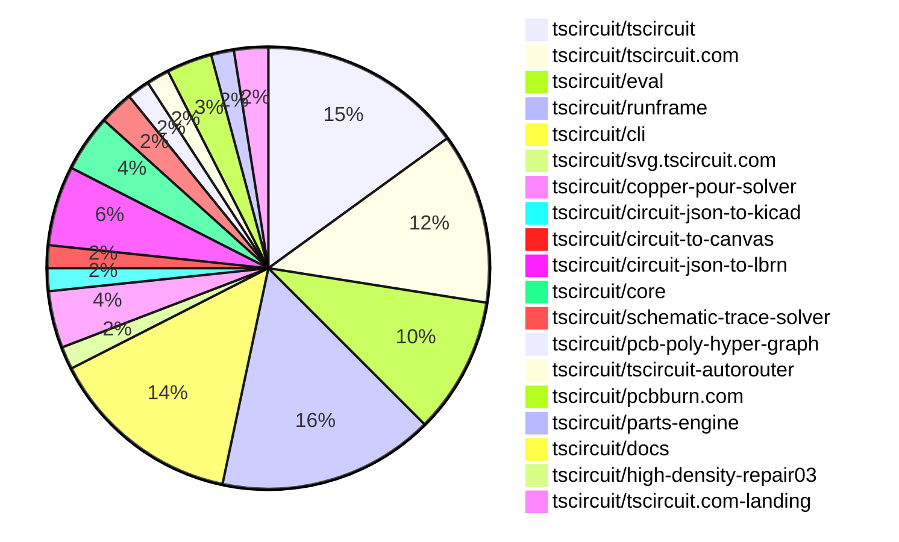

# Contribution Overview 2026-04-28

The current week is shown below. There are 3 major sections:

- [Contributor Overview](#contributor-overview)
- [PRs by Repository](#prs-by-repository)
- [PRs by Contributor](#changes-by-contributor)
- [Scoring & Sponsorship Details](/docs/sponsorship-calculation-explanation.md)

## PRs by Repository

## Contributor Overview

| Contributor | 🐳 Major | 🐙 Minor | 🐌 Tiny | Score | ⭐ | Discussion Contributions |
|-------------|---------|---------|---------|-------|-----|--------------------------|
| [imrishabh18](#imrishabh18) | 1 | 6 | 5 | 21 | ⭐⭐ | 0🔹 0🔶 0💎 |
| [tscircuitbot](#tscircuitbot) | 0 | 0 | 83 | 14.5 | ⭐⭐ | 0🔹 0🔶 0💎 |
| [ShiboSoftwareDev](#ShiboSoftwareDev) | 2 | 1 | 2 | 14 | ⭐⭐ | 0🔹 0🔶 0💎 |
| [Sang-it](#Sang-it) | 3 | 0 | 2 | 13.5 | ⭐⭐ | 0🔹 0🔶 0💎 |
| [Abse2001](#Abse2001) | 2 | 0 | 1 | 11 | ⭐⭐ | 0🔹 0🔶 0💎 |
| [MustafaMulla29](#MustafaMulla29) | 0 | 3 | 3 | 10 | ⭐ | 0🔹 0🔶 0💎 |
| [AnasSarkiz](#AnasSarkiz) | 1 | 2 | 0 | 9 | ⭐ | 0🔹 0🔶 0💎 |
| [rushabhcodes](#rushabhcodes) | 1 | 1 | 1 | 7 | ⭐ | 0🔹 0🔶 0💎 |
| [seveibar](#seveibar) | 1 | 0 | 0 | 5 | ⭐ | 0🔹 0🔶 0💎 |
| [mohan-bee](#mohan-bee) | 0 | 0 | 1 | 1 |  | 0🔹 0🔶 0💎 |

## Staff Pass Ratio (SPR)

| Contributor | Reviewed PRs | Rejections | Approvals | SPR |
|-------------|--------------|------------|-----------|-----|
| [ShiboSoftwareDev](#ShiboSoftwareDev) | 3 | 0 | 3 | 100.0% |
| [Sang-it](#Sang-it) | 3 | 0 | 3 | 100.0% |
| [imrishabh18](#imrishabh18) | 3 | 0 | 3 | 100.0% |
| [MustafaMulla29](#MustafaMulla29) | 2 | 2 | 3 | 0.0% |
| [AnasSarkiz](#AnasSarkiz) | 1 | 0 | 1 | 100.0% |

ShiboSoftwareDev SPR PRs (3)

- [#2197](https://github.com/tscircuit/core/pull/2197) Add schematic box rendering for groups
- [#4](https://github.com/tscircuit/pcb-poly-hyper-graph/pull/4) Connect overlapping same-net obstacle regions
- [#3](https://github.com/tscircuit/pcb-poly-hyper-graph/pull/3) Use rectdiff-style port spacing for poly hypergraphs

Sang-it SPR PRs (3)

- [#2201](https://github.com/tscircuit/core/pull/2201) fix 45 degree rect fix
- [#244](https://github.com/tscircuit/schematic-trace-solver/pull/244) fix repro-28 -> net label trace collision
- [#247](https://github.com/tscircuit/schematic-trace-solver/pull/247) enforce availableNetOrientation

imrishabh18 SPR PRs (3)

- [#2202](https://github.com/tscircuit/core/pull/2202) Add `supplier_footprint_mismatch_warning` when footprint string does not match with the jlcpcb footprint
- [#159](https://github.com/tscircuit/circuit-json-to-lbrn/pull/159) Add the Hole Punch Top and Hole Punch Bottom layers
- [#157](https://github.com/tscircuit/circuit-json-to-lbrn/pull/157) Add a Reflected Bottom Board Cut Layer

MustafaMulla29 SPR PRs (2)

- [#2523](https://github.com/tscircuit/eval/pull/2523) Add EasyEDA proxy config plumbing to web worker and browser USB-C connector proxy integration test
- [#256](https://github.com/tscircuit/circuit-json-to-kicad/pull/256) Implement kicadSchematicScaleFactor to scale all schematic symbols and wiring in KiCad export

AnasSarkiz SPR PRs (1)

- [#42](https://github.com/tscircuit/copper-pour-solver/pull/42) Eliminate Copper Pour Boolean Failures with Robust Manifold Geometry Engine

> Note: AI evaluates PRs and assigns 1-3 star ratings automatically. 4 and 5 star ratings require manual staff review.

### Discussion Contribution Legend

- 🔹 Normal Comments: Basic participation with minimal effort
- 🔶 Great Informative Comments: Thoughtful participation that adds value
- 💎 Incredible Comments: Exceptional participation with high-quality content

## Review Table

[reviews-received-hover]: ## "Number of reviews received for PRs for this contributor"
[approvals-received-hover]: ## "Number of approvals received for PRs this contributor authored"
[rejections-received-hover]: ## "Number of rejections received for PRs this contributor authored"
[prs-opened-hover]: ## "Number of PRs opened by this contributor"
[issues-created-hover]: ## "Number of issues created by this contributor"

| Contributor | Reviews Received | Approvals Received | Rejections Received | Approvals | Rejections Given | PRs Opened | PRs Merged | Issues Created |
|---|---|---|---|---|---|---|---|---|
| [64johnlee](#64johnlee) | 0 | 0 | 0 | 0 | 0 | 2 | 0 | 0 |
| [tscircuitbot](#tscircuitbot) | 0 | 0 | 0 | 0 | 0 | 106 | 83 | 0 |
| [billwestrup](#billwestrup) | 0 | 0 | 0 | 0 | 0 | 1 | 0 | 0 |
| [rushabhcodes](#rushabhcodes) | 5 | 0 | 0 | 0 | 0 | 5 | 3 | 0 |
| [AnasSarkiz](#AnasSarkiz) | 4 | 4 | 0 | 1 | 0 | 4 | 3 | 0 |
| [ShiboSoftwareDev](#ShiboSoftwareDev) | 8 | 6 | 0 | 3 | 0 | 9 | 5 | 0 |
| [Sang-it](#Sang-it) | 4 | 4 | 0 | 0 | 0 | 8 | 5 | 0 |
| [seveibar](#seveibar) | 0 | 0 | 0 | 15 | 0 | 2 | 1 | 0 |
| [imrishabh18](#imrishabh18) | 3 | 3 | 0 | 0 | 0 | 13 | 12 | 0 |
| [mohan-bee](#mohan-bee) | 3 | 2 | 0 | 0 | 0 | 2 | 1 | 0 |
| [MustafaMulla29](#MustafaMulla29) | 4 | 3 | 0 | 2 | 0 | 6 | 6 | 0 |
| [orbitwebsites-cloud](#orbitwebsites-cloud) | 2 | 0 | 0 | 0 | 0 | 1 | 0 | 0 |
| [Abse2001](#Abse2001) | 1 | 1 | 0 | 2 | 0 | 3 | 3 | 0 |
| [0hmX](#0hmX) | 2 | 0 | 0 | 0 | 0 | 3 | 0 | 0 |
| [0hmxbot](#0hmxbot) | 0 | 0 | 0 | 0 | 0 | 1 | 0 | 0 |

## Changes by Repository

### [tscircuit/tscircuit](https://github.com/tscircuit/tscircuit)

🐌 Tiny Contributions (18)

| PR # | Impact | Contributor | Description |
|------|--------|-------------|-------------|
| [#3064](https://github.com/tscircuit/tscircuit/pull/3064) | 🐌 Tiny | tscircuitbot | Automated package update |
| [#3063](https://github.com/tscircuit/tscircuit/pull/3063) | 🐌 Tiny | tscircuitbot | Automated package update |
| [#3062](https://github.com/tscircuit/tscircuit/pull/3062) | 🐌 Tiny | tscircuitbot | Automated package update |
| [#3061](https://github.com/tscircuit/tscircuit/pull/3061) | 🐌 Tiny | tscircuitbot | Updates the tscircuitcli package from version 0.1.1307 to 0.1.1308 and the tscircuitrunframe package from version 0.0.1892 to 0.0.1893 in package.json |
| [#3060](https://github.com/tscircuit/tscircuit/pull/3060) | 🐌 Tiny | tscircuitbot | Automated package update |
| [#3059](https://github.com/tscircuit/tscircuit/pull/3059) | 🐌 Tiny | tscircuitbot | Automated package update |
| [#3058](https://github.com/tscircuit/tscircuit/pull/3058) | 🐌 Tiny | tscircuitbot | Automated package update |
| [#3057](https://github.com/tscircuit/tscircuit/pull/3057) | 🐌 Tiny | tscircuitbot | Automated package update |
| [#3056](https://github.com/tscircuit/tscircuit/pull/3056) | 🐌 Tiny | tscircuitbot | Updates the package version from 0.0.1690 to 0.0.1691 in package.json |
| [#3055](https://github.com/tscircuit/tscircuit/pull/3055) | 🐌 Tiny | tscircuitbot | Automated package update |
| [#3054](https://github.com/tscircuit/tscircuit/pull/3054) | 🐌 Tiny | tscircuitbot | Automated package update to version 0.0.1690 |
| [#3053](https://github.com/tscircuit/tscircuit/pull/3053) | 🐌 Tiny | tscircuitbot | Updates the tscircuitcli package from version 0.1.1303 to 0.1.1304 and the tscircuitrunframe package from version 0.0.1888 to 0.0.1889 in package.json |
| [#3052](https://github.com/tscircuit/tscircuit/pull/3052) | 🐌 Tiny | tscircuitbot | Automated package update |
| [#3051](https://github.com/tscircuit/tscircuit/pull/3051) | 🐌 Tiny | tscircuitbot | Automated package update |
| [#3050](https://github.com/tscircuit/tscircuit/pull/3050) | 🐌 Tiny | tscircuitbot | Automated package update |
| [#3049](https://github.com/tscircuit/tscircuit/pull/3049) | 🐌 Tiny | tscircuitbot | Automated package update |
| [#3048](https://github.com/tscircuit/tscircuit/pull/3048) | 🐌 Tiny | tscircuitbot | Automated package update |
| [#3047](https://github.com/tscircuit/tscircuit/pull/3047) | 🐌 Tiny | tscircuitbot | Automated package update |

### [tscircuit/tscircuit.com](https://github.com/tscircuit/tscircuit.com)

🐌 Tiny Contributions (15)

| PR # | Impact | Contributor | Description |
|------|--------|-------------|-------------|
| [#3293](https://github.com/tscircuit/tscircuit.com/pull/3293) | 🐌 Tiny | tscircuitbot | Automated package update for tscircuitrunframe from version 0.0.1893 to 0.0.1894 |
| [#3292](https://github.com/tscircuit/tscircuit.com/pull/3292) | 🐌 Tiny | tscircuitbot | Automated package update for tscircuiteval from version 0.0.799 to 0.0.800 |
| [#3291](https://github.com/tscircuit/tscircuit.com/pull/3291) | 🐌 Tiny | tscircuitbot | Updates the tscircuitrunframe package from version 0.0.1892 to 0.0.1893 |
| [#3290](https://github.com/tscircuit/tscircuit.com/pull/3290) | 🐌 Tiny | tscircuitbot | Updates the tscircuitrunframe package from version 0.0.1891 to 0.0.1892 |
| [#3289](https://github.com/tscircuit/tscircuit.com/pull/3289) | 🐌 Tiny | tscircuitbot | Automated package update |
| [#3287](https://github.com/tscircuit/tscircuit.com/pull/3287) | 🐌 Tiny | tscircuitbot | Updates the tscircuitrunframe package to version 0.0.1891 |
| [#3286](https://github.com/tscircuit/tscircuit.com/pull/3286) | 🐌 Tiny | tscircuitbot | Automated package update |
| [#3285](https://github.com/tscircuit/tscircuit.com/pull/3285) | 🐌 Tiny | tscircuitbot | Updates the tscircuitrunframe package to version 0.0.1890 in the package.json file. |
| [#3284](https://github.com/tscircuit/tscircuit.com/pull/3284) | 🐌 Tiny | tscircuitbot | Automated package update |
| [#3283](https://github.com/tscircuit/tscircuit.com/pull/3283) | 🐌 Tiny | tscircuitbot | Updates the tscircuitrunframe package from version 0.0.1887 to 0.0.1888 |
| [#3282](https://github.com/tscircuit/tscircuit.com/pull/3282) | 🐌 Tiny | tscircuitbot | Updates the tscircuitrunframe package from version 0.0.1885 to 0.0.1887 |
| [#3281](https://github.com/tscircuit/tscircuit.com/pull/3281) | 🐌 Tiny | tscircuitbot | Updates the tscircuiteval package from version 0.0.796 to 0.0.797 |
| [#3280](https://github.com/tscircuit/tscircuit.com/pull/3280) | 🐌 Tiny | tscircuitbot | Updates the tscircuiteval package from version 0.0.794 to 0.0.796 |
| [#3279](https://github.com/tscircuit/tscircuit.com/pull/3279) | 🐌 Tiny | tscircuitbot | Updates the tscircuitrunframe package from version 0.0.1884 to 0.0.1885 |
| [#3288](https://github.com/tscircuit/tscircuit.com/pull/3288) | 🐌 Tiny | mohan-bee | Updates the circuit-json-to-kicad dependency from version 0.0.34 to 0.0.124 to enable courtyard export functionality that was previously not working in tscircuit.com. |

### [tscircuit/eval](https://github.com/tscircuit/eval)

| PR # | Impact | Rating | Contributor | Description |
|------|--------|--------|-------------|-------------|
| [#2523](https://github.com/tscircuit/eval/pull/2523) | 🐙 Minor | ⭐⭐ | MustafaMulla29 | Adds proxy configuration for EasyEDA API requests in the web worker and implements a browser test for USB-C connector rendering without CORS errors. |

🐌 Tiny Contributions (11)

| PR # | Impact | Contributor | Description |
|------|--------|-------------|-------------|
| [#2537](https://github.com/tscircuit/eval/pull/2537) | 🐌 Tiny | tscircuitbot | Automated package update to version 0.0.800 |
| [#2535](https://github.com/tscircuit/eval/pull/2535) | 🐌 Tiny | tscircuitbot | Automated package update |
| [#2534](https://github.com/tscircuit/eval/pull/2534) | 🐌 Tiny | tscircuitbot | Updates package dependencies to their latest versions. |
| [#2532](https://github.com/tscircuit/eval/pull/2532) | 🐌 Tiny | tscircuitbot | Automated package update |
| [#2531](https://github.com/tscircuit/eval/pull/2531) | 🐌 Tiny | tscircuitbot | Automated package update |
| [#2530](https://github.com/tscircuit/eval/pull/2530) | 🐌 Tiny | tscircuitbot | Automated package update |
| [#2529](https://github.com/tscircuit/eval/pull/2529) | 🐌 Tiny | tscircuitbot | Automated package update to version 0.0.796 |
| [#2528](https://github.com/tscircuit/eval/pull/2528) | 🐌 Tiny | tscircuitbot | Automated package update |
| [#2526](https://github.com/tscircuit/eval/pull/2526) | 🐌 Tiny | tscircuitbot | Automated package update |
| [#2525](https://github.com/tscircuit/eval/pull/2525) | 🐌 Tiny | tscircuitbot | Updates the versions of several dependencies in the package.json file. |
| [#2536](https://github.com/tscircuit/eval/pull/2536) | 🐌 Tiny | MustafaMulla29 | Updates the version of the tscircuitparts-engine dependency from 0.0.20 to 0.0.21 in package.json |

### [tscircuit/runframe](https://github.com/tscircuit/runframe)

| PR # | Impact | Rating | Contributor | Description |
|------|--------|--------|-------------|-------------|
| [#3260](https://github.com/tscircuit/runframe/pull/3260) | 🐙 Minor | ⭐⭐ | imrishabh18 | Sets the default value of includeOxidationCleaningLayer to true for lbrn export options, ensuring that the oxidation cleaning layer is included by default in the exported files. |

🐌 Tiny Contributions (18)

| PR # | Impact | Contributor | Description |
|------|--------|-------------|-------------|
| [#3274](https://github.com/tscircuit/runframe/pull/3274) | 🐌 Tiny | tscircuitbot | Automated package update |
| [#3273](https://github.com/tscircuit/runframe/pull/3273) | 🐌 Tiny | tscircuitbot | Updates the tscircuiteval package from version 0.0.799 to 0.0.800 in the package.json file. |
| [#3272](https://github.com/tscircuit/runframe/pull/3272) | 🐌 Tiny | tscircuitbot | Automated package update |
| [#3271](https://github.com/tscircuit/runframe/pull/3271) | 🐌 Tiny | tscircuitbot | Automated package update |
| [#3270](https://github.com/tscircuit/runframe/pull/3270) | 🐌 Tiny | tscircuitbot | Updates the tscircuiteval package from version 0.0.798 to 0.0.799 in the package.json file. |
| [#3268](https://github.com/tscircuit/runframe/pull/3268) | 🐌 Tiny | tscircuitbot | Automated package update |
| [#3267](https://github.com/tscircuit/runframe/pull/3267) | 🐌 Tiny | tscircuitbot | Automated package update |
| [#3266](https://github.com/tscircuit/runframe/pull/3266) | 🐌 Tiny | tscircuitbot | Automated package update |
| [#3265](https://github.com/tscircuit/runframe/pull/3265) | 🐌 Tiny | tscircuitbot | Updates the circuit-json-to-kicad package from version 0.0.120 to 0.0.124 in package.json |
| [#3263](https://github.com/tscircuit/runframe/pull/3263) | 🐌 Tiny | tscircuitbot | Automated package update |
| [#3261](https://github.com/tscircuit/runframe/pull/3261) | 🐌 Tiny | tscircuitbot | Automated package update |
| [#3259](https://github.com/tscircuit/runframe/pull/3259) | 🐌 Tiny | tscircuitbot | Automated package update |
| [#3258](https://github.com/tscircuit/runframe/pull/3258) | 🐌 Tiny | tscircuitbot | Updates the tscircuiteval package to version 0.0.797 in the package.json file. |
| [#3256](https://github.com/tscircuit/runframe/pull/3256) | 🐌 Tiny | tscircuitbot | Updates the tscircuiteval package to version 0.0.796 in the package.json file. |
| [#3255](https://github.com/tscircuit/runframe/pull/3255) | 🐌 Tiny | tscircuitbot | Automated package update |
| [#3254](https://github.com/tscircuit/runframe/pull/3254) | 🐌 Tiny | tscircuitbot | Updates the tscircuiteval package from version 0.0.794 to 0.0.795 in the package.json file. |
| [#3262](https://github.com/tscircuit/runframe/pull/3262) | 🐌 Tiny | imrishabh18 | Update circuit-json-to-lbrn from 0.0.71 to 0.0.74 in package.json to include bug fixes and dependency updates. |
| [#3269](https://github.com/tscircuit/runframe/pull/3269) | 🐌 Tiny | MustafaMulla29 | Adds EasyEDA proxy configuration to RunFrame to support USB-C connector integration. |

### [tscircuit/cli](https://github.com/tscircuit/cli)

🐌 Tiny Contributions (17)

| PR # | Impact | Contributor | Description |
|------|--------|-------------|-------------|
| [#2867](https://github.com/tscircuit/cli/pull/2867) | 🐌 Tiny | tscircuitbot | Automated package update |
| [#2866](https://github.com/tscircuit/cli/pull/2866) | 🐌 Tiny | tscircuitbot | Updates the tscircuitrunframe package to version 0.0.1894 in the package.json file. |
| [#2865](https://github.com/tscircuit/cli/pull/2865) | 🐌 Tiny | tscircuitbot | Automated package update |
| [#2864](https://github.com/tscircuit/cli/pull/2864) | 🐌 Tiny | tscircuitbot | Updates the tscircuitrunframe package from version 0.0.1892 to 0.0.1893 |
| [#2863](https://github.com/tscircuit/cli/pull/2863) | 🐌 Tiny | tscircuitbot | Automated package update |
| [#2862](https://github.com/tscircuit/cli/pull/2862) | 🐌 Tiny | tscircuitbot | Updates the tscircuitrunframe package to version 0.0.1892 in the package.json file. |
| [#2861](https://github.com/tscircuit/cli/pull/2861) | 🐌 Tiny | tscircuitbot | Automated package update |
| [#2860](https://github.com/tscircuit/cli/pull/2860) | 🐌 Tiny | tscircuitbot | Updates the tscircuitrunframe package from version 0.0.1890 to 0.0.1891 |
| [#2859](https://github.com/tscircuit/cli/pull/2859) | 🐌 Tiny | tscircuitbot | Automated package update |
| [#2858](https://github.com/tscircuit/cli/pull/2858) | 🐌 Tiny | tscircuitbot | Updates the tscircuitrunframe package to version 0.0.1890 |
| [#2857](https://github.com/tscircuit/cli/pull/2857) | 🐌 Tiny | tscircuitbot | Automated package update |
| [#2856](https://github.com/tscircuit/cli/pull/2856) | 🐌 Tiny | tscircuitbot | Automated package update |
| [#2855](https://github.com/tscircuit/cli/pull/2855) | 🐌 Tiny | tscircuitbot | Automated package update |
| [#2854](https://github.com/tscircuit/cli/pull/2854) | 🐌 Tiny | tscircuitbot | Updates the tscircuitrunframe package to version 0.0.1888 in the package.json file. |
| [#2853](https://github.com/tscircuit/cli/pull/2853) | 🐌 Tiny | tscircuitbot | Automated package update |
| [#2852](https://github.com/tscircuit/cli/pull/2852) | 🐌 Tiny | tscircuitbot | Updates the tscircuitrunframe package from version 0.0.1885 to 0.0.1887 |
| [#2849](https://github.com/tscircuit/cli/pull/2849) | 🐌 Tiny | tscircuitbot | Updates the tscircuitrunframe package to version 0.0.1885 |

### [tscircuit/svg.tscircuit.com](https://github.com/tscircuit/svg.tscircuit.com)

🐌 Tiny Contributions (2)

| PR # | Impact | Contributor | Description |
|------|--------|-------------|-------------|
| [#1390](https://github.com/tscircuit/svg.tscircuit.com/pull/1390) | 🐌 Tiny | tscircuitbot | Updates the tscircuit package version from 0.0.1693 to 0.0.1695 in package.json |
| [#1389](https://github.com/tscircuit/svg.tscircuit.com/pull/1389) | 🐌 Tiny | ShiboSoftwareDev | Updates the dependencies in package.json to newer versions for tscircuit and circuit-to-svg. |

### [tscircuit/copper-pour-solver](https://github.com/tscircuit/copper-pour-solver)

| PR # | Impact | Rating | Contributor | Description |
|------|--------|--------|-------------|-------------|
| [#42](https://github.com/tscircuit/copper-pour-solver/pull/42) | 🐳 Major | ⭐⭐⭐ | AnasSarkiz | Replaces the legacy flatten-js copper pour boolean pipeline with a new manifold-3d geometry engine, improving robustness on complex boards and dense obstacle layouts. |
| [#44](https://github.com/tscircuit/copper-pour-solver/pull/44) | 🐙 Minor | ⭐⭐ | AnasSarkiz | Fixes empty copper-pour blocker inputs to preserve the full pour geometry instead of hitting an empty manifold polygon path. |

🐌 Tiny Contributions (3)

| PR # | Impact | Contributor | Description |
|------|--------|-------------|-------------|
| [#45](https://github.com/tscircuit/copper-pour-solver/pull/45) | 🐌 Tiny | tscircuitbot | Automated package update |
| [#41](https://github.com/tscircuit/copper-pour-solver/pull/41) | 🐌 Tiny | tscircuitbot | Automated package update |
| [#40](https://github.com/tscircuit/copper-pour-solver/pull/40) | 🐌 Tiny | tscircuitbot | Updates the package version from 0.0.24 to 0.0.25 in package.json |

### [tscircuit/circuit-json-to-kicad](https://github.com/tscircuit/circuit-json-to-kicad)

| PR # | Impact | Rating | Contributor | Description |
|------|--------|--------|-------------|-------------|
| [#256](https://github.com/tscircuit/circuit-json-to-kicad/pull/256) | 🐙 Minor | ⭐⭐ | MustafaMulla29 | Adds a kicadSchematicScaleFactor to scale all schematic symbols and wiring in KiCad export, ensuring proper representation of components in the exported schematic. |

🐌 Tiny Contributions (1)

| PR # | Impact | Contributor | Description |
|------|--------|-------------|-------------|
| [#261](https://github.com/tscircuit/circuit-json-to-kicad/pull/261) | 🐌 Tiny | tscircuitbot | Automated package update |

### [tscircuit/circuit-to-canvas](https://github.com/tscircuit/circuit-to-canvas)

| PR # | Impact | Rating | Contributor | Description |
|------|--------|--------|-------------|-------------|
| [#234](https://github.com/tscircuit/circuit-to-canvas/pull/234) | 🐳 Major | ⭐⭐⭐ | Abse2001 | Adds support for rendering drill cutouts in SMT pads by utilizing holes, vias, and plated holes, enhancing the visual representation of pads in the canvas rendering. |

🐌 Tiny Contributions (1)

| PR # | Impact | Contributor | Description |
|------|--------|-------------|-------------|
| [#235](https://github.com/tscircuit/circuit-to-canvas/pull/235) | 🐌 Tiny | tscircuitbot | Automated package update |

### [tscircuit/circuit-json-to-lbrn](https://github.com/tscircuit/circuit-json-to-lbrn)

| PR # | Impact | Rating | Contributor | Description |
|------|--------|--------|-------------|-------------|
| [#159](https://github.com/tscircuit/circuit-json-to-lbrn/pull/159) | 🐳 Major | ⭐⭐⭐ | imrishabh18 | This pull request introduces two new layers, Hole Punch Top and Hole Punch Bottom, to mark hole centers for drilling in the PCB design. It adds options to include these layers in the conversion process, enhancing the functionality of the circuit design tool. |
| [#163](https://github.com/tscircuit/circuit-json-to-lbrn/pull/163) | 🐙 Minor | ⭐⭐ | imrishabh18 | Changes oxidation cleaning layers from scan-based fill output to outline-only cut paths, keeping the board contour as the generated geometry and removing scan-only cut settings. |
| [#161](https://github.com/tscircuit/circuit-json-to-lbrn/pull/161) | 🐙 Minor | ⭐⭐ | imrishabh18 | Fixes the copper cut fill layer by normalizing contours to ensure correct area calculations and clipping against the board outline. |
| [#157](https://github.com/tscircuit/circuit-json-to-lbrn/pull/157) | 🐙 Minor | ⭐⭐ | imrishabh18 | Adds a reflected bottom board cut layer to the project, enabling the mirroring of the bottom layer in the output. |
| [#155](https://github.com/tscircuit/circuit-json-to-lbrn/pull/155) | 🐙 Minor | ⭐⭐ | imrishabh18 | Adds board outlines for the oxidation cleaning layer, enabling laser cleaning of oxidation from the copper surface of the board. |

🐌 Tiny Contributions (2)

| PR # | Impact | Contributor | Description |
|------|--------|-------------|-------------|
| [#162](https://github.com/tscircuit/circuit-json-to-lbrn/pull/162) | 🐌 Tiny | tscircuitbot | Automated package update |
| [#156](https://github.com/tscircuit/circuit-json-to-lbrn/pull/156) | 🐌 Tiny | tscircuitbot | Automated package update |

### [tscircuit/core](https://github.com/tscircuit/core)

| PR # | Impact | Rating | Contributor | Description |
|------|--------|--------|-------------|-------------|
| [#2201](https://github.com/tscircuit/core/pull/2201) | 🐳 Major | ⭐⭐⭐ | Sang-it | Fixes the issue where multiple obstacles were incorrectly generated for 45-degree rotated rectangles in the autorouting system. |
| [#2204](https://github.com/tscircuit/core/pull/2204) | 🐙 Minor | ⭐⭐ | AnasSarkiz | Updates the copper-pour-solver to v0.0.29 and initializes manifold geometry before creating the copper pour solver, refreshing the copper pour snapshot output. |
| [#2197](https://github.com/tscircuit/core/pull/2197) | 🐙 Minor | ⭐⭐ | ShiboSoftwareDev | Implements showAsSchematicBox by rendering collapsed groups as regular box-style schematic_components, with direct group ports exposed as schematic pins and internal schematic elements suppressed. |
| [#2202](https://github.com/tscircuit/core/pull/2202) | 🐙 Minor | ⭐⭐ | imrishabh18 | Adds a warning when the footprint string does not match the supplier footprint, enhancing error handling for component placement. |

🐌 Tiny Contributions (1)

| PR # | Impact | Contributor | Description |
|------|--------|-------------|-------------|
| [#2203](https://github.com/tscircuit/core/pull/2203) | 🐌 Tiny | Sang-it | Renames variables for clarity in the getObstaclesFromCircuitJson function. |

### [tscircuit/schematic-trace-solver](https://github.com/tscircuit/schematic-trace-solver)

| PR # | Impact | Rating | Contributor | Description |
|------|--------|--------|-------------|-------------|
| [#244](https://github.com/tscircuit/schematic-trace-solver/pull/244) | 🐳 Major | ⭐⭐⭐ | Sang-it | Fixes net label trace collision in the Example28 solver by implementing a rerouting algorithm to avoid overlaps between traces and net labels. |
| [#247](https://github.com/tscircuit/schematic-trace-solver/pull/247) | 🐳 Major | ⭐⭐⭐ | Sang-it | Adds a new solver for determining available net orientations in schematic trace solving, enhancing the placement of net labels based on available orientations and avoiding collisions. |

🐌 Tiny Contributions (1)

| PR # | Impact | Contributor | Description |
|------|--------|-------------|-------------|
| [#245](https://github.com/tscircuit/schematic-trace-solver/pull/245) | 🐌 Tiny | Sang-it | Adds a new example and test to ensure VCC net labels are positioned at the corner whenever feasible. |

### [tscircuit/pcb-poly-hyper-graph](https://github.com/tscircuit/pcb-poly-hyper-graph)

| PR # | Impact | Rating | Contributor | Description |
|------|--------|--------|-------------|-------------|
| [#4](https://github.com/tscircuit/pcb-poly-hyper-graph/pull/4) | 🐳 Major | ⭐⭐⭐ | ShiboSoftwareDev | Adds obstacle-contact ports when same-net obstacle polygons overlap or touch on a shared layer, allowing both serialized obstacle regions to reference the shared contact point, with test coverage for overlapping pad regions. |
| [#3](https://github.com/tscircuit/pcb-poly-hyper-graph/pull/3) | 🐳 Major | ⭐⭐⭐ | ShiboSoftwareDev | Updates poly hypergraph port generation to match rectdiff conventions: spacing now derives from trace width plus obstacle margin, endpoint margins use 34 spacing, and long shared edges decimate dense port candidates after 5 ports. Short midpoint-only ports are marked as cramped, and tests cover the new defaults, decimation behavior, and cramped metadata. |

### [tscircuit/tscircuit-autorouter](https://github.com/tscircuit/tscircuit-autorouter)

🐌 Tiny Contributions (2)

| PR # | Impact | Contributor | Description |
|------|--------|-------------|-------------|
| [#1057](https://github.com/tscircuit/tscircuit-autorouter/pull/1057) | 🐌 Tiny | ShiboSoftwareDev | Fixes port spacing in the pcb-poly-hyper-graph dependency to ensure proper layout in PCB designs. |
| [#1054](https://github.com/tscircuit/tscircuit-autorouter/pull/1054) | 🐌 Tiny | Abse2001 | Updates the high-density-repair03 dependency to a newer commit to improve DRC (Design Rule Check) scores. |

### [tscircuit/pcbburn.com](https://github.com/tscircuit/pcbburn.com)

🐌 Tiny Contributions (4)

| PR # | Impact | Contributor | Description |
|------|--------|-------------|-------------|
| [#90](https://github.com/tscircuit/pcbburn.com/pull/90) | 🐌 Tiny | imrishabh18 | Bumps circuit-json-to-lbrn to version 0.0.76 and sets includeOxidationCleaningLayer to true by default in workspace state, while preserving explicit settings during LBRN updates. |
| [#89](https://github.com/tscircuit/pcbburn.com/pull/89) | 🐌 Tiny | imrishabh18 | Update circuit-json-to-lbrn from 0.0.74 to 0.0.75 and refresh bun.lock to match the new package version and integrity hash |
| [#87](https://github.com/tscircuit/pcbburn.com/pull/87) | 🐌 Tiny | imrishabh18 | Changes the default setting of the oxidation cleaning layer to false in the WorkspaceProvider to prevent unintentional enabling during workspace creation and option merges. |
| [#86](https://github.com/tscircuit/pcbburn.com/pull/86) | 🐌 Tiny | imrishabh18 | Updates the Bun workspace lockfile to change the circuit-json-to-lbrn dependency version from 0.0.71 to 0.0.74 and adjusts the lbrnts version accordingly, ensuring consistency in the dependency graph without altering any source code. |

### [tscircuit/parts-engine](https://github.com/tscircuit/parts-engine)

| PR # | Impact | Rating | Contributor | Description |
|------|--------|--------|-------------|-------------|
| [#29](https://github.com/tscircuit/parts-engine/pull/29) | 🐙 Minor | ⭐⭐ | MustafaMulla29 | Binds the fetchPartCircuitJson method in the JlcPcbPartsEngine constructor to ensure proper context for EasyEDA proxy connector fetches. |

🐌 Tiny Contributions (1)

| PR # | Impact | Contributor | Description |
|------|--------|-------------|-------------|
| [#30](https://github.com/tscircuit/parts-engine/pull/30) | 🐌 Tiny | MustafaMulla29 | Updates the easyeda dependency version from 0.0.256 to 0.0.266 in package.json |

### [tscircuit/docs](https://github.com/tscircuit/docs)

| PR # | Impact | Rating | Contributor | Description |
|------|--------|--------|-------------|-------------|
| [#540](https://github.com/tscircuit/docs/pull/540) | 🐳 Major | ⭐⭐⭐ | seveibar | Add functionality to the CircuitPreview component allowing users to edit circuit code snippets directly in a textarea, with changes reflected in the preview and a loading state displayed during updates. |

### [tscircuit/high-density-repair03](https://github.com/tscircuit/high-density-repair03)

| PR # | Impact | Rating | Contributor | Description |
|------|--------|--------|-------------|-------------|
| [#3](https://github.com/tscircuit/high-density-repair03/pull/3) | 🐳 Major | ⭐⭐⭐ | Abse2001 | Refactors the GlobalDrcForceImproveSolver to implement targeted error iteration and adaptive fallback mechanisms for improved error handling in DRC processes. |

### [tscircuit/tscircuit.com-landing](https://github.com/tscircuit/tscircuit.com-landing)

| PR # | Impact | Rating | Contributor | Description |
|------|--------|--------|-------------|-------------|
| [#14](https://github.com/tscircuit/tscircuit.com-landing/pull/14) | 🐳 Major | ⭐⭐⭐ | rushabhcodes | This PR makes the landing page auth CTA reflect the users current client-side session state. |
| [#15](https://github.com/tscircuit/tscircuit.com-landing/pull/15) | 🐙 Minor | ⭐⭐ | rushabhcodes | Updates the landing page auth CTA so signed-in users see a Dashboard button that links to the dashboard instead of an in-page Sign out action, aligning button behavior with navigation-only auth flows. |

🐌 Tiny Contributions (1)

| PR # | Impact | Contributor | Description |
|------|--------|-------------|-------------|
| [#13](https://github.com/tscircuit/tscircuit.com-landing/pull/13) | 🐌 Tiny | rushabhcodes | Updates the image file for the LED water accelerometer in the project assets. |

## Changes by Contributor

### [tscircuitbot](https://github.com/tscircuitbot)

🐌 Tiny Contributions (83)

| PR # | Impact | Description |
|------|--------|-------------|
| [#3064](https://github.com/tscircuit/tscircuit/pull/3064) | 🐌 Tiny | Automated package update |
| [#3063](https://github.com/tscircuit/tscircuit/pull/3063) | 🐌 Tiny | Automated package update |
| [#3062](https://github.com/tscircuit/tscircuit/pull/3062) | 🐌 Tiny | Automated package update |
| [#3061](https://github.com/tscircuit/tscircuit/pull/3061) | 🐌 Tiny | Updates the tscircuitcli package from version 0.1.1307 to 0.1.1308 and the tscircuitrunframe package from version 0.0.1892 to 0.0.1893 in package.json |
| [#3060](https://github.com/tscircuit/tscircuit/pull/3060) | 🐌 Tiny | Automated package update |
| [#3059](https://github.com/tscircuit/tscircuit/pull/3059) | 🐌 Tiny | Automated package update |
| [#3058](https://github.com/tscircuit/tscircuit/pull/3058) | 🐌 Tiny | Automated package update |
| [#3057](https://github.com/tscircuit/tscircuit/pull/3057) | 🐌 Tiny | Automated package update |
| [#3056](https://github.com/tscircuit/tscircuit/pull/3056) | 🐌 Tiny | Updates the package version from 0.0.1690 to 0.0.1691 in package.json |
| [#3055](https://github.com/tscircuit/tscircuit/pull/3055) | 🐌 Tiny | Automated package update |
| [#3054](https://github.com/tscircuit/tscircuit/pull/3054) | 🐌 Tiny | Automated package update to version 0.0.1690 |
| [#3053](https://github.com/tscircuit/tscircuit/pull/3053) | 🐌 Tiny | Updates the tscircuitcli package from version 0.1.1303 to 0.1.1304 and the tscircuitrunframe package from version 0.0.1888 to 0.0.1889 in package.json |
| [#3052](https://github.com/tscircuit/tscircuit/pull/3052) | 🐌 Tiny | Automated package update |
| [#3051](https://github.com/tscircuit/tscircuit/pull/3051) | 🐌 Tiny | Automated package update |
| [#3050](https://github.com/tscircuit/tscircuit/pull/3050) | 🐌 Tiny | Automated package update |
| [#3049](https://github.com/tscircuit/tscircuit/pull/3049) | 🐌 Tiny | Automated package update |
| [#3048](https://github.com/tscircuit/tscircuit/pull/3048) | 🐌 Tiny | Automated package update |
| [#3047](https://github.com/tscircuit/tscircuit/pull/3047) | 🐌 Tiny | Automated package update |
| [#3293](https://github.com/tscircuit/tscircuit.com/pull/3293) | 🐌 Tiny | Automated package update for tscircuitrunframe from version 0.0.1893 to 0.0.1894 |
| [#3292](https://github.com/tscircuit/tscircuit.com/pull/3292) | 🐌 Tiny | Automated package update for tscircuiteval from version 0.0.799 to 0.0.800 |
| [#3291](https://github.com/tscircuit/tscircuit.com/pull/3291) | 🐌 Tiny | Updates the tscircuitrunframe package from version 0.0.1892 to 0.0.1893 |
| [#3290](https://github.com/tscircuit/tscircuit.com/pull/3290) | 🐌 Tiny | Updates the tscircuitrunframe package from version 0.0.1891 to 0.0.1892 |
| [#3289](https://github.com/tscircuit/tscircuit.com/pull/3289) | 🐌 Tiny | Automated package update |
| [#3287](https://github.com/tscircuit/tscircuit.com/pull/3287) | 🐌 Tiny | Updates the tscircuitrunframe package to version 0.0.1891 |
| [#3286](https://github.com/tscircuit/tscircuit.com/pull/3286) | 🐌 Tiny | Automated package update |
| [#3285](https://github.com/tscircuit/tscircuit.com/pull/3285) | 🐌 Tiny | Updates the tscircuitrunframe package to version 0.0.1890 in the package.json file. |
| [#3284](https://github.com/tscircuit/tscircuit.com/pull/3284) | 🐌 Tiny | Automated package update |
| [#3283](https://github.com/tscircuit/tscircuit.com/pull/3283) | 🐌 Tiny | Updates the tscircuitrunframe package from version 0.0.1887 to 0.0.1888 |
| [#3282](https://github.com/tscircuit/tscircuit.com/pull/3282) | 🐌 Tiny | Updates the tscircuitrunframe package from version 0.0.1885 to 0.0.1887 |
| [#3281](https://github.com/tscircuit/tscircuit.com/pull/3281) | 🐌 Tiny | Updates the tscircuiteval package from version 0.0.796 to 0.0.797 |
| [#3280](https://github.com/tscircuit/tscircuit.com/pull/3280) | 🐌 Tiny | Updates the tscircuiteval package from version 0.0.794 to 0.0.796 |
| [#3279](https://github.com/tscircuit/tscircuit.com/pull/3279) | 🐌 Tiny | Updates the tscircuitrunframe package from version 0.0.1884 to 0.0.1885 |
| [#2537](https://github.com/tscircuit/eval/pull/2537) | 🐌 Tiny | Automated package update to version 0.0.800 |
| [#2535](https://github.com/tscircuit/eval/pull/2535) | 🐌 Tiny | Automated package update |
| [#2534](https://github.com/tscircuit/eval/pull/2534) | 🐌 Tiny | Updates package dependencies to their latest versions. |
| [#2532](https://github.com/tscircuit/eval/pull/2532) | 🐌 Tiny | Automated package update |
| [#2531](https://github.com/tscircuit/eval/pull/2531) | 🐌 Tiny | Automated package update |
| [#2530](https://github.com/tscircuit/eval/pull/2530) | 🐌 Tiny | Automated package update |
| [#2529](https://github.com/tscircuit/eval/pull/2529) | 🐌 Tiny | Automated package update to version 0.0.796 |
| [#2528](https://github.com/tscircuit/eval/pull/2528) | 🐌 Tiny | Automated package update |
| [#2526](https://github.com/tscircuit/eval/pull/2526) | 🐌 Tiny | Automated package update |
| [#2525](https://github.com/tscircuit/eval/pull/2525) | 🐌 Tiny | Updates the versions of several dependencies in the package.json file. |
| [#3274](https://github.com/tscircuit/runframe/pull/3274) | 🐌 Tiny | Automated package update |
| [#3273](https://github.com/tscircuit/runframe/pull/3273) | 🐌 Tiny | Updates the tscircuiteval package from version 0.0.799 to 0.0.800 in the package.json file. |
| [#3272](https://github.com/tscircuit/runframe/pull/3272) | 🐌 Tiny | Automated package update |
| [#3271](https://github.com/tscircuit/runframe/pull/3271) | 🐌 Tiny | Automated package update |
| [#3270](https://github.com/tscircuit/runframe/pull/3270) | 🐌 Tiny | Updates the tscircuiteval package from version 0.0.798 to 0.0.799 in the package.json file. |
| [#3268](https://github.com/tscircuit/runframe/pull/3268) | 🐌 Tiny | Automated package update |
| [#3267](https://github.com/tscircuit/runframe/pull/3267) | 🐌 Tiny | Automated package update |
| [#3266](https://github.com/tscircuit/runframe/pull/3266) | 🐌 Tiny | Automated package update |
| [#3265](https://github.com/tscircuit/runframe/pull/3265) | 🐌 Tiny | Updates the circuit-json-to-kicad package from version 0.0.120 to 0.0.124 in package.json |
| [#3263](https://github.com/tscircuit/runframe/pull/3263) | 🐌 Tiny | Automated package update |
| [#3261](https://github.com/tscircuit/runframe/pull/3261) | 🐌 Tiny | Automated package update |
| [#3259](https://github.com/tscircuit/runframe/pull/3259) | 🐌 Tiny | Automated package update |
| [#3258](https://github.com/tscircuit/runframe/pull/3258) | 🐌 Tiny | Updates the tscircuiteval package to version 0.0.797 in the package.json file. |
| [#3256](https://github.com/tscircuit/runframe/pull/3256) | 🐌 Tiny | Updates the tscircuiteval package to version 0.0.796 in the package.json file. |
| [#3255](https://github.com/tscircuit/runframe/pull/3255) | 🐌 Tiny | Automated package update |
| [#3254](https://github.com/tscircuit/runframe/pull/3254) | 🐌 Tiny | Updates the tscircuiteval package from version 0.0.794 to 0.0.795 in the package.json file. |
| [#2867](https://github.com/tscircuit/cli/pull/2867) | 🐌 Tiny | Automated package update |
| [#2866](https://github.com/tscircuit/cli/pull/2866) | 🐌 Tiny | Updates the tscircuitrunframe package to version 0.0.1894 in the package.json file. |
| [#2865](https://github.com/tscircuit/cli/pull/2865) | 🐌 Tiny | Automated package update |
| [#2864](https://github.com/tscircuit/cli/pull/2864) | 🐌 Tiny | Updates the tscircuitrunframe package from version 0.0.1892 to 0.0.1893 |
| [#2863](https://github.com/tscircuit/cli/pull/2863) | 🐌 Tiny | Automated package update |
| [#2862](https://github.com/tscircuit/cli/pull/2862) | 🐌 Tiny | Updates the tscircuitrunframe package to version 0.0.1892 in the package.json file. |
| [#2861](https://github.com/tscircuit/cli/pull/2861) | 🐌 Tiny | Automated package update |
| [#2860](https://github.com/tscircuit/cli/pull/2860) | 🐌 Tiny | Updates the tscircuitrunframe package from version 0.0.1890 to 0.0.1891 |
| [#2859](https://github.com/tscircuit/cli/pull/2859) | 🐌 Tiny | Automated package update |
| [#2858](https://github.com/tscircuit/cli/pull/2858) | 🐌 Tiny | Updates the tscircuitrunframe package to version 0.0.1890 |
| [#2857](https://github.com/tscircuit/cli/pull/2857) | 🐌 Tiny | Automated package update |
| [#2856](https://github.com/tscircuit/cli/pull/2856) | 🐌 Tiny | Automated package update |
| [#2855](https://github.com/tscircuit/cli/pull/2855) | 🐌 Tiny | Automated package update |
| [#2854](https://github.com/tscircuit/cli/pull/2854) | 🐌 Tiny | Updates the tscircuitrunframe package to version 0.0.1888 in the package.json file. |
| [#2853](https://github.com/tscircuit/cli/pull/2853) | 🐌 Tiny | Automated package update |
| [#2852](https://github.com/tscircuit/cli/pull/2852) | 🐌 Tiny | Updates the tscircuitrunframe package from version 0.0.1885 to 0.0.1887 |
| [#2849](https://github.com/tscircuit/cli/pull/2849) | 🐌 Tiny | Updates the tscircuitrunframe package to version 0.0.1885 |
| [#1390](https://github.com/tscircuit/svg.tscircuit.com/pull/1390) | 🐌 Tiny | Updates the tscircuit package version from 0.0.1693 to 0.0.1695 in package.json |
| [#45](https://github.com/tscircuit/copper-pour-solver/pull/45) | 🐌 Tiny | Automated package update |
| [#41](https://github.com/tscircuit/copper-pour-solver/pull/41) | 🐌 Tiny | Automated package update |
| [#40](https://github.com/tscircuit/copper-pour-solver/pull/40) | 🐌 Tiny | Updates the package version from 0.0.24 to 0.0.25 in package.json |
| [#261](https://github.com/tscircuit/circuit-json-to-kicad/pull/261) | 🐌 Tiny | Automated package update |
| [#235](https://github.com/tscircuit/circuit-to-canvas/pull/235) | 🐌 Tiny | Automated package update |
| [#162](https://github.com/tscircuit/circuit-json-to-lbrn/pull/162) | 🐌 Tiny | Automated package update |
| [#156](https://github.com/tscircuit/circuit-json-to-lbrn/pull/156) | 🐌 Tiny | Automated package update |

### [AnasSarkiz](https://github.com/AnasSarkiz)

| PRs # | Impact | Rating | Description |
|------|--------|--------|-------------|
| [#42](https://github.com/tscircuit/copper-pour-solver/pull/42) | 🐳 Major | ⭐⭐⭐ | Replaces the legacy flatten-js copper pour boolean pipeline with a new manifold-3d geometry engine, improving robustness on complex boards and dense obstacle layouts. |
| [#2204](https://github.com/tscircuit/core/pull/2204) | 🐙 Minor | ⭐⭐ | Updates the copper-pour-solver to v0.0.29 and initializes manifold geometry before creating the copper pour solver, refreshing the copper pour snapshot output. |
| [#44](https://github.com/tscircuit/copper-pour-solver/pull/44) | 🐙 Minor | ⭐⭐ | Fixes empty copper-pour blocker inputs to preserve the full pour geometry instead of hitting an empty manifold polygon path. |

### [Sang-it](https://github.com/Sang-it)

| PRs # | Impact | Rating | Description |
|------|--------|--------|-------------|
| [#2201](https://github.com/tscircuit/core/pull/2201) | 🐳 Major | ⭐⭐⭐ | Fixes the issue where multiple obstacles were incorrectly generated for 45-degree rotated rectangles in the autorouting system. |
| [#244](https://github.com/tscircuit/schematic-trace-solver/pull/244) | 🐳 Major | ⭐⭐⭐ | Fixes net label trace collision in the Example28 solver by implementing a rerouting algorithm to avoid overlaps between traces and net labels. |
| [#247](https://github.com/tscircuit/schematic-trace-solver/pull/247) | 🐳 Major | ⭐⭐⭐ | Adds a new solver for determining available net orientations in schematic trace solving, enhancing the placement of net labels based on available orientations and avoiding collisions. |

🐌 Tiny Contributions (2)

| PR # | Impact | Description |
|------|--------|-------------|
| [#2203](https://github.com/tscircuit/core/pull/2203) | 🐌 Tiny | Renames variables for clarity in the getObstaclesFromCircuitJson function. |
| [#245](https://github.com/tscircuit/schematic-trace-solver/pull/245) | 🐌 Tiny | Adds a new example and test to ensure VCC net labels are positioned at the corner whenever feasible. |

### [ShiboSoftwareDev](https://github.com/ShiboSoftwareDev)

| PRs # | Impact | Rating | Description |
|------|--------|--------|-------------|
| [#4](https://github.com/tscircuit/pcb-poly-hyper-graph/pull/4) | 🐳 Major | ⭐⭐⭐ | Adds obstacle-contact ports when same-net obstacle polygons overlap or touch on a shared layer, allowing both serialized obstacle regions to reference the shared contact point, with test coverage for overlapping pad regions. |
| [#3](https://github.com/tscircuit/pcb-poly-hyper-graph/pull/3) | 🐳 Major | ⭐⭐⭐ | Updates poly hypergraph port generation to match rectdiff conventions: spacing now derives from trace width plus obstacle margin, endpoint margins use 34 spacing, and long shared edges decimate dense port candidates after 5 ports. Short midpoint-only ports are marked as cramped, and tests cover the new defaults, decimation behavior, and cramped metadata. |
| [#2197](https://github.com/tscircuit/core/pull/2197) | 🐙 Minor | ⭐⭐ | Implements showAsSchematicBox by rendering collapsed groups as regular box-style schematic_components, with direct group ports exposed as schematic pins and internal schematic elements suppressed. |

🐌 Tiny Contributions (2)

| PR # | Impact | Description |
|------|--------|-------------|
| [#1389](https://github.com/tscircuit/svg.tscircuit.com/pull/1389) | 🐌 Tiny | Updates the dependencies in package.json to newer versions for tscircuit and circuit-to-svg. |
| [#1057](https://github.com/tscircuit/tscircuit-autorouter/pull/1057) | 🐌 Tiny | Fixes port spacing in the pcb-poly-hyper-graph dependency to ensure proper layout in PCB designs. |

### [imrishabh18](https://github.com/imrishabh18)

| PRs # | Impact | Rating | Description |
|------|--------|--------|-------------|
| [#159](https://github.com/tscircuit/circuit-json-to-lbrn/pull/159) | 🐳 Major | ⭐⭐⭐ | This pull request introduces two new layers, Hole Punch Top and Hole Punch Bottom, to mark hole centers for drilling in the PCB design. It adds options to include these layers in the conversion process, enhancing the functionality of the circuit design tool. |
| [#2202](https://github.com/tscircuit/core/pull/2202) | 🐙 Minor | ⭐⭐ | Adds a warning when the footprint string does not match the supplier footprint, enhancing error handling for component placement. |
| [#3260](https://github.com/tscircuit/runframe/pull/3260) | 🐙 Minor | ⭐⭐ | Sets the default value of includeOxidationCleaningLayer to true for lbrn export options, ensuring that the oxidation cleaning layer is included by default in the exported files. |
| [#163](https://github.com/tscircuit/circuit-json-to-lbrn/pull/163) | 🐙 Minor | ⭐⭐ | Changes oxidation cleaning layers from scan-based fill output to outline-only cut paths, keeping the board contour as the generated geometry and removing scan-only cut settings. |
| [#161](https://github.com/tscircuit/circuit-json-to-lbrn/pull/161) | 🐙 Minor | ⭐⭐ | Fixes the copper cut fill layer by normalizing contours to ensure correct area calculations and clipping against the board outline. |
| [#157](https://github.com/tscircuit/circuit-json-to-lbrn/pull/157) | 🐙 Minor | ⭐⭐ | Adds a reflected bottom board cut layer to the project, enabling the mirroring of the bottom layer in the output. |
| [#155](https://github.com/tscircuit/circuit-json-to-lbrn/pull/155) | 🐙 Minor | ⭐⭐ | Adds board outlines for the oxidation cleaning layer, enabling laser cleaning of oxidation from the copper surface of the board. |

🐌 Tiny Contributions (5)

| PR # | Impact | Description |
|------|--------|-------------|
| [#3262](https://github.com/tscircuit/runframe/pull/3262) | 🐌 Tiny | Update circuit-json-to-lbrn from 0.0.71 to 0.0.74 in package.json to include bug fixes and dependency updates. |
| [#90](https://github.com/tscircuit/pcbburn.com/pull/90) | 🐌 Tiny | Bumps circuit-json-to-lbrn to version 0.0.76 and sets includeOxidationCleaningLayer to true by default in workspace state, while preserving explicit settings during LBRN updates. |
| [#89](https://github.com/tscircuit/pcbburn.com/pull/89) | 🐌 Tiny | Update circuit-json-to-lbrn from 0.0.74 to 0.0.75 and refresh bun.lock to match the new package version and integrity hash |
| [#87](https://github.com/tscircuit/pcbburn.com/pull/87) | 🐌 Tiny | Changes the default setting of the oxidation cleaning layer to false in the WorkspaceProvider to prevent unintentional enabling during workspace creation and option merges. |
| [#86](https://github.com/tscircuit/pcbburn.com/pull/86) | 🐌 Tiny | Updates the Bun workspace lockfile to change the circuit-json-to-lbrn dependency version from 0.0.71 to 0.0.74 and adjusts the lbrnts version accordingly, ensuring consistency in the dependency graph without altering any source code. |

### [mohan-bee](https://github.com/mohan-bee)

🐌 Tiny Contributions (1)

| PR # | Impact | Description |
|------|--------|-------------|
| [#3288](https://github.com/tscircuit/tscircuit.com/pull/3288) | 🐌 Tiny | Updates the circuit-json-to-kicad dependency from version 0.0.34 to 0.0.124 to enable courtyard export functionality that was previously not working in tscircuit.com. |

### [MustafaMulla29](https://github.com/MustafaMulla29)

| PRs # | Impact | Rating | Description |
|------|--------|--------|-------------|
| [#2523](https://github.com/tscircuit/eval/pull/2523) | 🐙 Minor | ⭐⭐ | Adds proxy configuration for EasyEDA API requests in the web worker and implements a browser test for USB-C connector rendering without CORS errors. |
| [#29](https://github.com/tscircuit/parts-engine/pull/29) | 🐙 Minor | ⭐⭐ | Binds the fetchPartCircuitJson method in the JlcPcbPartsEngine constructor to ensure proper context for EasyEDA proxy connector fetches. |
| [#256](https://github.com/tscircuit/circuit-json-to-kicad/pull/256) | 🐙 Minor | ⭐⭐ | Adds a kicadSchematicScaleFactor to scale all schematic symbols and wiring in KiCad export, ensuring proper representation of components in the exported schematic. |

🐌 Tiny Contributions (3)

| PR # | Impact | Description |
|------|--------|-------------|
| [#2536](https://github.com/tscircuit/eval/pull/2536) | 🐌 Tiny | Updates the version of the tscircuitparts-engine dependency from 0.0.20 to 0.0.21 in package.json |
| [#3269](https://github.com/tscircuit/runframe/pull/3269) | 🐌 Tiny | Adds EasyEDA proxy configuration to RunFrame to support USB-C connector integration. |
| [#30](https://github.com/tscircuit/parts-engine/pull/30) | 🐌 Tiny | Updates the easyeda dependency version from 0.0.256 to 0.0.266 in package.json |

### [seveibar](https://github.com/seveibar)

| PRs # | Impact | Rating | Description |
|------|--------|--------|-------------|
| [#540](https://github.com/tscircuit/docs/pull/540) | 🐳 Major | ⭐⭐⭐ | Add functionality to the CircuitPreview component allowing users to edit circuit code snippets directly in a textarea, with changes reflected in the preview and a loading state displayed during updates. |

### [Abse2001](https://github.com/Abse2001)

| PRs # | Impact | Rating | Description |
|------|--------|--------|-------------|
| [#234](https://github.com/tscircuit/circuit-to-canvas/pull/234) | 🐳 Major | ⭐⭐⭐ | Adds support for rendering drill cutouts in SMT pads by utilizing holes, vias, and plated holes, enhancing the visual representation of pads in the canvas rendering. |
| [#3](https://github.com/tscircuit/high-density-repair03/pull/3) | 🐳 Major | ⭐⭐⭐ | Refactors the GlobalDrcForceImproveSolver to implement targeted error iteration and adaptive fallback mechanisms for improved error handling in DRC processes. |

🐌 Tiny Contributions (1)

| PR # | Impact | Description |
|------|--------|-------------|
| [#1054](https://github.com/tscircuit/tscircuit-autorouter/pull/1054) | 🐌 Tiny | Updates the high-density-repair03 dependency to a newer commit to improve DRC (Design Rule Check) scores. |

### [rushabhcodes](https://github.com/rushabhcodes)

| PRs # | Impact | Rating | Description |
|------|--------|--------|-------------|
| [#14](https://github.com/tscircuit/tscircuit.com-landing/pull/14) | 🐳 Major | ⭐⭐⭐ | This PR makes the landing page auth CTA reflect the users current client-side session state. |
| [#15](https://github.com/tscircuit/tscircuit.com-landing/pull/15) | 🐙 Minor | ⭐⭐ | Updates the landing page auth CTA so signed-in users see a Dashboard button that links to the dashboard instead of an in-page Sign out action, aligning button behavior with navigation-only auth flows. |

🐌 Tiny Contributions (1)

| PR # | Impact | Description |
|------|--------|-------------|
| [#13](https://github.com/tscircuit/tscircuit.com-landing/pull/13) | 🐌 Tiny | Updates the image file for the LED water accelerometer in the project assets. |

## Repository Owners

| Repository | Codeowners |
|------------|------------|
| [builder](https://github.com/tscircuit/builder/blob/main/.github/CODEOWNERS) | [seveibar](https://github.com/seveibar)
| [pcb-viewer](https://github.com/tscircuit/pcb-viewer/blob/main/.github/CODEOWNERS) | [seveibar](https://github.com/seveibar), [ShiboSoftwareDev](https://github.com/ShiboSoftwareDev), [Abse2001](https://github.com/Abse2001)
| [footprints-old](https://github.com/tscircuit/footprints-old/blob/main/.github/CODEOWNERS) | [seveibar](https://github.com/seveibar)
| [footprinter](https://github.com/tscircuit/footprinter/blob/main/.github/CODEOWNERS) | [seveibar](https://github.com/seveibar), [techmannih](https://github.com/techmannih)
| [3d-viewer](https://github.com/tscircuit/3d-viewer/blob/main/.github/CODEOWNERS) | [ShiboSoftwareDev](https://github.com/ShiboSoftwareDev), [Abse2001](https://github.com/Abse2001)
| [winterspec](https://github.com/tscircuit/winterspec/blob/main/.github/CODEOWNERS) | [seveibar](https://github.com/seveibar), [ShiboSoftwareDev](https://github.com/ShiboSoftwareDev)
| [jscad-electronics](https://github.com/tscircuit/jscad-electronics/blob/main/.github/CODEOWNERS) | [seveibar](https://github.com/seveibar), [techmannih](https://github.com/techmannih), [ShiboSoftwareDev](https://github.com/ShiboSoftwareDev), [anas-sarkez](https://github.com/anas-sarkez)
| [circuit-to-svg](https://github.com/tscircuit/circuit-to-svg/blob/main/.github/CODEOWNERS) | [imrishabh18](https://github.com/imrishabh18)
| [schematic-symbols](https://github.com/tscircuit/schematic-symbols/blob/main/.github/CODEOWNERS) | [seveibar](https://github.com/seveibar), [imrishabh18](https://github.com/imrishabh18), [techmannih](https://github.com/techmannih)
| [circuit-json-to-gerber](https://github.com/tscircuit/circuit-json-to-gerber/blob/main/.github/CODEOWNERS) | [seveibar](https://github.com/seveibar), [ShiboSoftwareDev](https://github.com/ShiboSoftwareDev)
| [tscircuit.com](https://github.com/tscircuit/tscircuit.com/blob/main/.github/CODEOWNERS) | [seveibar](https://github.com/seveibar), [imrishabh18](https://github.com/imrishabh18)
| [issue-roulette](https://github.com/tscircuit/issue-roulette/blob/main/.github/CODEOWNERS) | [Anshgrover23](https://github.com/Anshgrover23)
| [sparkfun-boards](https://github.com/tscircuit/sparkfun-boards/blob/main/.github/CODEOWNERS) | [ShiboSoftwareDev](https://github.com/ShiboSoftwareDev), [Abse2001](https://github.com/Abse2001), [MustafaMulla29](https://github.com/MustafaMulla29), [Anshgrover23](https://github.com/Anshgrover23), [techmannih](https://github.com/techmannih)
| [schematic-corpus](https://github.com/tscircuit/schematic-corpus/blob/main/.github/CODEOWNERS) | [Abse2001](https://github.com/Abse2001)
| [copper-pour-solver](https://github.com/tscircuit/copper-pour-solver/blob/main/.github/CODEOWNERS) | [seveibar](https://github.com/seveibar), [ShiboSoftwareDev](https://github.com/ShiboSoftwareDev)
| [common](https://github.com/tscircuit/common/blob/main/.github/CODEOWNERS) | [seveibar](https://github.com/seveibar), [Abse2001](https://github.com/Abse2001)
| [circuit-to-canvas](https://github.com/tscircuit/circuit-to-canvas/blob/main/.github/CODEOWNERS) | [ShiboSoftwareDev](https://github.com/ShiboSoftwareDev), [Abse2001](https://github.com/Abse2001), [techmannih](https://github.com/techmannih)
| [circuit-json-to-lbrn](https://github.com/tscircuit/circuit-json-to-lbrn/blob/main/.github/CODEOWNERS) | [AnasSarkiz](https://github.com/AnasSarkiz)
| [pcbburn.com](https://github.com/tscircuit/pcbburn.com/blob/main/.github/CODEOWNERS) | [AnasSarkiz](https://github.com/AnasSarkiz)

## Repositories by Owner

| User | Repo |
|------|------|
| [seveibar](https://github.com/seveibar) | [builder](https://github.com/tscircuit/builder/blob/main/.github/CODEOWNERS) |
|  | [pcb-viewer](https://github.com/tscircuit/pcb-viewer/blob/main/.github/CODEOWNERS) |
|  | [footprints-old](https://github.com/tscircuit/footprints-old/blob/main/.github/CODEOWNERS) |
|  | [footprinter](https://github.com/tscircuit/footprinter/blob/main/.github/CODEOWNERS) |
|  | [winterspec](https://github.com/tscircuit/winterspec/blob/main/.github/CODEOWNERS) |
|  | [jscad-electronics](https://github.com/tscircuit/jscad-electronics/blob/main/.github/CODEOWNERS) |
|  | [schematic-symbols](https://github.com/tscircuit/schematic-symbols/blob/main/.github/CODEOWNERS) |
|  | [circuit-json-to-gerber](https://github.com/tscircuit/circuit-json-to-gerber/blob/main/.github/CODEOWNERS) |
|  | [tscircuit.com](https://github.com/tscircuit/tscircuit.com/blob/main/.github/CODEOWNERS) |
|  | [copper-pour-solver](https://github.com/tscircuit/copper-pour-solver/blob/main/.github/CODEOWNERS) |
|  | [common](https://github.com/tscircuit/common/blob/main/.github/CODEOWNERS) |
| [ShiboSoftwareDev](https://github.com/ShiboSoftwareDev) | [pcb-viewer](https://github.com/tscircuit/pcb-viewer/blob/main/.github/CODEOWNERS) |
|  | [3d-viewer](https://github.com/tscircuit/3d-viewer/blob/main/.github/CODEOWNERS) |
|  | [winterspec](https://github.com/tscircuit/winterspec/blob/main/.github/CODEOWNERS) |
|  | [jscad-electronics](https://github.com/tscircuit/jscad-electronics/blob/main/.github/CODEOWNERS) |
|  | [circuit-json-to-gerber](https://github.com/tscircuit/circuit-json-to-gerber/blob/main/.github/CODEOWNERS) |
|  | [sparkfun-boards](https://github.com/tscircuit/sparkfun-boards/blob/main/.github/CODEOWNERS) |
|  | [copper-pour-solver](https://github.com/tscircuit/copper-pour-solver/blob/main/.github/CODEOWNERS) |
|  | [circuit-to-canvas](https://github.com/tscircuit/circuit-to-canvas/blob/main/.github/CODEOWNERS) |
| [Abse2001](https://github.com/Abse2001) | [pcb-viewer](https://github.com/tscircuit/pcb-viewer/blob/main/.github/CODEOWNERS) |
|  | [3d-viewer](https://github.com/tscircuit/3d-viewer/blob/main/.github/CODEOWNERS) |
|  | [sparkfun-boards](https://github.com/tscircuit/sparkfun-boards/blob/main/.github/CODEOWNERS) |
|  | [schematic-corpus](https://github.com/tscircuit/schematic-corpus/blob/main/.github/CODEOWNERS) |
|  | [common](https://github.com/tscircuit/common/blob/main/.github/CODEOWNERS) |
|  | [circuit-to-canvas](https://github.com/tscircuit/circuit-to-canvas/blob/main/.github/CODEOWNERS) |
| [techmannih](https://github.com/techmannih) | [footprinter](https://github.com/tscircuit/footprinter/blob/main/.github/CODEOWNERS) |
|  | [jscad-electronics](https://github.com/tscircuit/jscad-electronics/blob/main/.github/CODEOWNERS) |
|  | [schematic-symbols](https://github.com/tscircuit/schematic-symbols/blob/main/.github/CODEOWNERS) |
|  | [sparkfun-boards](https://github.com/tscircuit/sparkfun-boards/blob/main/.github/CODEOWNERS) |
|  | [circuit-to-canvas](https://github.com/tscircuit/circuit-to-canvas/blob/main/.github/CODEOWNERS) |
| [anas-sarkez](https://github.com/anas-sarkez) | [jscad-electronics](https://github.com/tscircuit/jscad-electronics/blob/main/.github/CODEOWNERS) |
| [imrishabh18](https://github.com/imrishabh18) | [circuit-to-svg](https://github.com/tscircuit/circuit-to-svg/blob/main/.github/CODEOWNERS) |
|  | [schematic-symbols](https://github.com/tscircuit/schematic-symbols/blob/main/.github/CODEOWNERS) |
|  | [tscircuit.com](https://github.com/tscircuit/tscircuit.com/blob/main/.github/CODEOWNERS) |
| [Anshgrover23](https://github.com/Anshgrover23) | [issue-roulette](https://github.com/tscircuit/issue-roulette/blob/main/.github/CODEOWNERS) |
|  | [sparkfun-boards](https://github.com/tscircuit/sparkfun-boards/blob/main/.github/CODEOWNERS) |
| [MustafaMulla29](https://github.com/MustafaMulla29) | [sparkfun-boards](https://github.com/tscircuit/sparkfun-boards/blob/main/.github/CODEOWNERS) |
| [AnasSarkiz](https://github.com/AnasSarkiz) | [circuit-json-to-lbrn](https://github.com/tscircuit/circuit-json-to-lbrn/blob/main/.github/CODEOWNERS) |
|  | [pcbburn.com](https://github.com/tscircuit/pcbburn.com/blob/main/.github/CODEOWNERS) |

